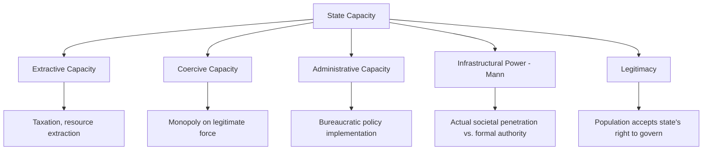

## State Capacity and Fragility

### Definition and Conceptual Overview

State capacity refers to a state's ability to effectively implement its policy goals — to extract resources, enforce rules, provide public goods, and exercise authority across its territory. State fragility (and its more severe form, state failure) describes the erosion or absence of this capacity, where the state loses effective control over its territory, cannot deliver core public goods or security, and/or loses legitimacy in the eyes of its population. These concepts sit at the empirical end of the sovereignty spectrum: whereas *legal* sovereignty is a formal, largely binary status under international law, state capacity captures the *empirical* dimension of statehood — the actual, variable degree to which a state can govern.

**Key Points**

- State capacity is typically disaggregated into distinct dimensions: extractive capacity (taxation), coercive capacity (monopoly on violence, security provision), administrative/bureaucratic capacity, and infrastructural capacity (the ability to penetrate and coordinate society, per Michael Mann).
- Robert Jackson's distinction between "juridical statehood" (formal international legal recognition) and "empirical statehood" (actual domestic governing capacity) is foundational to understanding why some internationally recognized states function as "quasi-states."
- Fragility exists on a spectrum rather than as a binary category — from stable high-capacity states, through weak or fragile states with partial capacity gaps, to collapsed or failed states with near-total loss of central authority.

### Dimensions of State Capacity

**Extractive Capacity**

The state's ability to raise revenue, primarily through taxation, from the population and economy under its jurisdiction. Extractive capacity is closely linked to bellicist theories of state formation (Tilly), which argue that historical fiscal-military competition drove European states to develop sophisticated tax-collection bureaucracies.

**Coercive Capacity**

The state's ability to maintain a functioning monopoly on the legitimate use of force (per Weber) — including police, military, and judicial enforcement capacity sufficient to maintain internal order and deter external threats.

**Administrative/Bureaucratic Capacity**

The state's capacity to implement policy through a professional, rule-governed civil service — encompassing regulatory enforcement, public service delivery, and the basic administrative functions (civil registration, property records, licensing) that underpin modern governance.

**Infrastructural Power (Michael Mann)**

Mann's influential distinction separates "despotic power" (the range of actions elites can take without routine negotiation with civil society) from "infrastructural power" — the institutional capacity of the state to actually penetrate society and implement decisions across its territory. A state can have high despotic power (formally unconstrained authority) yet low infrastructural power (unable to actually enforce decisions in practice), and vice versa.

**Legitimacy**

Though sometimes treated separately from "capacity" in a narrow technical sense, most contemporary frameworks (e.g., the OECD's fragility framework) treat legitimacy — the population's acceptance of the state's right to govern — as a core, mutually reinforcing dimension: capacity without legitimacy tends to be unstable, while legitimacy without capacity cannot translate into effective governance.

### Theoretical Foundations

**Weberian Baseline**

Weber's monopoly-on-legitimate-violence definition of the state provides the conceptual floor against which capacity and fragility are measured: fragility describes the degree to which a state falls short of effectively holding this monopoly across its claimed territory.

**Jackson's Juridical vs. Empirical Statehood**

Robert Jackson's *Quasi-States* (1990) distinguishes *juridical sovereignty* (formal international legal recognition and membership in the state system) from *empirical sovereignty* (actual domestic capacity to govern effectively). Jackson argues many post-colonial states achieved juridical statehood through decolonization and international recognition without correspondingly developing the empirical governing capacity that historically preceded juridical recognition in the European state-formation experience — producing "quasi-states" that are internationally recognized but domestically weak.

**Bellicist Capacity-Building (Tilly)**

Extends directly from Tilly's state formation theory: European states historically built extractive and administrative capacity through the fiscal-military pressures of sustained inter-state war. Many post-colonial states, by contrast, received or inherited state boundaries and institutions without undergoing an equivalent capacity-building process, a factor frequently cited (alongside colonial institutional legacies) in explaining contemporary capacity gaps.

**Neopatrimonialism**

A framework describing many fragile and developing states as blending formal rational-legal bureaucratic structures with informal, personalized patron-client relationships, where formal state institutions coexist with (and are often subordinated to) informal networks of loyalty, patronage, and personal rule — a pattern associated with weak rule-bound administrative capacity even where formal bureaucratic institutions nominally exist.

**Resource Curse and Rentier State Theory**

Argues that states heavily dependent on revenue from natural resource exports (oil, minerals) rather than broad-based taxation of their population tend to develop weaker accountability relationships with citizens (since the state does not need citizen consent for revenue, unlike a taxing state), often correlating with weaker institutional development, corruption, and heightened conflict risk over resource control.

### Measuring Fragility: Comparative Indices

**Fragile States Index (Fund for Peace)**

An annual composite index ranking states based on cohesion indicators (security apparatus, factionalized elites, group grievance), economic indicators (economic decline, uneven development, human flight/brain drain), political indicators (state legitimacy, public services, human rights, rule of law), and social/cross-cutting indicators (demographic pressures, refugees/IDPs, external intervention).

**Worldwide Governance Indicators (World Bank)**

Measures six dimensions across countries: voice and accountability, political stability and absence of violence, government effectiveness, regulatory quality, rule of law, and control of corruption — widely used in comparative political economy and development research as proxies for state capacity.

**OECD States of Fragility Framework**

A multidimensional framework assessing fragility across economic, environmental, political, security, and societal dimensions, explicitly rejecting a single fragility score in favor of profiling states across multiple risk dimensions simultaneously. [Behavioral note: specific country classifications and index rankings are updated periodically by these organizations and may shift year to year; treat any specific country ranking as time-sensitive rather than fixed.]

### The Spectrum of State Fragility

**Stable/High-Capacity States**

Effective extraction, coercive monopoly, administrative delivery, and broad legitimacy — able to implement policy reliably across the national territory.

**Weak/Fragile States**

Partial capacity gaps — the state maintains nominal control but struggles with corruption, uneven territorial reach, contested legitimacy in some regions, or insufficient service delivery, without full institutional collapse.

**Failed States**

Near-total collapse of central governing authority — loss of the monopoly on violence (often to competing armed non-state actors), inability to provide basic public goods or security, and frequently accompanied by civil conflict, displacement, and humanitarian crisis. Somalia's prolonged central government collapse following 1991 is among the most frequently cited reference cases in the failed-states literature.

**Collapsed/Ungoverned Spaces**

The most extreme end of the spectrum, where no functioning central authority exists at all, and governance functions (if present) are exercised by sub-state or non-state actors (warlords, militias, criminal organizations) over fragmented territory.

**Example**

Comparative capacity gaps are illustrated by contrasting Singapore and several Sub-Saharan post-colonial states at independence: both inherited colonial administrative structures around similar historical junctures, yet diverged sharply in subsequent extractive, administrative, and infrastructural capacity development — a divergence extensively analyzed in comparative political economy through lenses including colonial institutional legacy, geographic/resource endowment, and post-independence political leadership and party institutionalization choices. [Inference: the relative weight of these competing explanatory factors remains an active area of comparative research rather than a single settled causal account.]

### Causes and Drivers of State Fragility

**Colonial Institutional Legacies**

Institutionalist scholarship (Acemoglu, Johnson, Robinson; Mahoney) links contemporary capacity gaps to the type of institutions established during colonial rule — extractive colonial institutions designed to maximize resource extraction rather than build broad-based administrative capacity tend to correlate with weaker post-independence state capacity.

**Ethnic Fractionalization and Weak National Identity**

Highly ethnically fragmented societies, particularly where colonial borders did not correspond to pre-existing political communities, can face greater challenges building the shared national identity and cross-group trust that facilitates effective, broadly legitimate state institutions — though this relationship is contested and highly context-dependent rather than deterministic.

**Conflict and Civil War**

Armed conflict directly degrades state capacity by destroying infrastructure, diverting resources to military spending, undermining tax collection, and in severe cases fragmenting the state's territorial control among competing armed actors — with capacity erosion and conflict frequently reinforcing each other in self-perpetuating cycles ("conflict traps," per Paul Collier's work).

**Resource Dependence**

As noted above, rentier dynamics can weaken the accountability relationships and institutional development that broad-based taxation historically fostered in capacity-building state formation processes.

**External Intervention and Dependency**

Extensive reliance on foreign aid, or destabilizing external military intervention, can in some contexts undermine domestic institutional accountability and state-building incentives, though aid can also directly support capacity-building efforts depending on design and governance context — the empirical relationship is heavily debated in development economics and aid effectiveness literature.

### Consequences of State Fragility

**Security Spillovers**

Fragile and failed states can become havens for non-state armed actors, transnational terrorism, and organized crime, generating regional and international security concerns beyond the state's own borders — a major driver of post-Cold War international interest in "state-building" as a security policy objective.

**Humanitarian Crises**

Loss of state capacity to provide basic services and security frequently produces large-scale displacement (internally displaced persons and refugee flows), famine, and public health crises.

**Governance Vacuums and Non-State Authority**

Where central state authority collapses, governance functions are often assumed by non-state actors — armed militias, criminal networks, or informal traditional/customary authorities — producing hybrid or informal governance orders that can persist for extended periods.

**Development Impacts**

State fragility is strongly associated with weaker economic development outcomes, reduced foreign investment, and difficulty implementing public health, education, and infrastructure programs, contributing to persistent poverty traps in the most fragile contexts.

### Illustrative Diagram: State Capacity–Fragility Spectrum

<svg xmlns="http://www.w3.org/2000/svg" viewBox="0 0 800 320" font-family="sans-serif">
<text x="400" y="30" text-anchor="middle" font-size="18" font-weight="bold" fill="#1a1a2e">The State Capacity–Fragility Spectrum (svg_diagram)</text>
<rect x="60" y="80" width="680" height="30" fill="url(#grad1)" rx="4" />
<text x="120" y="140" text-anchor="middle" font-size="12" font-weight="bold" fill="`#2a8c6e`">High Capacity</text>

<text x="120" y="158" text-anchor="middle" font-size="10" fill="#333">Effective, legitimate,</text>

<text x="120" y="172" text-anchor="middle" font-size="10" fill="#333">full territorial control</text>

<text x="400" y="140" text-anchor="middle" font-size="12" font-weight="bold" fill="`#8a6e1a`">Weak / Fragile</text>

<text x="400" y="158" text-anchor="middle" font-size="10" fill="#333">Partial gaps, contested</text>

<text x="400" y="172" text-anchor="middle" font-size="10" fill="#333">legitimacy, uneven reach</text>

<text x="680" y="140" text-anchor="middle" font-size="12" font-weight="bold" fill="`#9c2a2a`">Failed / Collapsed</text>

<text x="680" y="158" text-anchor="middle" font-size="10" fill="#333">Loss of violence monopoly,</text>

<text x="680" y="172" text-anchor="middle" font-size="10" fill="#333">non-state actor control</text>

<line x1="120" y1="200" x2="120" y2="230" stroke="#555" stroke-width="1.5" />
<line x1="400" y1="200" x2="400" y2="230" stroke="#555" stroke-width="1.5" />
<line x1="680" y1="200" x2="680" y2="230" stroke="#555" stroke-width="1.5" />

<text x="120" y="250" text-anchor="middle" font-size="10" fill="#555" font-style="italic">e.g. stable OECD states</text>

<text x="400" y="250" text-anchor="middle" font-size="10" fill="#555" font-style="italic">e.g. many post-conflict states</text>

<text x="680" y="250" text-anchor="middle" font-size="10" fill="#555" font-style="italic">e.g. Somalia post-1991</text>

</svg>

### State Capacity, Fragility, and International Policy

**State-Building as International Policy Objective**

Post-Cold War and especially post-9/11 international policy increasingly treated state fragility as a direct security concern, motivating substantial international state-building and peacebuilding interventions (e.g., in Afghanistan, Iraq, and various UN peacekeeping/peacebuilding missions) — with decidedly mixed empirical track records regarding the effectiveness of externally driven state-building efforts. [Inference: the academic and policy literature remains divided on whether externally imposed or heavily externally supported state-building can durably substitute for endogenous capacity-building processes.]

**Sustainable Development Goal 16**

The UN's SDG 16 explicitly incorporates "peace, justice, and strong institutions" as a global development target, reflecting the mainstreaming of state capacity and institutional quality as core development policy concerns alongside more traditional economic development metrics.

### Critiques and Debates

**Eurocentric Benchmark Critique**

Critics argue that "state capacity" and "fragility" frameworks implicitly benchmark all states against an idealized Weberian/European model of centralized bureaucratic statehood, potentially mischaracterizing functioning alternative governance arrangements (customary authority, decentralized or federal arrangements, hybrid governance) as mere "fragility" rather than legitimate different institutional forms.

**Index Methodology Critique**

Comparative fragility indices face persistent methodological critique regarding data reliability in low-capacity states (the states hardest to measure are often those with the weakest data infrastructure), subjective weighting of component indicators, and the risk that aggregate rankings obscure important within-country variation (e.g., strong capacity in some regions or sectors alongside weakness in others).

**Causality and Policy Prescription Debate**

Significant debate persists over whether external state-building interventions can effectively build durable domestic capacity, or whether capacity fundamentally depends on endogenous political settlements, elite bargains, and gradually developed social contracts that cannot be substituted by external technical assistance or institution-building programs alone.

**"Fragility" as a Politically Loaded Label**

Some scholars caution that fragility classifications, produced predominantly by Western-based indices and institutions, can carry normative and geopolitical implications (justifying intervention, conditioning aid) that go beyond neutral empirical description, echoing broader post-colonial critiques of sovereignty and international recognition discussed elsewhere in this chapter. [Speculation: the degree to which this critique should change how fragility indices are constructed or used in policy remains a matter of ongoing disciplinary and practitioner debate.]

### Related Topics

- Theories of State Formation
- Sovereignty in Theory and Practice
- Failed States and Post-Conflict Reconstruction
- Neopatrimonialism and Informal Governance
- Resource Curse and Rentier State Theory
- Comparative Institutionalism and Colonial Legacies
- Civil War and Conflict Studies
- International Peacebuilding and State-Building Interventions
- Governance Indicators and Comparative Measurement
- The Welfare State