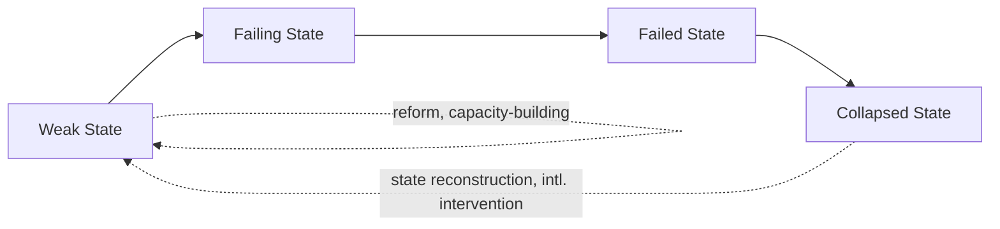

## Failed and Fragile States

### Definition and Conceptual Overview

Failed and fragile states describes the phenomenon and study of political entities that have lost, or are at serious risk of losing, the core functions expected of a modern state: an effective monopoly on the legitimate use of force, the capacity to extract resources and deliver public goods, and sufficient legitimacy to govern their population without sustained internal challenge. While "state capacity and fragility" as a topic addresses the analytical dimensions and measurement of capacity gaps broadly, this topic focuses specifically on the acute end-state condition of failure and near-failure — its definitional debates, causal pathways, case patterns, and the international policy response of state-building and intervention.

**Key Points**

- "State failure" and "fragile states" are related but distinct terms: fragility describes a spectrum condition of elevated risk and partial capacity gaps, while failure typically denotes a more acute, often near-total collapse of central governing authority.
- The concept gained major prominence in international relations and policy discourse in the 1990s (following state collapses in Somalia, Rwanda, and the former Yugoslavia) and especially after 2001, when fragile states became explicitly framed as global security threats.
- Failed states are frequently characterized by the fragmentation of the state's violence monopoly among competing armed non-state actors, alongside humanitarian crisis, displacement, and loss of effective governance.

### Historical Emergence of the Concept

**Cold War Backdrop**

During the Cold War, many weak post-colonial states were propped up through superpower patronage (aid, arms, diplomatic support) tied to bloc alignment rather than domestic governing effectiveness, masking underlying capacity weaknesses that became more visible once this external support structure ended.

**Post-Cold War Collapse Cases (1990s)**

The end of Cold War patronage coincided with a wave of visible state collapses: Somalia's central government collapsed in 1991 amid clan-based civil war, becoming the paradigmatic reference case for "failed state" analysis; Yugoslavia's disintegration (1991–1995) combined state collapse with ethnic conflict and international intervention; and the Rwandan genocide (1994) demonstrated how state collapse and mass violence could unfold with catastrophic speed, spurring significant scholarly and policy attention to fragile-state early warning.

**Post-9/11 Securitization**

The September 11, 2001 attacks, planned partly from Afghanistan under a Taliban regime governing amid state collapse, cemented fragile and failed states as a mainstream international security concern — the 2002 US National Security Strategy explicitly identified weak and failing states as a greater threat to US security than conquering states, marking a significant shift in how state capacity gaps were framed in international policy.

**Institutionalization of Fragility Monitoring (2000s–Present)**

This period saw the establishment of dedicated monitoring tools (the Fund for Peace's Failed States Index, later renamed the Fragile States Index, launched 2005) and the mainstreaming of state fragility as a distinct category within development policy (World Bank, OECD, DFID/FCDO frameworks), alongside expanded international state-building interventions in Afghanistan, Iraq, and elsewhere.

### Defining Failure: Competing Frameworks

**Weberian Threshold Definition**

The most parsimonious definition ties state failure directly to loss of the Weberian monopoly on legitimate violence: a failed state is one that can no longer effectively claim or exercise this monopoly across its territory, with armed non-state actors (militias, warlords, insurgent groups, criminal organizations) exercising de facto territorial control instead.

**Functionalist/Public Goods Definition**

Alternative definitions (e.g., associated with Robert Rotberg) emphasize the state's failure to deliver core "political goods" — security, rule of law, economic opportunity, and basic services — to its population, treating failure as fundamentally about the breakdown of the state's basic governance functions rather than violence monopoly alone.

**Legitimacy-Centered Definition**

Some scholars emphasize that failure is not purely about capacity but about the collapse of the state's perceived legitimacy among its population — a state may retain some coercive and administrative capacity yet be considered failed or failing if it has lost broad social acceptance of its right to govern, fueling active resistance or parallel governance structures.

**Degrees of Failure: A Continuum**

Contemporary scholarship generally treats failure not as a binary category but as the most acute point on a broader fragility continuum, distinguishing:

- *Weak states*: functioning but with significant capacity or legitimacy gaps
- *Failing states*: rapid, ongoing deterioration in capacity, legitimacy, or territorial control
- *Failed states*: near-total collapse of central governing authority
- *Collapsed states*: complete absence of functioning central government, often for extended periods

### Causal Pathways to State Failure

**Colonial Legacy and Arbitrary Borders**

Many contemporary fragile and failed states inherited colonial-era borders that grouped together, or divided, populations without regard to pre-existing political, ethnic, or economic communities, producing states lacking the cohesive national identity or negotiated internal political settlements that historically underpinned European state formation.

**Elite Bargains and Political Settlement Failure**

Comparative political scientists increasingly emphasize that state failure often stems from the breakdown or absence of a stable "political settlement" — an underlying elite bargain over the distribution of power and resources — rather than from capacity deficits alone; states can possess substantial coercive and administrative apparatus yet fail catastrophically when competing elite factions cannot reach or sustain a workable power-sharing arrangement.

**Resource Curse Dynamics**

Heavy dependence on easily capturable natural resource revenue (oil, diamonds, minerals) can both weaken states' accountability incentives toward citizens (per rentier state theory) and provide a lucrative prize that intensifies violent competition for control of the state or resource-rich territory, a pattern extensively documented in conflicts in the Democratic Republic of Congo, Sierra Leone, and Angola.

**Ethnic Exclusion and Horizontal Inequality**

Political scientists (e.g., Frances Stewart's work on horizontal inequalities) link state fragility and conflict risk to systematic economic, political, or social exclusion of particular ethnic or regional groups from state power and resources, generating grievances that can escalate into armed challenge to the state.

**Conflict Traps**

Paul Collier's influential "conflict trap" thesis argues that civil war itself becomes a self-reinforcing cause of further state weakness and conflict recurrence: war destroys economic and institutional capacity, displaces populations, and normalizes violence as a political tool, substantially raising the risk of renewed conflict even after a nominal peace settlement.

**External Shocks and Interventions**

Economic shocks (commodity price collapses, financial crises), climate-related shocks (drought, famine), and destabilizing external military interventions can trigger or accelerate state failure in already-weak states with limited institutional buffers against sudden crisis.

### Reference Case Patterns

**Somalia (1991–present)**

The collapse of Siad Barre's government in 1991 produced one of the most prolonged and frequently studied cases of state collapse, characterized by clan-based factional conflict, the absence of an effective central government for over a decade, the emergence of relatively stable but internationally unrecognized sub-state entities (Somaliland), and extended international intervention and state-building efforts with mixed results.

**Afghanistan (multiple periods)**

Afghanistan's recurrent state fragility across the late 20th and early 21st centuries illustrates the interaction of external intervention (Soviet occupation, post-2001 international state-building, and subsequent political transitions), weak central state penetration of a highly decentralized, tribally organized society, and the challenges of externally supported state-building efforts achieving durable domestic legitimacy and capacity.

**Democratic Republic of Congo**

Illustrates resource-curse dynamics combined with weak inherited colonial administrative capacity and regional conflict spillover, producing one of the most protracted contemporary cases of partial state fragility and localized armed non-state control over resource-rich territory.

**Example**

The contrast between Somalia's prolonged central collapse and the relatively greater (though still contested) stability achieved by the self-declared, internationally unrecognized territory of Somaliland within the same broader geographic and clan-based context illustrates how sub-national or localized political settlements can sometimes achieve functional governance even where the internationally recognized central state has failed — a pattern of interest to scholars examining alternatives to top-down, externally supported state-building. [Inference: Somaliland's relative stability is widely noted in the literature, though its long-term durability and the generalizability of its experience to other contexts remain subjects of ongoing scholarly discussion.]

### International Response: State-Building and Intervention

**Peacekeeping and Peacebuilding**

UN peacekeeping missions have increasingly incorporated broader "peacebuilding" mandates beyond traditional ceasefire monitoring, including support for security sector reform, rule of law development, and institution-building, reflecting the recognition that sustainable peace in fragile-state contexts requires addressing underlying capacity and legitimacy deficits, not just halting active violence.

**Statebuilding Interventions**

Large-scale international state-building efforts (Afghanistan and Iraq being the most extensively studied post-2001 cases) have generally aimed to construct or reconstruct governing institutions, security forces, and administrative capacity, often under significant time pressure and with contested degrees of success in achieving durable, locally legitimate institutions. [Behavioral outcomes of any specific state-building intervention are highly context-dependent and contested in the scholarly and policy evaluation literature; no single generalized success rate can be reliably stated.]

**New Deal for Engagement in Fragile States (2011)**

An international framework (endorsed by the g7+ group of fragile and conflict-affected states alongside donor countries) emphasizing country-led and country-owned peacebuilding and statebuilding goals, reflecting growing international consensus that externally imposed state-building models without strong local ownership tend to underperform.

**Debates Over Intervention Effectiveness**

Extensive scholarly debate persists over whether large-scale external state-building can substitute for organic, domestically negotiated political settlements, with critics arguing external actors often import governance models poorly suited to local political economy realities, while defenders argue carefully calibrated external support can help stabilize otherwise catastrophic humanitarian and security crises.

### Illustrative Diagram: Pathways to State Failure

<svg xmlns="http://www.w3.org/2000/svg" viewBox="0 0 800 440" font-family="sans-serif">
<text x="400" y="30" text-anchor="middle" font-size="18" font-weight="bold" fill="#1a1a2e">Causal Pathways to State Failure (svg_diagram)</text>
<rect x="40" y="70" width="160" height="70" fill="#3a5a9c" opacity="0.85" rx="6" />
<text x="120" y="100" text-anchor="middle" font-size="11" fill="white" font-weight="bold">Colonial Legacy /</text>
<text x="120" y="117" text-anchor="middle" font-size="11" fill="white" font-weight="bold">Arbitrary Borders</text>
<rect x="230" y="70" width="160" height="70" fill="#c9622a" opacity="0.85" rx="6" />
<text x="310" y="100" text-anchor="middle" font-size="11" fill="white" font-weight="bold">Resource Curse /</text>
<text x="310" y="117" text-anchor="middle" font-size="11" fill="white" font-weight="bold">Rentier Dynamics</text>
<rect x="420" y="70" width="160" height="70" fill="#2a8c6e" opacity="0.85" rx="6" />
<text x="500" y="100" text-anchor="middle" font-size="11" fill="white" font-weight="bold">Ethnic Exclusion /</text>
<text x="500" y="117" text-anchor="middle" font-size="11" fill="white" font-weight="bold">Horizontal Inequality</text>
<rect x="610" y="70" width="160" height="70" fill="#8c4a9c" opacity="0.85" rx="6" />
<text x="690" y="100" text-anchor="middle" font-size="11" fill="white" font-weight="bold">Elite Bargain</text>
<text x="690" y="117" text-anchor="middle" font-size="11" fill="white" font-weight="bold">Breakdown</text>
<line x1="120" y1="140" x2="400" y2="220" stroke="#555" stroke-width="2" />
<line x1="310" y1="140" x2="400" y2="220" stroke="#555" stroke-width="2" />
<line x1="500" y1="140" x2="400" y2="220" stroke="#555" stroke-width="2" />
<line x1="690" y1="140" x2="400" y2="220" stroke="#555" stroke-width="2" />
<rect x="280" y="220" width="240" height="60" fill="#9c2a4a" opacity="0.9" rx="6" />
<text x="400" y="255" text-anchor="middle" font-size="13" fill="white" font-weight="bold">State Fragility / Failure</text>
<line x1="400" y1="280" x2="400" y2="330" stroke="#555" stroke-width="2" marker-end="url(#arrow3)" />
<rect x="250" y="330" width="300" height="70" fill="#555" opacity="0.85" rx="6" />
<text x="400" y="360" text-anchor="middle" font-size="12" fill="white" font-weight="bold">Loss of Violence Monopoly,</text>
<text x="400" y="378" text-anchor="middle" font-size="12" fill="white" font-weight="bold">Humanitarian Crisis, Displacement</text>
</svg>

### Consequences and Regional/Global Spillovers

**Humanitarian Impact**

Failed states are frequently associated with severe humanitarian crises — famine, disease outbreaks, and large-scale internal displacement and refugee outflows — reflecting the collapse of basic public health, food security, and protection functions.

**Transnational Security Threats**

Ungoverned or weakly governed spaces within failed states have historically provided operating environments for transnational terrorist organizations and organized criminal networks (trafficking in arms, narcotics, and persons), reinforcing the post-9/11 securitization of fragility as an international policy concern.

**Regional Conflict Spillover**

State failure frequently generates cross-border spillover effects — refugee flows destabilizing neighboring states, cross-border insurgent or militia activity, and regional proxy competition for influence over contested territory or resources — as seen extensively in Central Africa's Great Lakes region conflicts linked to the Congo wars.

**Long-Term Development Setbacks**

Failed and fragile states consistently rank among the furthest from meeting international development benchmarks (including the UN Sustainable Development Goals), reflecting the compounding, long-term developmental costs of sustained institutional collapse.

### Critiques and Debates

**Definitional Imprecision**

Critics note persistent disagreement over precise thresholds distinguishing "fragile" from "failed" states, and argue the concept has sometimes been applied so broadly (encompassing dozens of diverse states with very different underlying conditions) that its analytical precision is compromised.

**Security-Centric Bias**

Scholars critique the post-9/11 framing of state fragility primarily through a Western security lens (fragile states as terrorism/security threats to donor countries) as potentially distorting policy priorities away from the fragile state's own population's welfare and governance needs toward donor-country security interests.

**Overreliance on External Intervention**

Extensive critique exists of large-scale, externally driven state-building models (particularly post-2001 Afghanistan and Iraq interventions) for underestimating the primacy of domestically negotiated political settlements and for importing institutional templates poorly adapted to local political, social, and economic realities. [Inference: this critique reflects a broad and influential strand of the state-building literature, though views on the appropriate degree and form of external engagement in fragile states remain actively contested among scholars and policymakers.]

**Alternative Governance Recognition**

Some scholars argue the "failed state" framework, by measuring solely against a centralized Weberian benchmark, can obscure functioning alternative or hybrid governance arrangements (customary authority, sub-state entities like Somaliland, community-based security arrangements) that may provide meaningful order and services even absent a conventionally functioning central state.

### Related Topics

- State Capacity and Fragility
- Theories of State Formation
- Sovereignty in Theory and Practice
- Civil War and Conflict Studies
- Resource Curse and Rentier State Theory
- Neopatrimonialism and Informal Governance
- International Peacebuilding and UN Peacekeeping
- Post-Colonial State-Building
- Humanitarian Intervention and Responsibility to Protect
- Comparative Governance Indicators