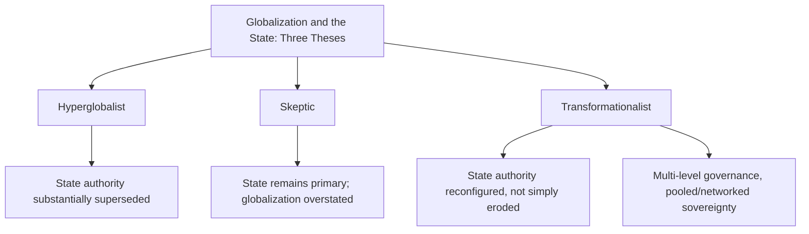

## Globalization and the Transformation of the State

### Definition and Conceptual Overview

Globalization refers to the intensifying worldwide interconnection of economic, political, social, and cultural processes — accelerated flows of capital, goods, people, information, and ideas across national borders — driven by technological change, trade liberalization, and the expansion of transnational institutions and networks. Its relationship to the state is a central and contested question in political science: does globalization fundamentally erode state sovereignty and capacity, or does it instead transform the *form* through which states exercise authority, without necessarily diminishing the state's underlying centrality to political order? This topic builds directly on the sovereignty and state-capacity material earlier in this chapter, examining specifically how transnational economic, political, and technological forces reshape state functions.

**Key Points**

- Globalization scholarship spans multiple, only partially overlapping dimensions: economic globalization (trade, capital, production), political globalization (international institutions, global governance), and cultural/informational globalization (media, migration, digital connectivity).
- The central theoretical debate is often framed as a contest between "hyperglobalist" claims of state decline, "skeptic" claims that state centrality is exaggerated as having ever been threatened, and "transformationalist" claims that the state's role is being reconfigured rather than simply diminished (a typology associated with David Held and Anthony McGrew).
- Globalization does not uniformly erode all dimensions of state authority simultaneously — it constrains some capacities (independent monetary policy, capital controls) while in some respects expanding others (surveillance capacity, participation in expanded regulatory and security cooperation).

### Historical Development

**Early Modern and Colonial-Era Globalization**

Long-distance trade networks, European colonial expansion, and the emergence of global commodity markets from the 16th century onward represent earlier waves of cross-border economic integration, though occurring within an international system still organized around expanding, competing sovereign and colonial powers rather than today's dense multilateral institutional architecture.

**Post-War Bretton Woods System (1944–1971)**

The Bretton Woods institutions (IMF, World Bank) and the GATT (General Agreement on Tariffs and Trade, 1947) established a managed framework for post-war international economic cooperation, combining expanding trade liberalization with continued substantial national policy autonomy (including capital controls) — often described as "embedded liberalism," balancing international openness with domestic social protection.

**Post-Bretton Woods Acceleration (1971–1990s)**

The collapse of fixed exchange rates (1971), subsequent financial deregulation, the removal of many capital controls, and the rise of multinational corporate production chains significantly accelerated economic globalization from the 1970s–1990s, coinciding with neoliberal policy shifts in many advanced economies.

**Post-Cold War Institutional Deepening (1990s–2000s)**

The end of the Cold War, the creation of the World Trade Organization (1995, succeeding GATT with a more robust dispute-settlement mechanism), rapid expansion of global supply chains, and the mainstreaming of the internet accelerated both economic and informational globalization, alongside expanding international human rights and environmental governance regimes.

**Contemporary Contestation and Partial Reversal (2010s–Present)**

The 2008 global financial crisis, rising populist and nationalist backlash against trade and immigration, US-China trade tensions, and COVID-19-era supply chain disruptions have prompted extensive debate over whether globalization has entered a period of stagnation, fragmentation, or partial reversal ("slowbalization" or "deglobalization"), alongside renewed emphasis on economic security, reshoring, and strategic autonomy among major economies. [Behavioral trajectory of these trends is ongoing and subject to further political and economic developments beyond any fixed characterization.]

### Theoretical Frameworks: Held and McGrew's Typology

**Hyperglobalist Thesis**

Argues globalization represents a fundamental, epochal transformation in which economic globalization has largely superseded the nation-state as the primary unit of economic and political organization, with transnational corporations, global markets, and international institutions displacing state authority — associated with both enthusiastic free-market proponents and critical globalization theorists who view state sovereignty as increasingly hollow.

**Skeptic Thesis**

Argues claims of unprecedented globalization and state decline are substantially overstated: contemporary economic interdependence, while significant, does not clearly exceed levels reached during the late-19th/early-20th century first wave of globalization (relative to GDP in some measures), and states remain the primary actors setting the legal and regulatory frameworks within which global economic activity occurs — globalization, in this view, is substantially a state-enabled and state-mediated process rather than an autonomous force overriding states.

**Transformationalist Thesis**

The most widely adopted contemporary position, arguing globalization is genuinely reshaping state power and authority, but through *reconfiguration* rather than simple erosion — states increasingly share authority with supranational, subnational, and non-state actors in complex multi-level governance arrangements, exercise sovereignty differently (through pooling, delegation, and networked cooperation), and retain central importance even as the exclusive, unmediated Westphalian model of sovereignty becomes less descriptively accurate.

### Dimensions of Globalization's Impact on State Functions

**Economic Policy Autonomy**

Capital mobility and international financial market integration are frequently argued to constrain states' independent monetary and fiscal policy choices (the "impossible trinity" in international macroeconomics: states cannot simultaneously maintain fixed exchange rates, free capital movement, and independent monetary policy), while trade liberalization commitments (WTO rules, bilateral/regional trade agreements) constrain unilateral tariff and industrial policy choices.

**Tax Policy and Fiscal Capacity**

Global capital mobility is argued by many political economists to generate downward pressure on corporate and capital taxation through inter-state tax competition, potentially constraining the fiscal base available for welfare state financing (directly connecting to the welfare state material discussed earlier in this chapter) — though the empirical magnitude of this "race to the bottom" effect remains contested.

**Regulatory Authority**

International trade and investment rules, alongside transnational regulatory harmonization efforts, can constrain states' unilateral regulatory choices (environmental, labor, health/safety standards), generating debate over "regulatory chill" — the concern that states may avoid stronger domestic regulation for fear of triggering trade disputes or discouraging investment.

**Border Control and Migration**

Globalization's facilitation of increased cross-border movement of people creates persistent tension between economic globalization's demand for labor mobility and states' continued assertion of sovereign control over migration and border policy — a central axis of contemporary nationalist and populist politics discussed elsewhere in this chapter.

**Security and Surveillance Capacity**

Somewhat counter to a pure "state decline" narrative, globalization and associated digital technologies have in some respects *expanded* certain state capacities — enhanced surveillance technology, expanded international security and intelligence cooperation frameworks, and biometric border-control systems represent growing, not diminishing, state capabilities in specific domains.

### Global Governance and Multi-Level Authority

**Proliferation of International Institutions**

The expansion of international and supranational institutions — the UN system, WTO, IMF/World Bank, regional bodies (EU, ASEAN, African Union), and thousands of international non-governmental organizations — represents states voluntarily creating and participating in institutions that constrain and coordinate their individual policy choices in exchange for benefits from cooperation, consistent with liberal institutionalist IR theory.

**Supranational Delegation: The EU Case**

As discussed in the sovereignty topic in this chapter, the European Union represents the most far-reaching case of states delegating substantial policy authority (trade, competition policy, and for Eurozone members, monetary policy) to supranational institutions — illustrating the transformationalist argument that sovereignty is being exercised differently (pooled) rather than simply lost.

**Global Governance Without World Government**

Global governance scholarship emphasizes that transnational coordination increasingly occurs through networks of state regulators, standard-setting bodies, public-private partnerships, and informal cooperation arrangements that operate below the level of formal treaty-based international law, producing effective transnational rule-making without a corresponding transnational sovereign authority.

**Multi-Level Governance**

A framework (originally developed in EU studies, associated with Gary Marks and Liesbet Hooghe) describing how policy authority is increasingly distributed and shared across supranational, national, regional, and local levels simultaneously, rather than being concentrated exclusively at the national state level as classical Westphalian sovereignty assumed.

### Global Civil Society and Non-State Actors

**Transnational Corporations**

Multinational corporations, particularly those coordinating complex global production and supply chains, exercise substantial economic influence that can in some contexts exceed the GDP of smaller states, raising questions about relative bargaining power between states and large transnational firms, particularly regarding taxation, labor standards, and investment location decisions.

**International NGOs and Transnational Advocacy Networks**

Organizations such as Amnesty International, Human Rights Watch, and transnational environmental and humanitarian networks increasingly shape international norms, monitor state compliance with international commitments, and mobilize cross-border political pressure — described by Margaret Keck and Kathryn Sikkink as "transnational advocacy networks" capable of influencing state behavior through information politics and normative pressure.

**Digital Platforms and Private Global Governance**

Large technology and social media platforms increasingly exercise quasi-regulatory authority over global information flows, content moderation, and digital commerce, raising novel questions about "private authority" operating partially outside traditional state regulatory frameworks — an area of growing but still comparatively underdeveloped political science and legal scholarship.

### Example: COVID-19 as a Test Case

The COVID-19 pandemic (2020–2022) provides an illustrative real-world test of competing globalization theses: on one hand, it demonstrated globalization's capacity to rapidly transmit a health crisis worldwide via interconnected travel and trade networks; on the other, state responses were overwhelmingly national — border closures, national vaccine procurement, and travel restrictions were unilaterally determined by individual states rather than coordinated supranational authorities, and international institutions (WHO) exercised primarily advisory rather than binding authority over national pandemic responses — illustrating the transformationalist argument that even amid deep global interconnection, states retained primary decision-making authority over core security and public health functions. [Inference: interpretations of what COVID-19 definitively demonstrates about the state-globalization relationship vary across scholars and remain a subject of ongoing academic analysis rather than settled consensus.]

### Illustrative Diagram: The State in a Globalized, Multi-Level System

<svg xmlns="http://www.w3.org/2000/svg" viewBox="0 0 800 440" font-family="sans-serif">
<text x="400" y="30" text-anchor="middle" font-size="18" font-weight="bold" fill="#1a1a2e">The State Within Multi-Level Global Governance (svg_diagram)</text>
<rect x="300" y="70" width="200" height="50" fill="#8c4a9c" opacity="0.9" rx="6" />
<text x="400" y="100" text-anchor="middle" font-size="12" fill="white" font-weight="bold">Supranational (UN, WTO, EU)</text>
<rect x="300" y="150" width="200" height="50" fill="#3a5a9c" opacity="0.9" rx="6" />
<text x="400" y="180" text-anchor="middle" font-size="12" fill="white" font-weight="bold">National State</text>
<rect x="300" y="230" width="200" height="50" fill="#2a8c6e" opacity="0.9" rx="6" />
<text x="400" y="260" text-anchor="middle" font-size="12" fill="white" font-weight="bold">Regional / Local Government</text>
<rect x="60" y="150" width="180" height="50" fill="#c9622a" opacity="0.85" rx="6" />
<text x="150" y="180" text-anchor="middle" font-size="11" fill="white" font-weight="bold">Transnational Corporations</text>
<rect x="560" y="150" width="180" height="50" fill="#9c2a4a" opacity="0.85" rx="6" />
<text x="650" y="180" text-anchor="middle" font-size="11" fill="white" font-weight="bold">Transnational NGOs / Networks</text>
<line x1="400" y1="120" x2="400" y2="150" stroke="#555" stroke-width="2" />
<line x1="400" y1="200" x2="400" y2="230" stroke="#555" stroke-width="2" />
<line x1="240" y1="175" x2="300" y2="175" stroke="#555" stroke-width="2" />
<line x1="560" y1="175" x2="500" y2="175" stroke="#555" stroke-width="2" />

<text x="400" y="340" text-anchor="middle" font-size="12" font-style="italic" fill="#555">Transformationalist view: state remains central node,</text>

<text x="400" y="358" text-anchor="middle" font-size="12" font-style="italic" fill="#555">but authority is shared and reconfigured across levels</text>

</svg>

### Critiques and Debates

**"Race to the Bottom" Contestation**

While frequently invoked in both public and academic debate, comparative political economists dispute the magnitude and universality of globalization-driven regulatory and tax "race to the bottom" dynamics — some empirical studies find limited or conditional evidence of systematic downward convergence in labor, environmental, or tax standards, complicating strong hyperglobalist claims. [Inference: this remains a genuinely contested empirical question rather than one with clear scholarly consensus in either direction.]

**Asymmetric Impact Critique**

Critics emphasize that globalization's effects on state capacity are highly unevenly distributed — powerful states (particularly those issuing major reserve currencies or possessing large domestic markets) retain substantially more policy autonomy and bargaining leverage than smaller or economically dependent states, complicating generalized claims about "the state" facing uniform globalization pressures.

**Cultural Homogenization vs. Hybridization Debate**

Beyond the economic-political dimension, globalization scholarship debates whether cultural globalization produces homogenization (a globally converging, often Western-dominated culture) or hybridization/"glocalization" (the localized adaptation and blending of global cultural flows with distinct local practices) — a debate with less direct bearing on state capacity but significant relevance to national identity dynamics discussed elsewhere in this chapter.

**Deglobalization and Fragmentation Debate**

Recent scholarship increasingly questions whether the post-2008, and especially post-2020, period represents a durable reversal or fragmentation of globalization (driven by geopolitical rivalry, supply chain security concerns, and populist backlash) or merely a recalibration within a continued broadly globalized system — with significant disagreement over how to characterize the current trajectory. [Speculation: given the relatively short time horizon since these disruptions, confident long-term characterization of this trend as a durable structural shift versus a temporary adjustment remains premature.]

### Related Topics

- Sovereignty in Theory and Practice
- State Capacity and Fragility
- The Welfare State
- Nationalism as Ideology
- Populism, Left and Right
- European Union Integration and Euroscepticism
- International Trade Governance (WTO, GATT)
- Global Civil Society and Transnational Advocacy Networks
- Multi-Level Governance Theory
- International Political Economy of Capital Mobility