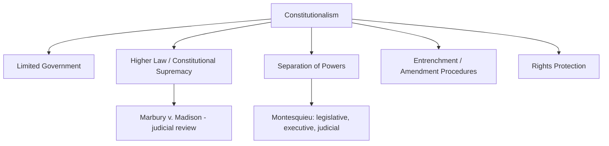

## Constitutionalism and the Rule of Law

### Definition and Conceptual Overview

Constitutionalism is the political principle that governmental power must be exercised within limits established by a constitution — a foundational body of rules (written or unwritten) that defines the structure of government, allocates and constrains political authority, and typically protects fundamental rights. The rule of law is a closely related but distinct principle: the requirement that all individuals and institutions, including the government itself, are subject to and accountable under publicly known, prospectively applied, and impartially enforced law, rather than to arbitrary or purely discretionary exercises of power. Together, constitutionalism and the rule of law form the core normative and institutional architecture through which modern states seek to constrain and legitimate the exercise of sovereign authority discussed elsewhere in this course.

**Key Points**

- Constitutionalism is fundamentally about *limited government*: the idea that legitimate political authority operates within defined boundaries, not merely that a state possesses a constitution (even highly authoritarian states typically have written constitutions).
- The rule of law encompasses both "thin"/formal conceptions (law must be general, public, prospective, clear, stable, and applied equally) and "thick"/substantive conceptions (law must also embody or protect specific values such as individual rights, democracy, or justice).
- Constitutionalism and the rule of law are mutually reinforcing but analytically separable: a state can approximate rule-of-law formal criteria without robust constitutional limits on power, and vice versa.

### Historical Development

**Ancient and Medieval Antecedents**

Classical political thought (Aristotle's discussion of law-governed versus arbitrary rule) and medieval constitutionalist documents — most notably England's Magna Carta (1215), which established that even the monarch was subject to certain legal constraints and could not act entirely arbitrarily against free subjects — provided early conceptual foundations, though pre-modern constitutionalism operated within fundamentally different political and social structures than the modern state.

**Early Modern Constitutionalism**

The English Civil War, the Glorious Revolution (1688), and the resulting Bill of Rights (1689) established key principles of parliamentary constraint on royal power, while continental natural law and social contract theorists (Locke in particular) provided the philosophical justification for limited, rights-protecting government that would heavily influence subsequent constitutional development.

**Founding-Era Written Constitutionalism**

The US Constitution (1787, ratified 1788) represents a landmark development: a comprehensive, codified, supreme written document establishing government structure, enumerated and separated powers, and (via subsequent amendment, the Bill of Rights of 1791) protected individual rights, paired with an emerging practice of judicial review. The French Revolution's Declaration of the Rights of Man and of the Citizen (1789) similarly articulated foundational rights-based constitutional principles, though France's own constitutional trajectory proved considerably more volatile through the 19th century.

**19th–Early 20th Century Diffusion**

Written constitutions and constitutional government spread across newly independent Latin American states, unifying European states (Germany, Italy), and eventually across decolonizing states in the mid-20th century, though often with substantial gaps between formal constitutional text and actual governing practice.

**Post-WWII Rights-Based Constitutionalism**

The horrors of Nazi Germany — a state that maintained formal legal procedures while perpetrating genocide — profoundly shaped post-war constitutional development, driving a shift toward entrenched, judicially enforceable fundamental rights and constitutional courts empowered to invalidate legislation (Germany's Basic Law of 1949 and Constitutional Court being paradigmatic examples), alongside the broader post-war human rights framework (Universal Declaration of Human Rights, 1948).

**Post-Cold War Constitutional Waves**

The end of the Cold War prompted a substantial wave of new constitution-making across post-communist Eastern Europe, post-apartheid South Africa (1996 Constitution, widely regarded as among the most rights-expansive globally), and numerous other democratizing states, frequently incorporating international human rights norms, constitutional courts, and detailed rights catalogs.

### Core Elements of Constitutionalism

**Limited Government**

The foundational principle that government authority is bounded — by enumerated powers, separation of powers, federalism, rights protections, or other mechanisms — rather than plenary and unconstrained.

**Higher Law / Constitutional Supremacy**

The doctrine that the constitution constitutes a superior form of law binding on ordinary legislation and government action, such that laws or governmental acts inconsistent with the constitution are legally invalid — most explicitly established through the US Supreme Court's *Marbury v. Madison* (1803) decision establishing judicial review.

**Separation of Powers**

The division of governmental authority among distinct branches (legislative, executive, judicial) with functionally differentiated roles and mutual checks, designed to prevent the concentration of power in a single actor or institution — theorized most influentially by Montesquieu in *The Spirit of the Laws* (1748).

**Entrenchment and Amendment Procedures**

Constitutional provisions are typically more difficult to alter than ordinary legislation, requiring supermajorities, special procedures, or multi-stage ratification processes — entrenchment is designed to provide stability and protect fundamental commitments from transient political majorities, while amendment procedures allow for constitutional adaptation over time.

**Rights Protection**

Most contemporary constitutions include catalogs of protected individual and, increasingly, collective or social rights, often accompanied by judicial or quasi-judicial enforcement mechanisms.

### The Rule of Law: Formal and Substantive Conceptions

**Formal (Thin) Conception**

Associated with legal theorists such as Joseph Raz and Lon Fuller, the formal conception focuses on procedural and structural qualities law must possess regardless of its substantive content: laws must be general, public/promulgated, prospective (not retroactive), clear and intelligible, relatively stable, non-contradictory, capable of being followed, and consistently enforced. Fuller's "inner morality of law" (from *The Morality of Law*, 1964) articulates eight such formal desiderata, arguing that a legal system radically failing these criteria (e.g., secret, constantly changing, or contradictory laws) cannot properly be called "law" at all, regardless of its substantive content.

**Substantive (Thick) Conception**

Broader conceptions of the rule of law incorporate substantive value commitments beyond formal procedural criteria — requiring that law protect fundamental individual rights, operate within a democratic framework, or embody principles of justice and human dignity, not merely that it satisfies formal generality and predictability criteria. Under a purely formal conception, a highly oppressive but procedurally consistent legal order could arguably satisfy "rule of law" criteria; substantive conceptions reject this possibility.

**Institutional/Functional Conception**

Some frameworks (e.g., the World Justice Project's Rule of Law Index) operationalize the rule of law through institutional and outcome indicators: constraints on government powers, absence of corruption, open government, fundamental rights protection, order and security, regulatory enforcement, civil and criminal justice effectiveness — blending formal and substantive elements into a measurable comparative framework.

### Judicial Review and Constitutional Enforcement

**American Model (Decentralized)**

Judicial review is exercised by ordinary courts (with the Supreme Court as final arbiter) as an incident of their general jurisdiction, applying constitutional review within the context of ordinary litigation — the "diffuse" or decentralized model, following *Marbury v. Madison*.

**European/Kelsenian Model (Centralized)**

Associated with legal theorist Hans Kelsen and most influentially implemented in Austria (1920) and post-war Germany, this model concentrates constitutional review in a single, specialized constitutional court operating separately from the ordinary judiciary, often with the power to conduct abstract review (assessing a law's constitutionality independent of a specific case) as well as concrete review arising from ordinary litigation.

**Weak-Form Judicial Review**

Some systems (notably the UK's Human Rights Act 1998 framework, and Canada's "notwithstanding clause" mechanism) adopt intermediate models where courts can declare legislation incompatible with constitutional/rights norms without the power to formally invalidate it, preserving a degree of legislative supremacy while still providing meaningful judicial rights scrutiny — reflecting ongoing debate over the appropriate balance between judicial and legislative authority in rights protection.

**Countermajoritarian Difficulty**

A foundational debate in constitutional theory (most associated with Alexander Bickel's 1962 formulation) concerns the tension between judicial review and democratic self-governance: unelected judges invalidating legislation enacted by elected representatives raises persistent normative questions about the democratic legitimacy of constitutional judicial review, generating extensive debate over appropriate standards of judicial deference versus activism.

### Comparative Table: Constitutional Design Choices

| Dimension | Option A | Option B |
| --- | --- | --- |
| Constitution form | Codified/written (most states) | Uncodified/unwritten (UK, partially) |
| Judicial review model | Decentralized (US) | Centralized constitutional court (Germany, many civil law states) |
| Amendment difficulty | Rigid, high entrenchment (US, requiring supermajorities) | Flexible, ordinary-majority amendment (UK parliamentary sovereignty tradition) |
| Rights enforcement | Strong-form judicial invalidation | Weak-form judicial dialogue (UK, Canada notwithstanding clause) |
| Executive-legislative relations | Presidential separation of powers | Parliamentary fusion with constitutional constraints |

### Rule of Law and Democracy: Relationship and Tensions

**Mutually Reinforcing View**

The dominant contemporary view holds that rule of law and democracy are mutually reinforcing: democratic accountability requires a stable legal framework for elections and political competition, while rule-of-law constraints prevent democratically elected majorities from entrenching themselves in power or violating minority rights, together constituting "liberal democracy" as commonly understood.

**Illiberal Democracy and Democratic Backsliding**

Contemporary political science (Fareed Zakaria's influential 1997 formulation of "illiberal democracy," and extensive subsequent democratic backsliding scholarship) documents cases where formally democratic elections persist while rule-of-law constraints, judicial independence, and constitutional checks are progressively eroded — Hungary under Viktor Orbán and Poland's PiS-era judicial reforms are frequently cited examples of executive aggrandizement weakening constitutional constraints while formal electoral processes continue. [Behavioral trajectory and current institutional status of any specific country's rule-of-law conditions are subject to ongoing political developments and should be treated as time-sensitive rather than fixed.]

**Constitutional Capture / Court-Packing**

A recognized mechanism of democratic backsliding involves executives or dominant legislative majorities altering the composition, jurisdiction, or independence of constitutional courts to neutralize judicial checks on executive power, a pattern documented across multiple recent cases of democratic erosion globally.

### Illustrative Diagram: Formal vs. Substantive Rule of Law

<svg xmlns="http://www.w3.org/2000/svg" viewBox="0 0 800 400" font-family="sans-serif">
<text x="400" y="30" text-anchor="middle" font-size="18" font-weight="bold" fill="#1a1a2e">Rule of Law: Formal vs. Substantive Conceptions (svg_diagram)</text>
<rect x="60" y="80" width="320" height="260" fill="#3a5a9c" opacity="0.15" stroke="#3a5a9c" stroke-width="2" rx="8" />
<text x="220" y="110" text-anchor="middle" font-size="14" font-weight="bold" fill="#3a5a9c">Formal (Thin) Conception</text>
<text x="220" y="140" text-anchor="middle" font-size="11" fill="#333">General &amp; publicly promulgated</text>
<text x="220" y="160" text-anchor="middle" font-size="11" fill="#333">Prospective, not retroactive</text>
<text x="220" y="180" text-anchor="middle" font-size="11" fill="#333">Clear and intelligible</text>
<text x="220" y="200" text-anchor="middle" font-size="11" fill="#333">Relatively stable over time</text>
<text x="220" y="220" text-anchor="middle" font-size="11" fill="#333">Consistently enforced</text>
<text x="220" y="250" text-anchor="middle" font-size="10" fill="#555" font-style="italic">(Fuller's "inner morality of law")</text>
<rect x="420" y="80" width="320" height="260" fill="#9c2a4a" opacity="0.15" stroke="#9c2a4a" stroke-width="2" rx="8" />
<text x="580" y="110" text-anchor="middle" font-size="14" font-weight="bold" fill="#9c2a4a">Substantive (Thick) Conception</text>
<text x="580" y="140" text-anchor="middle" font-size="11" fill="#333">Protects fundamental rights</text>
<text x="580" y="160" text-anchor="middle" font-size="11" fill="#333">Operates within democratic order</text>
<text x="580" y="180" text-anchor="middle" font-size="11" fill="#333">Embodies substantive justice</text>
<text x="580" y="200" text-anchor="middle" font-size="11" fill="#333">Constrains arbitrary power</text>
<text x="580" y="220" text-anchor="middle" font-size="11" fill="#333">Requires judicial independence</text>
<text x="580" y="250" text-anchor="middle" font-size="10" fill="#555" font-style="italic">(includes formal criteria plus values)</text>
</svg>

### Comparative and Contemporary Applications

**Constitutional Courts and Democratization**

Newly established or strengthened constitutional courts have played prominent roles in numerous democratic transitions (South Africa, post-communist Central/Eastern Europe, various Latin American cases), often serving as key institutional guarantors of the new constitutional order against potential backsliding by elected majorities.

**Rule of Law Indices**

Comparative measurement tools — the World Justice Project's Rule of Law Index and the World Bank's Worldwide Governance Indicators' "Rule of Law" component (discussed also in the state capacity topic in this chapter) — provide cross-national comparative data, though face similar methodological critiques regarding measurement validity and cross-cultural applicability as other governance indices.

**International and Transnational Rule of Law**

Beyond the domestic level, rule-of-law principles increasingly extend to international governance through international courts and tribunals (International Court of Justice, International Criminal Court), generating parallel debates about the democratic legitimacy and effectiveness of rule-of-law constraints operating above the level of the individual state.

### Critiques and Debates

**Formalism vs. Substantivism Debate**

Legal theorists continue to dispute whether a purely formal/procedural conception of the rule of law is adequate, or whether rule of law necessarily requires substantive value commitments — critics of pure formalism (echoing debates between legal positivism and natural law theory) argue formal criteria alone cannot distinguish a rule-of-law order from a highly oppressive but procedurally consistent authoritarian legal system.

**Countermajoritarian Difficulty**

As noted, the core tension between unelected judicial review and democratic self-governance remains a persistent, unresolved normative debate in constitutional theory, with positions ranging from strong judicial supremacy to strong legislative/political-constitutionalist skepticism of extensive judicial power (associated with scholars like Jeremy Waldron).

**Constitutionalism Without Constitutionalism**

Comparative scholars note a persistent gap in many states between formal constitutional text (often containing extensive rights guarantees and power constraints) and actual governing practice, where formal constitutional provisions are honored more in rhetoric than in enforced practice — raising questions about the conditions under which constitutional text translates into genuine constraining effect versus becoming a largely symbolic document.

**Rule of Law Promotion Critique**

International rule-of-law promotion and development assistance efforts have faced critique (paralleling broader state-building critiques discussed earlier in this chapter) for sometimes exporting institutional templates poorly adapted to local legal traditions and political economy contexts, with contested evidence regarding the effectiveness of externally supported rule-of-law reform programs. [Inference: this remains an actively debated area within comparative law and development scholarship rather than a settled empirical consensus.]

### Related Topics

- Sovereignty in Theory and Practice
- Separation of Powers and Checks and Balances
- Judicial Review and Constitutional Courts
- Democratic Backsliding and Illiberal Democracy
- Federalism and Constitutional Design
- Human Rights and International Law
- Comparative Constitutional Amendment Procedures
- State Capacity and Fragility
- Parliamentary vs. Presidential Systems
- Legal Positivism and Natural Law Theory