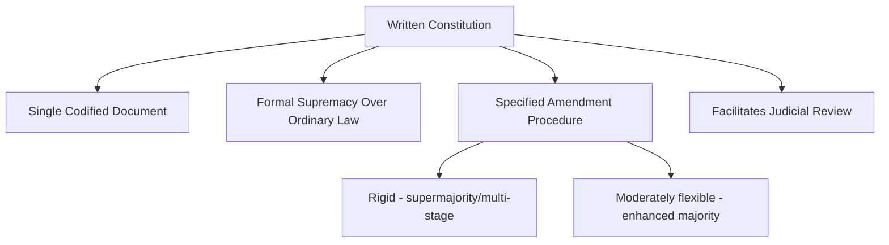

## Written and Unwritten Constitutions

### Definition and Conceptual Overview

The written/unwritten (or codified/uncodified) distinction categorizes constitutions according to whether the fundamental rules governing a state's structure and power are consolidated into a single, authoritative, codified document (a written constitution) or instead dispersed across multiple sources — statutes, judicial precedent, established conventions, and authoritative treatises — without a single comprehensive codified text (an unwritten or uncodified constitution). This distinction is foundational to comparative constitutional design, shaping how constitutional rules are identified, interpreted, entrenched, and amended.

**Key Points**

- The overwhelming majority of contemporary states (roughly 190 of the world's approximately 200 states) have codified, written constitutions; the United Kingdom, New Zealand (until recent partial codification developments), and Israel are the most frequently cited examples of substantially uncodified constitutional systems.
- "Unwritten" is somewhat misleading terminology: uncodified constitutional systems still rely extensively on written sources (statutes, judicial decisions) — the defining feature is the *absence of a single consolidated authoritative document*, not the absence of written materials altogether.
- The written/unwritten distinction correlates with, but is analytically distinct from, other constitutional design dimensions such as rigidity/flexibility of amendment, the presence or absence of judicial review, and parliamentary versus legislative sovereignty.

### Written (Codified) Constitutions

**Core Characteristics**

A written constitution consolidates the fundamental rules of governance — the structure of government institutions, the allocation of powers, the amendment procedure, and (in most cases) a catalog of protected rights — into a single authoritative document that is typically designated as supreme law, taking precedence over ordinary legislation.

**Historical Emergence**

The US Constitution (1787) is widely regarded as the first comprehensive modern written constitution of this kind, followed by the French revolutionary constitutions and subsequent 19th-century constitutional documents across Latin America, Europe, and beyond, establishing written codification as the dominant global constitutional model.

**Functions and Advantages**

- *Clarity and accessibility*: a single authoritative text provides a relatively identifiable, publicly accessible reference point for constitutional rules.
- *Entrenchment*: written constitutions typically establish formal, more demanding amendment procedures than ordinary legislation, providing durability and insulation from transient political majorities.
- *Symbolic/founding function*: written constitutions often serve as a foundational statement of national identity and values, particularly significant following independence, revolution, or major political transition.
- *Facilitates judicial review*: a codified supreme text provides a clearer textual basis against which courts can assess the constitutionality of ordinary legislation and executive action.

**Amendment Procedures**

Written constitutions typically specify formal amendment mechanisms, which vary considerably in rigidity:

- *Rigid*: requiring supermajorities in the legislature, multi-stage ratification (e.g., the US Constitution's Article V process requiring two-thirds congressional approval and three-fourths state ratification), or popular referenda.
- *Moderately flexible*: requiring enhanced but not extraordinarily demanding majorities.
- The degree of rigidity involves an inherent trade-off between constitutional stability/predictability and adaptability to changing political and social circumstances.

### Unwritten (Uncodified) Constitutions

**Core Characteristics**

An uncodified constitution derives its fundamental rules from multiple, dispersed sources rather than a single authoritative document: primary legislation of constitutional significance, common law judicial precedent, authoritative constitutional conventions (unwritten but widely observed practices), and authoritative constitutional treatises and works of scholarship.

**The United Kingdom as Paradigm Case**

The UK constitution draws on several distinct source categories:

- *Statutes of constitutional significance*: e.g., the Magna Carta (1215), the Bill of Rights (1689), the Act of Settlement (1701), the Parliament Acts (1911, 1949), the European Communities Act (1972, since repealed), the Human Rights Act (1998), and various devolution statutes.
- *Common law*: judicial decisions establishing and refining constitutional principles over time, including landmark cases on the royal prerogative and judicial review of executive action.
- *Constitutional conventions*: unwritten but authoritative political practices — for example, the convention that the monarch acts on ministerial advice, or the convention governing collective cabinet responsibility — which are politically binding despite lacking formal legal enforceability.
- *Authoritative works*: treatises by constitutional scholars such as A.V. Dicey and Walter Bagehot have historically carried significant interpretive authority in identifying and explaining constitutional practice.

**Parliamentary Sovereignty**

The UK's uncodified constitutional tradition is closely tied to the doctrine of parliamentary sovereignty (most associated with Dicey): Parliament possesses supreme, unlimited law-making authority, and no Parliament can bind its successors — meaning, in principle, any "constitutional" statute can be amended or repealed through ordinary legislative majority, without the heightened entrenchment procedures characteristic of written constitutional systems.

**Flexibility as Design Feature**

Uncodified constitutional systems are frequently characterized as highly flexible — capable of gradual, incremental adaptation through ordinary legislative and judicial processes without requiring formal constitutional amendment procedures — though this flexibility also generates persistent debate about the adequacy of protection for fundamental rights and institutional structures against ordinary political majorities.

**Other Substantially Uncodified Systems**

- *New Zealand*: relies on a combination of key statutes (the Constitution Act 1986, the New Zealand Bill of Rights Act 1990), common law, and convention, without a single consolidated codified document, though New Zealand's system has seen incremental discussion of further codification.
- *Israel*: operates through a series of "Basic Laws" enacted incrementally since 1958, intended eventually to form a complete constitution but not yet consolidated into a single codified document, with ongoing political and judicial debate over the Basic Laws' precise constitutional status and entrenchment.

### Comparative Table: Written vs. Unwritten Constitutional Systems

| Dimension | Written (Codified) | Unwritten (Uncodified) |
| --- | --- | --- |
| Source structure | Single consolidated document | Multiple dispersed sources (statute, common law, convention) |
| Typical example | United States, Germany, France, India | United Kingdom, New Zealand, Israel |
| Amendment | Formal, often rigid, entrenched procedure | Ordinary legislative process (in Diceyan parliamentary sovereignty tradition) |
| Judicial review basis | Clear textual supremacy clause | More contested; often weaker-form or statute-based rights review |
| Primary constraint on power | Constitutional supremacy over legislature | Political conventions, electoral accountability, common law tradition |
| Flexibility | Generally lower (by design) | Generally higher |

### Hybrid and Partial Cases

**Israel's Ongoing Constitutional Development**

Israel's incremental Basic Law approach exemplifies a hybrid trajectory — an originally uncodified system gradually accumulating quasi-constitutional statutory text, with significant ongoing legal and political controversy (including major 2023 judicial reform disputes) over the proper entrenchment and judicial enforceability of these Basic Laws relative to ordinary legislation.

**New Zealand's Partial Codification Debates**

New Zealand has periodically debated further consolidating its constitutional arrangements into a single codified document, though as of the most recent developments no comprehensive written constitution has been adopted, with existing key statutes and the Treaty of Waitangi continuing to function as central uncodified-tradition constitutional sources. [Behavioral status of ongoing constitutional reform debates in any specific country is subject to change and should be verified against current developments.]

**Canada's Blended Model**

Canada possesses a substantially codified constitution (the Constitution Act 1867 and Constitution Act 1982, including the Canadian Charter of Rights and Freedoms) alongside continuing reliance on unwritten constitutional conventions (particularly regarding the operation of responsible/cabinet government), illustrating that even codified systems typically retain significant uncodified conventional elements operating alongside the written text.

### Example: Constitutional Conventions in Codified vs. Uncodified Systems

Even fully codified constitutional systems rely substantially on unwritten conventions to fill gaps not addressed by the formal text — for example, the US Constitution's formal text does not itself specify that a president must concede electoral defeat or that cabinet members must resign upon losing presidential confidence; such practices function as constitutional conventions operating alongside, rather than replacing, the written document. This illustrates that the written/unwritten distinction is better understood as a matter of degree — the extent to which fundamental governing rules are codified versus conventional — than as a strict binary category.

### Illustrative Diagram: Sources of Constitutional Authority — Codified vs. Uncodified Systems

<svg xmlns="http://www.w3.org/2000/svg" viewBox="0 0 800 420" font-family="sans-serif">
<text x="400" y="30" text-anchor="middle" font-size="18" font-weight="bold" fill="#1a1a2e">Sources of Constitutional Authority: Two Models (svg_diagram)</text>
<rect x="60" y="70" width="320" height="300" fill="#3a5a9c" opacity="0.12" stroke="#3a5a9c" stroke-width="2" rx="8" />
<text x="220" y="100" text-anchor="middle" font-size="14" font-weight="bold" fill="#3a5a9c">Codified (e.g., United States)</text>
<rect x="90" y="120" width="260" height="50" fill="#3a5a9c" opacity="0.85" rx="6" />
<text x="220" y="150" text-anchor="middle" font-size="12" fill="white" font-weight="bold">Single Supreme Document</text>
<rect x="90" y="190" width="260" height="40" fill="#3a5a9c" opacity="0.5" rx="6" />
<text x="220" y="215" text-anchor="middle" font-size="11" fill="white">+ Amendments (formal)</text>
<rect x="90" y="245" width="260" height="40" fill="#3a5a9c" opacity="0.5" rx="6" />
<text x="220" y="270" text-anchor="middle" font-size="11" fill="white">+ Judicial precedent (interpretive)</text>
<rect x="90" y="300" width="260" height="40" fill="#3a5a9c" opacity="0.5" rx="6" />
<text x="220" y="325" text-anchor="middle" font-size="11" fill="white">+ Convention (gap-filling)</text>
<rect x="420" y="70" width="320" height="300" fill="#9c2a4a" opacity="0.12" stroke="#9c2a4a" stroke-width="2" rx="8" />
<text x="580" y="100" text-anchor="middle" font-size="14" font-weight="bold" fill="#9c2a4a">Uncodified (e.g., United Kingdom)</text>
<rect x="450" y="120" width="260" height="45" fill="#9c2a4a" opacity="0.85" rx="6" />
<text x="580" y="147" text-anchor="middle" font-size="11" fill="white" font-weight="bold">Constitutional Statutes</text>
<rect x="450" y="180" width="260" height="45" fill="#9c2a4a" opacity="0.75" rx="6" />
<text x="580" y="207" text-anchor="middle" font-size="11" fill="white" font-weight="bold">Common Law Precedent</text>
<rect x="450" y="240" width="260" height="45" fill="#9c2a4a" opacity="0.65" rx="6" />
<text x="580" y="267" text-anchor="middle" font-size="11" fill="white" font-weight="bold">Constitutional Conventions</text>
<rect x="450" y="300" width="260" height="45" fill="#9c2a4a" opacity="0.55" rx="6" />
<text x="580" y="327" text-anchor="middle" font-size="11" fill="white" font-weight="bold">Authoritative Treatises</text>
</svg>

### Constitutional Interpretation Across Both Models

**Originalism and Textualism**

In codified systems, particularly the United States, significant interpretive debate centers on originalism (interpreting constitutional text according to its meaning at the time of enactment) versus living-constitutionalism (interpreting text as adapting to contemporary values and circumstances) — a debate less directly applicable to uncodified systems, which rely more heavily on evolving common law and conventional practice rather than fixed textual interpretation.

**Purposive and Evolutive Interpretation**

Many codified constitutional systems outside the US (e.g., Canada's "living tree" doctrine, established in the 1929 *Edwards v. Canada* case) explicitly embrace evolutive, purposive interpretation of constitutional text, illustrating that the written/unwritten distinction does not map neatly onto interpretive philosophy — written constitutions can be interpreted flexibly, just as unwritten constitutional traditions can exhibit strong continuity and precedential constraint.

### Critiques and Debates

**Flexibility vs. Stability Trade-off**

Advocates of codified constitutions emphasize the stability, clarity, and entrenchment benefits of a single supreme text, particularly its capacity to protect fundamental rights and institutional structures from erosion by transient political majorities; advocates of uncodified systems emphasize the adaptive flexibility and evolutionary capacity of convention-based systems to respond to changing political circumstances without requiring difficult formal amendment.

**Democratic Legitimacy of Entrenchment**

Critics of highly rigid written constitutions (echoing the countermajoritarian difficulty discussed in the constitutionalism and rule of law topic) argue that entrenching specific rules against a current generation's democratic majority raises legitimacy questions — why should past constitutional framers bind present-day democratic decision-making? Defenders respond that entrenchment protects fundamental commitments (rights, institutional checks) precisely from majoritarian erosion, which is the point of constitutionalism.

**Vulnerability of Convention-Based Systems**

Critics of uncodified systems (a debate that intensified in the UK following Brexit-era constitutional controversies) argue that reliance on unwritten conventions — which lack formal legal enforceability and depend on political actors' good-faith observance — leaves such systems potentially more vulnerable to erosion by norm-breaking political actors than codified systems with clearer, more formally enforceable textual constraints. [Inference: whether codified systems are genuinely more resilient against determined norm erosion, given that written constitutions can also be reinterpreted, circumvented, or formally amended by sufficiently empowered majorities, remains a genuinely contested comparative question rather than a settled finding.]

**"Living" Uncodified Constitutions and Judicial Power**

Some scholars note that the flexibility of uncodified systems can, in practice, transfer substantial interpretive authority to courts (in identifying and applying common law constitutional principles) in ways not fundamentally different from — and sometimes less transparent than — the judicial interpretive authority exercised under codified systems with explicit judicial review.

### Related Topics

- Constitutionalism and the Rule of Law
- Judicial Review and Constitutional Courts
- Parliamentary Sovereignty and Legislative Supremacy
- Comparative Constitutional Amendment Procedures
- Federalism and Constitutional Design
- Democratic Backsliding and Constitutional Erosion
- Parliamentary vs. Presidential Systems
- Constitutional Conventions and Political Norms
- Israel's Basic Laws and Judicial Reform Debates
- Comparative Judicial Interpretation Theory