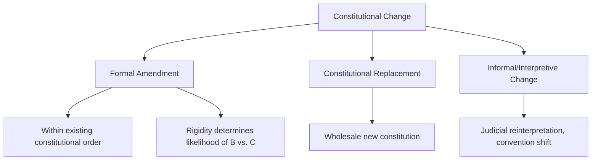

## Constitutional Amendment Processes

### Definition and Conceptual Overview

Constitutional amendment processes are the formal mechanisms by which a constitution's text is deliberately altered, added to, or repealed through procedures typically more demanding than those governing ordinary legislation. Amendment procedures sit at the center of a foundational constitutional design trade-off: they must be sufficiently rigorous to preserve the constitution's function as entrenched "higher law" — protecting fundamental commitments from transient political majorities, as discussed in the constitutionalism and rule of law topic — while remaining sufficiently accessible to allow legitimate constitutional adaptation over time, avoiding rigidity that could otherwise produce obsolescence, illegitimate circumvention, or destabilizing extra-constitutional change.

**Key Points**

- Amendment procedures vary enormously in rigidity across constitutional systems, from near-ordinary-legislative-majority processes to multi-stage procedures requiring supermajorities, popular referenda, and/or subnational unit ratification.
- Donald Lutz's influential comparative index of constitutional rigidity demonstrates that amendment difficulty correlates with constitutional replacement frequency: highly rigid constitutions tend to be amended less often but are more likely to be entirely replaced (rather than incrementally amended) when political pressure for change becomes acute.
- Many constitutions designate certain provisions as unamendable ("eternity clauses" or entrenched core provisions), raising distinct theoretical questions about whether any constitutional provision can legitimately place itself beyond the reach of future amendment.

### Theoretical Foundations

**The Entrenchment-Flexibility Trade-off**

Constitutional theory identifies a core tension: highly rigid amendment procedures maximize stability, predictability, and protection of fundamental commitments against transient majorities, but risk obsolescence, illegitimate informal circumvention, or eventual crisis-driven wholesale replacement if formal channels prove too difficult to use for legitimate adaptation; highly flexible procedures maximize adaptability but risk undermining the constitution's distinctive function as higher law insulated from ordinary political majorities.

**Amendment vs. Constitutional Replacement**

Comparative constitutional scholars distinguish *amendment* (incremental textual modification within an existing constitutional order) from *replacement* (wholesale substitution of an entirely new constitution, typically following revolution, state collapse, transition, or fundamental political rupture) — the choice and design of amendment procedures shapes which of these pathways a political system is more likely to follow when facing pressure for fundamental change.

**Constituent Power vs. Constituted Power**

A foundational theoretical distinction (traced to Emmanuel Sieyès's revolutionary-era writing) separates *constituent power* — the original, foundational authority to establish a constitutional order (exercised, for example, by a founding constitutional convention or referendum) — from *constituted power* — the ordinary governmental authority created and bounded by that constitution, including the amendment power itself, which typically operates as a form of constituted (and thus more limited) rather than unlimited constituent authority.

### Comparative Models of Amendment Procedure

**Legislative Supermajority Model**

Requires an enhanced legislative majority (commonly two-thirds) in one or both legislative chambers, often across two successive legislative sessions separated by an intervening election, to enact a constitutional amendment — used in various forms across many parliamentary and mixed systems.

**Multi-Stage Federal Ratification Model**

Exemplified by the United States: Article V requires proposal by two-thirds of both houses of Congress (or a constitutional convention called by two-thirds of state legislatures, a mechanism never yet used to propose an amendment) followed by ratification by three-fourths of state legislatures (or state ratifying conventions) — a highly rigid, multi-veto-point process that has produced only 27 amendments (including the original Bill of Rights) since 1788, and none since 1992.

**Popular Referendum Model**

Requires direct popular approval via referendum, either as the sole ratification mechanism or combined with legislative approval — used extensively in Ireland (virtually all constitutional amendments require referendum approval), Switzerland (mandatory referendum for constitutional amendments, often combined with a "double majority" requiring both a national popular majority and a majority of cantons), and Australia (requiring both a national majority and a majority of states — the "double majority" requirement, which has resulted in the failure of the substantial majority of proposed amendments put to referendum).

**Mixed/Hybrid Models**

Many constitutions combine legislative supermajority requirements with additional ratification steps — for example, requiring both supermajority parliamentary approval and either popular referendum or subnational unit consent, depending on the type or significance of the proposed amendment (some systems apply different, more demanding procedures to amendments affecting particularly fundamental provisions, such as federal structure or core rights).

**Ordinary Legislative Majority Model**

Some uncodified or weakly entrenched systems (as discussed in the written/unwritten constitutions topic) permit constitutional change through ordinary legislative majority — most notably the UK's parliamentary sovereignty tradition, under which "constitutional" statutes can formally be amended or repealed through the same simple-majority process as any other legislation, though political convention and practice often impose informal, non-legally-binding constraints on such changes.

### Comparative Table: Amendment Procedure Rigidity

| System | Core Mechanism | Approximate Rigidity |
| --- | --- | --- |
| United States | 2/3 Congress + 3/4 state ratification | Very High |
| Switzerland | Mandatory referendum, double majority (popular + cantonal) | High |
| Australia | Parliamentary proposal + double majority referendum | High |
| Germany | 2/3 Bundestag + 2/3 Bundesrat; certain provisions unamendable | High (with eternity clause) |
| Ireland | Legislative proposal + mandatory popular referendum | Moderate-High |
| India | Varies by provision: simple majority, special majority, or special majority + state ratification | Variable/Tiered |
| United Kingdom | Ordinary legislative majority (constitutional statutes) | Low (formally) |

### Unamendable Provisions: "Eternity Clauses"

**Concept and Function**

Some constitutions explicitly designate certain core provisions as permanently unamendable through the ordinary formal amendment process — commonly protecting core structural features (federalism, republican government form, human dignity, or the constitutional order's basic democratic character) from removal even via otherwise-valid supermajority amendment procedures.

**Germany's Basic Law (Article 79(3))**

Perhaps the most influential example: Germany's "eternity clause" explicitly prohibits amendments affecting federal structure, the participation of states (Länder) in legislation, or the core principles of human dignity and democratic, social federal statehood articulated in Articles 1 and 20 — a provision widely understood as a direct constitutional response to the Weimar Republic's formal-legal collapse into Nazi dictatorship, seeking to prevent any future formally "legal" dismantling of Germany's democratic constitutional order.

**The "Basic Structure" Doctrine (India)**

India's Supreme Court, in the landmark *Kesavananda Bharati v. State of Kerala* (1973) decision, judicially developed a "basic structure doctrine" holding that Parliament's constitutional amendment power, while textually broad, cannot be used to alter the constitution's "basic structure" (including judicial review, federalism, secularism, and democratic government) — a judicially created (rather than explicitly textual) unamendability doctrine that remains among the most significant and debated developments in comparative constitutional law.

**Theoretical Puzzle**

Eternity clauses raise a foundational theoretical puzzle directly connected to the constituent/constituted power distinction: can a constitution's own (constituted) amendment power legitimately place certain provisions permanently beyond that same amendment power's reach, effectively binding all future constituent moments short of complete constitutional replacement? Scholars remain divided on whether eternity clauses represent a coherent and legitimate constitutional design tool or an internally paradoxical attempt at "constitutional self-entrenchment" that cannot ultimately bind a sufficiently determined future exercise of genuine constituent power. [Inference: this theoretical debate remains unresolved in constitutional theory rather than settled by consensus.]

### Illustrative Diagram: The US Article V Amendment Process

<svg xmlns="http://www.w3.org/2000/svg" viewBox="0 0 800 380" font-family="sans-serif">
<text x="400" y="30" text-anchor="middle" font-size="18" font-weight="bold" fill="#1a1a2e">US Constitutional Amendment: Article V Pathway (svg_diagram)</text>
<rect x="60" y="70" width="320" height="60" fill="#3a5a9c" opacity="0.85" rx="6" />
<text x="220" y="95" text-anchor="middle" font-size="12" fill="white" font-weight="bold">Proposal: 2/3 of Both Houses</text>
<text x="220" y="113" text-anchor="middle" font-size="11" fill="white">of Congress</text>
<rect x="420" y="70" width="320" height="60" fill="#c9622a" opacity="0.85" rx="6" />
<text x="580" y="95" text-anchor="middle" font-size="12" fill="white" font-weight="bold">OR: Convention Called by</text>
<text x="580" y="113" text-anchor="middle" font-size="11" fill="white">2/3 of State Legislatures (unused)</text>
<line x1="220" y1="130" x2="400" y2="200" stroke="#555" stroke-width="2" />
<line x1="580" y1="130" x2="400" y2="200" stroke="#555" stroke-width="2" />
<rect x="250" y="200" width="300" height="60" fill="#8c4a9c" opacity="0.9" rx="6" />
<text x="400" y="225" text-anchor="middle" font-size="12" fill="white" font-weight="bold">Ratification: 3/4 of States</text>
<text x="400" y="243" text-anchor="middle" font-size="11" fill="white">(legislatures or conventions)</text>
<line x1="400" y1="260" x2="400" y2="300" stroke="#555" stroke-width="2" marker-end="url(#arrow4)" />
<rect x="270" y="300" width="260" height="50" fill="#2a8c6e" opacity="0.9" rx="6" />
<text x="400" y="330" text-anchor="middle" font-size="12" fill="white" font-weight="bold">Amendment Ratified</text>
</svg>

### Judicial Interpretation as Informal Amendment Substitute

**Living Constitutionalism and Judicial Reinterpretation**

Where formal amendment procedures are highly rigid (as in the US), courts often play a substantial role in adapting constitutional meaning to changing circumstances through interpretive reinterpretation rather than formal textual amendment — a dynamic that intensifies debate over judicial legitimacy and the countermajoritarian difficulty discussed in the constitutionalism and rule of law topic, since interpretive change can achieve outcomes functionally similar to formal amendment without engaging the constitution's designated amendment procedure.

**"Constitutional Moments" Theory**

Legal scholar Bruce Ackerman's influential theory of "constitutional moments" argues that fundamental constitutional change in US history has sometimes occurred through exceptional periods of heightened, broad-based popular political mobilization and elite consensus (Reconstruction, the New Deal) that functioned as de facto higher-lawmaking episodes achieving amendment-equivalent legitimacy and effect, even where the formal Article V process was not strictly followed in the conventional sense — a controversial but influential theoretical account of how rigid formal amendment systems can nonetheless accommodate major substantive constitutional change.

### Amendment Frequency and Constitutional Endurance

**Comparative Patterns**

Comparative constitutional scholarship (notably the work of Zachary Elkins, Tom Ginsburg, and James Melton on constitutional endurance) finds that constitutions combining moderate amendment flexibility with inclusive drafting processes and specificity tend to endure longer than either extremely rigid or extremely flexible constitutions — extremely rigid constitutions may become obsolete and face illegitimate circumvention or crisis-driven replacement, while extremely flexible constitutions may fail to provide the stability and credible commitment function that gives constitutionalism its distinctive value. [Inference: while this general relationship is empirically documented across large comparative datasets, the precise causal mechanisms and the applicability of these findings to any single country's specific circumstances remain subject to ongoing scholarly refinement.]

**Amendment Culture Variation**

Amendment frequency varies dramatically across systems independent of formal rigidity alone — reflecting differing political cultures regarding the appropriateness of formal constitutional change: some systems (e.g., many US states, or India at the national level) amend relatively frequently even with moderately demanding procedures, while others (the US federal constitution) exhibit strong cultural resistance to formal amendment even where the constitutional text has arguably become significantly outdated in certain respects.

### Critiques and Debates

**Excessive Rigidity Critique**

Critics of highly rigid systems (particularly applied to the US federal Constitution) argue that near-impossibility of formal amendment forces excessive reliance on judicial reinterpretation to achieve necessary constitutional adaptation, potentially undermining democratic legitimacy and textual fidelity by displacing formal amendment with contested judicial interpretation.

**Excessive Flexibility Critique**

Critics of highly flexible systems (raised particularly regarding countries with frequent constitutional amendment, or uncodified systems reliant on ordinary legislative majority) argue that easily amended constitutions fail to provide meaningful entrenchment or credible protection against majoritarian erosion of fundamental rights and institutional checks, functionally collapsing the distinction between constitutional and ordinary law.

**Eternity Clause Legitimacy Debate**

As discussed above, scholars remain divided over whether unamendable "eternity clause" provisions represent legitimate, prudent constitutional design (protecting core democratic and rights commitments from any future majority, however large) or an illegitimate attempt to permanently bind future generations' constituent authority — a debate with direct relevance to ongoing judicial controversies (e.g., India's basic structure doctrine's continued application and scope).

**Amendment as Democratic Backsliding Vector**

Comparative democratic backsliding scholarship notes that formal, procedurally valid constitutional amendment processes have themselves sometimes been used as vehicles for democratic erosion — dominant political actors using ostensibly legitimate supermajority amendment procedures to weaken judicial independence, extend term limits, or entrench single-party dominance — illustrating that formal procedural legitimacy alone does not guarantee that amendment processes serve constitutionalism's underlying protective function. [Behavioral application and outcome in any specific contemporary case remains subject to ongoing political and legal developments.]

### Related Topics

- Constitutionalism and the Rule of Law
- Written and Unwritten Constitutions
- Judicial Review and Constitutional Courts
- Democratic Backsliding and Constitutional Erosion
- Federalism and Constitutional Design
- Constituent Power and Constitution-Making Processes
- Comparative Constitutional Endurance
- India's Basic Structure Doctrine
- Germany's Basic Law and Eternity Clauses
- Referenda and Direct Democracy in Constitutional Change