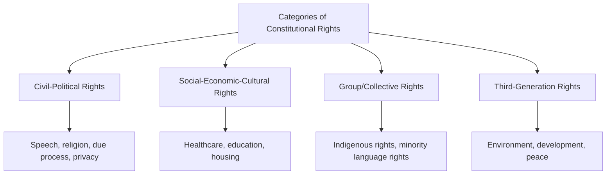

## Bills of Rights and Constitutional Protections

### Definition and Conceptual Overview

A bill of rights is a constitutional (or quasi-constitutional) catalog of fundamental individual and, increasingly, collective rights and freedoms that a state's legal order guarantees to persons within its jurisdiction, typically protected against infringement by ordinary legislation or executive action. Bills of rights function as a core mechanism of constitutionalism as discussed earlier in this chapter — translating the general principle of limited government into specific, enumerated protections, usually accompanied by institutional enforcement mechanisms (most commonly judicial review) that give those protections practical legal effect beyond mere aspirational statement.

**Key Points**

- Bills of rights vary substantially in scope (civil-political rights only versus civil-political plus social-economic rights), enforceability (strong-form judicial invalidation versus weak-form declaratory mechanisms), and constitutional status (entrenched constitutional text versus ordinary statute).
- The classical liberal tradition emphasizes negative rights (freedoms from government interference — speech, religion, due process); many post-war and especially post-Cold War constitutions increasingly incorporate positive/social rights (entitlements to state provision — healthcare, education, housing).
- Rights protections exist on a spectrum of enforceability, from fully justiciable constitutional rights subject to judicial invalidation of inconsistent legislation, to weaker declaratory or aspirational rights provisions lacking direct judicial enforcement mechanisms.

### Historical Development

**Early Antecedents**

England's Magna Carta (1215) and Bill of Rights (1689) established early, limited protections against arbitrary royal power (due process guarantees, protection from excessive fines, parliamentary consent to taxation), though these documents protected specific classes (initially nobility) rather than articulating universal individual rights in the modern sense.

**Enlightenment Rights Declarations**

The US Declaration of Independence (1776) and subsequent state constitutions (Virginia's 1776 Declaration of Rights being particularly influential) articulated natural-rights-based rationales for government, followed by the US Bill of Rights (the first ten constitutional amendments, ratified 1791), protecting core civil liberties (speech, religion, due process, jury trial) against federal government action. France's Declaration of the Rights of Man and of the Citizen (1789) similarly articulated foundational, universalist rights claims grounded in Enlightenment natural rights theory, proving highly influential across subsequent European and Latin American constitutional development.

**19th Century Gaps and Exclusions**

Despite universalist rhetoric, most 18th–19th century rights declarations excluded large populations from effective protection or citizenship (women, enslaved and colonized peoples, religious and ethnic minorities), reflecting a substantial historical gap between formal rights text and its actual application — a gap progressively narrowed (though not eliminated) through subsequent constitutional amendment, civil rights movements, and evolving judicial interpretation.

**Post-WWII International and Domestic Expansion**

The Universal Declaration of Human Rights (1948), drafted substantially in response to Nazi atrocities, established an influential international rights framework that shaped subsequent domestic constitutional rights catalogs worldwide, alongside regional human rights instruments (the European Convention on Human Rights, 1950; the American Convention on Human Rights, 1969) and increasingly detailed and expansive domestic bills of rights in post-war constitutions (Germany's Basic Law, 1949, being a particularly influential model emphasizing human dignity as a foundational, judicially enforceable constitutional value).

**Post-Cold War Expansion and Social Rights Incorporation**

Post-1989 constitution-making across post-communist states, and especially South Africa's 1996 Constitution, significantly expanded the scope of constitutionally protected rights to include extensive social, economic, and cultural rights (housing, healthcare, education, environment) alongside traditional civil-political rights, reflecting evolving international human rights norms and a broader conception of what constitutional rights protection should encompass.

### Categories of Rights

**Civil and Political Rights**

The classical liberal core: freedom of speech, religion, assembly, and association; due process and fair trial guarantees; protection from arbitrary detention and torture; privacy protections; and political participation rights (voting, candidacy). These rights are traditionally conceived as primarily "negative" — obligating the state to refrain from interference — though contemporary theory increasingly recognizes that even civil-political rights require some positive state action to be effectively realized (e.g., functioning courts to secure due process, or electoral administration to secure voting rights).

**Social, Economic, and Cultural Rights**

Rights to specific social goods and services — healthcare, education, housing, an adequate standard of living, and in some formulations, employment and social security. These are traditionally conceived as "positive" rights, requiring affirmative state resource allocation and provision rather than mere non-interference, and have historically faced greater contestation regarding their appropriate status as directly justiciable constitutional rights (as opposed to aspirational policy goals) given resource-allocation and separation-of-powers concerns.

**Group and Collective Rights**

Rights held by, or specifically protecting, particular collective groups rather than individuals alone — indigenous peoples' land and self-governance rights, minority language and cultural rights, and in some frameworks, rights to self-determination — reflecting growing recognition that individual-rights frameworks alone may not adequately protect certain forms of collective identity and interest, particularly for historically marginalized groups.

**Third-Generation / Solidarity Rights**

A more recently and less consistently recognized category encompassing rights to a healthy environment, peace, and development — reflecting evolving international human rights discourse, though these rights face greater contestation regarding their justiciability, precise content, and appropriate holder (individual versus collective/state).

### Enforceability Spectrum

**Strong-Form Judicial Review**

Courts possess authority to invalidate legislation or executive action found inconsistent with constitutionally protected rights — the dominant model in systems with entrenched, codified bills of rights and constitutional or supreme court review (United States, Germany, South Africa, India).

**Weak-Form Judicial Review**

Courts can assess legislation against rights standards and issue declarations of incompatibility, but lack formal power to invalidate the legislation directly, preserving ultimate legislative authority to decide whether to amend the law — exemplified by the UK's Human Rights Act 1998 (declarations of incompatibility do not invalidate the statute) and Canada's Charter of Rights and Freedoms, which includes a "notwithstanding clause" (Section 33) allowing legislatures to expressly override certain Charter rights for renewable five-year periods.

**Aspirational/Directive Provisions**

Some constitutions include rights or principles framed as non-justiciable directive principles of state policy rather than directly enforceable rights — India's Directive Principles of State Policy (distinct from India's separately justiciable Fundamental Rights) provide an influential example, articulating social and economic policy goals intended to guide legislation and governance without themselves being directly enforceable in court.

**International/Regional Enforcement**

Beyond domestic constitutional mechanisms, regional human rights courts (the European Court of Human Rights, the Inter-American Court of Human Rights) provide supplementary, though jurisdictionally and politically constrained, avenues for rights enforcement where domestic remedies are argued to be inadequate.

### Comparative Table: Selected Bill of Rights Models

| System | Scope | Enforceability | Notable Feature |
| --- | --- | --- | --- |
| United States (Bill of Rights) | Primarily civil-political | Strong-form judicial review | Limited social-economic rights; heavy reliance on judicial interpretation |
| Germany (Basic Law, Arts. 1–19) | Civil-political, dignity-centered | Strong-form; core rights unamendable | Human dignity as foundational, eternity-clause-protected value |
| South Africa (1996 Constitution) | Extensive civil-political and social-economic | Strong-form, including justiciable socio-economic rights | Among the most expansive globally; courts have enforced socio-economic rights (e.g., housing, healthcare access) |
| Canada (Charter of Rights) | Civil-political, equality rights | Strong-form with legislative override (notwithstanding clause) | Balances judicial and legislative authority via Section 33 |
| United Kingdom (Human Rights Act) | Civil-political (ECHR-derived) | Weak-form (declarations of incompatibility) | Preserves parliamentary sovereignty |
| India (Fundamental Rights + Directive Principles) | Civil-political justiciable; social-economic largely aspirational | Tiered: strong-form for Fundamental Rights, non-justiciable for Directive Principles | Basic structure doctrine protects core rights from amendment |

### Judicial Enforcement of Social-Economic Rights: The South African Model

South Africa's Constitutional Court has developed an influential jurisprudential approach to enforcing justiciable socio-economic rights — rather than mandating specific substantive outcomes (e.g., a right to a particular quantity of housing), the Court has generally applied a "reasonableness review" standard, assessing whether government policies and resource allocation decisions constitute a reasonable program toward progressive realization of the relevant right, most notably in cases addressing access to housing and HIV/AIDS treatment. This approach has been influential internationally as a model for making social-economic rights meaningfully justiciable while remaining sensitive to separation-of-powers and resource-allocation concerns traditionally raised against direct judicial enforcement of positive rights. [Inference: the long-term comparative effectiveness of the reasonableness-review model relative to alternative approaches to socio-economic rights enforcement remains an active subject of comparative constitutional scholarship rather than a settled consensus.]

### Example: Rights Limitation Clauses

Most contemporary bills of rights include, explicitly or through judicial doctrine, mechanisms for permissible rights limitation — recognizing that few rights are treated as absolute and that legitimate government interests can justify proportionate restrictions. Canada's Charter includes an explicit general limitation clause (Section 1), permitting "reasonable limits...as can be demonstrably justified in a free and democratic society," subject to judicial proportionality analysis (assessing whether a limiting measure serves a pressing objective, is rationally connected to that objective, minimally impairs the right, and is proportionate in its overall effects) — a structured proportionality framework that has proven highly influential in comparative constitutional rights adjudication internationally, including in Germany, South Africa, and Israel.

### Illustrative Diagram: Rights Enforceability Spectrum

<svg xmlns="http://www.w3.org/2000/svg" viewBox="0 0 800 340" font-family="sans-serif">
<text x="400" y="30" text-anchor="middle" font-size="18" font-weight="bold" fill="#1a1a2e">Bill of Rights Enforceability Spectrum (svg_diagram)</text>
<line x1="80" y1="180" x2="720" y2="180" stroke="#333" stroke-width="3" />
<polygon points="720,180 705,172 705,188" fill="#333" />
<circle cx="150" cy="180" r="10" fill="#9c2a4a" />
<text x="150" y="150" text-anchor="middle" font-size="11" font-weight="bold" fill="#333">Aspirational /</text>
<text x="150" y="135" text-anchor="middle" font-size="11" font-weight="bold" fill="#333">Directive</text>
<text x="150" y="210" text-anchor="middle" font-size="10" fill="#555">India's Directive</text>
<text x="150" y="225" text-anchor="middle" font-size="10" fill="#555">Principles</text>
<circle cx="350" cy="180" r="10" fill="#c9622a" />
<text x="350" y="150" text-anchor="middle" font-size="11" font-weight="bold" fill="#333">Weak-Form</text>
<text x="350" y="135" text-anchor="middle" font-size="11" font-weight="bold" fill="#333">Judicial Review</text>
<text x="350" y="210" text-anchor="middle" font-size="10" fill="#555">UK Human Rights Act</text>
<circle cx="550" cy="180" r="10" fill="#3a5a9c" />
<text x="550" y="150" text-anchor="middle" font-size="11" font-weight="bold" fill="#333">Strong-Form w/</text>
<text x="550" y="135" text-anchor="middle" font-size="11" font-weight="bold" fill="#333">Legislative Override</text>
<text x="550" y="210" text-anchor="middle" font-size="10" fill="#555">Canada Charter</text>
<text x="550" y="225" text-anchor="middle" font-size="10" fill="#555">(Section 33)</text>
<circle cx="680" cy="180" r="10" fill="#2a8c6e" />
<text x="680" y="150" text-anchor="middle" font-size="11" font-weight="bold" fill="#333">Strong-Form,</text>
<text x="680" y="135" text-anchor="middle" font-size="11" font-weight="bold" fill="#333">Entrenched</text>
<text x="680" y="210" text-anchor="middle" font-size="10" fill="#555">Germany, South Africa</text>

<text x="150" y="260" text-anchor="middle" font-size="10" fill="#555" font-style="italic">Least</text>

<text x="680" y="260" text-anchor="middle" font-size="10" fill="#555" font-style="italic">Most</text>

<text x="400" y="280" text-anchor="middle" font-size="11" fill="#555" font-style="italic">Increasing judicial enforceability / entrenchment →</text>

</svg>

### Bills of Rights and Democratic Legitimacy

**Judicial Empowerment and the Countermajoritarian Question**

As discussed in the constitutionalism and rule of law topic, robust, judicially enforceable bills of rights necessarily empower courts to invalidate democratically enacted legislation, raising persistent debate over the appropriate balance between judicial rights protection and democratic self-governance — a debate that intensifies further with expansive social-economic rights catalogs, given their more direct implications for budgetary and policy discretion typically reserved to elected branches.

**Rights as Democratic Precondition vs. Constraint**

Some theorists (associated with a "democratic constitutionalism" perspective) argue certain rights (particularly political participation and expression rights) function as *preconditions* for meaningful democracy rather than external constraints upon it, making their judicial protection less democratically problematic than rights protections addressing other domains; this framing remains contested regarding its applicability to the full range of contemporary constitutional rights catalogs.

### Critiques and Debates

**Positive vs. Negative Rights Debate**

Persistent theoretical debate continues over whether social-economic ("positive") rights are appropriately conceived as genuine, directly justiciable constitutional rights comparable to civil-political rights, or whether they are better understood as policy goals appropriately left to legislative and executive discretion given their resource-allocation implications and comparative institutional competence concerns — a debate the South African reasonableness-review model represents one influential attempt to navigate rather than definitively resolve.

**Formal Rights vs. Substantive Realization Gap**

Comparative scholars consistently note a persistent gap between formal constitutional rights guarantees and their substantive, practical realization — particularly acute in states with weaker judicial independence, enforcement capacity, or state fragility (as discussed earlier in this chapter), where extensive formal rights catalogs may exist alongside limited practical rights protection, echoing broader debates about the gap between constitutional text and constitutional practice.

**Universalism vs. Cultural Relativism**

International human rights and constitutional rights discourse continues to face contestation between universalist claims (that core rights apply to all persons regardless of cultural or political context) and relativist or pluralist critiques (arguing rights frameworks, often developed within Western liberal traditions, may inadequately account for diverse cultural, religious, and political traditions regarding the proper relationship between individual and community) — a foundational and unresolved debate in comparative rights theory. [Speculation: the degree to which this tension can be reconciled through cross-cultural dialogue versus representing a genuinely persistent normative disagreement remains a matter of ongoing philosophical and political debate rather than settled consensus.]

**Judicialization of Politics Critique**

Critics across the political spectrum have raised concern that expansive, strongly enforceable bills of rights contribute to broader "judicialization of politics" — the transfer of significant policy decision-making from elected legislatures to unelected courts — with disputes continuing over whether this transfer appropriately protects fundamental rights from majoritarian overreach or inappropriately displaces democratic deliberation on contested social and economic policy questions.

### Related Topics

- Constitutionalism and the Rule of Law
- Written and Unwritten Constitutions
- Constitutional Amendment Processes
- Judicial Review and Constitutional Courts
- Human Rights and International Law
- South African Constitutional Jurisprudence
- Proportionality Analysis in Comparative Constitutional Law
- Indigenous Rights and Group-Differentiated Citizenship
- Democratic Backsliding and Rights Erosion
- Directive Principles vs. Justiciable Rights