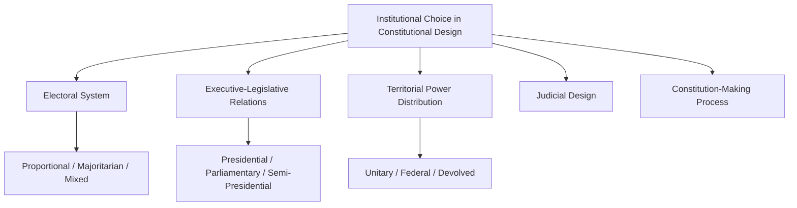

## Institutional Choice in Constitutional Design

### Definition and Conceptual Overview

Institutional choice in constitutional design refers to the field of comparative political science and constitutional theory concerned with the deliberate selection among alternative institutional arrangements — electoral systems, executive-legislative relations, territorial power distribution, judicial structures, and constitution-making processes themselves — when framing a new or reformed constitutional order. Rather than treating constitutional structures as fixed or naturally given, this field treats them as consequential *design choices* with predictable, comparatively documented effects on governability, representation, accountability, conflict management, and democratic stability, drawing on comparative empirical evidence to inform constitution-makers' decisions.

**Key Points**

- Institutional design choices are highly interdependent rather than independent: electoral system choice interacts with executive type, which interacts with territorial structure, such that constitutional designers must consider institutional "packages" rather than optimizing individual components in isolation.
- No single institutional configuration is universally optimal; comparative constitutional design scholarship generally emphasizes that appropriate institutional choices depend heavily on a country's specific social cleavage structure, historical legacies, and political context (a "contextualist" rather than "one-size-fits-all" orientation).
- Key recurring design trade-offs include representation versus governability (electoral systems), power concentration versus power-sharing (executive type and territorial structure), and majoritarian versus consensus/consociational models of democracy.

### Core Institutional Design Domains

**Electoral System Design**

The choice of electoral formula (proportional representation, plurality/majoritarian systems, or mixed systems) fundamentally shapes party system fragmentation, the proportionality of representation, government formation dynamics, and the nature of legislator-constituent accountability relationships.

**Executive-Legislative Relations**

The choice among presidential, parliamentary, and semi-presidential systems structures how executive authority is selected, how it relates to and can be removed by the legislature, and the resulting incentives for cross-party cooperation, gridlock risk, and democratic stability.

**Territorial Power Distribution**

The choice among unitary, federal, and various decentralized/devolved arrangements determines how power is distributed vertically between central and subnational governments, with significant implications for managing regional, ethnic, or linguistic diversity and cleavages.

**Judicial Design and Constitutional Review**

As discussed in the constitutionalism and rule of law topic, choices regarding centralized versus decentralized judicial review, judicial appointment mechanisms, and court independence safeguards shape the institutional capacity for enforcing constitutional limits on political power.

**Constitution-Making Process Design**

Beyond the substantive institutions a constitution establishes, the *process* by which the constitution itself is drafted and ratified (constituent assembly composition, public participation mechanisms, ratification procedure) is itself an important institutional choice with documented effects on the resulting constitution's legitimacy and durability.

### Electoral System Trade-offs

**Proportional Representation (PR)**

Translates vote shares into seat shares with relatively high fidelity, typically producing multi-party systems, coalition governments, and more descriptively representative legislatures (including minority and smaller-party representation), but potentially at the cost of governing stability, clear accountability (voters may struggle to attribute responsibility within coalition governments), and swift decisive government formation.

**Plurality/Majoritarian Systems**

Systems such as first-past-the-post tend to produce fewer, larger parties (per Duverger's Law, which holds that plurality electoral rules tend toward two-party systems), often manufacturing single-party legislative majorities from a plurality (not necessarily majority) of the popular vote, favoring clear governing accountability and stability but at the cost of proportionality and the potential systematic underrepresentation of smaller or geographically dispersed political constituencies.

**Mixed Systems**

Systems combining proportional and majoritarian elements (e.g., mixed-member proportional systems used in Germany and New Zealand) attempt to balance proportionality and constituency-based accountability, representing a widely studied middle path in comparative electoral system design.

**Design Implications for Divided Societies**

Comparative scholarship on electoral system choice in ethnically or religiously divided societies (notably associated with Arend Lijphart's advocacy of PR and Donald Horowitz's alternative emphasis on preferential/alternative vote systems designed to incentivize cross-ethnic vote-pooling) represents a significant and unresolved debate over which electoral design best manages deep social cleavages — PR advocates emphasize ensuring proportional minority representation, while alternative-vote advocates emphasize incentivizing moderate, cross-cleavage political appeals. [Inference: this remains among the most actively contested empirical and normative debates in comparative institutional design scholarship, without a single settled resolution.]

### Executive-Legislative System Trade-offs

**Presidentialism**

Separately elected executive with a fixed term, not dependent on ongoing legislative confidence, providing clear executive accountability and stability of tenure, but raising documented risks (associated particularly with Juan Linz's influential critique) including "dual democratic legitimacy" conflicts between separately elected president and legislature, rigid fixed terms that can exacerbate crises when an executive loses public confidence before term's end, and documented associations with higher rates of democratic breakdown, particularly in the historical experience of Latin American presidential systems.

**Parliamentarism**

Executive authority derives from and remains dependent on ongoing legislative confidence, allowing for more flexible removal of failing governments (via votes of no confidence) without requiring impeachment-level crisis triggers, generally facilitating easier coalition formation and government instability resolution, though at some potential cost to executive stability and voter ability to directly select the chief executive.

**Semi-Presidentialism**

Hybrid systems combining a popularly elected president with a separately accountable prime minister/cabinet responsible to the legislature (France's Fifth Republic being the paradigmatic case) — offering potential benefits of combining direct executive accountability with legislative-confidence flexibility, but introducing distinctive risks of executive-executive conflict (particularly during periods of "cohabitation" where president and prime minister derive from opposing political coalitions).

**Comparative Democratic Stability Evidence**

Linz's influential comparative analysis, alongside subsequent scholarship, has documented a statistical association between presidentialism and higher rates of democratic breakdown compared to parliamentarism, particularly in the context of Latin American 20th-century political history, though this finding remains contested regarding its generalizability and causal mechanisms (rival explanations emphasize regional political culture, economic conditions, and historical timing rather than executive type alone as the primary causal driver). [Inference: the precise causal weight of executive-type choice versus other confounding factors in these documented associations remains an active subject of methodological debate in comparative politics.]

### Comparative Table: Executive Type Trade-offs

| Dimension | Presidential | Parliamentary | Semi-Presidential |
| --- | --- | --- | --- |
| Executive selection | Direct popular election | Legislative selection/confidence | Both (dual legitimacy) |
| Removal mechanism | Impeachment (high threshold) | Vote of no confidence (lower threshold) | Varies; potential cohabitation conflict |
| Term fixity | Fixed term | Flexible (early elections possible) | Mixed |
| Documented stability risk | Higher (Linz thesis) | Lower (per comparative evidence) | Intermediate; cohabitation-specific risks |
| Example | United States, most Latin America | UK, Germany, India | France, Poland |

### Territorial Power Distribution Trade-offs

**Unitary Systems**

Concentrate constitutional authority at the central government level, with subnational units (if they exist) exercising only devolved, revocable authority rather than constitutionally entrenched autonomous power — generally facilitating more uniform national policy but potentially inadequate for managing significant territorial, regional, or ethnic diversity.

**Federal Systems**

Constitutionally entrench a division of sovereign authority between central and constituent state/provincial governments, each possessing independent constitutional authority over specified domains — frequently adopted in large, diverse, or historically fragmented polities (as discussed in relation to state formation theory earlier in this course) to accommodate territorial diversity while maintaining national unity, though at potential cost to policy uniformity and central coordination capacity.

**Asymmetric Federalism/Devolution**

Some systems grant differentiated degrees of autonomy to different subnational units based on distinct historical, cultural, or political circumstances (e.g., Spain's differentiated autonomous community arrangements, or the UK's asymmetric devolution to Scotland, Wales, and Northern Ireland) — a design tool specifically developed to accommodate territorially concentrated minority nationalism, as discussed in the nation and national identity topic earlier in this course.

**Consociational Power-Sharing**

Beyond purely territorial arrangements, consociational designs (theorized primarily by Arend Lijphart) incorporate additional power-sharing mechanisms for deeply divided societies — grand coalition government, mutual veto rights for major groups, proportionality in representation and resource allocation, and segmental group autonomy — exemplified by post-conflict arrangements such as Northern Ireland's Good Friday Agreement (1998) and Bosnia and Herzegovina's Dayton Agreement (1995) constitutional structure.

### Illustrative Diagram: Institutional Design Interdependencies

<svg xmlns="http://www.w3.org/2000/svg" viewBox="0 0 800 420" font-family="sans-serif">
<text x="400" y="30" text-anchor="middle" font-size="18" font-weight="bold" fill="#1a1a2e">Interdependence of Institutional Design Choices (svg_diagram)</text>
<circle cx="220" cy="140" r="80" fill="#3a5a9c" opacity="0.85" />
<text x="220" y="135" text-anchor="middle" font-size="13" fill="white" font-weight="bold">Electoral</text>
<text x="220" y="153" text-anchor="middle" font-size="13" fill="white" font-weight="bold">System</text>
<circle cx="580" cy="140" r="80" fill="#c9622a" opacity="0.85" />
<text x="580" y="130" text-anchor="middle" font-size="12" fill="white" font-weight="bold">Executive-Legislative</text>
<text x="580" y="148" text-anchor="middle" font-size="12" fill="white" font-weight="bold">Relations</text>
<circle cx="220" cy="320" r="80" fill="#2a8c6e" opacity="0.85" />
<text x="220" y="315" text-anchor="middle" font-size="13" fill="white" font-weight="bold">Territorial</text>
<text x="220" y="333" text-anchor="middle" font-size="13" fill="white" font-weight="bold">Structure</text>
<circle cx="580" cy="320" r="80" fill="#8c4a9c" opacity="0.85" />
<text x="580" y="315" text-anchor="middle" font-size="13" fill="white" font-weight="bold">Judicial</text>
<text x="580" y="333" text-anchor="middle" font-size="13" fill="white" font-weight="bold">Design</text>
<line x1="290" y1="180" x2="510" y2="180" stroke="#555" stroke-width="1.5" stroke-dasharray="4,3" />
<line x1="290" y1="280" x2="510" y2="280" stroke="#555" stroke-width="1.5" stroke-dasharray="4,3" />
<line x1="220" y1="220" x2="220" y2="240" stroke="#555" stroke-width="1.5" stroke-dasharray="4,3" />
<line x1="580" y1="220" x2="580" y2="240" stroke="#555" stroke-width="1.5" stroke-dasharray="4,3" />
<line x1="290" y1="200" x2="510" y2="260" stroke="#555" stroke-width="1.5" stroke-dasharray="4,3" />
</svg>

### Consensus vs. Majoritarian Democracy Models

**Lijphart's Typology**

Arend Lijphart's influential comparative framework (*Patterns of Democracy*, 1999/2012) distinguishes majoritarian democracies — concentrating power (single-party government, plurality electoral systems, unitary and centralized government, unicameral or asymmetric bicameral legislatures, flexible constitutions) — from consensus democracies — dispersing and sharing power (coalition government, proportional representation, federal/decentralized government, strong bicameralism, rigid constitutions with judicial review).

**Comparative Governance Outcomes**

Lijphart's comparative empirical work argues consensus democracies tend to perform comparably or better on measures of democratic quality, minority representation, and policy outcomes in socially diverse societies, without a clear efficiency trade-off relative to majoritarian systems, challenging earlier assumptions that majoritarian "efficiency" necessarily comes at the cost of representativeness. [Inference: Lijphart's specific empirical findings and methodology have faced ongoing scholarly scrutiny and are not universally accepted as definitively establishing consensus democracy's general superiority across all contexts.]

### Constitution-Making Process as Institutional Choice

**Elite-Negotiated vs. Participatory Drafting**

Constitution-making processes range from narrow elite negotiation (small constituent assemblies or executive-driven drafting) to broadly participatory processes incorporating extensive public consultation, civil society engagement, and sometimes direct popular ratification referenda — comparative research (Elkins, Ginsburg, Melton and others) generally finds more inclusive, participatory drafting processes associated with greater subsequent constitutional legitimacy and durability, though the relationship is not deterministic and depends on how genuinely participatory mechanisms are implemented in practice.

**Example**

South Africa's 1996 constitution-making process is frequently cited as an influential participatory model: following the negotiated 1993 interim constitution, the final constitution was drafted by a democratically elected Constitutional Assembly, incorporated extensive public submission and consultation processes, and required certification by the Constitutional Court against agreed foundational principles before final adoption — a process credited by many comparative scholars with contributing to the resulting constitution's strong subsequent legitimacy and durability despite South Africa's deeply divided historical context. [Inference: while widely cited as a positive comparative case, attributing South Africa's constitutional durability specifically and primarily to its participatory drafting process (as opposed to other contributing factors) remains a matter of scholarly interpretation rather than definitively isolated causal proof.]

### Critiques and Debates

**Institutional Determinism Critique**

Critics caution against overly deterministic claims that particular institutional configurations straightforwardly cause specific political outcomes (democratic stability, conflict management success), emphasizing instead that institutional effects are heavily mediated by underlying social, economic, and historical context — the same formal institution can function very differently across different societies.

**Transferability and "Institutional Fetishism" Critique**

Scholars caution against treating institutional models that succeeded in one context as straightforwardly transferable "best practice" templates for adoption elsewhere without careful contextual adaptation, a critique closely paralleling broader critiques of externally driven state-building and rule-of-law promotion discussed earlier in this course.

**PR vs. Majoritarian Debate in Divided Societies**

As noted, the Lijphart-Horowitz debate over appropriate electoral system design for managing deep ethnic or religious cleavages remains genuinely unresolved, with both approaches citing distinct comparative case evidence and neither commanding decisive consensus support among comparative institutionalists.

**Presidentialism Debate Reconsidered**

While Linz's critique of presidentialism remains influential, subsequent scholarship has qualified the original thesis, noting that some presidential systems (particularly outside Latin America) have proven durably stable, suggesting executive type alone is insufficient to predict democratic breakdown risk without accounting for party system characteristics, federalism, and other interacting institutional and contextual factors. [Speculation: whether a more refined, conditional version of the presidentialism-instability thesis, or a rejection of the thesis's core causal claim in favor of alternative explanatory frameworks, will ultimately prevail in the comparative literature remains an open question.]

### Related Topics

- Constitutionalism and the Rule of Law
- Written and Unwritten Constitutions
- Constitutional Amendment Processes
- Bills of Rights and Constitutional Protections
- Federalism and Constitutional Design
- Electoral Systems and Party System Effects
- Presidential vs. Parliamentary Systems
- Consociationalism and Power-Sharing in Divided Societies
- Comparative Constitution-Making Processes
- Theories of State Formation