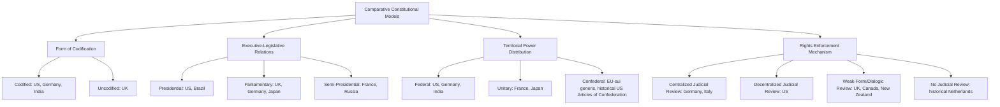

## Comparative Constitutional Models

### Definition and Scope

Comparative constitutional models refer to the systematic analysis of how different states structure their fundamental legal-political architecture, examining variations in the codification, distribution of powers, mechanisms of rights protection, and processes of constitutional change. This subfield sits at the intersection of comparative politics, constitutional law, and institutional design, asking why states adopt different constitutional forms and what consequences follow from those choices.

The comparative method treats constitutions not as isolated legal texts but as institutional solutions to recurring political problems: how to allocate power among competing actors, how to constrain rulers, how to accommodate social diversity, and how to balance stability against adaptability.

### Core Classificatory Dimensions

**Codified vs. Uncodified Constitutions**

- **Codified constitutions**: A single authoritative document (or small set of documents) serves as supreme law, typically entrenched through special amendment procedures. Examples: the United States (1787), Germany's *Grundgesetz* (1949), India (1950).
- **Uncodified constitutions**: Constitutional rules are distributed across statutes, judicial precedent, and convention, without one consolidated text. The United Kingdom is the paradigmatic case, relying on Acts of Parliament, common law, and constitutional conventions.

[Inference] The codified/uncodified distinction is often treated as binary in introductory texts, but most scholars now regard it as a spectrum, since even "uncodified" systems have quasi-foundational documents (e.g., Magna Carta, Bill of Rights 1689) and codified systems rely heavily on judicial interpretation and unwritten conventions.

**Rigid vs. Flexible Constitutions**

- **Rigid**: Amendment requires procedures more demanding than ordinary legislation (supermajorities, referenda, ratification by subunits). The US Constitution's Article V process is a classic example of high rigidity.
- **Flexible**: Amendment follows the same procedure as ordinary law. The UK Parliament can alter constitutional arrangements via simple majority Acts.

Rigidity is frequently measured empirically using amendment rate as a proxy, though this conflates formal difficulty with political will to amend.

**Monarchical vs. Republican Forms**

Distinguishes constitutional monarchies (Spain, Japan, Sweden, the UK) — where a hereditary head of state exists alongside constitutional constraints — from republics, where the head of state derives authority from election or appointment under constitutional rules (France, Germany, India, the US).

### Systems of Governmental Power Allocation

**Presidential Systems**

Characterized by a separately elected executive with a fixed term, independent of legislative confidence, and formal separation of powers between branches.

- **Key Points**:
  - Executive and legislature elected separately (dual democratic legitimacy)
  - Fixed terms for both branches
  - No confidence mechanism binding the executive to the legislature
  - Examples: United States, Brazil, Mexico, most of Latin America, Philippines, Indonesia

Juan Linz's influential critique argued that presidentialism generates a structural problem of **dual legitimacy**: when both the president and the legislature can claim to represent the popular will, and no constitutional mechanism resolves conflict between them short of extraordinary measures, systems become prone to deadlock or breakdown. [Inference] This "perils of presidentialism" thesis remains contested — Latin American democratic survival since the 1990s has led some scholars to argue that party system fragmentation, not presidentialism per se, better explains instability.

**Parliamentary Systems**

The executive (prime minister/cabinet) is drawn from and remains accountable to the legislature, which can remove it via a vote of no confidence.

- **Key Points**:
  - Fusion of executive and legislative personnel
  - Confidence mechanism links survival of government to legislative majority
  - Head of state (monarch or ceremonial president) distinct from head of government
  - Examples: United Kingdom, Germany, India, Japan, Canada, Australia

Subtypes include the **Westminster model** (majoritarian, single-party government, adversarial politics — UK, historically) versus **consensus parliamentary systems** (coalition-based, proportional representation, power-sharing — Netherlands, Germany, Nordic states), following Arend Lijphart's majoritarian/consensus typology.

**Semi-Presidential Systems**

A directly elected president coexists with a prime minister accountable to parliament, producing a dual executive.

- **Key Points**:
  - President has independent popular mandate and often significant reserve powers (foreign affairs, defense, dissolution)
  - Prime minister and cabinet depend on legislative confidence
  - Produces "cohabitation" when president and parliamentary majority come from opposing parties
  - Examples: France (Fifth Republic), Russia, Portugal, Poland, Ukraine, Taiwan

Robert Elgie's framework further subdivides this category into **premier-presidential** (cabinet accountable only to parliament) and **president-parliamentary** (cabinet accountable to both president and parliament) systems, the latter associated with greater instability risk. [Inference] Empirical work on semi-presidentialism suggests the *president-parliamentary* subtype correlates with weaker democratic durability, though causal mechanisms are debated.

### Territorial Distribution of Power

**Federal Systems**

Constitutionally entrenched division of sovereignty between a central government and constituent units (states/provinces/länder), where subunits possess autonomous authority not merely delegated by the center.

- Constitutional entrenchment of subunit powers (not revocable by ordinary central legislation)
- Bicameral legislatures often give subunits representation independent of population (e.g., US Senate, German Bundesrat)
- Examples: United States, Germany, India, Brazil, Nigeria, Switzerland, Canada

**Unitary Systems**

Sovereignty is constitutionally located in the central government, which may delegate administrative or even legislative authority to subunits, but retains the constitutional power to alter or revoke that delegation.

- Examples: France, Japan, most smaller states
- **Devolution** (UK's Scotland, Wales, Northern Ireland arrangements) represents unitary systems with substantial, but formally revocable, delegated autonomy — distinguishing it from federalism proper. [Inference] Whether devolved UK arrangements have become de facto quasi-federal is a matter of ongoing scholarly debate, since political conventions may function as constraints even absent legal entrenchment.

**Confederal Arrangements**

Constituent units retain primary sovereignty, delegating limited authority to a central body that typically lacks direct coercive power over individuals (historical US under the Articles of Confederation 1781–1789; arguably the European Union in certain respects, though the EU is usually treated as *sui generis*).

### Rights Protection and Judicial Review Models

**Centralized (Kelsenian) Judicial Review**

A single specialized constitutional court holds exclusive authority to rule on constitutionality, often with power to annul legislation with erga omnes (universal) effect. Associated with Hans Kelsen's design for the Austrian Constitutional Court (1920).

- Examples: Germany (Bundesverfassungsgericht), France (Conseil constitutionnel, though historically ex ante review), Italy, South Korea, South Africa

**Decentralized (American) Judicial Review**

Ordinary courts at all levels may rule on constitutionality in the course of adjudicating cases, with binding effect typically limited to the parties (though precedent extends practical effect).

- Examples: United States, Argentina, Canada (hybrid, given the Supreme Court's centralizing role)

**Weak-Form / Dialogic Review**

Courts can declare legislation incompatible with constitutional rights but cannot strike it down; the legislature retains final say, preserving parliamentary supremacy while enabling judicial dialogue.

- Examples: United Kingdom (Human Rights Act 1998, declarations of incompatibility), Canada (notwithstanding clause under Section 33 of the Charter), New Zealand

[Inference] Mark Tushnet's and Stephen Gardbaum's scholarship on the "new Commonwealth model of constitutionalism" frames weak-form review as a distinct third path between US-style strong judicial supremacy and pure parliamentary sovereignty, though the practical strength of legislative override varies significantly by political culture (Canada's notwithstanding clause is rarely invoked; UK Parliament almost always amends law following a declaration of incompatibility).

**No Judicial Review**

Some systems formally preclude courts from invalidating primary legislation, vesting ultimate constitutional interpretation in the legislature itself (historically the Netherlands under Article 120 of its Constitution).

### Rights Entrenchment Models

- **Bill of Rights entrenched in the constitutional text**: US Bill of Rights, German Basic Law Articles 1–19 (with an "eternity clause," Article 79(3), placing human dignity and core structural principles beyond amendment)
- **Statutory rights instruments**: UK Human Rights Act 1998 (ordinary statute incorporating the European Convention on Human Rights, amendable by simple majority)
- **Directive principles (non-justiciable)**: India's Directive Principles of State Policy (Part IV), which guide governance but are not directly enforceable in court, contrasted with justiciable Fundamental Rights (Part III)

### Amendment Procedures Compared

| Country | Amendment Threshold | Additional Requirements |
| --- | --- | --- |
| United States | 2/3 of both houses of Congress, or convention | Ratification by 3/4 of state legislatures |
| Germany | 2/3 of Bundestag and Bundesrat | Eternity clause bars certain amendments entirely |
| India | Varies by provision (simple majority to 2/3 with state ratification) | Basic Structure Doctrine limits amendments that alter constitutional identity |
| France | 3/5 joint session (Congress) or referendum | President or Parliament initiates |
| Japan | 2/3 of both houses | Majority approval in national referendum |

[Unverified] Precise procedural thresholds are subject to periodic constitutional revision in some jurisdictions; figures above reflect the standard provisions as commonly documented but should be checked against the current constitutional text for jurisdiction-specific research.

### The Basic Structure Doctrine (Comparative Constitutional Innovation)

India's *Kesavananda Bharati v. State of Kerala* (1973) established that Parliament's amending power under Article 368 cannot be used to alter the constitution's "basic structure" — including judicial review, federalism, secularism, and separation of powers — even via a validly enacted formal amendment. This doctrine has been influential in comparative constitutional theory as an example of **unamendable constitutional cores** or "eternity clauses" functioning through judicial interpretation rather than explicit textual entrenchment, and has been cited or adapted by courts in Bangladesh, Colombia, and elsewhere.

### Constitution-Making Processes

- **Elite pact/negotiated transition**: Spain (1978), South Africa (1996) — negotiated among outgoing and incoming political elites during regime transition
- **Constituent assembly**: France (1958), India (1946–1950) — dedicated body elected or convened specifically to draft the constitution
- **Imposed constitutions**: Japan (1947, drafted under US Occupation oversight), Iraq (2005, under significant external influence)
- **Popular ratification via referendum**: France (1958 and 2000 amendments), Ireland (frequent referenda on constitutional amendments)

[Inference] Comparative scholarship (e.g., Jon Elster, Tom Ginsburg) suggests that inclusive, broadly participatory constitution-making processes correlate with greater subsequent constitutional durability and legitimacy, though isolating this causal relationship from confounding factors like pre-existing social cohesion remains methodologically difficult.

### Diagram: Classificatory Overview of Constitutional Models

### Comparative Case Snapshot

**Example**: Consider how three states handle a hypothetical clash between an enacted statute and an entrenched right.

- **United States**: Any court, in an actual case or controversy, may declare the statute unconstitutional; the ruling binds the parties and, via precedent (especially at the Supreme Court level), effectively nullifies the statute nationwide.
- **United Kingdom**: A court may issue a declaration of incompatibility under the Human Rights Act 1998, but the statute remains valid law until Parliament chooses to amend it — preserving parliamentary sovereignty.
- **Germany**: Only the Federal Constitutional Court may authoritatively rule on constitutionality; if it strikes the law, the ruling has erga omnes effect and Parliament cannot simply re-enact the identical provision without constitutional amendment (and even amendment is barred if it touches the "eternity clause" of Article 79(3)).

This illustrates how the same underlying conflict — rights versus legislative will — is resolved through structurally distinct institutional pathways depending on constitutional design choices.

### Illustrative Diagram: Separation of Powers Spectrum (svg_diagram)

<svg xmlns="http://www.w3.org/2000/svg" viewBox="0 0 760 260">
<text x="380" y="30" text-anchor="middle" font-size="18" font-weight="bold" fill="#1a1a1a">Executive-Legislative Fusion Spectrum (svg_diagram)</text>
<line x1="60" y1="130" x2="700" y2="130" stroke="#555" stroke-width="3" />
<circle cx="100" cy="130" r="8" fill="#2563eb" />
<text x="100" y="160" text-anchor="middle" font-size="13" fill="#1a1a1a">Pure Parliamentary</text>
<text x="100" y="178" text-anchor="middle" font-size="11" fill="#555">(UK, Westminster)</text>
<circle cx="290" cy="130" r="8" fill="#2563eb" />
<text x="290" y="160" text-anchor="middle" font-size="13" fill="#1a1a1a">Consensus Parliamentary</text>
<text x="290" y="178" text-anchor="middle" font-size="11" fill="#555">(Germany, Netherlands)</text>
<circle cx="480" cy="130" r="8" fill="#2563eb" />
<text x="480" y="160" text-anchor="middle" font-size="13" fill="#1a1a1a">Semi-Presidential</text>
<text x="480" y="178" text-anchor="middle" font-size="11" fill="#555">(France, Russia)</text>
<circle cx="670" cy="130" r="8" fill="#2563eb" />
<text x="670" y="160" text-anchor="middle" font-size="13" fill="#1a1a1a">Pure Presidential</text>
<text x="670" y="178" text-anchor="middle" font-size="11" fill="#555">(US, Brazil)</text>
<text x="60" y="100" font-size="12" fill="#777">Fused executive/legislature</text>
<text x="620" y="100" font-size="12" fill="#777">Separated, dual legitimacy</text>
<path d="M 60 210 L 700 210" stroke="#999" stroke-width="1" stroke-dasharray="4" />
<text x="380" y="230" text-anchor="middle" font-size="12" fill="#777">Degree of institutional fusion decreases left to right</text>
</svg>

### Critiques and Limitations of Classical Typologies

- Binary categories (presidential/parliamentary, federal/unitary) obscure hybrid and evolving arrangements; South Africa combines strong constitutionalism with a parliamentary-executive fusion; the EU resists easy placement in any single category.
- [Speculation] Some scholars argue that formal constitutional typologies capture less variance in actual governance outcomes than informal institutions (party discipline, judicial culture, bureaucratic capacity), meaning identical formal structures can produce divergent real-world results across countries.
- Constitutional transplantation (borrowing models across jurisdictions) does not guarantee equivalent function, since supporting political and social conditions differ — a caution associated with comparative law scholars like Otto Kahn-Freund and Pierre Legrand regarding the limits of legal transplants.

### Related Topics

- Federalism and Multi-Level Governance
- Judicial Review and Constitutional Courts
- Presidentialism vs. Parliamentarism Debates (Linz Thesis)
- Constitutional Amendment and Entrenchment Theory
- Constitution-Making and Democratic Transitions
- Separation of Powers Doctrine
- Bills of Rights and Rights Entrenchment Models
- Semi-Presidentialism (Premier-Presidential vs. President-Parliamentary Subtypes)
- Basic Structure Doctrine and Unamendability
- Comparative Legal Transplants and Constitutional Borrowing