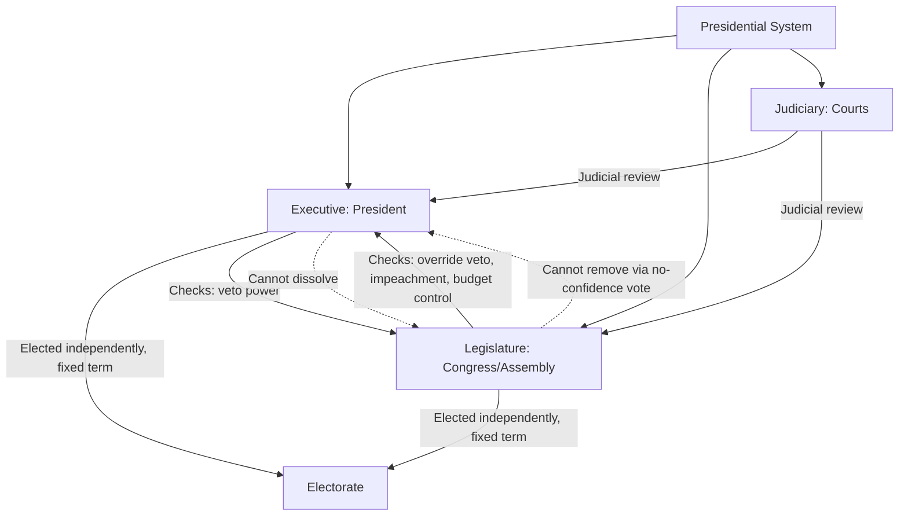

## Presidential Systems of Government

### Definition and Core Concept

A presidential system is a form of government in which the head of state and head of government are combined in a single office, the president, who is elected independently of the legislature and serves for a fixed term. The president derives authority directly from the electorate (or an electoral body distinct from the legislature) rather than from the confidence of a parliamentary majority. This structural feature — the separate origin and separate survival of the executive and legislative branches — is the defining characteristic that distinguishes presidentialism from parliamentarism and semi-presidentialism.

The concept is most closely associated with the theoretical work of political scientist Juan Linz, who framed presidential systems around two features: dual democratic legitimacy (both the president and the legislature claim independent popular mandates) and fixed terms of office (neither branch can ordinarily remove the other before the term expires, barring impeachment or similar extraordinary mechanisms).

### Key Structural Features

**Separation of Powers**

Presidential systems institutionalize a formal separation among the executive, legislative, and judicial branches. Each branch has its own constitutionally defined sphere of authority, and personnel typically cannot serve in more than one branch simultaneously (e.g., a cabinet secretary in the U.S. system cannot simultaneously hold a seat in Congress).

**Fixed Electoral Terms**

The president is elected for a predetermined term (four years in the United States, six in Mexico, five in Brazil, among other variations) that cannot be shortened by a legislative vote of no confidence. Correspondingly, the president generally cannot dissolve the legislature to call early elections. This rigidity is often called the "temporal rigidity" of presidentialism.

**Independent Legitimacy**

The president is elected either directly by popular vote or through a body (such as an electoral college) that is constitutionally distinct from the legislature. This gives the executive a claim to represent the national will independent of, and sometimes in tension with, the legislature's own claim to represent the people.

**Single-Person Executive**

Executive authority is vested in one individual rather than a collective cabinet responsible to parliament. The cabinet in a presidential system is typically appointed by and accountable to the president, not to the legislature.

### Comparative Institutional Design

### Comparison with Parliamentary and Semi-Presidential Systems

| Feature | Presidential | Parliamentary | Semi-Presidential |
| --- | --- | --- | --- |
| Head of state / head of government | Combined in president | Separate (monarch/president vs. PM) | Separate (president vs. PM) |
| Executive origin | Directly/separately elected | Emerges from legislative majority | President elected separately; PM from legislature |
| Executive survival | Fixed term, independent of legislature | Depends on continuous parliamentary confidence | PM depends on parliament; president has fixed term |
| Legislative dissolution power | Generally absent | Present (PM/monarch can dissolve) | Present, often shared |
| Removal mechanism | Impeachment (high threshold, usually for misconduct) | Vote of no confidence (low threshold, policy or political grounds) | Varies by branch |

### Checks and Balances Mechanisms

Presidential systems rely on interlocking constitutional checks rather than the fusion of powers characteristic of parliamentary systems:

- **Veto and veto override**: The president can typically veto legislation, but the legislature can override this veto with a supermajority (e.g., two-thirds in both chambers of the U.S. Congress).
- **Impeachment**: A legislative process, usually requiring supermajority votes, to remove a president for defined offenses (e.g., "treason, bribery, or other high crimes and misdemeanors" in the U.S. Constitution). This is deliberately distinguished from a parliamentary no-confidence vote, which requires no showing of misconduct.
- **Advice and consent / confirmation powers**: Legislatures often confirm executive appointments (cabinet officials, judges, ambassadors).
- **Power of the purse**: Legislatures typically control appropriations, constraining executive action even when the executive controls policy direction.
- **Judicial review**: Courts, particularly in systems following the U.S. model, can invalidate executive or legislative acts that violate the constitution.

### Historical Origins

The modern presidential system originated with the United States Constitution (1787), which was a deliberate departure from the British parliamentary model the framers associated with monarchical concentration of power. The framers, influenced by Montesquieu's theory of separated powers, sought an executive strong enough to act decisively but constrained enough to avoid recreating monarchical excess. This model was subsequently exported, adapted, and modified throughout Latin America in the nineteenth and twentieth centuries, and later in parts of Africa and Asia during decolonization.

### Global Distribution and Variants

**Pure Presidentialism**

Found in the United States, most of Latin America (Brazil, Mexico, Argentina, Colombia, Chile), and several African and Asian states (Nigeria, Indonesia, South Korea, the Philippines). These systems generally follow the dual-legitimacy, fixed-term model described above, though specific powers (decree authority, coalition-building tools) vary considerably.

**Hyper-Presidentialism**

A term used to describe systems where constitutional or de facto practice grants the president exceptionally concentrated authority — broad decree powers, weak legislative or judicial checks, and extended tenure through re-election or constitutional amendment. This is often discussed in the context of certain Latin American and post-Soviet states. [Inference] The classification of specific countries as "hyper-presidential" is a matter of ongoing scholarly debate and depends on the specific indicators used (decree power, party discipline, judicial independence).

**Semi-Presidentialism (Contrast Case)**

Systems such as France and Russia combine a popularly elected president with a prime minister accountable to parliament, blending presidential and parliamentary features. This is analytically distinct from pure presidentialism and is typically treated as its own category in comparative institutional analysis.

### The Linz Thesis: Presidentialism and Democratic Stability

Juan Linz's influential argument, developed in the late 1980s and 1990s, held that presidential systems are more prone to democratic breakdown than parliamentary systems, for several interrelated reasons:

- **Dual legitimacy problem**: When the president and the legislative majority belong to opposing parties or coalitions (divided government), each can claim to represent the popular will, producing gridlock or crises of legitimacy with no constitutional mechanism for resolution short of the term's end.
- **Winner-take-all dynamics**: Because the presidency is a single, indivisible office, elections tend to be zero-sum, discouraging power-sharing and coalition-building compared to parliamentary systems where coalition cabinets are common.
- **Temporal rigidity**: Fixed terms prevent the kind of adaptive adjustment (early elections, cabinet reshuffles) parliamentary systems use to resolve political crises, potentially allowing a crisis to fester until it produces extra-constitutional outcomes (coups, forced resignations).
- **Outsider candidates**: Direct popular election can favor charismatic outsiders without established party or legislative experience, potentially weakening institutional constraints once in office.

[Unverified] Linz's thesis, while highly influential, has been contested by subsequent scholars (e.g., Mainwaring and Shugart) who argue that the relationship between presidentialism and instability is heavily mediated by other factors such as party system fragmentation, the president's constitutional powers, and federalism, rather than presidentialism per se causing instability.

### Divided Government and Legislative Gridlock

A frequently studied phenomenon within presidential systems is "divided government," where the presidency and one or both legislative chambers are controlled by different parties. This condition:

- Increases the likelihood of legislative gridlock on budgetary and policy matters.
- Can incentivize the use of unilateral executive tools (executive orders, decrees) to bypass legislative obstruction.
- Has been associated empirically (particularly in U.S. politics research) with reduced legislative productivity, though findings on its broader governance effects are mixed and context-dependent.

### Executive Powers in Practice

**Formal (Constitutional) Powers**

- Legislative initiative or veto power
- Command of the armed forces (commander-in-chief authority)
- Appointment power over cabinet, judiciary (subject to confirmation in many systems), and bureaucracy
- Emergency or decree powers (varying widely in scope and constraints across countries)
- Diplomatic authority (treaty negotiation, though ratification often requires legislative consent)

**Informal (Political) Powers**

- Party leadership and influence over legislative coalition-building
- Public communication and "going public" strategies to build pressure on the legislature
- Patronage and appointment leverage to secure legislative cooperation

### Example: Structural Comparison in Practice

Consider a hypothetical bill facing opposition in a divided legislature:

- In a **pure presidential system**, the president cannot dissolve the legislature to seek a more favorable majority, nor can the legislature remove the president simply for blocking the bill. The dispute is likely to persist until the current terms expire, be resolved through negotiation, or escalate into use of unilateral tools (e.g., executive orders) or, in more severe scenarios, constitutional crisis.
- In a **parliamentary system**, sustained legislative opposition to the executive's agenda would typically trigger either the government's resignation, a vote of no confidence, or new elections — providing an institutional "release valve" that many presidential systems lack.

### Advantages Commonly Cited

- **Accountability clarity**: Voters can identify a single, clearly responsible executive official, simplifying retrospective evaluation ("who is to blame") compared to coalition parliamentary cabinets.
- **Stability of tenure**: Fixed terms can insulate the executive from transient legislative majorities, potentially enabling longer-term policy planning.
- **Checks against executive dominance**: Formal separation of powers can, in well-institutionalized systems, provide robust constraints against unilateral executive overreach.

### Disadvantages Commonly Cited

- **Gridlock risk**: As discussed above, divided government can produce policy paralysis.
- **Legitimacy conflict**: Dual electoral mandates can generate constitutional crises without clear resolution mechanisms.
- **Difficulty of removal**: Impeachment's high evidentiary and procedural thresholds mean an unpopular or ineffective president may remain in office for the full term absent clear misconduct.
- **Personalization of power**: The single-executive structure can encourage excessive concentration of authority around one individual, particularly where party institutionalization is weak.

### Case Illustrations

- **United States**: Often treated as the paradigmatic presidential system, characterized by strong judicial review, federalism, and a two-party system that has historically (though not always) produced relatively stable divided-government arrangements.
- **Brazil**: A presidential system operating with a highly fragmented multi-party legislature, requiring presidents to build broad coalitions ("coalitional presidentialism") through cabinet appointments and resource distribution to govern effectively.
- **Nigeria**: A federal presidential system adopted after periods of military rule, combining presidentialism with federalism as a mechanism for managing ethnic and regional diversity.
- **Philippines**: A presidential system with a single six-year, non-renewable presidential term, a design intended to limit the possibility of prolonged personal rule following the Marcos era.

### Related Topics

- Parliamentary Systems of Government
- Semi-Presidential (Hybrid) Systems
- Separation of Powers and Checks and Balances
- Divided Government and Legislative Gridlock
- Impeachment Processes and Comparative Practice
- Coalitional Presidentialism (Latin American Case Studies)
- Juan Linz's Theory of Presidential Democratic Breakdown
- Federalism and Executive Power
- Executive Decree and Unilateral Action Powers
- Term Limits and Executive Tenure Design