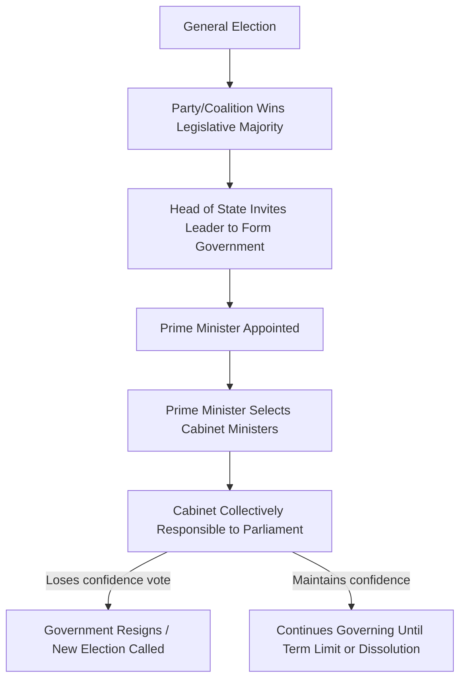

## Parliamentary Systems and the Cabinet

### Definition and Core Concept

A parliamentary system is a form of government in which the executive derives its democratic legitimacy from, and is directly accountable to, the legislature (parliament). Unlike presidential systems, there is a fusion rather than a strict separation of executive and legislative power: the head of government (prime minister or equivalent) and the cabinet are typically drawn from the legislature and remain in office only as long as they retain its confidence. This "confidence" relationship — the continuous accountability of the executive to the legislative majority — is the defining structural feature of parliamentarism.

Parliamentary systems typically separate the head of state (a monarch or a largely ceremonial president) from the head of government (the prime minister), unlike presidential systems, which combine both roles in one office.

### Key Structural Features

**Fusion of Powers**

Members of the cabinet, including the prime minister, are typically also sitting members of the legislature. This contrasts with presidential systems, where executive officials are usually barred from simultaneously holding legislative seats. The executive is, in effect, a committee of the legislature's majority.

**Confidence and Accountability**

The government (prime minister and cabinet) remains in office only so long as it commands the confidence of a majority in the legislature (or at least avoids an active majority against it). Loss of confidence — through a formal vote of no confidence or defeat on a key measure treated as a confidence matter — typically forces the government's resignation or new elections.

**Flexible Terms**

Unlike the fixed terms of presidential systems, parliamentary terms are typically maximum periods rather than fixed durations. A prime minister can often request the head of state to dissolve parliament and call early elections, and conversely, parliament can remove a government mid-term through a no-confidence vote.

**Collective Executive**

The cabinet operates on the principle of collective responsibility: cabinet decisions are presented as unified positions, and individual ministers who publicly dissent are expected to resign. This differs from presidential systems, where cabinet members serve at the pleasure of, and are individually accountable to, the president alone.

### Formation and Structure of the Cabinet

### The Role of the Head of State vs. Head of Government

| Function | Head of State | Head of Government (PM) |
| --- | --- | --- |
| Typical office | Monarch or ceremonial president | Prime minister (or equivalent title) |
| Selection | Hereditary succession or indirect election | Emerges from legislative majority/coalition |
| Role | Symbolic, ceremonial, unifying | Executive decision-making, policy direction |
| Political accountability | Generally politically neutral | Directly accountable to legislature |
| Reserve powers | May retain limited discretionary powers (e.g., dissolution on advice) | Exercises day-to-day governing authority |

Examples of this separation include the United Kingdom (monarch and prime minister), Germany (federal president and chancellor), and India (president and prime minister). Some parliamentary systems merge the roles into a single largely ceremonial presidency with a separately empowered prime minister, while others (rare) blend the offices more substantially.

### Cabinet Formation Process

**Single-Party Majority Government**

When one party wins an outright legislative majority, its leader is typically invited by the head of state to form a government, and cabinet posts are filled from within that party, often reflecting internal factions or seniority.

**Coalition Government**

When no single party achieves a majority, parties negotiate a coalition agreement specifying policy priorities and the distribution of cabinet portfolios among coalition partners. This is common in systems with proportional representation (e.g., Germany, the Netherlands, Israel).

**Minority Government**

A party may govern without a legislative majority, relying on case-by-case support or the abstention of other parties. Minority governments are generally less stable and more vulnerable to defeat on confidence votes.

### The Vote of No Confidence

**Standard Motion of No Confidence**

A parliamentary motion, typically initiated by opposition parties, calling for a vote on whether the government retains the legislature's confidence. If the motion passes, the government is constitutionally required to resign or seek dissolution and new elections.

**Constructive Vote of No Confidence**

A variant, notably used in Germany's Basic Law (Article 67), requiring that a no-confidence motion simultaneously nominate a successor chancellor. This mechanism is designed to prevent purely destructive votes that topple a government without providing a viable alternative, thereby enhancing governmental stability. [Inference] This design is often credited by comparative scholars with contributing to Germany's post-war cabinet stability relative to the Weimar Republic's more permissive no-confidence rules, though multiple institutional factors (electoral thresholds, party system consolidation) are typically cited together as contributing causes.

**Confidence Motion (Government-Initiated)**

Some systems allow the government itself to call a confidence vote on a specific piece of legislation, effectively linking the policy's passage to the government's survival and pressuring wavering coalition members to support it.

### Collective and Individual Ministerial Responsibility

**Collective Responsibility**

The convention that cabinet decisions, once made, are binding on all ministers publicly, regardless of internal disagreement during deliberation. A minister unwilling to publicly support a cabinet decision is expected to resign rather than dissent openly, preserving the appearance (and functional reality) of a unified executive facing the legislature.

**Individual Ministerial Responsibility**

The principle that ministers are accountable to parliament for the conduct of their own departments, potentially including resignation over departmental failures, personal misconduct, or policy errors, independent of the government's overall standing.

### Dissolution of Parliament

The power to dissolve parliament and trigger early elections is a central feature distinguishing parliamentary flexibility from presidential rigidity. The specific mechanics vary:

- In some systems (e.g., the UK after the Fixed-term Parliaments Act was repealed in 2022), the prime minister can request dissolution from the monarch essentially at their discretion, subject to certain constraints.
- In other systems, dissolution is more constrained, requiring a failed confidence vote, an inability to form a government after a specified period, or a formal request tied to specific constitutional triggers.

[Unverified] The precise dissolution rules are highly jurisdiction-specific and subject to periodic constitutional or statutory reform; specific procedural details should be verified against the current constitutional text of the country in question.

### Comparative Variants of Parliamentarism

**Westminster Model**

Associated with the United Kingdom and states influenced by British constitutional tradition (Canada, Australia, India, New Zealand). Characterized by strong party discipline, fusion of executive and legislative leadership, and (in its classic form) tendencies toward single-party majority government under first-past-the-post electoral systems, though this is not universal (e.g., coalition and minority governments occur in Westminster systems too, such as Canada).

**Consensus/Coalition-Oriented Model**

Associated with continental European systems using proportional representation (Germany, the Netherlands, Scandinavian countries), typically producing multi-party coalitions, formal coalition agreements, and cabinet portfolio allocation through inter-party negotiation.

**Constructive Vote of No Confidence Systems**

As discussed above, Germany's model is the most cited example of engineering additional stability into the no-confidence mechanism itself.

### Advantages Commonly Cited

- **Flexibility in crisis resolution**: A government that loses legislative support can be replaced without waiting for a fixed term to expire, potentially resolving political deadlock faster than presidential systems allow.
- **Alignment of executive and legislative agendas**: Because the executive is drawn from and dependent on the legislative majority, unified government (and consequently more legislative productivity) is comparatively more common, particularly in majoritarian variants.
- **Encourages coalition-building**: In multi-party systems, parliamentarism can incentivize negotiation and power-sharing rather than winner-take-all competition.

### Disadvantages Commonly Cited

- **Potential for instability**: In fragmented party systems without stabilizing mechanisms (such as the constructive vote of no confidence), governments can be short-lived, producing frequent elections or cabinet reshuffles.
- **Reduced direct accountability**: Voters choose parties or local representatives rather than the head of government directly, which can blur lines of accountability, particularly in coalition contexts where post-election bargaining determines the executive's composition.
- **Concentration of power in party leadership**: Strong party discipline in fusion-of-powers systems can weaken the legislature's independent check on the executive, since the governing party's legislators have strong incentives to support their own cabinet.

### Example: Government Formation After an Inconclusive Election

Consider a legislature in which no party wins a majority:

1. The head of state typically invites the leader of the largest party (or the party best positioned to build a majority) to attempt government formation.
2. That leader negotiates a coalition agreement with one or more other parties, allocating cabinet portfolios (e.g., finance, foreign affairs, defense) according to relative party size and priorities.
3. The resulting coalition cabinet must then win a formal vote of confidence (or avoid defeat on one, depending on the constitutional requirement) in the legislature to formally take office.
4. Throughout its tenure, the coalition must maintain internal cohesion; defections or withdrawal of a coalition partner can trigger a confidence crisis, cabinet reshuffle, or early elections.

### Case Illustrations

- **United Kingdom**: The archetypal Westminster parliamentary system, with cabinet government, collective responsibility, and historically strong party discipline, though the monarch's reserve powers remain largely dormant conventions rather than active tools.
- **Germany**: A parliamentary federal republic using the constructive vote of no confidence, contributing to a comparatively stable post-war record of cabinet durability despite frequent coalition governments.
- **India**: A parliamentary system combining a ceremonial president (head of state) with a prime minister and council of ministers accountable to the Lok Sabha (lower house), operating within a federal structure.
- **Israel**: A parliamentary system with a highly proportional electoral system, often producing complex multi-party coalitions and, at times, notable cabinet instability.

### Related Topics

- Presidential Systems of Government
- Semi-Presidential (Hybrid) Systems
- Coalition Government Formation and Bargaining
- Motion/Vote of No Confidence: Comparative Mechanisms
- Collective vs. Individual Ministerial Responsibility
- The Westminster Model and Its Variants
- Electoral Systems and Party Fragmentation (Proportional Representation)
- Dissolution of the Legislature: Comparative Rules
- Head of State vs. Head of Government: Comparative Roles
- Constructive Vote of No Confidence (Germany's Basic Law, Article 67)