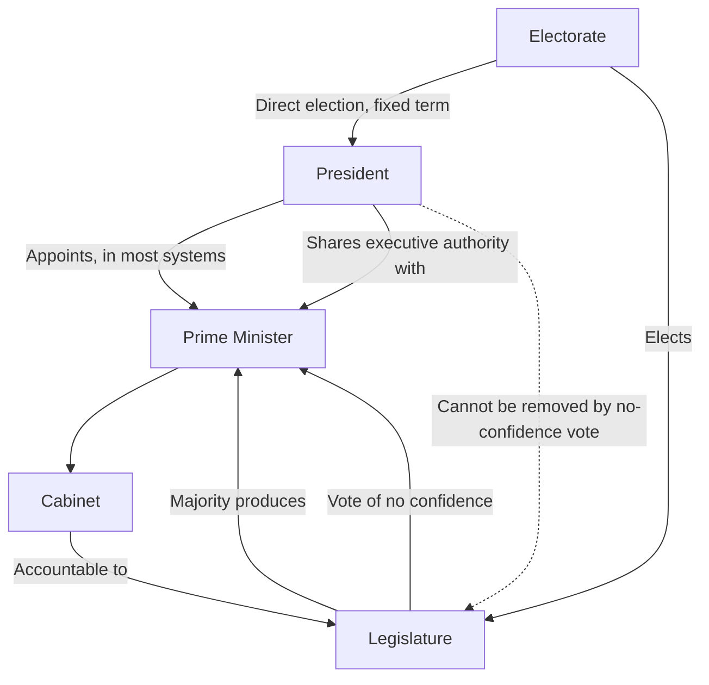

## Semi-Presidential Systems

### Definition and Core Concept

A semi-presidential system is a hybrid form of government combining a popularly elected, fixed-term president with a prime minister and cabinet who are separately responsible to the legislature. The system is characterized by a dual executive: the president, who derives legitimacy directly from popular election, and the prime minister, who derives legitimacy from and remains accountable to the legislative majority. This structural duality distinguishes semi-presidentialism from both pure presidential systems (single, fused executive legitimacy) and pure parliamentary systems (executive entirely dependent on the legislature).

The term was popularized by political scientist Maurice Duverger in his analysis of the French Fifth Republic, though the underlying institutional pattern predates his terminology and appears in other contexts, including the Weimar Republic (1919–1933).

### Defining Criteria

Political scientists (notably Robert Elgie) generally identify semi-presidentialism by three core criteria:

1. **Popularly elected president**: The president is elected directly by the citizenry (or through a mechanism functionally equivalent to direct popular election) rather than by the legislature.
2. **Fixed presidential term**: The president serves for a set term independent of legislative confidence.
3. **Separately responsible prime minister and cabinet**: A prime minister and cabinet exist, exercising executive and governmental power, and are accountable to the legislature through mechanisms such as a vote of no confidence.

Unlike a pure presidential system, the existence of a prime minister accountable to parliament (rather than solely to the president) is the key distinguishing feature.

### Structural Diagram

### Sub-Types of Semi-Presidentialism

**Premier-Presidential Systems**

The prime minister and cabinet are responsible exclusively to the legislature, and the president, while possessing independent popular legitimacy and often significant reserve powers (such as legislative dissolution or the appointment of the prime minister), cannot unilaterally dismiss the government. France under the Fifth Republic and Poland are frequently cited examples.

**President-Parliamentary Systems**

The prime minister and cabinet are responsible to both the president and the legislature simultaneously — meaning the president can dismiss the prime minister independent of the legislature's confidence, in addition to the legislature's own power to remove the government via no-confidence vote. This sub-type is generally regarded by scholars as more prone to inter-executive conflict, since the cabinet must simultaneously satisfy two potentially opposed sources of authority. Russia and Weimar Germany are commonly cited examples. [Inference] The classification of specific contemporary systems, especially where constitutional practice diverges from formal text (e.g., de facto executive dominance despite formal legislative checks), remains a matter of scholarly interpretation rather than a settled, universally agreed taxonomy.

### Comparative Table: Semi-Presidential Sub-Types

| Feature | Premier-Presidential | President-Parliamentary |
| --- | --- | --- |
| PM/cabinet accountable to legislature | Yes | Yes |
| PM/cabinet accountable to president | No (president cannot unilaterally dismiss) | Yes (president can dismiss independently) |
| Risk of dual accountability conflict | Lower | Higher |
| Common examples | France, Poland, Romania | Russia, Weimar Germany |

### Cohabitation

**Definition**

Cohabitation occurs when the president and the parliamentary majority (and thus the prime minister) belong to opposing political parties or coalitions. Because the prime minister is drawn from and answerable to the legislative majority rather than appointed at the president's sole discretion in the premier-presidential sub-type, the president may be constitutionally required to appoint a prime minister from an opposing camp.

**Division of Authority During Cohabitation**

During cohabitation, informal convention (rather than formal constitutional text) often governs the division of labor: the president may retain primary influence over foreign policy and defense (the so-called "reserved domain" in the French case), while the prime minister and cabinet manage domestic and economic policy. This division is a political practice rather than a strict constitutional rule, and its precise contours have varied across different cohabitation episodes in French history (1986–1988, 1993–1995, 1997–2002).

[Unverified] Whether a similar "reserved domain" convention would apply identically in other semi-presidential systems experiencing cohabitation depends heavily on that country's specific constitutional text and political norms, and should not be assumed to generalize automatically from the French case.

### Presidential Powers in Semi-Presidential Systems

Presidential authority varies considerably across semi-presidential constitutions but commonly includes some combination of:

- Appointment of the prime minister (sometimes constrained by the requirement to select someone commanding legislative confidence)
- Power to dissolve the legislature (subject to varying constraints)
- Command of the armed forces and conduct of foreign affairs
- Limited legislative veto or referral powers (e.g., referring legislation to a constitutional court)
- Emergency powers under specified constitutional conditions (e.g., Article 16 of the French Constitution)

### Advantages Commonly Cited

- **Combines stability and flexibility**: The fixed-term presidency can provide continuity and a stable symbol of national unity, while the prime minister and cabinet retain the parliamentary system's capacity to adjust to shifting legislative majorities without removing the head of state.
- **Crisis-management capacity**: A strong president can act decisively during emergencies, potentially without the delays associated with pure parliamentary coalition negotiation.
- **Accommodates divided preferences**: Cohabitation allows opposing political forces to share power without a full constitutional crisis, potentially moderating polarization by forcing cross-party cooperation.

### Disadvantages Commonly Cited

- **Ambiguous lines of accountability**: Voters and observers may struggle to identify which official — president or prime minister — is responsible for a given policy outcome, particularly during cohabitation.
- **Risk of institutional conflict**: Especially in president-parliamentary sub-types, competing claims to authority over the cabinet can produce paralysis or constitutional crises.
- **Potential for authoritarian drift**: Where presidential reserve powers are extensive and checks are weak, semi-presidentialism has in some cases (per [Inference] comparative democratization scholarship) facilitated the concentration of power in the presidency, particularly in post-Soviet states where formal parliamentary checks proved weak in practice.

### Worked Example: Cohabitation Scenario

Consider a semi-presidential republic where the president belongs to Party A and, following a legislative election, Party B wins a majority in the assembly:

1. The president is constitutionally obligated (in a premier-presidential system) to appoint a prime minister capable of commanding the confidence of the new majority — typically the leader of Party B or a figure it supports.
2. The resulting cabinet, staffed largely by Party B, sets the government's domestic legislative agenda and requires ongoing parliamentary confidence to remain in office.
3. The president, unable to dismiss this cabinet unilaterally, retains authority in domains constitutionally reserved to the presidency (commonly defense and foreign affairs) and may use veto, referral to a constitutional court, or public communication to influence policy where direct authority is unavailable.
4. This arrangement persists until the next legislative or presidential election realigns control of both branches, or until a constitutional dissolution mechanism is triggered.

### Case Illustrations

- **France (Fifth Republic)**: The paradigmatic premier-presidential case, having experienced multiple cohabitation periods that tested and refined the informal division of authority between the Élysée (presidency) and Matignon (prime minister's office).
- **Poland**: A premier-presidential system in which cohabitation-like dynamics have recurred between presidents and prime ministers from opposing parties, generating disputes over foreign policy representation and judicial appointments.
- **Russia**: Frequently cited as a president-parliamentary case where formal constitutional checks on the president coexist with, per [Inference] comparative political science analysis, a heavily president-dominated practical balance of power.
- **Weimar Germany**: A historical semi-presidential case whose institutional weaknesses — including extensive presidential emergency powers under Article 48 and a fragmented multi-party legislature — are widely cited in the comparative-institutions literature as contributing factors, among several, to the collapse of the Weimar Republic.

### Related Topics

- Presidential Systems of Government
- Parliamentary Systems and the Cabinet
- Cohabitation and Divided Executive Authority (French Fifth Republic)
- Premier-Presidential vs. President-Parliamentary Classification (Elgie's Framework)
- Reserved Domains and Informal Constitutional Convention
- Emergency and Reserve Powers of the President
- Weimar Republic: Institutional Design and Collapse
- Dual Executive Legitimacy and Accountability Ambiguity
- Comparative Constitutional Design of Hybrid Regimes