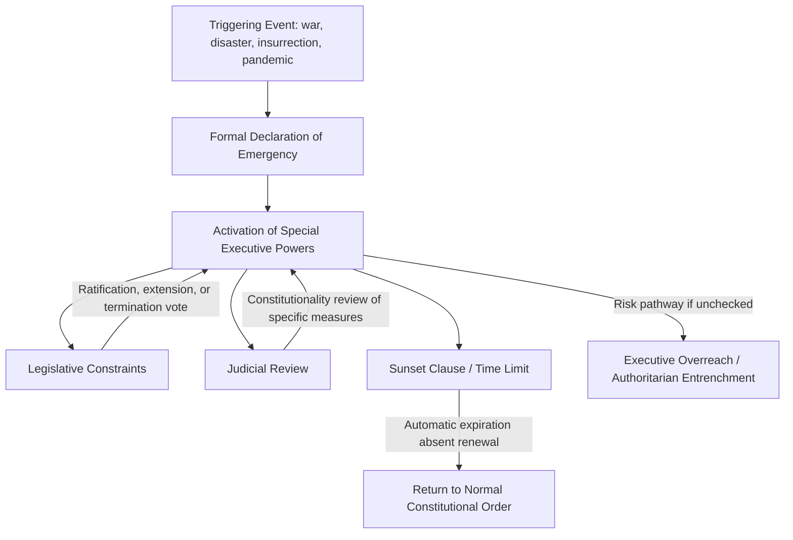

## Executive Power and Emergency Authority

### Definition and Core Concept

Executive power refers to the constitutional and legal authority vested in the head of state and/or head of government to implement, enforce, and administer law and public policy. Emergency authority is a specific, bounded subset of executive power — powers that are activated, expanded, or specially authorized during declared states of crisis (war, natural disaster, insurrection, public health emergency, economic collapse) that would not ordinarily be available to the executive under normal constitutional operation. The study of emergency authority sits at the intersection of executive power theory and constitutional design, because emergency powers represent the point at which the normal separation-of-powers and checks-and-balances framework is deliberately relaxed to allow rapid, centralized decision-making.

### Theoretical Foundations

**The Necessity Doctrine**

A long-standing justification, tracing to Roman dictatorship and revived in modern constitutional theory, holding that extraordinary circumstances may require the temporary suspension of normal constitutional constraints in order to preserve the constitutional order itself. The Latin maxim *salus populi suprema lex* ("the welfare of the people is the supreme law") is often invoked in this tradition.

**Carl Schmitt's Sovereignty Thesis**

The political theorist Carl Schmitt argued that sovereignty is ultimately defined by "he who decides on the exception" — that the true locus of constitutional authority reveals itself in the emergency, when the normal rule of law is suspended by whoever holds the power to declare the state of exception. [Inference] Schmitt's framework is highly influential in critical and constitutional theory but is also contested; many liberal-constitutionalist scholars reject the notion that emergency powers reveal a "true" sovereign outside legal constraint, arguing instead that constitutional emergency provisions are themselves legally bounded exercises of delegated authority, not extra-legal sovereignty.

**Constitutional (Legalist) Approaches**

In contrast to Schmitt's exception-based framework, most modern constitutions attempt to legally codify emergency powers in advance — specifying triggering conditions, permissible scope, duration limits, and mechanisms for legislative or judicial oversight — precisely in order to prevent emergency authority from becoming a vehicle for unconstrained executive discretion.

### Structural Overview of Emergency Power Mechanisms

### Common Categories of Emergency Authority

**War Powers**

Authority to mobilize armed forces, direct military operations, and in some systems, unilaterally commit forces to conflict for a limited period pending legislative ratification (e.g., the U.S. War Powers Resolution of 1973, which requires congressional notification and authorization for extended military engagements).

**States of Emergency / States of Siege**

Formal legal declarations suspending certain civil liberties (e.g., freedom of movement, assembly, or habeas corpus) and often permitting rule by decree, curfews, or expanded law enforcement authority. Many constitutions (e.g., France's Article 16, India's Article 352) explicitly provide for this category.

**Martial Law**

The temporary substitution of military authority and military courts for civilian governance and civilian judicial process, typically reserved for the most severe breakdowns of civil order.

**Decree/Ordinance Powers**

Authority for the executive to issue binding legal instruments with the force of law, bypassing the ordinary legislative process, usually subject to subsequent legislative ratification or a time limit (e.g., Article 77 of the Indian Constitution's ordinance-making power; French government ordinances under Article 38).

**Public Health/Disaster Emergency Powers**

A category that gained significant global scholarly and public attention during the COVID-19 pandemic (2020–2022), encompassing quarantine authority, lockdown orders, emergency procurement, and, in some jurisdictions, temporary suspension of certain legislative or judicial functions.

### Comparative Constitutional Mechanisms

| Country | Emergency Provision | Key Features |
| --- | --- | --- |
| United States | No single unified "emergency" constitutional clause; statutory framework (National Emergencies Act, 1976) | President declares emergency; triggers specific pre-existing statutory powers; Congress can terminate via joint resolution |
| France | Article 16 of the Constitution | President assumes exceptional powers "when the institutions of the Republic... are threatened"; consultation requirements; Constitutional Council review after 30 days |
| India | Articles 352, 356, 360 | Distinguishes national emergency, state ("President's Rule"), and financial emergency; parliamentary approval required within specified periods |
| Germany | Basic Law, Articles 115a–115l (state of defense) | Detailed procedural safeguards reflecting post-Weimar caution about emergency power abuse |
| Weimar Germany (historical) | Article 48 | Broad, loosely constrained presidential emergency decree power; widely cited as a structural contributor to the Republic's collapse |

### Checks on Emergency Authority

**Legislative Oversight**

Mechanisms requiring legislative notification, ratification, periodic renewal votes, or the power to terminate a declared emergency by resolution. The effectiveness of this check depends heavily on whether the legislature retains genuine political independence from the executive during the crisis period.

**Judicial Review**

Courts may assess whether specific emergency measures fall within constitutional or statutory bounds, whether the triggering conditions were genuinely met, and whether the measures are proportionate to the stated threat. [Inference] Judicial willingness to constrain emergency executive action varies significantly across legal systems and historical periods; courts have historically shown deference to the executive during acute crises (a pattern sometimes called "judicial deference in wartime"), with more assertive review often emerging only after the acute phase has passed.

**Sunset Clauses and Renewal Requirements**

Many modern emergency statutes build in automatic expiration dates requiring affirmative legislative action to extend the emergency, shifting the default toward the restoration of normal constitutional order absent continued justification.

**Federalism and Subnational Checks**

In federal systems, subnational governments (states, provinces) may retain independent authority to resist, modify, or supplement national emergency measures, providing an additional layer of institutional friction against unilateral central executive action.

### The "Ratchet Effect" and Emergency Power Entrenchment

A widely discussed pattern in comparative politics literature holds that emergency powers, once granted, tend to persist beyond the originating crisis — either through formal non-repeal of emergency legislation, bureaucratic institutionalization of temporary agencies, or the political incentive structure that makes relinquishing expanded authority costly for an incumbent executive. [Inference] This "ratchet effect" is a recurring theme in the scholarly literature on emergency powers (e.g., work by legal scholars examining the persistence of post-9/11 U.S. security authorities), though the degree to which it applies is contingent on specific institutional and political factors in each case, and is not a universal or deterministic law of emergency governance.

### Worked Example: Emergency Power Activation and Constraint

Consider a hypothetical constitutional democracy facing a major natural disaster:

1. The executive formally declares a state of emergency under statutory authority, citing the specific triggering conditions defined in law (e.g., a certain scale of infrastructure damage or casualties).
2. This declaration activates a defined set of powers: emergency procurement without standard competitive bidding, deployment of military or National Guard-type forces for civilian assistance, and possibly temporary suspension of certain regulatory requirements (e.g., environmental permitting for emergency repairs).
3. The legislature is notified and, depending on the constitutional design, must affirmatively ratify the emergency within a set period (e.g., 15 or 30 days) or it automatically lapses.
4. Courts remain available to hear challenges to specific measures — for example, a legal challenge arguing that a particular curfew order exceeds the scope authorized by the emergency declaration.
5. Upon resolution of the underlying crisis, the emergency formally terminates, either automatically via sunset clause or through legislative/executive action, restoring the ordinary constitutional distribution of authority.

### Case Illustrations

- **United States — National Emergencies Act (1976)**: Enacted partly in response to concerns about indefinitely persisting emergency declarations (some dating to the 1930s), it requires presidents to specify which statutory powers are being invoked and provides for congressional termination, though in practice few emergencies have been terminated by Congress rather than by presidential choice or expiration.
- **France — Article 16 (1961 invocation)**: Used once, by President Charles de Gaulle during the Algerian War crisis, remaining a rarely invoked but constitutionally significant reserve power.
- **India — 1975–1977 National Emergency**: Widely cited as a case in which broad emergency powers were used to suspend civil liberties and postpone elections, becoming a central reference point in Indian constitutional law regarding the risks of expansive emergency authority.
- **Weimar Germany — Article 48**: The historical touchstone for scholarly caution about loosely bounded presidential emergency decree power, frequently invoked (over 250 times in the Republic's history) and ultimately exploited in the transition to Nazi rule via the 1933 Reichstag Fire Decree and Enabling Act.

### Related Topics

- Presidential Systems of Government
- Semi-Presidential Systems (Reserve and Emergency Powers)
- Separation of Powers and Checks and Balances
- Civil Liberties Under States of Emergency
- Carl Schmitt and the Theory of Sovereign Exception
- Judicial Deference and Wartime Constitutional Review
- Federalism as a Check on Executive Power
- War Powers and Legislative-Executive Conflict
- Authoritarian Entrenchment via Emergency Governance
- Comparative Constitutional Design of Emergency Clauses