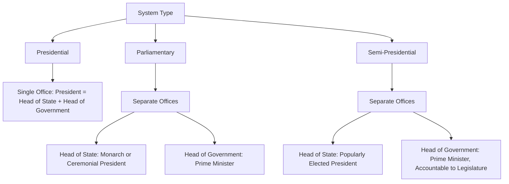

## Heads of State and Heads of Government

### Definition and Core Concept

The distinction between head of state and head of government is a foundational classificatory concept in comparative executive studies. The **head of state** is the office that formally embodies the sovereignty, continuity, and symbolic unity of the nation — the highest formal representative of the state in both domestic ceremony and international relations. The **head of government** is the office responsible for the actual day-to-day direction of public policy, the administration of the executive branch, and political leadership of the governing coalition or party. In some systems these two functions are fused into a single office (as in presidential systems); in others they are formally separated between two distinct officeholders (as in most parliamentary and semi-presidential systems).

### The Fusion/Separation Distinction Across System Types

### Functions of the Head of State

**Symbolic and Ceremonial Functions**

- Representing national unity and continuity above day-to-day partisan politics
- Formally opening the legislative session, delivering state addresses (often drafted by the government)
- Receiving foreign dignitaries and accrediting ambassadors
- Conferring honors, awards, and formal state recognitions

**Formal Constitutional Functions**

- Formally appointing the head of government (typically the leader of the party or coalition commanding a legislative majority)
- Signing (promulgating) legislation into law, often as a largely formal/ministerial act
- Formally commissioning military officers or issuing formal declarations of war (frequently on the advice of the government)
- Granting pardons or clemency (in many systems)

**Reserve Powers**

In many parliamentary systems, the head of state retains latent "reserve powers" — discretionary authority intended for use only in exceptional circumstances, such as when no party can form a stable government, or when a prime minister attempts to act unconstitutionally. These powers are typically exercised according to well-established convention rather than personal political discretion, and their invocation is often controversial precisely because it appears to break with the norm of ceremonial neutrality (e.g., the Australian constitutional crisis of 1975, in which the Governor-General dismissed the Prime Minister).

### Functions of the Head of Government

- Setting the policy agenda and legislative priorities
- Chairing cabinet meetings and coordinating ministerial portfolios
- Serving as the primary political spokesperson for the government's program
- Directing the civil service and executive agencies in implementing policy
- Representing the country in intergovernmental negotiations on substantive policy matters (trade, climate, security cooperation)

### Comparative Table of Arrangements

| System | Head of State | Head of Government | Relationship |
| --- | --- | --- | --- |
| United States | President | President (same office) | Fused |
| United Kingdom | Monarch | Prime Minister | Separated; monarch largely ceremonial |
| Germany | Federal President | Chancellor | Separated; president largely ceremonial with limited reserve powers |
| France | President | Prime Minister | Separated but president holds substantial independent authority (semi-presidential) |
| India | President | Prime Minister | Separated; president largely ceremonial, exercises formal powers on ministerial advice |
| Japan | Emperor | Prime Minister | Separated; Emperor is a symbolic office with no political power under the postwar constitution |
| Russia | President | Prime Minister (Chairman of the Government) | Separated in form; president holds substantial practical authority (semi-presidential/president-parliamentary) |

### Monarchies vs. Ceremonial Republics as Heads of State

**Constitutional Monarchies**

The head of state role is filled by a hereditary monarch operating within a constitutional framework that constrains the monarch's political power, typically to ceremonial and reserve functions (United Kingdom, Japan, Sweden, Spain, Thailand, among others). The monarch's legitimacy derives from tradition, hereditary succession, and constitutional convention rather than direct popular election.

**Ceremonial (Indirectly Elected) Presidencies**

In many parliamentary republics, the head of state is a president elected indirectly — by the legislature, by an electoral college, or by a special assembly — specifically to insulate the office from direct partisan electoral competition and reinforce its above-politics symbolic character (Germany, India, Italy, Israel).

**Directly Elected Ceremonial Presidents**

A more unusual variant exists in some parliamentary systems where the head of state is directly elected by the public yet still holds a largely ceremonial role with limited executive power (e.g., Ireland, Austria, Iceland) — a design that grants the office strong democratic legitimacy without correspondingly expanding its everyday governing authority, though the popular mandate can still amplify the political weight of its reserve powers when they are exercised.

### The Political Significance of Separation

**Advantages of Separating the Roles**

- Provides a "neutral" symbolic figure who can serve as a unifying national representative independent of partisan political conflict
- Creates an institutional safety valve during political crises (e.g., a head of state that can invite a new government formation attempt, or dissolve parliament, without being personally implicated in the policy failures of the outgoing government)
- Allows the head of government to be evaluated, criticized, and replaced through ordinary political processes without symbolically destabilizing the state itself

**Advantages of Fusing the Roles**

- Produces a single, clearly identifiable, and directly accountable chief executive
- Avoids the potential for symbolic/practical authority conflicts between two co-existing executive offices
- Simplifies international representation, since there is no ambiguity about which office speaks for the state in diplomatic and ceremonial contexts simultaneously

### Worked Example: Reserve Power Exercise

Consider a parliamentary system in which, following a general election, no party or coalition can command a clear legislative majority:

1. The head of state (monarch or ceremonial president) begins consultations with party leaders to identify who might plausibly form a viable government.
2. If an apparent government subsequently loses a vote of no confidence shortly after formation, the head of state may again need to decide whether to invite an alternative coalition to attempt formation or to call new elections.
3. In extreme cases, where a sitting prime minister attempts to act in a manner widely viewed as unconstitutional, the head of state's reserve power to dismiss the government (rarely used, but formally retained in some constitutional frameworks) becomes a live political question.
4. Because these reserve powers are grounded in convention rather than frequent practice, their exercise is often followed by significant public and scholarly debate over whether the head of state acted within the bounds of expected neutrality — as occurred following the Australian Governor-General's 1975 dismissal of Prime Minister Gough Whitlam.

### Case Illustrations

- **United Kingdom**: The monarch's role is almost entirely ceremonial in ordinary practice, with reserve powers (appointing a prime minister, granting dissolution) exercised strictly according to convention, particularly the convention of always acting on ministerial advice.
- **Germany**: The Federal President's role is deliberately limited by the post-Weimar constitutional design, reflecting a historical judgment that expansive presidential discretion (as under Weimar's Article 48) contributed to democratic breakdown; the chancellor holds the substantive executive authority.
- **France**: A semi-presidential case in which the head of state (president) is far from purely ceremonial, retaining significant independent authority over defense and foreign policy even when a prime minister from an opposing party governs domestically.
- **Japan**: The Emperor's role is constitutionally limited to symbolic functions under Article 1 and Chapter I of the 1947 Constitution, following the explicit renunciation of the prewar conception of the Emperor as a sovereign political authority.

### Related Topics

- Presidential Systems of Government
- Parliamentary Systems and the Cabinet
- Semi-Presidential Systems
- Reserve Powers and Constitutional Convention
- Constitutional Monarchy as an Institutional Form
- Ceremonial vs. Executive Presidencies
- Government Formation After Inconclusive Elections
- Comparative Study of Symbolic Political Authority
- Executive Power and Emergency Authority