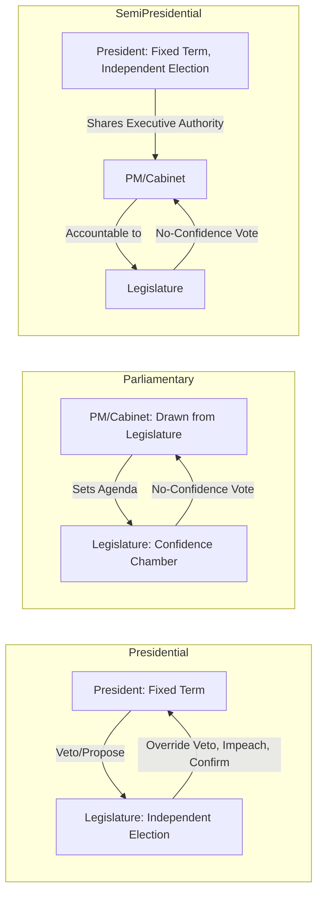

## Executive-Legislative Relations

### Definition and Core Concept

Executive-legislative relations refers to the constitutionally structured patterns of interaction, cooperation, and conflict between the executive branch (president, prime minister, and cabinet) and the legislative branch (parliament, congress, or assembly) in the process of governing. This relationship is shaped fundamentally by the type of governmental system in place — presidential, parliamentary, or semi-presidential — because each system distributes electoral origin, survival dependency, and formal powers differently between the two branches. The study of executive-legislative relations examines how these structural features translate into patterns of cooperation, gridlock, oversight, and institutional conflict in practice.

### Structural Determinants of the Relationship

**Separation of Survival**

In presidential systems, the executive's tenure is independent of legislative confidence (fixed terms), whereas in parliamentary systems, the executive's survival is continuously contingent on maintaining legislative confidence. This single variable predicts much of the divergent behavior between the two systems: presidential systems can sustain persistent executive-legislative conflict without automatically triggering a change in government, while parliamentary systems tend to resolve sustained conflict through cabinet change or new elections.

**Separation of Origin**

Whether the executive and legislature are elected via the same process (parliamentary systems, where the executive emerges from the legislative majority) or via separate, independent electoral processes (presidential systems) shapes the degree to which the two branches can plausibly claim competing democratic mandates.

**Party System and Discipline**

The degree of party discipline — how consistently legislators from the governing party vote with the executive's preferences — substantially conditions executive-legislative relations independent of the formal constitutional structure. High party discipline in a parliamentary system produces very smooth executive dominance of the legislative agenda; low party discipline in a presidential system can produce shifting, unpredictable legislative coalitions.

### Comparative Dynamics by System Type

### Unified vs. Divided Government

**Unified Government**

The condition in which the same party or coalition controls both the executive and a working legislative majority. This typically facilitates smoother legislative productivity, since the governing party has strong incentives (and, in parliamentary systems, near-structural necessity) to support the executive's agenda.

**Divided Government**

The condition in which the executive and the legislative majority (or one chamber of a bicameral legislature) are controlled by opposing parties or coalitions — a situation possible in presidential systems (due to independently timed and contested elections) and, in a related form, during cohabitation in semi-presidential systems. Divided government is structurally rare and generally short-lived in parliamentary systems, since a persistent legislative majority opposed to the government would typically remove that government through a no-confidence vote rather than coexist with it indefinitely.

**Consequences of Divided Government**

- Increased likelihood of legislative gridlock, particularly on budgetary and high-salience policy matters
- Greater incentive for the executive to employ unilateral tools (executive orders, decrees, signing statements) to advance policy goals without legislative cooperation
- Potential for heightened use of oversight mechanisms (investigations, hearings, confirmation delays) by the legislative majority against the executive

### Formal Mechanisms of Executive-Legislative Interaction

**Legislative Initiation and Agenda Control**

- In parliamentary systems, the cabinet typically dominates the legislative agenda, often having near-exclusive practical control over which bills receive priority floor time.
- In presidential systems, the executive can usually propose legislation and often submits a formal budget proposal, but does not control the legislative calendar or floor scheduling, which typically remains under the legislature's own internal leadership.

**Veto Power and Override**

Presidential systems generally grant the executive a veto over legislation, subject to legislative override (commonly requiring a supermajority). Parliamentary systems generally lack an equivalent standalone executive veto, since the fused nature of executive and legislative majority makes such a mechanism largely redundant — the government typically would not allow a bill it opposes to reach final passage in the first place.

**Confirmation and Appointment Powers**

Legislative confirmation of executive appointments (cabinet officials, judges, senior civil servants, ambassadors) is a common check in presidential systems (e.g., U.S. Senate confirmation) and exists in more limited form in some parliamentary systems, though parliamentary cabinets are typically appointed by the head of government directly rather than subject to a separate legislative confirmation vote.

**Oversight, Investigation, and Interpellation**

- **Question time**: A parliamentary practice in which the head of government and ministers face direct, often adversarial, questioning from legislators on the floor (e.g., UK Prime Minister's Questions).
- **Interpellation**: A formal procedure, common in many parliamentary and some presidential systems, allowing legislators to summon a minister to answer detailed questions about policy, sometimes followed by a vote of confidence in that minister specifically.
- **Committee investigations**: A common oversight tool in presidential systems (e.g., U.S. congressional committees), providing a mechanism for legislative scrutiny of executive action independent of the confidence relationship.

**Budgetary and Fiscal Controls**

The legislature's control over appropriations ("power of the purse") is one of the most consistently powerful checks on executive action across nearly all system types, since even an executive with substantial unilateral policy tools generally cannot spend money without some form of legislative appropriation.

### Sources and Patterns of Conflict

**Policy Disagreement**

Ordinary political disagreement over substantive policy direction, ideology, or priorities — a normal and expected feature of democratic governance rather than evidence of institutional dysfunction per se.

**Institutional Rivalry**

Conflict arising not from specific policy disagreement but from each branch's institutional interest in defending or expanding its own constitutional prerogatives (e.g., legislative resistance to executive claims of unilateral war-making authority, independent of the specific military action at issue).

**Electoral Cycle Misalignment**

In presidential systems, midterm or off-cycle legislative elections can shift legislative control away from the president's party partway through a fixed presidential term, creating divided government without any corresponding change in the executive.

**Coalition Fragility (Parliamentary/Semi-Presidential)**

In multi-party parliamentary or semi-presidential systems, conflict can emerge less between the executive and legislature as unified blocs and more between coalition partners within the governing majority itself, occasionally destabilizing the cabinet without an outright change in the nominal executive-legislative alignment.

### Worked Example: Divided Government and Legislative Strategy

Consider a presidential system in which the president's party controls the executive but the opposition controls both legislative chambers following a midterm election:

1. The president's major legislative priorities face significant difficulty advancing through committee and floor votes controlled by the opposition majority.
2. In response, the executive may increase reliance on unilateral tools available within existing statutory authority (executive orders, agency rulemaking, use of existing appropriated funds for new priorities) to advance policy goals without new legislation.
3. The legislative majority, in turn, may increase oversight activity — committee hearings, investigative subpoenas, and confirmation delays for executive nominees — as an alternative avenue of influence over executive branch conduct.
4. Both branches may engage in public communication strategies ("going public") aimed at shifting public opinion in their favor ahead of the next election, since neither branch can force the other's removal before the fixed terms expire.
5. Resolution of specific disputes, where it occurs, often depends on negotiated compromise, unified control returning after a subsequent election, or judicial resolution of specific legal questions regarding the scope of executive unilateral authority.

### Case Illustrations

- **United States**: A frequently studied case of persistent divided government dynamics, given midterm elections, an independently elected Senate and House, and a presidency all operating on different electoral cycles and constituencies.
- **United Kingdom**: Illustrates the parliamentary pattern of tight executive-legislative fusion under strong party discipline, in which sustained divided government of the presidential type is structurally rare, though minority and coalition governments (2010–2015, 2017–2019) illustrate parliamentary variants of executive-legislative tension.
- **France**: Illustrates the semi-presidential cohabitation pattern, in which the presidency and the prime minister's parliamentary majority can be held by opposing political forces, generating a distinctive form of institutionalized divided authority.
- **Brazil**: Illustrates "coalitional presidentialism," in which a president elected independently of a highly fragmented multi-party legislature must construct and continuously maintain broad legislative coalitions through cabinet appointments and resource allocation, since no natural governing majority exists at the outset.

### Related Topics

- Presidential Systems of Government
- Parliamentary Systems and the Cabinet
- Semi-Presidential Systems
- Divided Government and Legislative Gridlock
- Legislative Oversight Mechanisms (Committees, Interpellation, Question Time)
- Executive Unilateral Action (Executive Orders and Decrees)
- Coalitional Presidentialism in Fragmented Party Systems
- The Power of the Purse and Budgetary Control
- Impeachment and Vote of No Confidence: Comparative Removal Mechanisms