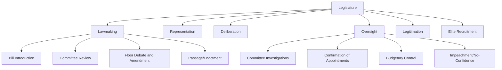

## Functions and Powers of Legislatures

### Definition and Core Concept

A legislature is the branch of government constitutionally vested with primary authority to make, amend, and repeal law. Beyond lawmaking narrowly defined, legislatures in modern democratic and non-democratic systems alike perform a cluster of interrelated functions — representation, deliberation, oversight, and legitimation — that together constitute the institution's broader role in the political system. The comparative study of legislative functions and powers examines how these roles are distributed, exercised, and constrained across different constitutional designs (presidential, parliamentary, semi-presidential) and different legislative structures (unicameral, bicameral).

### Core Functions of Legislatures

**Lawmaking (Legislative Function)**

The foundational function: the formal power to enact, amend, and repeal statutes. This includes both the substantive power to originate legislation and the procedural authority to debate, amend, and vote on proposals, whether originating within the legislature itself or submitted by the executive.

**Representation**

Legislatures serve as the primary institutional channel through which citizens' interests, preferences, and identities are represented in the policymaking process. This function operates through both **geographic representation** (members elected from defined districts or constituencies) and, in many systems, **proportional or group representation** (party-list systems, reserved seats for specific social groups or regions).

**Deliberation**

The function of structured debate and public discussion of policy alternatives, ideally exposing the reasoning, trade-offs, and competing values underlying proposed legislation, thereby providing both a decision-making mechanism and a transparency/accountability mechanism.

**Oversight (Control Function)**

The function of scrutinizing and constraining executive branch conduct, including implementation of existing law, use of appropriated funds, and adherence to constitutional and statutory limits. This function is examined in detail in the discussion of "Legislative Oversight Mechanisms" below.

**Legitimation**

The function of conferring democratic legitimacy on governmental action by requiring that binding decisions pass through an institution directly accountable to, and structurally representative of, the citizenry — a function that operates even in systems where the legislature's practical policy influence is otherwise limited.

**Recruitment and Socialization of Political Elites**

Legislatures frequently serve as a training ground and screening mechanism for future executive leaders, providing a structured pathway through which political actors gain policy expertise, public visibility, and coalition-building experience prior to holding higher executive office (most pronounced in parliamentary systems, where the head of government is typically drawn directly from the legislature).

### Structural Overview of Legislative Functions

### Formal Powers of Legislatures

**Legislative Power**

The core power to pass binding statutes, typically requiring some combination of committee approval, floor votes in one or more chambers, and (in many systems) executive assent or the opportunity for executive veto subject to override.

**Budgetary/Fiscal Power ("Power of the Purse")**

The authority to approve, amend, or reject the government's proposed budget and appropriations, widely regarded as one of the legislature's most consequential powers because virtually all executive action ultimately depends on appropriated funding. This power includes:

- **Authorization**: Establishing or continuing government programs and agencies by law
- **Appropriation**: Allocating specific funding levels to authorized programs
- **Taxation**: Levying taxes and other revenue-raising measures, historically one of the earliest and most jealously guarded legislative prerogatives (tracing to the historical principle of "no taxation without representation")

**Confirmation and Appointment Power**

In many presidential systems, the legislature (or one chamber) must confirm certain executive appointments — cabinet officials, judges, senior civil servants, ambassadors, regulatory commissioners — providing a check on the executive's personnel choices.

**Oversight and Investigative Power**

The authority to compel testimony, subpoena documents, and conduct formal investigations into executive branch conduct, government programs, or matters of public concern, independent of the ordinary lawmaking process.

**Constitutional Amendment Power**

Many legislatures play a central or exclusive role in initiating or ratifying constitutional amendments, typically subject to heightened procedural requirements (supermajority votes, multiple readings, ratification by subnational units, or public referendum) reflecting the amendment's foundational significance.

**Removal Power**

- **Impeachment** (presidential and some semi-presidential systems): A formal legislative process for removing executive or judicial officials for defined misconduct, typically requiring supermajority votes and often a distinct trial phase.
- **Vote of no confidence** (parliamentary and semi-presidential systems): The power to remove a government from office through majority vote, without a formal showing of individual misconduct.

**War and Treaty Powers**

Formal authority, varying significantly by system, over declarations of war, ratification of international treaties, and, in some systems, ongoing oversight of extended military deployments.

### Bicameralism vs. Unicameralism

**Unicameral Legislatures**

A single legislative chamber holds primary lawmaking authority. Common in smaller states, unitary systems, and some post-authoritarian constitutional designs seeking simplified, faster legislative processes (e.g., Sweden, Denmark, New Zealand, Portugal).

**Bicameral Legislatures**

Two chambers, typically differentiated by mode of election, term length, or represented constituency, both of which generally must approve legislation (with varying degrees of relative power between the chambers).

- **Symmetric bicameralism**: Both chambers hold roughly equal formal legislative power (e.g., the U.S. Congress, the Italian Parliament).
- **Asymmetric bicameralism**: One chamber holds predominant power, with the other serving a more limited, often advisory or delaying, role (e.g., the UK House of Lords relative to the House of Commons, the German Bundesrat's more constrained role relative to the Bundestag on many matters).

**Rationale for Bicameralism**

Commonly cited justifications include: providing a check against hasty legislation through a "second look" by a differently constituted body; accommodating federal structures by giving subnational units direct representation (e.g., the U.S. Senate, the German Bundesrat); and moderating pure majoritarianism by tempering the lower house's more direct popular representation with a chamber structured on different representational principles.

### Legislative Powers Across System Types

| Power/Function | Presidential Systems | Parliamentary Systems |
| --- | --- | --- |
| Bill initiation | Legislature and executive both typically can initiate | Executive (cabinet) typically dominates agenda |
| Veto override | Common (supermajority override of executive veto) | Generally absent (no standalone executive veto to override) |
| Confirmation of appointments | Common, often significant | Less common as a distinct legislative check; PM appoints cabinet directly |
| Removal of executive | Impeachment (high threshold, requires misconduct) | Vote of no confidence (lower threshold, no misconduct required) |
| Budgetary control | Legislature generally holds independent, robust appropriations power | Legislature approves budget, but government (cabinet) usually drafts and dominates its substantive content |
| Committee investigative independence | Generally high, especially under divided government | Generally more constrained by governing majority's party discipline |

### Committee Systems

Legislative committees are specialized subunits organized around particular policy areas (finance, defense, health, judiciary) or particular procedural functions (rules, ethics, appropriations). Committees perform much of the detailed technical work of lawmaking and oversight that would be impractical to conduct before the full chamber, including:

- Detailed review, amendment, and "markup" of proposed legislation before floor consideration
- Specialized oversight hearings and investigations within the committee's jurisdiction
- Confirmation hearings for executive or judicial nominees (where applicable)

[Inference] The relative power of committees versus party leadership varies significantly across legislatures; strong committee systems (historically associated with the U.S. Congress) tend to develop where individual legislators have incentives and resources for independent policy specialization, whereas more centralized party-leadership control over the legislative agenda (common in many parliamentary systems with strong party discipline) tends to correspondingly limit committee autonomy.

### Legislative Oversight Mechanisms in Detail

- **Question time / interpellation**: Direct, often adversarial questioning of ministers on the floor of the legislature.
- **Committee hearings and investigations**: Formal inquiry into executive conduct, often involving subpoenaed testimony and documents.
- **Ombudsman and auditor institutions**: Often legislatively created or legislatively accountable bodies (e.g., national audit offices, ombudsman offices) that provide specialized, ongoing oversight capacity supplementing the legislature's own direct investigative work.
- **Sunset and reauthorization requirements**: Statutory provisions requiring periodic legislative renewal of specific programs or emergency authorities, providing recurring oversight checkpoints.

### Worked Example: The Lifecycle of a Bill

Consider the general lifecycle of legislation in a bicameral system:

1. **Introduction**: A bill is introduced by a legislator (or, in many systems, submitted by the executive/cabinet) in one chamber.
2. **Committee referral and review**: The bill is assigned to the relevant subject-matter committee, which may hold hearings, gather expert testimony, and substantially amend the bill's text ("markup").
3. **Floor debate and amendment**: The full chamber debates the bill, potentially subject to further amendment, procedural motions, or (in some systems) time-limiting mechanisms (e.g., cloture in the U.S. Senate to end debate and permit a vote).
4. **Passage in first chamber**: The bill passes by the required vote threshold (simple majority for ordinary legislation in most systems; supermajority for specific categories such as constitutional amendments).
5. **Second chamber process**: In bicameral systems, the bill undergoes an analogous process in the second chamber, potentially resulting in a differing version requiring reconciliation (e.g., a conference committee).
6. **Executive action**: The reconciled bill is submitted to the executive for signature/promulgation or veto, subject to whatever override mechanism the constitution provides.
7. **Implementation and oversight**: Once enacted, the legislature may continue to monitor the law's implementation through ongoing oversight mechanisms, and may subsequently amend or repeal it through the same lawmaking process.

### Case Illustrations

- **United States Congress**: A strongly bicameral, symmetric system with robust independent committee structures, extensive investigative and confirmation powers, and a legislature capable of sustained, structurally durable divided-government conflict with the executive.
- **United Kingdom Parliament**: An asymmetric bicameral system (House of Commons dominant over House of Lords) in which the governing party's control over the Commons, combined with strong party discipline, generally allows the cabinet to dominate the legislative agenda while question time and select committees provide the primary ongoing oversight mechanisms.
- **German Bundestag/Bundesrat**: A bicameral federal system in which the Bundesrat represents the Länder (states) directly and holds a constrained but meaningful veto over specific categories of federal legislation affecting state interests.
- **New Zealand Parliament**: A unicameral legislature (since the abolition of its upper house in 1950) operating under a mixed-member proportional electoral system, often cited in comparative literature as an example of a unicameral system successfully combining efficient lawmaking with robust proportional representation.

### Related Topics

- Executive-Legislative Relations
- Bicameralism and Federal Representation
- Legislative Committee Systems and Specialization
- Electoral Systems and Their Effect on Legislative Composition
- Impeachment and Vote of No Confidence: Comparative Removal Mechanisms
- The Power of the Purse and Budgetary Control
- Parliamentary Sovereignty and Its Limits
- Ombudsman and Independent Oversight Institutions
- Committee Hearings and Investigative Power