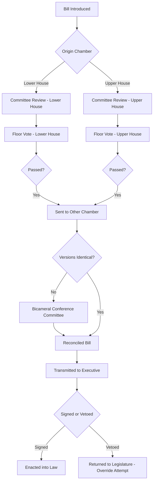

## Bicameralism and Unicameralism

### Definitions

**Bicameralism** refers to a legislative structure composed of two separate chambers (houses), each typically possessing distinct membership, powers, and often differing modes of selection. **Unicameralism** refers to a legislative structure composed of a single chamber, which holds sole responsibility for legislative functions.

### Historical Origins

Bicameralism developed largely as an institutional compromise between competing social and political forces:

- **British model**: The House of Lords (aristocracy, hereditary/appointed) and House of Commons (elected representation) emerged from feudal estates — the "two estates" of nobility/clergy and commoners.
- **U.S. model**: The Senate and House of Representatives resulted from the Connecticut Compromise (1787), reconciling the conflict between large states (favoring population-based representation) and small states (favoring equal state representation).
- **Federal states**: Bicameralism frequently maps onto federal structures, with one chamber representing population (lower house) and another representing constituent territorial units — states, provinces, regions (upper house).

Unicameralism historically appears in smaller, more homogeneous, or unitary states where the rationale for a second chamber (e.g., representing federal units or a hereditary class) is absent — examples include most Nordic legislatures, New Zealand (which abolished its upper house in 1950), and most sub-national legislatures such as U.S. state legislatures (with Nebraska being the sole unicameral exception).

### Core Rationale for Bicameralism

**Key Points**

- **Checks and balances**: A second chamber can act as a "check" on hasty or ill-considered legislation from the first, requiring broader consensus before enactment.
- **Territorial/federal representation**: In federations, an upper house (e.g., U.S. Senate, German Bundesrat, Australian Senate) gives constituent states/regions representation independent of population size, protecting smaller units from being overwhelmed by larger ones.
- **Elite or expert review**: Historically and in some contemporary systems, an upper chamber (e.g., appointed Senate in Canada, House of Lords) is intended to provide deliberative, less populist scrutiny, sometimes composed of appointed experts or elder statesmen.
- **Minority protection**: A second chamber, especially if elected under different rules or terms, can prevent transient majorities from dominating the entire legislative process.
- **Slowing the legislative process**: Requiring passage through two chambers introduces additional veto points, reducing the likelihood of impulsive or poorly vetted lawmaking.

### Core Rationale for Unicameralism

**Key Points**

- **Efficiency and speed**: A single chamber can pass legislation more quickly, without the delays, conference committees, or reconciliation processes bicameral systems require.
- **Clearer accountability**: With only one legislative body, voters can more easily assign credit or blame for legislative outcomes, avoiding the diffusion of responsibility that can occur across two chambers.
- **Reduced redundancy and cost**: Unicameral systems avoid duplicating staff, administrative infrastructure, and electoral processes for a second chamber.
- **Democratic legitimacy concerns**: Where an upper house is not directly elected (e.g., appointed or hereditary), critics argue it lacks democratic legitimacy and may obstruct the will of the elected majority.
- **Suitability for smaller/unitary polities**: In states without strong federal or class-based cleavages, the functional justification for a second chamber is weaker.

### Comparative Institutional Design

| Feature | Bicameral | Unicameral |
| --- | --- | --- |
| Chambers | 2 (upper and lower) | 1 |
| Common rationale | Federalism, checks and balances, elite review | Efficiency, unified accountability |
| Legislative speed | Slower (requires bicameral passage/reconciliation) | Faster |
| Representative basis | Often differs by chamber (population vs. territory) | Single basis (typically population) |
| Examples | United States, United Kingdom, Germany, India, Philippines | Sweden, New Zealand, Israel, Denmark, Nebraska (U.S. state) |

### Symmetric vs. Asymmetric Bicameralism

Political scientists (notably Lijphart, 1999) distinguish bicameral systems along two dimensions:

- **Symmetry**: The degree to which the two chambers possess comparable constitutional powers.
  - *Strong/symmetric bicameralism*: Both chambers have roughly equal formal powers (e.g., U.S. Congress — both House and Senate must pass identical legislation).
  - *Weak/asymmetric bicameralism*: One chamber (usually the lower house) is constitutionally dominant (e.g., UK Parliament — House of Commons can override the House of Lords via the Parliament Acts of 1911/1949; the German Bundestag generally prevails over the Bundesrat except on specific matters).
- **Congruence**: The degree to which the two chambers are elected or composed using similar methods and thus tend to reflect similar political majorities.
  - *Congruent*: Both chambers selected similarly (e.g., both directly elected via similar systems), producing overlapping composition.
  - *Incongruent*: Chambers selected differently (e.g., one directly elected, one appointed or indirectly elected via state legislatures/regional bodies), producing potentially divergent political majorities — increasing the likelihood of interchamber conflict.

Lijphart's typology situates the "strongest" bicameral systems (most likely to produce gridlock or require extensive negotiation) as those combining **symmetry with incongruence** — exemplified by the U.S. Senate and the Italian Senate/Chamber of Deputies (prior to 2020 reforms).

### The Philippine Case

The Philippines operates a **symmetric, incongruent bicameral** Congress:

- **Senate**: 24 members elected at-large (nationwide constituency), six-year terms, staggered elections (half the Senate elected every three years), maximum of two consecutive terms.
- **House of Representatives**: Members elected from legislative districts (single-member plurality) plus party-list representatives (proportional, reserved for marginalized sectors), three-year terms, maximum of three consecutive terms.
- Both chambers possess co-equal legislative authority; bills require passage in identical form by both houses (often reconciled via a Bicameral Conference Committee) before transmission to the President.
- **Revenue, appropriation, and local bills** must originate exclusively in the House of Representatives (Art. VI, Sec. 24, 1987 Constitution), though the Senate may propose or concur with amendments — a partial asymmetry despite otherwise co-equal status.

### Interchamber Conflict Resolution Mechanisms

- **Conference/Bicameral committees**: Ad hoc joint committees reconcile differing versions of a bill (used in the U.S. and the Philippines).
- **Navette system**: Repeated shuttling of a bill between chambers until identical text is achieved (used in France), with the lower house typically given final say if disagreement persists.
- **Override/tie-breaking provisions**: Some systems grant the lower house power to override upper-house objections after a set period or under defined conditions (e.g., UK Parliament Acts; German mediation committee, *Vermittlungsausschuss*).
- **Joint sessions**: Some systems allow both chambers to sit and vote together to break deadlocks (e.g., India's joint sitting provision under Article 108).

### Example

**Example**

Consider a proposed national budget bill:

- In a **bicameral** system (e.g., the Philippines), the House of Representatives originates the appropriations bill; the Senate deliberates and may propose amendments; a Bicameral Conference Committee reconciles differences; both chambers ratify the reconciled version before it proceeds to the President for signature.
- In a **unicameral** system (e.g., Sweden's Riksdag), the single chamber debates, amends, and passes the budget directly — no reconciliation process with a second chamber is required, shortening the legislative timeline.

### Debates and Critiques

- **Democratic theory critique of bicameralism**: Where the upper chamber is not popularly elected or is malapportioned (e.g., disproportionate small-state power in the U.S. Senate), critics argue this violates the principle of "one person, one vote" and can produce policy outcomes misaligned with national majority preferences. [Inference: the normative weight of this critique varies significantly by political theorist and constitutional tradition, and is contested rather than settled.]
- **Empirical findings on gridlock**: Comparative studies (e.g., Tsebelis's veto players theory) suggest that strong, incongruent bicameralism increases the number of institutional veto points, which is associated with greater policy stability but also slower responsiveness to changing majority preferences. [Unverified: precise magnitude of this effect is context- and country-dependent and subject to ongoing empirical debate.]
- **Unicameral vulnerability to majoritarian excess**: Critics of unicameralism argue that without a check from a second chamber, a single-chamber majority could pass legislation with insufficient deliberation or minority safeguards — though proponents counter that judicial review, constitutional courts, or supermajority requirements can substitute for this function.

### Diagram: Bicameral Legislative Process (svg_diagram)

### Conclusion

The choice between bicameralism and unicameralism reflects deeper constitutional trade-offs between deliberative caution, federal accommodation, and minority protection on one hand, and legislative efficiency, clear accountability, and democratic majoritarianism on the other. The design is rarely ideologically neutral — it encodes assumptions about how much friction a political system should tolerate in the lawmaking process and whose interests (territorial, elite, or population-based) merit structurally guaranteed representation.

**Related Topics**

- The Philippine Bicameral Conference Committee: composition and controversies
- Malapportionment and the "small-state bias" in federal upper chambers
- Veto players theory (George Tsebelis) and legislative gridlock
- Comparative upper house selection methods: election, appointment, indirect election
- History of the abolition of unicameral/bicameral systems (e.g., New Zealand 1950, Philippines 1935→1943→1987 transitions)
- Party-list systems and proportional representation in mixed legislatures