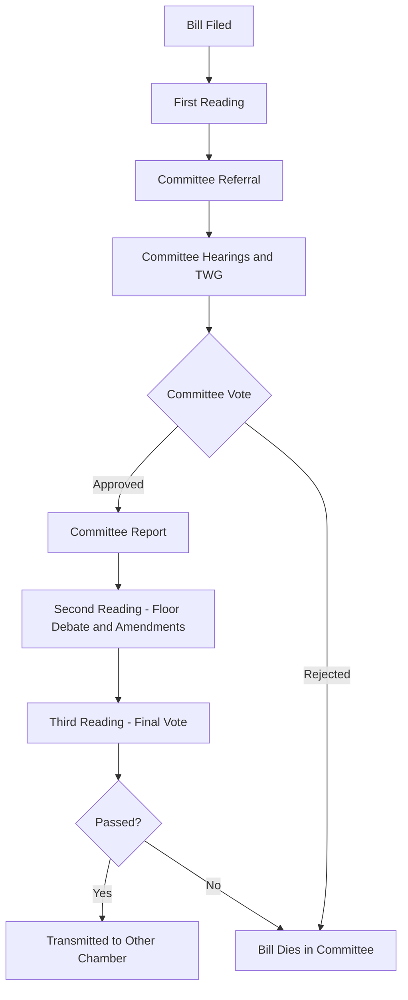

## Legislative Committees and Organization

### Definitions

**Legislative committees** are subunits of a legislature composed of a smaller number of members, tasked with detailed examination of bills, oversight of the executive, budget scrutiny, or investigation of specific policy areas prior to (or instead of) full chamber deliberation. **Legislative organization** refers to the broader institutional architecture governing how a legislature structures its work — chamber leadership, committee systems, party organization, rules of procedure, and staffing.

### Rationale for Committee Systems

**Key Points**

- **Division of labor**: No legislative chamber can feasibly deliberate on every technical detail of every bill on the floor; committees allow specialization and delegation of detailed work to smaller groups.
- **Expertise development**: Members serving repeatedly on the same committee accumulate policy expertise (e.g., a member serving for years on an Appropriations or Finance committee develops deep budgetary knowledge).
- **Information and oversight**: Committees, particularly those with subpoena or investigative powers, serve as the legislature's primary mechanism for monitoring executive agencies and implementation of law.
- **Gatekeeping**: Committees typically control which bills advance to the floor, shaping the overall legislative agenda and enabling strategic control over outcomes.
- **Reducing floor transaction costs**: By pre-vetting and amending bills before floor consideration, committees reduce the time and conflict the full chamber must expend on every measure.

### Types of Committees

- **Standing committees**: Permanent committees with continuing jurisdiction over a specific policy area (e.g., Foreign Affairs, Finance, Agriculture), persisting across legislative sessions.
- **Select/special committees**: Temporary committees created for a specific, often time-limited purpose (e.g., investigating a particular scandal or crisis), typically dissolved once their task is complete.
- **Joint committees**: Composed of members from both chambers in a bicameral system, often used for administrative matters or coordinated policy review (e.g., U.S. Joint Committee on Taxation).
- **Conference/Bicameral committees**: Formed specifically to reconcile differing versions of a bill passed by each chamber in a bicameral legislature.
- **Committee of the Whole**: A procedural device in which the entire chamber convenes as a single committee (often under relaxed rules) to expedite consideration of a bill, common in the U.S. House of Representatives and the UK House of Commons.
- **Subcommittees**: Further subdivisions of standing committees, allowing even more granular specialization (e.g., a Defense Appropriations subcommittee within a broader Appropriations Committee).

### Committee Assignment and Leadership

**Key Points**

- **Assignment mechanisms**: Committee membership is typically allocated by party leadership or steering committees, often proportional to each party's share of chamber seats.
- **Seniority norms**: In many systems (historically strong in the U.S. Congress), committee chairmanships are awarded based on length of continuous service on the committee, though this norm has weakened in some legislatures in favor of leadership appointment or election by party caucus.
- **Chair powers**: Committee chairs typically control the committee's agenda, scheduling of hearings, and — in many systems — whether a bill receives a hearing or vote at all, granting substantial informal gatekeeping power.
- **Minority/majority ratios**: The proportion of majority-to-minority party members on a committee often mirrors (or in some cases exceeds) the chamber's overall partisan composition, reinforcing majority party control over committee outcomes.

### Committee Systems: Comparative Models

| Model | Characteristics | Examples |
| --- | --- | --- |
| Strong committee system | Committees hold significant gatekeeping and amendment power; specialization is high; floor generally defers to committee recommendations | United States Congress |
| Weak/floor-dominant system | Committees play an advisory or preparatory role; floor and party leadership retain primary control over legislative outcomes | United Kingdom House of Commons (historically) |
| Party-dominated system | Committee composition and behavior tightly controlled by party leadership; committees serve to implement party positions rather than exercise independent judgment | Many parliamentary systems with strong party discipline |

[Inference: The strength of a chamber's committee system is a matter of degree along a spectrum rather than a strict binary, and classifications vary somewhat across comparative legislative studies.]

### Legislative Organization Beyond Committees

- **Presiding officers**: Positions such as Speaker (lower house) or Senate President (upper house) manage floor proceedings, recognize members to speak, and often hold significant procedural and sometimes partisan power.
- **Party organization**: Majority and minority floor leaders, whips (responsible for enforcing party voting discipline), and party caucuses/conferences coordinate legislative strategy and votes.
- **Rules and procedure committees**: In some systems (notably the U.S. House Rules Committee), a specific committee controls the terms under which bills are debated and amended on the floor, exercising substantial agenda-setting power.
- **Legislative staff and support agencies**: Professional staff (committee staff, personal member staff) and non-partisan support bodies (e.g., the U.S. Congressional Budget Office, Congressional Research Service) provide analytical capacity, particularly important where legislators lack technical expertise.

### The Philippine Case

- The **House of Representatives** and **Senate** each maintain standing committees corresponding to major policy areas (e.g., Committee on Appropriations, Committee on Justice, Committee on Ways and Means).
- Committee chairmanships are typically distributed through negotiation among the majority coalition, often reflecting alliances formed post-election rather than strict seniority.
- The **Bicameral Conference Committee** plays an outsized role in Philippine lawmaking, since it reconciles House and Senate versions of a bill — critics note that because conference committee deliberations are less transparent than floor proceedings, this stage has occasionally been used to introduce substantive changes not debated in either chamber. [Inference: the extent to which this constitutes a systemic transparency concern versus a normal feature of bicameral reconciliation is a matter of ongoing debate among Philippine legal and political scholars.]
- Committee referral and hearings function as the primary vetting stage before a bill proceeds to second and third reading on the floor.

### Example

**Example**

A proposed healthcare financing bill in a bicameral legislature:

1. The bill is introduced and referred to the relevant standing committee (e.g., Committee on Health).
2. The committee holds hearings, invites resource persons (agency officials, experts, stakeholders), and may create a technical working group to refine provisions.
3. The committee votes to approve, amend, or reject the bill (a "committee report").
4. If approved, the bill proceeds to the floor for second reading (debate and amendment) and third reading (final vote).
5. If passed, and a counterpart version exists in the other chamber, both versions proceed to a Bicameral Conference Committee for reconciliation before final enactment.

### Committee Referral and Bill Flow (svg_diagram)

### Debates and Critiques

- **Committee power vs. floor democracy**: Strong committee gatekeeping can be criticized as insulating policy decisions from the full deliberative body, effectively allowing a small subset of members (or a single chair) to block legislation favored by a chamber majority.
- **Seniority vs. merit/loyalty in leadership selection**: Seniority-based chair selection is defended as reducing intra-party competition and rewarding expertise, but critiqued for entrenching incumbents and reducing responsiveness to shifting party priorities; leadership-appointed chairs increase party control but may reduce independent committee judgment.
- **Transparency of conference/bicameral committees**: Because reconciliation committees often operate with less public scrutiny than standing committee hearings or floor votes, they are a recurring focus of transparency and accountability critiques across multiple bicameral systems, not only the Philippines.
- **Resource asymmetry**: Committees with greater staff and research support (e.g., well-funded U.S. congressional committees) can conduct substantially more independent oversight and policy analysis than under-resourced committees in many other legislatures, affecting the real-world balance of power between the legislature and the executive branch. [Unverified: comparative magnitude of this resource gap across specific legislatures requires case-by-case empirical verification.]

### Conclusion

Committee systems and broader legislative organization structures determine, in practice, how much substantive influence rests with specialized subgroups of legislators versus the chamber as a whole, and how effectively a legislature can perform its lawmaking and oversight functions relative to the executive. The specific configuration — strength of committees, method of leadership selection, and procedural control over the floor agenda — shapes not only legislative efficiency but also the internal distribution of power within the legislature itself.

**Related Topics**

- The U.S. House Rules Committee and agenda-setting power
- Oversight hearings and executive accountability mechanisms
- Committee staff resources and the "expertise gap" between legislature and executive
- Seniority norms versus leadership-appointed committee chairs
- Transparency reforms for bicameral/conference committees
- Party whip systems and voting discipline enforcement