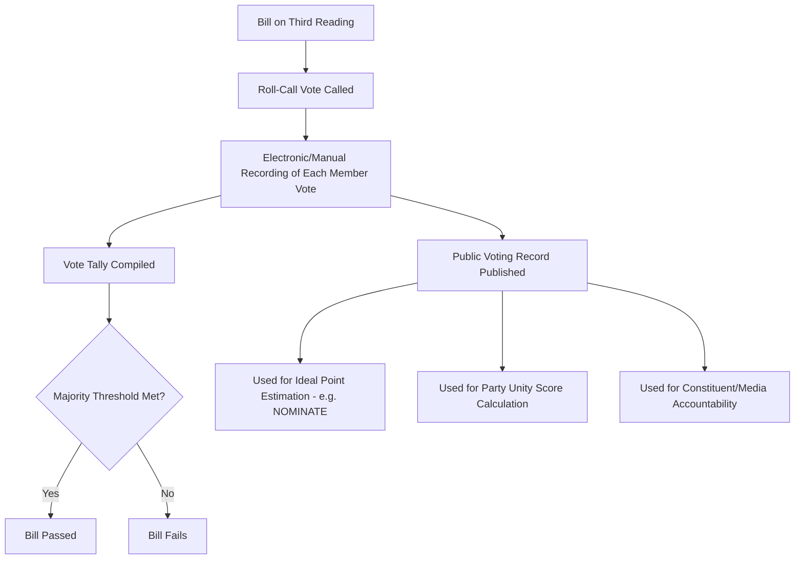

## Legislative Behavior and Roll-Call Voting

### Definitions

**Legislative behavior** is the subfield of legislative studies concerned with explaining why individual legislators act as they do — how they vote, what positions they take, how they allocate effort between lawmaking, oversight, and constituency service. **Roll-call voting** refers to the formal, individually-recorded vote of each legislator on a given motion or bill, as opposed to voice votes or unrecorded methods, and constitutes the primary empirical data source used to study legislative behavior quantitatively.

### Theoretical Approaches to Legislative Behavior

**Key Points**

- **Rational choice / spatial models**: Legislators are modeled as utility-maximizing actors positioned in an ideological (typically left-right) policy space; they vote for the alternative closest to their own ideal point. This underlies most quantitative roll-call scaling methods.
- **Principal-agent / delegate models**: Legislators are viewed as agents accountable to principals — constituents, party leaders, or interest groups — with voting behavior explained by the need to satisfy these principals to secure reelection or advancement.
- **Partisan theories**: Voting behavior is driven primarily by party affiliation and discipline, with party leadership using procedural control, whipping, and electoral resources to secure unified voting blocs (e.g., "conditional party government" theory — party discipline strengthens when a party is internally homogeneous and polarized from the opposition).
- **Sociological/institutional approaches**: Emphasize norms, socialization within the chamber, committee culture, and interpersonal relationships as shaping behavior beyond pure electoral or ideological calculation.
- **Mayhew's "electoral connection" thesis** (1974): Argues that most observable legislative behavior — position-taking, credit-claiming, advertising — can be explained as instrumentally rational strategies aimed at reelection.

### Determinants of Legislative Voting Behavior

- **Constituency preferences**: Legislators often vote in line with the perceived preferences of their electoral district, particularly on salient or highly visible issues.
- **Party affiliation and discipline**: In party-centric systems, voting closely tracks party position, reinforced by career incentives (committee assignments, leadership positions) controlled by party leadership.
- **Ideology**: Personal policy preferences, often measured empirically through revealed preference in voting patterns rather than stated positions.
- **Interest group and donor influence**: Lobbying, campaign contributions, and organized constituency pressure can shape both position-taking and actual votes, particularly on lower-salience issues where public attention is limited.
- **Presidential/executive influence**: In presidential systems, the executive may exert influence through patronage, pork-barrel allocation, or public appeals, especially on the president's legislative agenda items.
- **Logrolling and vote trading**: Legislators may exchange support across unrelated bills to secure passage of measures important to their own constituencies.

### Roll-Call Voting: Mechanics and Types

- **Recorded (roll-call) vote**: Each member's vote (yea/nay/abstain/absent) is individually recorded and made part of the public record; typically triggered by a procedural threshold (e.g., a minimum number of members requesting it) or required for specific vote types (e.g., constitutional amendments, veto overrides).
- **Voice vote**: Members respond collectively ("aye"/"no"), with the outcome determined by the presiding officer's assessment of volume; no individual record is created.
- **Division vote**: Members physically stand or move to designated areas to be counted, without individual identification being recorded in all systems.
- **Electronic voting**: Modern legislatures increasingly use electronic systems allowing near-instantaneous recorded votes with minimal procedural delay (common in the U.S. House, European Parliament, and many others).

### Quantitative Analysis of Roll-Call Data

**Key Points**

- **Ideal point estimation**: Statistical techniques (e.g., NOMINATE scores, developed by Poole and Rosenthal; Bayesian IRT-based methods) use patterns of roll-call votes to estimate each legislator's position on one or more latent ideological dimensions.
- **W-NOMINATE / DW-NOMINATE**: Widely used scaling methods in U.S. congressional studies; DW-NOMINATE allows dynamic (time-varying) estimation of legislator ideology across multiple congresses, enabling longitudinal comparison.
- **Party unity scores**: Measure the percentage of votes on which a legislator sides with the majority of their own party against the majority of the opposing party, used as an indicator of party discipline.
- **Cutting lines**: In spatial voting models, a "cutting line" divides the policy space into legislators expected to vote yea versus nay based on the location of the status quo and the proposed alternative relative to each legislator's ideal point.

$$U_i(x) = -\|x - \theta_i\|^2$$

Where $U_i(x)$ represents legislator $i$'s utility for policy outcome $x$, and $\theta_i$ is that legislator's ideal point in the policy space; under this canonical spatial voting model, the legislator votes for whichever alternative minimizes squared distance from $\theta_i$.

### Comparative Note: Parliamentary vs. Presidential Roll-Call Dynamics

| Feature | Parliamentary Systems | Presidential Systems |
| --- | --- | --- |
| Party discipline | Typically very high; votes against party line are rare and often sanctioned | Varies; can be lower, especially in candidate-centered electoral systems (e.g., U.S.) |
| Vote predictability | High — floor votes are often near-unanimous within party | Moderate to low — cross-party coalitions on specific bills are more common |
| Confidence linkage | Legislative votes may be tied to government survival (no-confidence mechanisms) | No direct linkage; executive survival is independent of individual legislative votes |
| Roll-call transparency | Varies — some parliamentary systems rely more heavily on voice/division votes for routine matters | Often high — many presidential systems mandate recorded votes for most substantive legislation |

[Inference: exact levels of party discipline and vote predictability vary considerably by country and specific electoral rules; the table reflects general comparative tendencies rather than universal rules.]

### The Philippine Case

- The Philippine Congress operates within a **presidential system** with historically **weak party discipline**, owing in part to a multi-party, coalition-based electoral environment and the prevalence of "turncoatism" (legislators switching party affiliation, particularly after elections, to align with the winning administration coalition).
- Roll-call votes are recorded electronically in both chambers for most substantive measures, particularly on third reading.
- Voting coalitions in the Philippine Congress often align more closely with **executive patronage relationships and regional/personalistic alliances** than with stable ideological or programmatic party positions. [Inference: this characterization reflects a broad scholarly consensus in Philippine political science literature but individual voting behavior can vary by legislator, issue salience, and period.]
- Because party-switching and shifting coalitions are common, DW-NOMINATE-style ideological scaling — which assumes some continuity of party-based voting blocs — is less straightforward to apply to the Philippine context than to more institutionalized two-party or stable multi-party systems.

### Example

**Example**

A roll-call vote on a contested tax reform bill in a presidential system might show:

- Strong majority-party support (say, 85% yea among the president's coalition).
- Split opposition-party votes, with some members from tax-sensitive constituencies breaking ranks to vote nay despite party leadership's official position.
- A handful of majority-party defections from legislators representing constituencies expected to be adversely affected by the reform.

Analyzing this roll call using ideal-point estimation would likely reveal that defections cluster among legislators whose estimated ideal points are farthest from their party's median position on the relevant policy dimension — consistent with spatial voting theory.

### Roll-Call Vote Data Flow (svg_diagram)

### Debates and Critiques

- **Do roll-call votes measure "true" preferences?**: Critics note that roll-call votes only capture behavior on issues that reach a floor vote, and agenda-setting by party leadership or committee chairs can systematically prevent certain issues from ever coming to a recorded vote — introducing potential selection bias into ideal-point estimates.
- **Strategic voting**: Legislators may vote strategically (e.g., voting against a bill they privately support, knowing it will pass anyway, to signal position to constituents) — complicating the interpretation of roll-call data as a direct measure of sincere preference.
- **Dimensionality debates**: Scholars disagree on how many meaningful ideological dimensions are needed to explain roll-call voting patterns in a given legislature; U.S. congressional scholars have generally found a dominant single left-right dimension explains most variance, though a second dimension (often associated with regional or race-related issues) has been identified in some historical periods. [Unverified: dimensionality findings are specific to the institutional and historical context studied and should not be assumed to generalize automatically to other legislatures.]
- **Party discipline as behavior-shaping vs. behavior-revealing**: A methodological debate exists over whether high party-line voting reflects genuine underlying preference homogeneity within parties, or whether party discipline mechanisms (whipping, sanctions) coerce members into voting against their private preferences, complicating the inference of "true" ideology from voting records alone.

### Conclusion

The study of legislative behavior through roll-call voting provides one of the most empirically tractable windows into how legislatures actually function, revealing patterns of party discipline, ideological structure, and coalition formation that are often obscured in purely institutional or constitutional analysis. However, roll-call data carries interpretive limitations — reflecting only recorded floor behavior, shaped by strategic and agenda-setting dynamics — that require careful methodological treatment rather than naive reading of vote totals as unmediated preference revelation.

**Related Topics**

- Mayhew's electoral connection theory and position-taking behavior
- DW-NOMINATE and alternative ideal-point estimation methods
- Party switching ("turncoatism") in Philippine legislative politics
- Whip systems and mechanisms of party discipline enforcement
- Agenda-setting power and its effect on roll-call selection bias
- Logrolling, pork-barrel politics, and distributive legislative behavior