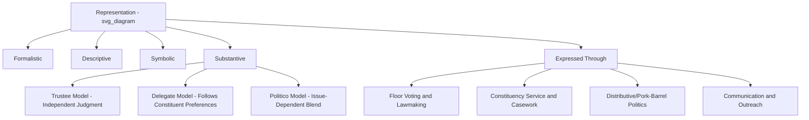

## Representation and Constituency Service

### Definitions

**Representation** refers to the theoretical and practical relationship between legislators and the citizens they are elected to serve — the ways in which a legislator's actions, decisions, and presence in the legislature are meant to stand for, act on behalf of, or reflect the interests of a constituency. **Constituency service** (also called casework) refers to the concrete activities legislators and their staff perform to assist individual constituents or the district as a whole — resolving bureaucratic problems, securing local projects, and responding to requests for help — distinct from lawmaking or floor voting.

### Theoretical Models of Representation

**Key Points**

- **Hanna Pitkin's typology** (*The Concept of Representation*, 1967) remains the foundational framework, distinguishing:
  - **Formalistic representation**: Representation defined by the legal/institutional authorization process (how a representative gains and can lose authority — i.e., elections).
  - **Descriptive representation**: The degree to which a representative resembles the represented in social characteristics (e.g., ethnicity, gender, class, region).
  - **Symbolic representation**: The degree to which a representative evokes feelings of legitimate representation among constituents, independent of substantive policy alignment.
  - **Substantive representation**: The degree to which a representative actively acts in the interest of the represented, promoting their policy preferences regardless of descriptive similarity.
- **Trustee vs. delegate models**: A long-standing normative debate (traceable to Edmund Burke's 1774 Speech to the Electors of Bristol) over whether a legislator should exercise independent judgment on behalf of constituents (**trustee**) or should closely follow and enact the expressed preferences of constituents (**delegate**), with most legislators in practice adopting a **politico** model blending both depending on issue salience.
- **Responsible party government model**: An alternative view holding that representation functions primarily through voters selecting between competing party platforms, with individual legislators expected to support their party's program rather than exercise independent constituency-specific judgment.

### Dimensions of the Representational Relationship

- **Geographic/territorial representation**: Legislators elected from defined districts represent the collective interests of that geographic constituency (dominant in single-member district systems).
- **Party-list/proportional representation**: Legislators represent a broader ideological or sectoral constituency defined by party or list affiliation rather than geography (common in proportional representation systems and mixed systems, e.g., Philippine party-list seats).
- **Sectoral/functional representation**: Some systems reserve seats for specific social sectors (e.g., labor, indigenous peoples, women, youth), representing group-based rather than purely geographic or partisan interests.
- **Virtual/surrogate representation**: The concept that constituents may feel represented by legislators outside their own district who share their identity or policy views, particularly relevant to descriptive representation of minority groups dispersed across multiple districts.

### Constituency Service: Functions and Forms

**Key Points**

- **Casework**: Direct assistance to individual constituents navigating government bureaucracy — expediting document processing, resolving benefit claims, addressing agency delays, or assisting with disputes involving government agencies.
- **Pork-barrel / distributive politics**: Legislators securing government spending, infrastructure projects, or discretionary funds specifically directed to their district, often used to demonstrate tangible benefit delivery to constituents.
- **District/local office presence**: Maintenance of local offices staffed to handle constituent inquiries, separate from the legislator's capital-based legislative office.
- **Communication and outreach**: Newsletters, town halls, social media engagement, and public appearances intended to maintain visibility and responsiveness to constituent concerns.
- **Franking privilege / official communication resources**: Many legislatures provide official (often subsidized or free) channels for legislators to communicate with constituents, raising recurring debates over the line between legitimate constituent communication and taxpayer-subsidized incumbency advantage.

### Why Constituency Service Matters: Theoretical Rationale

- **Electoral connection**: Mayhew's (1974) framework identifies constituency service as a low-risk, high-return activity for legislators — casework rarely generates opposition (helping an individual constituent is broadly popular) while building a personal reputation for responsiveness independent of controversial policy positions.
- **Incumbency advantage**: Extensive empirical literature (particularly in U.S. congressional studies) links constituency service capacity to incumbency advantage, as sitting legislators can leverage staff and institutional resources unavailable to challengers.
- **Bureaucratic oversight function**: Casework can also serve a systemic oversight role, as patterns of constituent complaints may reveal broader administrative failures that legislators can address through hearings or legislation.

### Comparative Variation

| Factor | High Constituency-Service Emphasis | Lower Constituency-Service Emphasis |
| --- | --- | --- |
| Electoral system | Single-member district, candidate-centered (e.g., U.S., Philippines) | Closed-list proportional representation, party-centered (e.g., some European systems) |
| Personal vote incentive | High — reelection tied closely to personal reputation for local delivery | Lower — reelection tied more to party performance/list position |
| Staff resources | Often substantial dedicated district/casework staff | Varies; may be more centralized at party level |
| Party discipline | Often weaker, allowing legislators more incentive to cultivate personal, non-party-based support | Often stronger, reducing incentive for personalistic constituency cultivation |

[Inference: this table reflects general comparative patterns identified in legislative studies literature; specific country configurations can deviate due to local political culture, informal norms, or hybrid electoral rules.]

### The Philippine Case

- Philippine legislative politics is marked by an especially strong emphasis on constituency service and **patronage-based representation**, often described in the literature using terms such as "trapo" (traditional politician) politics or patron-client relationships.
- **Pork barrel mechanisms**: Historically, Philippine legislators had access to discretionary funds (e.g., the Priority Development Assistance Fund, PDAF) explicitly intended for district-level projects; the Supreme Court declared PDAF unconstitutional in 2013 (*Belgica v. Executive Secretary*) following the "pork barrel scam" controversy, though debates continue over successor mechanisms and their transparency. [Fact, subject to ongoing legal/political developments — verify current status of any successor congressional insertion mechanisms via recent sources if precision on present-day practice is required.]
- **District representatives** in the House are widely expected by constituents to deliver visible local benefits (roads, scholarships, medical assistance, livelihood programs) as a central basis of their political survival, often more so than programmatic legislative achievements.
- **Party-list representatives**, by contrast, are constitutionally intended to represent marginalized and underrepresented sectors (Republic Act No. 7941, the Party-List System Act), reflecting a more sectoral/functional representational model distinct from the district-based patronage system, though scholars have noted persistent debates over whether the party-list system has fully achieved this sectoral representation goal in practice. [Inference: the degree to which the party-list system has achieved its original sectoral-representation intent versus being utilized by traditional political and economic elites is a matter of ongoing scholarly and public debate.]

### Example

**Example**

A constituent in a Philippine congressional district whose relative has died and requires urgent burial assistance visits the district representative's local office. Casework staff:

1. Process a request for the office's discretionary financial or medical assistance program.
2. Connect the constituent with relevant national agencies (e.g., DSWD) for supplementary aid.
3. Log the interaction, contributing to the representative's district-level record of constituent responsiveness — later referenced in campaign messaging around service delivery.

This exemplifies **substantive** and **symbolic** representation operating through non-legislative channels — the constituent's problem is addressed not via a floor vote, but via direct casework, reinforcing the constituent's sense of being "represented" regardless of the representative's voting record on unrelated national policy issues.

### Representation Model Relationships (svg_diagram)

### Debates and Critiques

- **Constituency service vs. programmatic policymaking trade-off**: Critics argue that heavy legislator investment in casework and district-level patronage can crowd out attention to substantive national policy work, weakening the legislature's broader lawmaking and oversight capacity.
- **Patronage and clientelism critiques**: Scholars of Philippine and comparable developing-democracy politics have long debated whether extensive constituency service functions as legitimate representative responsiveness or as a mechanism perpetuating clientelist political relationships that entrench incumbents and discourage programmatic, issue-based voting. [Inference: this remains an active and normatively contested area of scholarship rather than a settled empirical conclusion.]
- **Descriptive vs. substantive representation debate**: A persistent theoretical question concerns whether increasing descriptive representation (e.g., more women, ethnic minorities, or sectoral representatives in the legislature) reliably produces substantive policy benefits for those groups, or whether the relationship is more contingent and context-dependent. [Unverified: findings vary substantially by country, policy area, and specific group studied, and should not be treated as a uniform causal claim.]
- **Incumbency advantage and democratic competition**: Constituency-service-driven incumbency advantage raises normative concerns about whether elections remain genuinely competitive when sitting legislators can leverage institutional resources unavailable to challengers.

### Conclusion

Representation and constituency service together illuminate the gap between the formal, deliberative image of a legislature as a lawmaking body and its lived function as an institution deeply embedded in ongoing, often personalized relationships between individual legislators and their constituents. Understanding this dual role — as both a policy-making chamber and a distributive, service-oriented institution — is essential to explaining legislative behavior, incumbency dynamics, and the persistence of patronage politics in many democratic systems, including the Philippines.

**Related Topics**

- Pitkin's typology of representation in comparative application
- The Philippine pork barrel system and post-PDAF congressional insertions
- Party-list system reform debates (RA 7941)
- Incumbency advantage and electoral competitiveness
- Clientelism and patron-client politics in Southeast Asian democracies
- Descriptive representation and its substantive policy effects