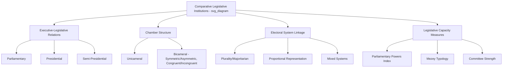

## Comparative Legislative Institutions

### Definitions

**Comparative legislative institutions** is the subfield of comparative politics and legislative studies that examines how legislatures differ across countries in structure, powers, procedures, and relationship to the executive, and what consequences these institutional variations have for governance, representation, and policy outcomes. It integrates cross-national analysis with the more country-specific topics (bicameralism, committee systems, roll-call behavior, representation) covered elsewhere in legislative studies.

### Core Dimensions of Comparison

**Key Points**

- **Executive-legislative relations**: The formal constitutional relationship between the legislature and executive — whether the executive is drawn from and accountable to the legislature (parliamentary), separately elected and constitutionally independent (presidential), or a hybrid of both (semi-presidential).
- **Chamber structure**: Unicameral versus bicameral organization, and — where bicameral — the degree of symmetry and congruence between chambers (see prior chapter item).
- **Electoral system linkage**: How members are elected (plurality/majoritarian, proportional representation, mixed systems) shapes incentives for constituency service, party discipline, and legislative behavior.
- **Legislative capacity**: The institutional resources (staff, research support, committee infrastructure, session length) available to a legislature to draft, analyze, and oversee legislation independently of the executive.
- **Party system characteristics**: Number of effective parties, degree of party discipline, and fragmentation, all of which shape coalition formation and legislative-executive bargaining dynamics.

### Executive-Legislative Regime Types

- **Parliamentary systems**: The executive (prime minister/cabinet) is drawn from and remains accountable to the legislature via confidence votes; the legislature can remove the government through a vote of no confidence, and the executive typically can dissolve the legislature and call early elections (e.g., United Kingdom, Germany, Japan, India).
- **Presidential systems**: The executive (president) is elected independently (directly or via an electoral college) for a fixed term, and neither branch can ordinarily remove the other outside of extraordinary mechanisms (e.g., impeachment); legislative and executive survival are institutionally separated (e.g., United States, Philippines, most of Latin America).
- **Semi-presidential systems**: A directly elected president coexists with a prime minister and cabinet accountable to the legislature, creating dual executive authority with varying divisions of power depending on constitutional design and the relative strength of presidential versus parliamentary majorities (e.g., France, Russia formally, several post-Soviet states).
- **Assembly-independent/directorial systems**: A rarer category in which executive authority is collectively vested in a body elected by, but not readily removable by, the legislature during its term (e.g., Switzerland's Federal Council).

### Legislative-Executive Power Balance: Comparative Framework

| Regime Type | Government Formation | Removal Mechanism | Legislative Independence from Executive |
| --- | --- | --- | --- |
| Parliamentary | Legislature selects/confirms executive | No-confidence vote | Lower — executive often controls legislative agenda via majority party |
| Presidential | Executive elected independently | Impeachment (high threshold, for cause) | Higher — legislature institutionally separate, can obstruct executive agenda |
| Semi-presidential | Dual — president elected; PM often requires legislative confidence | Varies (no-confidence for PM; impeachment for president) | Variable — depends on "cohabitation" dynamics between president and legislative majority |

[Inference: this table presents idealized/formal institutional distinctions; real-world practice varies significantly based on party discipline, informal norms, and specific constitutional text, and should be supplemented with case-specific research for precision.]

### Legislative Strength: Measuring Institutional Capacity

**Key Points**

- **Fish and Kroenig's Parliamentary Powers Index** and similar comparative indices attempt to quantify legislative strength across dimensions such as: authority over the executive (ability to remove/investigate), institutional autonomy (control over own agenda/rules), and specified powers (budgetary authority, treaty ratification, appointment confirmation).
- **Mezey's classification** (1979) distinguishes legislatures by combining **policy-making power** (ability to independently shape legislative outcomes) with **support/legitimacy** (public and elite acceptance of the institution), yielding categories such as "active" legislatures (high power, high support — e.g., U.S. Congress), "reactive" legislatures (moderate power, dependent on executive initiative — many parliamentary systems), "vulnerable" legislatures (some power but weak legitimacy, susceptible to executive or military override), and "minimal" legislatures (largely rubber-stamp bodies with negligible independent power).
- **Committee strength** as a comparative indicator: legislatures with strong, specialized standing committees (e.g., U.S. Congress) tend to exhibit greater independent policy-shaping capacity than those where committees serve primarily to ratify decisions already made by party/executive leadership.

### Federalism and Legislative Structure

- Federal systems (e.g., United States, Germany, Australia, India, Brazil) typically feature an upper chamber explicitly designed to represent constituent states/regions, embedding federal bargaining directly into the national legislative process.
- Unitary systems (e.g., Philippines, France, Japan, most Nordic countries) do not require this territorial representation function, though some unitary states nonetheless retain bicameral structures for other reasons (elite review, regional/local government representation short of full federalism).
- [Inference: the correlation between federalism and bicameralism is strong but not absolute — several federal systems are unicameral at the sub-national level even where the national legislature is bicameral, and some unitary states retain bicameral national legislatures for historical or elite-review reasons rather than federal representation.]

### The Philippine Case in Comparative Context

- The Philippines is classified as a **presidential system** modeled significantly on the U.S. Congress in structural terms (bicameral, symmetric-incongruent bicameralism, committee-based standing structure), but operates within a distinct party system context characterized by **weak party discipline**, fluid party coalitions, and strong personalistic/patronage politics — diverging significantly from the more institutionalized, ideologically structured party system typically assumed in classical U.S.-derived legislative theory. [Inference: characterizing the precise degree of "weakness" in Philippine party discipline relative to other presidential systems requires comparative empirical measurement rather than assumption, though this characterization reflects a broad consensus in the comparative Philippine politics literature.]
- Using Mezey's typology, the Philippine Congress has been characterized by various scholars as occupying a position between "active" and "vulnerable" — possessing significant formal constitutional powers (budgetary authority, oversight, impeachment) but historically susceptible to strong executive dominance during periods of unified government or high presidential popularity, and historically vulnerable to extraconstitutional interruption (e.g., the 1972 declaration of martial law and abolition of Congress under Marcos Sr., restored only with the 1987 Constitution). [Inference: precise typological classification is a matter of scholarly interpretation rather than an uncontested empirical fact.]
- The 1987 Constitution's restoration of a bicameral Congress, following the unicameral National Assembly/Batasang Pambansa under the 1973 Constitution's amended form, reflects a deliberate post-authoritarian institutional design choice intended to reintroduce additional checks on executive power.

### Example

**Example**

Comparing legislative response to a similar policy crisis (e.g., a public health emergency requiring emergency spending authority) illustrates institutional variation:

- In a **parliamentary system** with a disciplined majority government, emergency legislation can typically pass rapidly, since the executive commands a reliable legislative majority.
- In the **U.S. presidential system**, emergency spending may require protracted negotiation between the president, House, and Senate — particularly under divided government — given the separation of survival between branches.
- In the **Philippine presidential system**, emergency legislation may pass relatively quickly if the president enjoys a strong majority coalition in both chambers (common given the "bandwagon" tendency of Philippine legislative coalitions to align with a popular incumbent president), but can also reveal committee-level bottlenecks or bicameral reconciliation delays even under favorable political conditions.

### Comparative Institutional Framework (svg_diagram)

### Debates and Critiques

- **Presidentialism vs. parliamentarism and democratic stability**: A long-standing debate, prominently associated with Juan Linz's work ("The Perils of Presidentialism," 1990), argues that presidential systems are more prone to executive-legislative deadlock and democratic breakdown due to the "dual legitimacy" of separately elected executives and legislatures, compared to the more flexible confidence-based accountability of parliamentary systems. This thesis remains contested, with critics (e.g., Mainwaring and Shugart) arguing that specific institutional configurations (e.g., electoral system design, party system fragmentation) matter more than presidentialism as such. [Inference: this remains an actively debated proposition in comparative politics rather than a settled empirical consensus.]
- **Legislative strength indices and measurement validity**: Cross-national indices attempting to quantify legislative power (e.g., Fish-Kroenig) face persistent methodological debate over how to weight and operationalize formal constitutional powers versus actual exercised influence, since formal authority and real-world legislative independence do not always align. [Unverified: specific index scores and rankings should be treated as one analytical tool among several, not a definitive measure of legislative strength.]
- **Convergence vs. path-dependence**: Scholars debate whether legislatures across different countries are converging toward similar organizational forms (e.g., increasing committee specialization, professionalized staff) due to globalization and institutional diffusion, or whether path-dependent historical and cultural factors continue to produce persistent, non-convergent institutional variation.

### Conclusion

Comparative analysis of legislative institutions reveals that formally similar structures (e.g., bicameral, committee-based legislatures) can function very differently depending on the surrounding constitutional regime type, electoral system, and party system context — as the divergence between the U.S. Congress and the structurally similar but behaviorally distinct Philippine Congress illustrates. Understanding legislatures comparatively requires attention not only to formal institutional design but to the broader political ecosystem — executive relations, electoral incentives, and party system characteristics — that shapes how those formal structures actually operate in practice.

**Related Topics**

- Linz's "Perils of Presidentialism" thesis and subsequent critiques
- Mezey's legislative typology and its application to hybrid/transitional democracies
- The 1973 Batasang Pambansa and Philippine legislative institutional history
- Comparative electoral system design and its effect on legislative behavior
- Parliamentary Powers Index and cross-national legislative strength measurement
- Divided government and executive-legislative deadlock in presidential systems