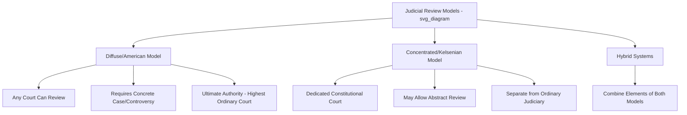

## Judicial Review and Constitutional Courts

### Definitions

**Judicial review** is the power of courts to examine the constitutionality of legislative and executive acts, and to declare them void or unenforceable if found inconsistent with the constitution. **Constitutional courts** are specialized judicial bodies — separate from the ordinary court hierarchy in many systems — vested with primary or exclusive authority to adjudicate constitutional questions, as distinguished from **diffuse (decentralized) judicial review**, in which ordinary courts at any level may exercise this power.

### Origins and Models of Judicial Review

**Key Points**

- **American ("diffuse") model**: Originating from *Marbury v. Madison* (1803), in which the U.S. Supreme Court asserted the implicit power to invalidate a federal statute as unconstitutional, even absent explicit constitutional textual authorization for judicial review. Under this model, any court, at any level, can rule on constitutional questions in the course of ordinary litigation, with final authority resting in the highest ordinary court.
- **European ("concentrated"/Kelsenian) model**: Developed by legal theorist Hans Kelsen and first institutionalized in the Austrian Constitution of 1920, this model vests constitutional review exclusively in a specialized constitutional court, separate from the ordinary judiciary, often with the power to review legislation both *a priori* (before enactment) and *a posteriori* (after enactment), and sometimes accessible directly by individuals via constitutional complaint mechanisms.
- **Hybrid/mixed models**: Many contemporary systems blend elements of both — e.g., a supreme court exercising ultimate constitutional authority (as in a diffuse system) while incorporating specialized constitutional chambers or divisions, or vesting certain constitutional questions in a dedicated body while others remain with ordinary courts.

### Comparative Structural Models

| Model | Review Authority | Access | Examples |
| --- | --- | --- | --- |
| Diffuse (American) | Any court, ultimate authority in highest ordinary court | Concrete cases/controversies (as-applied review) | United States, Philippines, Japan, India (Supreme Court) |
| Concentrated (Kelsenian) | Dedicated constitutional court, separate from ordinary judiciary | Often abstract review (direct challenge) plus concrete referral from ordinary courts | Germany (Federal Constitutional Court), Austria, Italy, South Korea |
| Hybrid | Supreme Court or specialized constitutional chamber/tribunal | Varies — often combines abstract and concrete review mechanisms | France (Conseil Constitutionnel, historically abstract-only; post-2008 reform added concrete review via *question prioritaire de constitutionnalité*), South Africa, Indonesia |

[Inference: classification of specific countries can vary somewhat across comparative constitutional law scholarship, particularly for hybrid systems combining features of both models.]

### Core Doctrinal Concepts

- **Justiciability**: Whether a given constitutional question is appropriate for judicial resolution, often constrained by doctrines such as standing (who may bring a case), ripeness (whether a controversy is sufficiently concrete), and mootness (whether a live controversy still exists).
- **Political question doctrine**: A judicial self-restraint doctrine under which courts decline to adjudicate matters deemed constitutionally committed to the discretion of the political branches (executive/legislature), though the scope of this doctrine varies significantly across jurisdictions and has been narrowed in some (e.g., the Philippines' 1987 Constitution explicitly expanded judicial power to include reviewing "grave abuse of discretion" by any government branch, partly to prevent excessive invocation of the political question doctrine as seen under the Marcos-era judiciary).
- **Facial vs. as-applied challenges**: A facial challenge argues a law is unconstitutional in all its applications; an as-applied challenge argues a law is unconstitutional only as applied to the specific facts of a given case.
- **Judicial review of amendments**: Some constitutional courts (notably India's Supreme Court, via the "basic structure doctrine" established in *Kesavananda Bharati v. State of Kerala*, 1973) have asserted authority to review and invalidate even constitutional amendments if found to violate the constitution's foundational structure — a comparatively expansive and contested form of judicial review.

### Institutional Design Features of Constitutional Courts

**Key Points**

- **Appointment mechanisms**: Vary widely — some systems require joint or supermajority legislative confirmation (intended to encourage cross-partisan consensus candidates), others rely on executive appointment with legislative confirmation, and some incorporate judicial council or peer nomination processes.
- **Tenure**: Ranges from life tenure (subject to good behavior, as in the U.S.) to fixed non-renewable terms (common in many concentrated constitutional courts, intended to balance independence with periodic renewal and reduced entrenchment).
- **Mandatory retirement age**: Many systems impose a mandatory judicial retirement age (e.g., 70 in the Philippines for the Supreme Court) as a structural safeguard against excessive entrenchment.
- **Abstract vs. concrete review**: Abstract review allows challenges to a law's constitutionality independent of any specific case or controversy (often available only to designated actors such as legislative minorities, the executive, or ombudsman institutions); concrete review arises from an actual pending case.

### The Philippine Case

- The Philippines follows the **diffuse (American) model**, with the **Supreme Court** as the court of last resort on constitutional questions, though lower courts (Regional Trial Courts, Court of Appeals) may also rule on constitutional issues in cases before them, subject to appellate review.
- The 1987 Constitution (Article VIII, Section 1) explicitly and unusually expanded the scope of "judicial power" to include the duty to determine whether any branch or instrumentality of government has committed "grave abuse of discretion amounting to lack or excess of jurisdiction" — a provision widely understood as a direct response to the pre-1986 judiciary's perceived over-reliance on the political question doctrine to avoid reviewing Marcos-era executive actions.
- The Philippine Supreme Court exercises both **original jurisdiction** (for specific case types, including certain constitutional petitions) and **appellate jurisdiction**, and has the power to review the constitutionality of a wide range of governmental acts, including declarations of martial law duration and scope (subject to specific constitutional timelines for review under Article VII, Section 18).
- Notable exercises of Philippine judicial review include *Belgica v. Executive Secretary* (2013, declaring the PDAF/pork barrel system unconstitutional) and various rulings on the scope of executive agreements versus treaties requiring Senate concurrence.

### Example

**Example**

A legislature passes a law restricting a specific form of political speech. Under the two models:

- **Diffuse model (e.g., Philippines/U.S.)**: An affected individual or organization must have standing and an actual case or controversy (e.g., being charged under the law, or facing imminent enforcement) to challenge it; the case proceeds through the ordinary court hierarchy, potentially reaching the Supreme Court on appeal, which then rules on the law's constitutionality as part of resolving that specific case.
- **Concentrated model (e.g., Germany)**: A designated set of actors (e.g., a specified number of Bundestag members, a state government, or in some cases individuals via constitutional complaint after exhausting other remedies) may directly petition the Federal Constitutional Court to review the law's constitutionality, potentially even before it is ever enforced against anyone (abstract review), without requiring an underlying individual case.

### Judicial Review Models Comparison (svg_diagram)

### Debates and Critiques

- **Countermajoritarian difficulty**: A foundational normative debate (associated with Alexander Bickel's *The Least Dangerous Branch*, 1962) concerns the tension between judicial review and democratic self-governance — unelected judges invalidating decisions made by elected legislative majorities raises persistent questions about democratic legitimacy, addressed differently across jurisdictions through varying appointment mechanisms, tenure structures, and doctrines of judicial restraint.
- **Judicial activism vs. restraint**: Ongoing debate over the appropriate scope of judicial review — whether courts should defer broadly to legislative and executive judgment absent clear constitutional violation (restraint), or should actively enforce constitutional rights and structural limits even against popular political preferences (activism). [Inference: characterizations of any specific court as "activist" or "restrained" are frequently contested and often reflect the political orientation of the characterizer as much as neutral institutional analysis.]
- **Basic structure doctrine controversy**: India's basic structure doctrine, which allows judicial invalidation of even duly passed constitutional amendments, remains a significant point of comparative constitutional debate — praised by some as an essential safeguard against majoritarian erosion of core constitutional values, criticized by others as an unelected judiciary arrogating powers beyond even the constitutional amendment process itself. [Unverified: the doctrine's proper scope and legitimacy remain actively contested within Indian constitutional scholarship and jurisprudence itself.]
- **Court-packing and judicial independence concerns**: Comparative scholarship has documented instances across multiple countries where governments have sought to alter constitutional court composition, jurisdiction, or appointment procedures to reduce the court's capacity for independent constitutional review — a recurring concern in the "democratic backsliding" literature. [Inference: specific characterizations of such efforts as illegitimate "court-packing" versus legitimate institutional reform are often contested along partisan and scholarly lines depending on the case.]

### Conclusion

Judicial review and the institutional design of constitutional courts represent a central mechanism through which democratic systems attempt to reconcile majoritarian lawmaking with enforceable constitutional limits, but the specific model chosen — diffuse or concentrated, abstract or concrete, broadly or narrowly justiciable — shapes not only how constitutional questions are resolved but the judiciary's broader relationship to democratic accountability and political power. The Philippine experience, with its post-authoritarian constitutional expansion of judicial power to check "grave abuse of discretion," illustrates how judicial review design is often a direct institutional response to a country's specific historical experience with executive overreach.

**Related Topics**

- *Marbury v. Madison* and the origins of diffuse judicial review
- Kelsen's pure theory of law and the Austrian constitutional court model
- The "grave abuse of discretion" clause in the 1987 Philippine Constitution
- India's basic structure doctrine and *Kesavananda Bharati*
- Countermajoritarian difficulty and theories of judicial legitimacy
- Democratic backsliding and threats to judicial independence