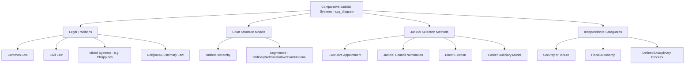

## Comparative Judicial Systems

### Definitions

**Comparative judicial systems** is the subfield examining how legal and judicial institutions differ across countries — their underlying legal traditions, court structures, judicial selection methods, and the judiciary's institutional relationship to the other branches of government — and what consequences these variations have for legal predictability, judicial independence, and access to justice.

### Major Legal Traditions (Legal Families)

**Key Points**

- **Common law tradition**: Originating in England, characterized by reliance on judicial precedent (*stare decisis*) as a primary source of law, an adversarial trial process, and historically judge-made law developed incrementally through case decisions (e.g., United States, United Kingdom, India, Philippines in significant part, Australia, Canada).
- **Civil law tradition**: Rooted in Roman law and codified through comprehensive legal codes (e.g., the Napoleonic Code, German Civil Code/BGB), characterized by an inquisitorial trial process, comprehensive statutory codes as the primary source of law, and judicial decisions generally treated as persuasive rather than strictly binding precedent (e.g., France, Germany, Japan, most of Latin America and continental Europe).
- **Mixed/hybrid legal systems**: Systems incorporating elements of multiple traditions due to colonial history or deliberate legal transplantation — the **Philippines** is a notable example, blending Spanish civil law heritage (particularly in civil law areas such as property, family law, and obligations, largely codified in the Civil Code) with American common law influence (particularly in constitutional law, criminal procedure, and corporate/commercial law) following U.S. colonial administration (1898–1946).
- **Religious/customary law systems**: Legal systems substantially or partially grounded in religious doctrine (e.g., Sharia-influenced systems in various Muslim-majority countries) or indigenous customary law, often operating alongside or integrated with civil/common law frameworks (e.g., the Philippines' recognition of Muslim personal law under the Code of Muslim Personal Laws, and indigenous customary law recognition under the Indigenous Peoples' Rights Act).

### Court Structure Models

- **Unified/integrated hierarchy**: A single court system handling all case types (civil, criminal, administrative, constitutional) organized in a hierarchical appellate structure culminating in one highest court (characteristic of most common law systems, including the Philippines and the U.S.).
- **Specialized/segmented systems**: Separate court hierarchies for different case categories — for example, many civil law countries maintain distinct **ordinary courts** (civil/criminal matters), **administrative courts** (disputes involving government action, e.g., France's Conseil d'État), and **constitutional courts** (constitutional questions), each with its own separate hierarchy and highest court, rather than a single unified supreme court.
- **Specialized subject-matter courts**: Many systems, regardless of overall structure, maintain specialized courts for particular subject areas — labor courts, family courts, tax courts, commercial courts, military courts, and (increasingly) cybercrime or environmental courts.

### Comparative Structural Overview

| Feature | Common Law (e.g., Philippines, U.S.) | Civil Law (e.g., France, Germany) |
| --- | --- | --- |
| Primary law source | Judicial precedent + statute | Comprehensive codes |
| Trial process | Adversarial | Inquisitorial |
| Court hierarchy | Typically unified, single apex court | Often segmented (ordinary/administrative/constitutional) |
| Role of prior decisions | Binding precedent (*stare doctrine*) | Generally persuasive, not strictly binding |
| Judicial reasoning style | Case-by-case, analogical | Deductive, code-interpretation focused |

[Inference: these are general tendencies characterizing each tradition; considerable variation exists within each category, and many systems today exhibit convergence or blended features.]

### Judicial Selection Methods

**Key Points**

- **Executive appointment (with or without legislative confirmation)**: Common across many systems, varying in the degree of legislative check involved (e.g., U.S. federal judges — presidential nomination with Senate confirmation; Philippine judiciary — presidential appointment from a shortlist submitted by the Judicial and Bar Council).
- **Judicial council/commission nomination**: A body composed partly or wholly of judges, legal professionals, or independent members screens and nominates candidates, intended to reduce direct political influence over appointments (e.g., the Philippine Judicial and Bar Council, established under the 1987 Constitution).
- **Direct election**: Some systems (notably many U.S. state judiciaries) elect judges directly by popular vote, a practice largely unique among developed democracies and subject to significant scholarly debate over its effects on judicial independence and impartiality.
- **Career judiciary/civil service model**: Common in many civil law countries, where individuals enter a judicial career track early (often via specialized examination after law school) and are promoted through the ranks based on seniority and performance evaluation, rather than being appointed as experienced lawyers or politicians later in their careers (e.g., France, Germany, Japan).

### Judicial Independence: Structural Safeguards

- **Security of tenure**: Protection against arbitrary removal, ranging from life tenure to fixed non-renewable terms, intended to insulate judges from political retaliation for unpopular rulings.
- **Fiscal autonomy**: Constitutional or statutory protection of judicial branch budgets from being used as leverage by the executive or legislature (the Philippine Constitution, for instance, explicitly guarantees the judiciary fiscal autonomy under Article VIII, Section 3).
- **Disciplinary and removal mechanisms**: Formal processes (impeachment, judicial council disciplinary proceedings) intended to allow removal only for defined causes (e.g., serious misconduct) through a defined, non-arbitrary process, rather than at the unilateral discretion of the executive.
- **Prohibition on salary diminution**: Many constitutions explicitly prohibit reducing sitting judges' salaries during their tenure, preventing this as an indirect pressure tactic.

### The Philippine Judicial System

**Key Points**

- **Structure**: A unified hierarchy consisting of the Supreme Court (apex court), Court of Appeals, Sandiganbayan (anti-graft court for public officials), Court of Tax Appeals, Regional Trial Courts, and first-level courts (Metropolitan/Municipal Trial Courts), alongside a parallel Sharia court system for Muslim personal law matters in specified regions.
- **Selection**: Justices and judges are appointed by the President from a shortlist of at least three nominees per vacancy submitted by the **Judicial and Bar Council (JBC)**, a constitutionally created body chaired by the Chief Justice and composed of representatives from the legal profession, academe, private sector, and ex-officio members (Secretary of Justice, a Congressional representative).
- **Tenure**: Supreme Court justices and other judges serve until a mandatory retirement age of 70, and may be removed only through impeachment (for Supreme Court justices specifically) or through Supreme Court-supervised administrative disciplinary proceedings (for lower court judges), reflecting an emphasis on insulating the judiciary from ordinary political removal.
- **Hybrid legal character**: Philippine substantive law reflects its mixed heritage — the **Civil Code** (1949, heavily based on Spanish civil law) governs most private law matters (property, contracts, family relations, succession), while **constitutional law, criminal procedure, corporate law, and remedial law (rules of court)** draw substantially on American common law principles and procedural frameworks, including reliance on case law and the doctrine of *stare decisis* for Supreme Court decisions (Civil Code, Article 8).

### Example

**Example**

Consider how a commercial contract dispute would be resolved differently:

- In the **Philippines** (mixed system), the dispute would likely be governed by Civil Code contract provisions (civil law heritage), but resolved through an adversarial trial process with reliance on prior Supreme Court decisions interpreting those code provisions as binding precedent (common law procedural and precedential influence) — illustrating the blended character of the system.
- In **France** (pure civil law), the same dispute would be resolved primarily through direct application and interpretation of the Civil Code's contract provisions, with prior court decisions treated as persuasive guidance rather than strictly binding authority, and the case would proceed through the ordinary court hierarchy using inquisitorial procedures.
- In the **United States** (pure common law), especially where the dispute falls outside any comprehensive statutory scheme, the resolution might depend substantially on accumulated case law precedent specific to the relevant state's contract jurisprudence.

### Legal Traditions and Court Structures (svg_diagram)

### Debates and Critiques

- **Judicial elections and independence**: The practice of electing judges (found in many U.S. states) is heavily debated — proponents argue it enhances democratic accountability of the judiciary, while critics argue it creates pressure for judges to align rulings with popular sentiment or campaign donor interests, potentially compromising impartiality, particularly in criminal sentencing and politically salient cases. [Inference: empirical findings on the magnitude of these effects vary by study design and jurisdiction, and remain an active area of empirical legal scholarship.]
- **Convergence between common law and civil law systems**: Some comparative legal scholars argue that globalization, cross-jurisdictional legal borrowing, and the rise of international legal harmonization (e.g., through trade law, human rights law) are producing gradual convergence between common law and civil law traditions; others argue that fundamental methodological and cultural differences persist despite surface-level convergence in specific legal areas. [Unverified: the degree and permanence of this convergence is a matter of ongoing scholarly debate rather than settled consensus.]
- **Judicial councils and appointment insulation**: While judicial councils (like the Philippine JBC) are intended to reduce direct political influence over judicial appointments, critics note that appointing authorities (presidents) retain final selection power from the shortlist, and council composition itself may be subject to political influence over time — raising questions about how fully such mechanisms achieve their intended insulating function in practice. [Inference: the actual effectiveness of judicial councils in reducing politicization varies by country and specific institutional design, and is contested in the comparative judicial politics literature.]
- **Access to justice across systems**: Comparative scholars debate whether adversarial (common law) or inquisitorial (civil law) trial processes better serve access to justice and case resolution efficiency, with considerations including cost, case backlog, and the relative burden placed on parties versus judges to develop factual records.

### Conclusion

Comparative judicial systems reveal that a country's approach to law and courts is shaped by deep historical and legal-cultural forces — colonial legacy, legal tradition, and constitutional design choices — that produce meaningful variation in how disputes are resolved, how judges are selected and held accountable, and how independently the judiciary can function relative to the political branches. The Philippine judiciary's hybrid civil-common law character and its distinctive Judicial and Bar Council appointment mechanism exemplify how legal systems often reflect layered historical influences rather than a single, unmodified legal tradition.

**Related Topics**

- The Philippine Civil Code and its Spanish civil law heritage
- The Judicial and Bar Council: composition, function, and reform debates
- Adversarial vs. inquisitorial trial procedure in comparative perspective
- Judicial elections in U.S. states and empirical independence research
- Sharia and customary law integration within national legal systems
- Legal transplantation and colonial legal heritage in Southeast Asia