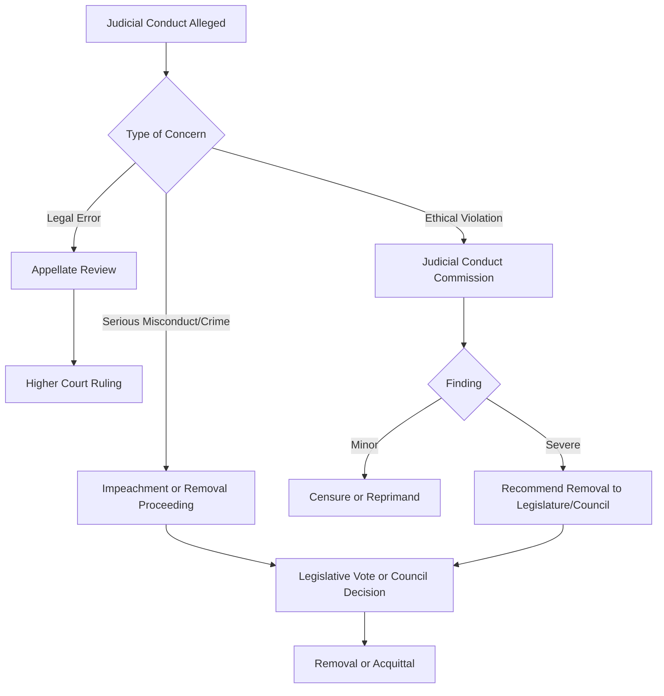

## Judicial Independence and Accountability

### Conceptual Overview

Judicial independence and accountability represent two normatively desirable but structurally opposed values in the design of judicial institutions. **Judicial independence** refers to the capacity of judges to decide cases according to law and conscience, free from improper influence by other government branches, private interests, public opinion, or litigants. **Judicial accountability** refers to mechanisms that ensure judges exercise their power responsibly, ethically, and within the bounds of their authority. Every judicial system must calibrate a balance between these two values: too much independence risks an unaccountable judiciary insulated from democratic correction; too much accountability risks a judiciary vulnerable to political capture, threatening the rule of law.

This tension is often described in comparative judicial politics as the **independence-accountability trade-off**, and most institutional design choices (tenure length, appointment method, removal procedures, disciplinary bodies) represent points along this spectrum rather than pure commitments to either value.

### Dimensions of Judicial Independence

**Institutional (Structural) Independence**

This concerns the judiciary's position relative to the other branches of government.

- Separation of powers safeguards
- Security of tenure (life tenure, fixed long terms, or terms until a mandatory retirement age)
- Protection from salary reduction (financial independence)
- Judicial councils or commissions insulating appointment/discipline from direct executive or legislative control
- Budgetary autonomy for court administration

**Decisional (Substantive) Independence**

This concerns the individual judge's freedom to decide the specific case before them.

- Freedom from instructions by superiors, government officials, or party organs on how to rule
- Freedom from *ex parte* influence by litigants
- Immunity from civil liability for judicial acts performed in good faith
- Random case assignment to prevent "judge shopping" or targeted case allocation

**Internal Independence**

Often overlooked, this concerns independence *within* the judicial hierarchy itself — a trial judge's freedom from informal pressure by appellate judges, chief justices, or court presidents who may control case assignments, promotions, or performance evaluations.

**Behavioral/Personal Independence**

The psychological and professional disposition of a judge to resist external pressure, distinct from formal-legal guarantees. [Inference] Comparative scholars often argue that formal guarantees are necessary but not sufficient conditions for actual independent behavior, since a judiciary can possess strong formal protections yet still exhibit deferential behavior toward powerful actors due to informal norms or career incentives.

### Mechanisms of Judicial Accountability

**Accountability can be classified along two axes: the actor to whom judges answer, and the mechanism through which answerability occurs.**

| Type | Description | Example Mechanisms |
| --- | --- | --- |
| Legal/Vertical accountability | Appellate review correcting legal errors | Appeals, cassation, certiorari |
| Professional accountability | Peer/institutional oversight of conduct and competence | Judicial conduct commissions, disciplinary boards |
| Political accountability | Answerability to elected branches or the electorate | Impeachment, confirmation hearings, judicial elections, reappointment votes |
| Social/Public accountability | Transparency and public scrutiny | Published opinions, open hearings, investigative journalism, civil society monitoring |
| Administrative accountability | Oversight of caseload management and efficiency | Performance evaluations, court administration audits |

### Institutional Design: Appointment and Removal Systems

**Appointment Methods (Comparative Models)**

- **Executive appointment** — e.g., U.S. federal judges nominated by the President, confirmed by the Senate
- **Judicial councils** — bodies composed largely of judges and legal professionals who select or recommend appointees (common in much of continental Europe and Latin America, e.g., Italy's Consiglio Superiore della Magistratura)
- **Popular election** — direct election of judges, used in many U.S. state court systems
- **Legislative appointment or ratification** — parliamentary election or confirmation of judges, seen in some parliamentary systems
- **Merit-based/hybrid commissions** — nominating commissions that screen candidates before executive selection (a common judicial reform template, sometimes called the "Missouri Plan" in U.S. state contexts)

**Tenure Structures**

- **Life tenure** (e.g., U.S. federal Article III judges) — maximizes independence, minimizes accountability
- **Fixed non-renewable terms** — balances independence with periodic institutional renewal, reduces incentive to curry favor for reappointment
- **Fixed renewable terms** — creates potential accountability pressure since judges seeking reappointment may be incentivized to avoid controversial rulings [Inference: this incentive effect is widely theorized in judicial politics literature but its empirical magnitude varies by country and is contested]
- **Mandatory retirement age** — common compromise mechanism (e.g., many constitutional courts)

**Removal Mechanisms**

- **Impeachment** — legislative removal for misconduct, typically requiring supermajority votes (used for U.S. federal judges)
- **Judicial councils/disciplinary tribunals** — peer-based removal for ethical violations, more common in civil law systems
- **Recall elections** — used in some U.S. states for elected judges
- **Court-packing or jurisdiction-stripping** — indirect political tools that constrain judicial power without formal removal, controversial precisely because they bypass formal accountability channels

### The Independence-Accountability Trade-off in Practice

**Key Points**

- No system maximizes both values simultaneously; institutional design choices are trade-offs, not solutions
- Comparative constitutional design literature (e.g., work associated with scholars like Tom Ginsburg and J. Mark Ramseyer) frames judicial design choices as reflecting the interests of political actors at the time of constitutional drafting — an "insurance model" where uncertain future electoral prospects lead drafters to entrench independent courts as insurance against losing power
- Judicial elections (used in many U.S. states) maximize direct accountability but raise concerns about campaign financing influencing rulings and populist pressure on criminal sentencing
- Life tenure (U.S. federal model) maximizes independence but raises concerns about generational entrenchment and lack of responsiveness to evolving social consensus
- Judicial councils are often designed as a middle path, aiming to depoliticize appointments while maintaining professional accountability, though [Inference] critics argue councils can become self-perpetuating oligarchies of the legal profession, insulated from any external check

### Comparative Case Illustrations

**United States**

Federal judges enjoy life tenure "during good behavior" (Article III) and salary protection, representing one of the strongest constitutional independence guarantees globally. Accountability operates almost exclusively through impeachment (rare and difficult) and the appellate hierarchy. State judiciaries vary widely, with many states using partisan or nonpartisan judicial elections, creating a much stronger accountability pull.

**United Kingdom**

Historically relied on parliamentary sovereignty and a strong norm of judicial independence protected by convention rather than a codified constitution. The Constitutional Reform Act 2005 formalized structural independence by creating the Judicial Appointments Commission and separating the Supreme Court from the House of Lords, reducing the historic fusion of judicial and legislative roles held by the Lord Chancellor.

**Germany**

The Federal Constitutional Court (*Bundesverfassungsgericht*) judges serve single 12-year non-renewable terms, elected by supermajorities in the Bundestag and Bundesrat. This design is often cited as a model balancing independence (non-renewable terms remove reappointment incentives) with democratic legitimacy (legislative election requiring cross-party consensus).

**Poland and Hungary (Judicial Reform Controversies)**

[Unverified — evolving political situation] Since the mid-2010s, both countries have been central cases in debates over "judicial capture," where ruling parties altered judicial council composition, retirement ages, and disciplinary chambers in ways critics argue subordinated courts to executive control, while governments characterized the changes as necessary democratic accountability reforms. These cases are frequently cited in EU rule-of-law litigation and scholarship on democratic backsliding.

**Latin America**

Many countries (e.g., Argentina, Bolivia) have experimented with judicial councils and, in some cases, judicial elections for high courts, reflecting efforts to increase legitimacy and reduce executive dominance over appointments, though scholars note mixed results in practice regarding actual independence outcomes.

### Theoretical Frameworks

**Principal-Agent Theory**

Views judges as agents whose behavior political principals (legislatures, executives) attempt to constrain through institutional design, since principals cannot perfectly monitor judicial decisions and must rely on ex ante structural controls (appointment) and ex post controls (removal, budget, jurisdiction).

**Strategic Judicial Behavior / Attitudinal Models**

Debates whether judges decide cases based on sincere legal or policy preferences (attitudinal model) or strategically anticipate reactions from other branches and the public (strategic model), which has direct implications for how much *de facto* independence formal guarantees actually produce.

**Insurance Theory of Judicial Review**

Associated with comparative constitutional scholarship, this theory posits that political actors drafting constitutions under electoral uncertainty create strong, independent courts as insurance against future loss of power — a rational-choice explanation for why authoritarian-adjacent or dominant parties sometimes still create genuinely independent courts.

### Measuring Judicial Independence

Comparative political scientists use various indices and proxies:

- **De jure independence** — measured from constitutional/statutory text (tenure length, removal thresholds, appointment procedures)
- **De facto independence** — measured through case outcome patterns, e.g., how often courts rule against the government, judicial turnover rates correlated with political transitions, or expert perception surveys
- Prominent indices include the **World Bank's judicial independence indicators**, the **V-Dem (Varieties of Democracy) judicial constraints on the executive index**, and country expert surveys used in comparative judicial politics research

$$\text{De facto independence} \neq \text{De jure independence}$$

[Inference] The gap between formal (de jure) guarantees and actual (de facto) independent behavior is one of the most consistently emphasized findings in comparative judicial politics, since constitutions with strong textual protections can coexist with highly deferential courts under authoritarian or hybrid regimes.

### Diagram: Independence-Accountability Spectrum (svg_diagram)

<svg xmlns="http://www.w3.org/2000/svg" viewBox="0 0 760 220">
<text x="380" y="25" text-anchor="middle" font-size="16" font-weight="bold" fill="#1a1a1a">Independence-Accountability Spectrum (svg_diagram)</text>
<line x1="60" y1="120" x2="700" y2="120" stroke="#333" stroke-width="3" />
<polygon points="700,120 690,114 690,126" fill="#333" />
<polygon points="60,120 70,114 70,126" fill="#333" />
<text x="60" y="150" text-anchor="middle" font-size="13" fill="#1a1a1a">Maximum</text>
<text x="60" y="165" text-anchor="middle" font-size="13" fill="#1a1a1a">Independence</text>
<text x="700" y="150" text-anchor="middle" font-size="13" fill="#1a1a1a">Maximum</text>
<text x="700" y="165" text-anchor="middle" font-size="13" fill="#1a1a1a">Accountability</text>
<circle cx="150" cy="120" r="7" fill="#2b6cb0" />
<text x="150" y="95" text-anchor="middle" font-size="12" fill="#2b6cb0">US Federal</text>
<text x="150" y="110" text-anchor="middle" font-size="12" fill="#2b6cb0">Life Tenure</text>
<circle cx="320" cy="120" r="7" fill="#2f855a" />
<text x="320" y="95" text-anchor="middle" font-size="12" fill="#2f855a">Germany FCC</text>
<text x="320" y="110" text-anchor="middle" font-size="12" fill="#2f855a">12yr Non-Renewable</text>
<circle cx="480" cy="120" r="7" fill="#b7791f" />
<text x="480" y="95" text-anchor="middle" font-size="12" fill="#b7791f">Judicial Councils</text>
<text x="480" y="110" text-anchor="middle" font-size="12" fill="#b7791f">Mixed Terms</text>
<circle cx="620" cy="120" r="7" fill="#c53030" />
<text x="620" y="95" text-anchor="middle" font-size="12" fill="#c53030">US State</text>
<text x="620" y="110" text-anchor="middle" font-size="12" fill="#c53030">Judicial Elections</text>

<text x="380" y="190" text-anchor="middle" font-size="12" fill="`#4a4a4a`" font-style="italic">Position reflects relative institutional emphasis, not a precise empirical scale</text>

</svg>

### Diagram: Accountability Mechanism Flow

### Illustrative Example: Comparing Two Design Choices

**Example**

Consider two hypothetical constitutional courts:

- **Court A**: Judges appointed for life by the executive alone, immune from any removal short of criminal conviction.
- **Court B**: Judges elected by popular vote for renewable 6-year terms.

Court A maximizes decisional independence — judges need not fear political retaliation — but risks entrenchment of a single political era's ideological preferences for decades and offers minimal responsiveness to public sentiment. Court B maximizes political accountability and legitimacy through direct electoral mandate, but creates strong incentives for judges to align rulings (particularly in criminal sentencing) with majoritarian public opinion to secure reelection, potentially compromising protections for unpopular defendants or minorities. [Inference] This stylized comparison mirrors real empirical findings that elected judges in retention or partisan election systems tend to hand down harsher criminal sentences closer to election dates, though effect sizes vary across studies and jurisdictions.

### Common Critiques and Debates

- **Democratic legitimacy critique**: Unelected judges wielding constitutional review power (especially over legislation) raises the "countermajoritarian difficulty" (a term associated with Alexander Bickel), questioning why unaccountable actors should override elected legislatures
- **Judicial capture critique**: Excessive accountability mechanisms controlled by ruling parties can be weaponized to purge independent judges under the guise of legitimate discipline
- **Transparency vs. deliberative secrecy tension**: Public accountability demands (e.g., disclosure of judicial deliberations) can conflict with the deliberative privacy many systems consider necessary for candid judicial reasoning
- **Global judicial reform movements**: International bodies (UN Basic Principles on the Independence of the Judiciary, Council of Europe's Venice Commission) have promoted standardized independence norms, though critics note these norms sometimes clash with local constitutional traditions

### Related Topics

- Judicial Review and Constitutional Interpretation
- Comparative Models of Constitutional Courts vs. Supreme Courts
- Judicial Selection Methods: Merit Plans, Elections, and Appointments
- Court-Packing and Jurisdiction-Stripping as Political Tools
- The Countermajoritarian Difficulty
- Judicial Behavior: Attitudinal, Strategic, and Legal Models
- Rule of Law Backsliding and Judicial Capture
- International and Regional Human Rights Courts' Independence Standards
- Judicial Councils: Composition and Comparative Effectiveness
- Public Trust in Courts and Judicial Legitimacy Surveys