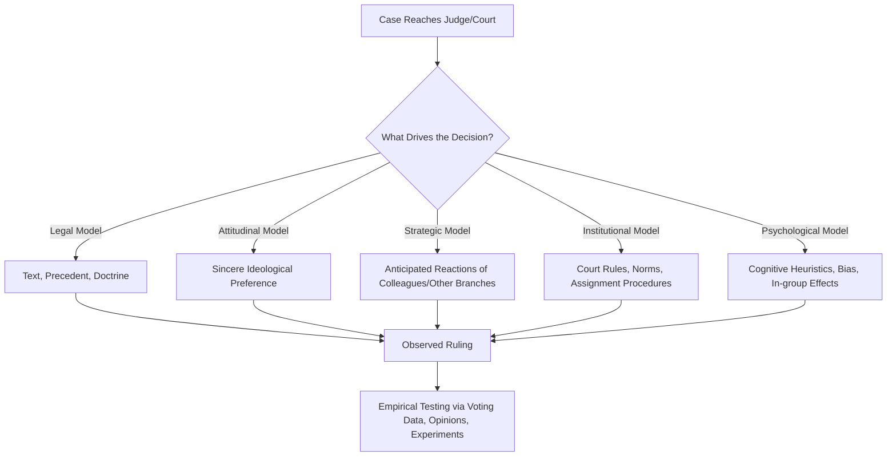

## Judicial Behavior and Decision-Making

### Conceptual Overview

Judicial behavior and decision-making is the subfield of judicial politics concerned with explaining *why judges rule the way they do*. Rather than treating judicial rulings as mechanical applications of law to facts, this field asks what mix of legal doctrine, personal ideology, institutional constraints, and strategic calculation actually drives outcomes. It draws heavily on political science methodology (quantitative modeling, game theory) alongside legal theory, making it one of the most methodologically diverse areas of judicial politics.

Three broad theoretical traditions dominate the field: the **legal model**, the **attitudinal model**, and the **strategic model**, with several extensions and hybrids layered on top (institutional, historical-institutionalist, and psychological approaches).

### The Legal Model

**Core Claim**

Judges decide cases based on the law: constitutional text, statutes, precedent (*stare decisis*), and accepted legal reasoning. Ideology and personal preference play no meaningful role; legal materials constrain and largely determine outcomes.

**Key Points**

- Dominant self-understanding within the legal profession and judiciary itself
- Emphasizes doctrinal consistency, textualism, originalism, purposivism, and other interpretive methodologies as genuine constraints
- Precedent operates through *stare decisis*, requiring courts to follow prior rulings absent strong justification for departure
- Criticized by political scientists as under-specified — legal materials are often ambiguous or contradictory, allowing judges considerable interpretive latitude, especially in "hard cases"

[Inference] Most contemporary judicial politics scholars view the pure legal model as descriptively incomplete on its own, though it remains influential as a normative account of how judges *should* decide and as a partial explanation for a substantial share of case outcomes (particularly in unanimous or low-salience cases).

### The Attitudinal Model

**Core Claim**

Judges decide cases according to their sincere personal policy preferences and ideological attitudes, particularly at courts of last resort where precedent is more malleable and judges are typically insulated from electoral or hierarchical discipline.

**Key Points**

- Most closely associated with the work of Jeffrey Segal and Harold Spaeth, whose studies of the U.S. Supreme Court found strong correlations between justices' ideological scores and their voting patterns, especially in civil liberties and economic regulation cases
- Measured empirically using tools like the **Segal-Cover scores** (derived from newspaper editorials' characterizations of nominees at confirmation) and **Martin-Quinn scores** (dynamic ideal-point estimates derived from voting records)
- Strongest explanatory power at apex courts with discretionary dockets (e.g., the U.S. Supreme Court's certiorari process), where justices can select ideologically salient cases
- Weaker explanatory power at lower courts, where precedent, panel effects, and reversal risk constrain sincere voting

$$P(\text{vote}_{ij} = \text{liberal}) = f(\theta_i, \, c_j)$$

Where $\theta_i$ represents a justice's ideal point and $c_j$ represents the case's ideological location — a standard spatial voting formalization used in attitudinal and strategic models alike.

### The Strategic (Rational Choice) Model

**Core Claim**

Judges are sincere policy-seekers but act strategically, anticipating the reactions of other justices/judges on the panel, other branches of government, and potential noncompliance, adjusting their voting and opinion-writing behavior to maximize policy influence given these constraints.

**Key Points**

- Associated with scholars such as Lee Epstein and Jack Knight, drawing on rational choice and game-theoretic frameworks
- Explains phenomena the pure attitudinal model struggles with: why justices sometimes vote against sincere preferences to avoid an unfavorable majority opinion, why opinion assignment and bargaining over language occurs, and why courts sometimes avoid confrontations with other branches (the "strategic avoidance" literature)
- Separation-of-powers models extend this to interbranch relations: courts anticipate whether Congress/the executive could override or fail to implement a ruling, shaping how aggressively courts rule against government preferences
- Panel effects in multi-judge courts (e.g., U.S. Courts of Appeals three-judge panels) are a key strategic phenomenon — a judge's vote is influenced by the ideological composition of the panel, not just their own preferences [Inference: the panel-effects literature, notably associated with Cass Sunstein and colleagues, finds this pattern robust across many studies, though effect sizes and mechanisms remain debated]

### Institutional and New Institutionalist Approaches

**Core Claim**

Judicial behavior is shaped not just by individual preferences but by the rules, norms, and institutional structures within which judges operate — court culture, collegiality norms, opinion-assignment practices, and the historical development of judicial institutions.

**Key Points**

- Emphasizes how formal rules (agenda-setting power of chief justices, opinion assignment authority, certiorari/cert pool procedures) structure outcomes independent of ideology
- Considers how informal norms (collegiality, reciprocity, consensus-seeking) shape bargaining and coalition formation on multi-member courts
- Historical-institutionalist variants examine how judicial institutions evolve path-dependently, and how court structure at founding shapes long-run behavior patterns

### Psychological and Behavioral Approaches

**Core Claim**

Judges, like other decision-makers, are subject to cognitive biases, heuristics, and psychological processes that shape decision-making in ways that pure preference- or strategy-based models do not capture.

**Key Points**

- **Cognitive heuristics**: anchoring effects in sentencing, availability heuristic in risk assessment
- **In-group/out-group dynamics**: shared characteristics between judge and litigant (race, gender, professional background) shown in some studies to correlate with case outcomes
- **Motivated reasoning**: judges may unconsciously interpret ambiguous legal materials in ways that align with prior beliefs while sincerely believing they are following neutral legal reasoning
- **Extra-legal factors**: empirical studies have examined correlations between judicial decisions and factors such as time since the judge's last meal (the widely cited but contested "hungry judge" studies), local public opinion, and media coverage salience [Unverified/contested — several of the more dramatic behavioral-economics findings on judicial decision-making, particularly the original hungry-judge parole study, have faced significant methodological criticism and replication concerns in subsequent literature]

### Comparative Judicial Behavior

Most of the classic quantitative behavioral literature developed around the U.S. Supreme Court due to data availability, but comparative scholars have extended these models:

- **European constitutional courts**: Studies of the German Federal Constitutional Court and others generally find weaker attitudinal effects than the U.S. Supreme Court, attributed to consensus-based appointment procedures (supermajority legislative election) and stronger civil law doctrinal traditions constraining discretion
- **Common law vs. civil law systems**: Common law systems' reliance on binding precedent and adversarial argumentation is theorized to create different behavioral dynamics than civil law systems' code-based, more inquisitorial traditions [Inference: this is a widely held theoretical distinction in comparative judicial politics, though empirical convergence in judicial behavior across legal families is an active area of debate]
- **Authoritarian and hybrid regime courts**: Judicial behavior in less independent judiciaries is often modeled through concepts like "tactical" or "strategic" deference, where judges rule against the government only in low-salience cases to preserve institutional legitimacy while avoiding retaliation ("split-the-difference" strategies)

### Diagram: Theoretical Models of Judicial Decision-Making

### Empirical Methods in the Field

| Method | Application |
| --- | --- |
| Ideal-point estimation | Scaling judges on a liberal-conservative dimension from voting records (e.g., Martin-Quinn scores) |
| Content analysis of opinions | Measuring doctrinal language, citation networks, tone |
| Panel composition studies | Testing whether ideological mix of multi-judge panels affects individual votes |
| Survey/interview methods | Direct elicitation of judicial attitudes and decision processes (limited by judges' reluctance to discuss reasoning candidly) |
| Natural experiments | Random panel assignment in appellate courts used to isolate ideological/panel effects from case-selection effects |
| Text-as-data/NLP approaches | Increasingly used to analyze large corpora of opinions for ideological signal, topic modeling, and citation patterns |

### Illustrative Example

**Example**

A U.S. Court of Appeals case on affirmative action reaches a three-judge panel. Under the **legal model**, the outcome should track binding Supreme Court precedent regardless of panel composition. Under the **attitudinal model**, we would expect a panel of three Democratic-appointed judges to rule differently than a panel of three Republican-appointed judges. Under the **strategic model**, we might additionally expect a single Republican-appointed judge sitting with two Democratic-appointed judges to moderate their position (or vice versa) due to the panel-effects dynamic, since dissenting alone carries less influence than joining a persuadable majority. Empirical panel-composition studies have used exactly this kind of variation (which panel a case happens to be randomly assigned to) to test between these competing predictions. [Inference] The consistent empirical finding that panel composition affects individual judicial votes beyond the individual judge's own ideology is one of the more robust findings supporting a hybrid strategic-attitudinal account over the pure attitudinal model.

### Critiques and Ongoing Debates

- **Measurement validity critique**: Ideal-point scores derived purely from votes risk circularity — inferring ideology from the very behavior the model claims to explain
- **Case selection/docket effects**: Since apex courts often choose their own docket (certiorari), attitudinal effects may be partly an artifact of which cases judges choose to hear, not just how they decide them
- **Generalizability critique**: Much of the classic literature is U.S. Supreme Court-centric; applicability to lower courts, non-common-law systems, and courts with mandatory (non-discretionary) dockets is more limited and requires separate theoretical adaptation
- **Integration debate**: Contemporary scholarship increasingly favors integrated models combining legal, attitudinal, strategic, and institutional variables rather than treating them as mutually exclusive competing theories

### Related Topics

- Judicial Independence and Accountability
- Ideal-Point Estimation and Measuring Judicial Ideology
- Precedent, Stare Decisis, and Doctrinal Change
- Panel Effects and Collegial Decision-Making on Multi-Member Courts
- Certiorari and Agenda-Setting on Apex Courts
- Comparative Constitutional Courts: Behavior Across Legal Families
- Separation-of-Powers Models of Judicial-Legislative Interaction
- Judicial Confirmation Politics and Nominee Ideology Measurement
- Legal Realism and Critical Legal Studies
- Text-as-Data Methods in Judicial Politics Research