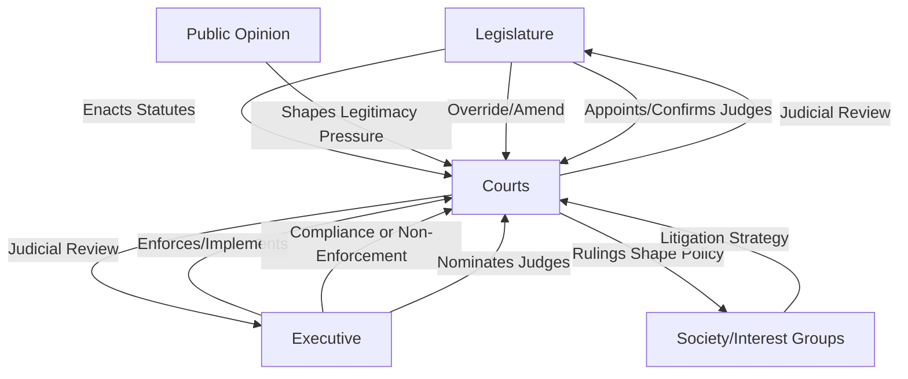

## Courts as Political Actors

### Conceptual Overview

The framing of courts as political actors challenges the traditional formalist view of judiciaries as purely neutral, apolitical bodies mechanically applying law to facts. Judicial politics as a discipline begins from the premise that courts, particularly high courts, are participants in the policymaking process — they allocate values authoritatively, shape the boundaries of other institutions' power, and are themselves embedded in and shaped by political dynamics (appointment politics, public opinion, interbranch conflict). This does not mean courts are simply legislatures in robes; rather, it means courts occupy a distinctive institutional position that is simultaneously legal and political.

### Why Courts Are Political: Core Arguments

**Key Points**

- **Authoritative value allocation**: Courts, like legislatures and executives, make binding decisions that allocate scarce resources, rights, and burdens among competing societal interests — the classic political science definition of "politics" (Easton's "authoritative allocation of values") applies directly to adjudication
- **Discretion in interpretation**: Legal texts (constitutions, statutes) are frequently indeterminate or silent on the specific facts before a court, requiring judges to exercise interpretive choices that inevitably reflect values, priorities, and worldview
- **Constitutional review as policymaking**: Where courts possess the power of judicial review, they can strike down legislation and executive action, effectively exercising a veto power over democratically elected branches — a form of policymaking authority functionally similar to a legislative chamber
- **Embeddedness in the political system**: Judicial appointments are typically made through overtly political processes (executive nomination, legislative confirmation, or partisan election), embedding courts within the broader political-institutional environment from the outset

[Inference] The "courts as political actors" framing does not deny that legal reasoning genuinely constrains judicial behavior; rather, it argues that legal constraint and political behavior are not mutually exclusive, and that treating courts as apolitical obscures analytically important dynamics that judicial politics scholarship seeks to explain.

### The Judicialization of Politics

**Definition**

Judicialization refers to the expanding role of courts and judicial procedures in resolving what were previously understood as purely political or policy questions — a phenomenon widely observed across democracies since the mid-20th century.

**Manifestations**

- **Judicialization of policy-making**: Courts increasingly adjudicate major social policy questions (healthcare, abortion, same-sex marriage, electoral redistricting) that were once resolved primarily through legislative deliberation
- **Judicialization of "mega-politics"**: Courts adjudicating core regime-defining questions — the legality of elections, executive emergency powers, transitions between political regimes, and even the legitimacy of the constitutional order itself (a term closely associated with comparative constitutional scholar Ran Hirschl)
- **Judicialization of everyday administration**: Expansion of judicial review over routine bureaucratic and administrative decisions
- **Litigation as political strategy**: Interest groups, opposition parties, and social movements increasingly pursue litigation as a primary strategy for achieving policy goals unattainable through the legislative process ("cause lawyering" and "legal mobilization")

[Inference] Hirschl's influential account of judicialization argues that political elites sometimes voluntarily empower courts strategically — to insulate contested policy questions from ongoing political majorities, to signal credible commitment to investors and international actors, or to offload politically costly decisions onto an institution perceived as neutral — though this remains one interpretation among several competing explanations in the literature.

### Courts and the Other Branches: Interbranch Dynamics

**Separation-of-Powers Games**

Courts operate within a strategic environment shaped by their relationship to the legislature and executive. Formal models (often game-theoretic, sometimes called "separation-of-powers" or SOP models) analyze how courts anticipate potential legislative overrides, non-compliance, or court-curbing measures when deciding cases, moderating rulings to avoid triggering retaliation.

**Mechanisms of Interbranch Conflict**

- **Legislative overrides**: Statutory reinterpretation or new legislation to reverse the practical effect of a court's statutory (non-constitutional) ruling
- **Constitutional amendment**: A more difficult but decisive tool to override constitutional rulings
- **Court-curbing**: Jurisdiction-stripping, altering court size ("court-packing"), budget threats, or procedural changes designed to constrain judicial power without directly overturning a specific ruling
- **Non-compliance/non-enforcement**: Executive branches may simply decline to enforce rulings vigorously, particularly against politically costly compliance
- **Appointment politics as long-run influence**: Rather than confronting sitting courts, political actors often prefer to reshape courts gradually through the appointment process, an especially salient strategy where vacancies arise with some regularity

### Courts and Public Opinion

**Key Points**

- Courts' authority ultimately rests on **diffuse institutional legitimacy** — public willingness to comply with and accept rulings even when substantively disagreeing — rather than direct electoral accountability
- Empirical literature on U.S. Supreme Court behavior has explored whether justices are responsive to shifts in aggregate public opinion (sometimes termed the "counter-majoritarian" puzzle in reverse — do courts follow public opinion rather than resist it?), with mixed and contested findings [Inference: studies using measures like aggregate "public mood" indices have found some correlation between opinion shifts and Court outputs over time, though the causal mechanism — direct responsiveness, shared exposure to the same social trends, or appointment-driven membership change — remains actively debated]
- The **legitimacy-based compliance model** argues courts maintain authority by cultivating a perception of legal, principled decision-making distinct from raw political preference, making legitimacy itself a resource courts must strategically protect through careful case selection and opinion-writing
- Backlash dynamics: highly salient, socially divisive rulings (e.g., on contested moral or social issues) can generate significant political backlash, mobilizing opposition and potentially constraining future judicial assertiveness — a dynamic examined extensively in the U.S. context around rulings like *Roe v. Wade*

### Comparative Perspectives on Courts as Political Actors

**Constitutional Courts vs. Ordinary Supreme Courts**

Many civil law democracies (Germany, France, Italy, South Korea, South Africa) established specialized constitutional courts, separate from the ordinary judicial hierarchy, explicitly empowered with abstract and concrete review over legislation. This institutional design reflects an intentional political choice to centralize the politically consequential function of constitutional review in a distinct body, often with appointment procedures designed for cross-partisan legitimacy (e.g., supermajority legislative election).

**Courts in Authoritarian and Hybrid Regimes**

[Inference] A substantial body of comparative scholarship examines why authoritarian regimes sometimes maintain functioning courts with meaningful (if bounded) independence — explanations include using courts to control lower-level bureaucratic agents, provide a credible commitment mechanism for economic actors, manage social conflict at low political cost, and maintain a veneer of legal-rational legitimacy, provided courts avoid directly challenging core regime interests.

**Third-Wave Democratization and Judicial Empowerment**

The global expansion of judicial review and constitutional courts during the late 20th-century "third wave" of democratization is frequently linked to broader constitutional design trends emphasizing rights protection and checks on majoritarian excess following transitions from authoritarian rule.

### Diagram: Courts Within the Political System

### Illustrative Example

**Example**

When a national court strikes down a legislature's redistricting map as an unconstitutional partisan gerrymander, several "courts as political actor" dynamics are simultaneously visible: the court exercises **authoritative value allocation** (determining which communities gain or lose electoral influence), **judicializes** a traditionally legislative-administrative question (electoral map-drawing), triggers potential **interbranch conflict** (legislature may redraw maps minimally to comply, or pursue court-curbing legislation), and stakes its own **institutional legitimacy** on public and political acceptance of the ruling. The case also illustrates litigation as political strategy, since redistricting challenges are frequently initiated by political parties or advocacy organizations using courts as an alternative venue to legislative bargaining.

### Critiques and Ongoing Debates

- **Formalist pushback**: Traditional legal scholars caution against overstating courts' political character, arguing that even discretionary interpretation remains meaningfully constrained by legal craft, professional norms, and doctrinal consistency in ways that distinguish it from ordinary political bargaining
- **Democratic theory critique**: If courts are political actors making policy, the countermajoritarian difficulty intensifies — why should unelected actors exercise this kind of authority at all, and what distinguishes their legitimacy from that of elected policymakers?
- **Judicialization skepticism**: Some scholars argue judicialization can hollow out legislative deliberation and civic capacity for democratic self-governance by displacing contested political questions into a technocratic-legal register
- **Selection effects in case studies**: Much of the "courts as political actors" literature draws on high-salience, high-profile cases; critics note that the vast majority of judicial business (routine appeals, statutory interpretation in low-salience areas) may exhibit far less political character, cautioning against overgeneralizing from landmark rulings

### Related Topics

- Judicial Independence and Accountability
- Judicial Behavior and Decision-Making
- Judicial Review and Constitutional Interpretation
- The Judicialization of Mega-Politics (Hirschl)
- Separation-of-Powers Models of Interbranch Bargaining
- Court-Curbing and Court-Packing as Political Strategy
- Legal Mobilization and Cause Lawyering
- Constitutional Courts vs. Supreme Courts: Comparative Design
- Public Opinion, Diffuse Support, and Judicial Legitimacy
- Courts in Authoritarian and Hybrid Regimes