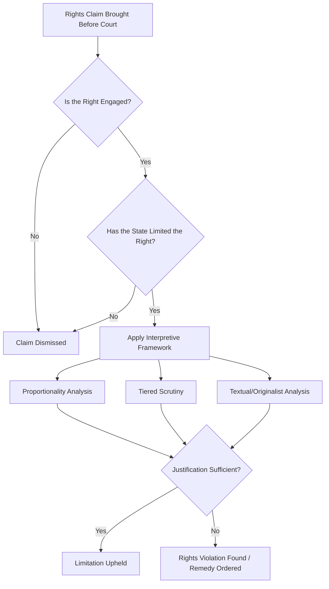

## Civil Liberties and Rights Adjudication

### Conceptual Overview

Civil liberties and rights adjudication refers to the judicial process of interpreting, applying, and enforcing constitutionally or statutorily protected individual rights and freedoms. This is one of the highest-salience arenas of judicial politics because it directly implicates the countermajoritarian role of courts — the power to protect individual and minority rights against majoritarian legislative or executive action. Rights adjudication sits at the intersection of constitutional design, judicial behavior, and political legitimacy, since courts must balance textual and doctrinal fidelity against evolving social values, all while operating within a politically contested environment.

### Categories of Rights Commonly Adjudicated

**Civil and Political Liberties**

- Freedom of speech and expression
- Freedom of religion and conscience
- Freedom of assembly and association
- Due process (procedural and substantive)
- Equal protection / non-discrimination
- Privacy rights
- Voting and electoral participation rights

**Criminal Procedure Rights**

- Protection against unreasonable search and seizure
- Right to counsel
- Protection against self-incrimination
- Right to a fair and public trial
- Protection against cruel and unusual punishment

**Socioeconomic and "Second/Third Generation" Rights**

- Right to education, health, housing (increasingly justiciable in some constitutional systems, e.g., South Africa, India, Colombia)
- Environmental rights
- Group and collective rights (indigenous rights, minority language rights)

[Inference] The justiciability of socioeconomic rights remains a contested area in comparative constitutional law — some systems treat these as directly enforceable, others as non-justiciable "directive principles" guiding policy without judicial enforcement mechanisms, reflecting differing theories about the proper institutional role of courts relative to elected branches in resource allocation.

### Interpretive Approaches to Rights Adjudication

**Originalism/Textualism**

Interprets rights provisions according to their original public meaning at the time of enactment, or their plain textual meaning, constraining judicial discretion by anchoring interpretation to historically fixed content.

**Living Constitutionalism / Evolutive Interpretation**

Interprets rights provisions as capable of evolving meaning over time in light of changing social values, technology, and understanding — associated with doctrines like the "living tree" approach in Canadian constitutional law or the European Court of Human Rights' "living instrument" doctrine.

**Purposivism**

Interprets rights provisions according to their underlying purpose or function within the broader constitutional scheme, often used as a middle path between strict textualism and open-ended evolutive interpretation.

**Proportionality Analysis**

A structured, multi-stage analytical framework widely used outside the United States (Canada, Germany, South Africa, the European Court of Human Rights, and many others) for adjudicating rights limitations, typically involving:

1. Legitimate purpose test — does the government's justification serve a valid objective?
2. Suitability/rational connection — does the measure actually advance that objective?
3. Necessity/minimal impairment — is there a less restrictive alternative achieving the same goal?
4. Balancing (proportionality *stricto sensu*) — do the benefits of the measure outweigh the harm to the right?

**Tiered Scrutiny (U.S. Model)**

The U.S. Supreme Court applies a tiered framework rather than unified proportionality analysis:

- **Strict scrutiny** — applied to fundamental rights and suspect classifications (race); requires a compelling government interest and narrow tailoring
- **Intermediate scrutiny** — applied to quasi-suspect classifications (e.g., historically, sex-based classifications); requires an important government interest substantially related to the classification
- **Rational basis review** — applied to most other classifications; requires only a legitimate government interest rationally related to the classification

$$\text{Strict Scrutiny: Compelling Interest} + \text{Narrow Tailoring}$$

### Comparative Institutional Models for Rights Enforcement

| Model | Description | Example |
| --- | --- | --- |
| Diffuse/decentralized judicial review | Any ordinary court can review constitutionality of laws | United States |
| Centralized constitutional court review | Only a specialized constitutional court can rule on constitutionality | Germany, South Korea, France |
| Regional/supranational human rights courts | Cross-border courts adjudicating rights claims against member states | European Court of Human Rights, Inter-American Court of Human Rights |
| Hybrid/mixed review | Combination of ordinary and constitutional court review pathways | India, South Africa |
| Parliamentary rights review (weak-form review) | Courts can flag incompatibility but cannot strike down legislation; parliament retains final word | United Kingdom (Human Rights Act), certain Commonwealth systems |

### Landmark Doctrinal Themes (Illustrative, Not Country-Specific)

**Key Points**

- **Incorporation/application doctrines**: Determining whether national-level bill-of-rights protections apply to sub-national government units (federal-to-state application) or purely to state action versus private conduct (the "state action doctrine" in the U.S. context)
- **Balancing individual rights against collective/security interests**: Recurrent tension in national security, public health emergency, and counterterrorism contexts, where courts must assess deference owed to executive judgments about risk versus rights protection
- **Positive vs. negative rights obligations**: Whether constitutional rights merely restrain state interference (negative rights) or impose affirmative state obligations to provide resources or protections (positive rights) — increasingly significant in health, environmental, and social rights litigation
- **Horizontal application of rights**: Whether constitutional rights protections extend to private relationships (e.g., employer-employee, private discrimination) or apply only against the state (vertical application) — an area of significant comparative divergence, with some systems (Germany, South Africa) recognizing meaningful horizontal effect

### Strategic and Institutional Dimensions

**Interest Group Litigation ("Cause Lawyering")**

Rights adjudication is a primary arena for organized legal mobilization — civil rights organizations, civil liberties groups, and advocacy NGOs pursue strategic litigation campaigns designed to establish favorable precedent incrementally, often through carefully selected test cases.

**Amicus Curiae Participation**

"Friend of the court" briefs filed by non-party interest groups, experts, and government bodies to influence judicial reasoning in high-salience rights cases — a well-documented mechanism through which organized interests seek to shape rights doctrine without being formal litigants.

**Backlash and Counter-Mobilization**

Landmark rights rulings frequently generate political backlash and counter-mobilization by opposing interests, which can translate into legislative override attempts, constitutional amendment campaigns, or sustained political contestation over subsequent appointments — a dynamic extensively studied in the comparative "judicialization" literature.

### Diagram: Rights Adjudication Decision Framework

### Illustrative Example

**Example**

A government enacts a law restricting public assembly during a declared public health emergency, and a civil liberties organization challenges the law as violating freedom of assembly. Under a **proportionality framework**, a court would ask: (1) does public health protection constitute a legitimate objective (almost certainly yes); (2) does the assembly restriction rationally advance that objective; (3) was there a less restrictive alternative (e.g., capacity limits rather than outright prohibition) that would achieve comparable protection; and (4) do the public health benefits outweigh the harm to assembly rights, considering the restriction's duration and scope. Under the **U.S. tiered scrutiny model**, the court would instead classify assembly as a fundamental right triggering strict scrutiny, requiring the government to show a compelling interest and narrow tailoring — analytically similar in structure to proportionality's necessity and balancing stages but operationalized through a distinct doctrinal vocabulary. [Inference] Comparative constitutional scholars have noted that proportionality analysis and U.S.-style tiered scrutiny often converge in practical outcomes despite differing doctrinal architecture, though this convergence thesis remains debated, particularly regarding how much genuine deference each framework affords to legislative judgment.

### Critiques and Ongoing Debates

- **Judicial supremacy critique**: Concentrating final interpretive authority over contested rights questions in unelected courts raises persistent countermajoritarian concerns, particularly acute in rights areas touching deeply contested moral and social questions
- **Proportionality critique**: Critics argue proportionality analysis grants courts extremely broad, judge-empowering discretion under the guise of a structured methodology, since the final "balancing" stage often lacks a determinate metric
- **Positive rights skepticism**: Critics of enforceable socioeconomic rights argue courts lack institutional competence (expertise, information, democratic accountability) to make complex resource-allocation decisions properly belonging to elected branches and budgetary processes
- **Global rights convergence vs. local constitutionalism tension**: The increasing cross-citation of foreign and international human rights jurisprudence by domestic courts (sometimes called "judicial dialogue" or "constitutional borrowing") is celebrated by some as promoting rights-protective best practices and criticized by others as undermining domestic constitutional sovereignty and interpretive legitimacy

### Related Topics

- Judicial Independence and Accountability
- Judicial Behavior and Decision-Making
- Courts as Political Actors
- Proportionality Analysis in Comparative Constitutional Law
- Tiered Scrutiny and Equal Protection Doctrine
- Regional Human Rights Courts (ECtHR, IACtHR, African Court)
- Socioeconomic Rights and Justiciability Debates
- Legal Mobilization, Cause Lawyering, and Amicus Curiae Practice
- Horizontal vs. Vertical Application of Constitutional Rights
- Judicial Dialogue and Comparative Constitutional Borrowing