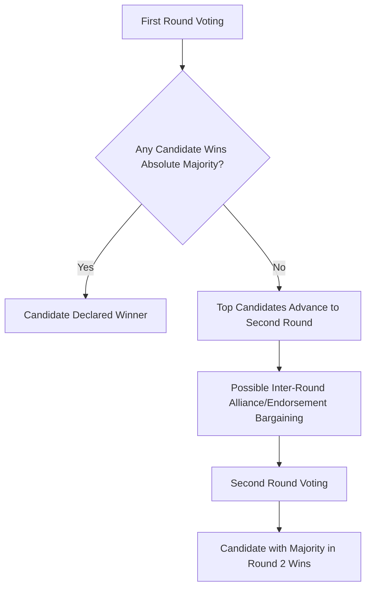

## Majoritarian and Plurality Systems

### Conceptual Overview

Majoritarian and plurality electoral systems are a family of electoral formulas in which the candidate or party receiving the most votes in a given constituency wins the seat, typically without any requirement for proportional translation of vote share into seat share. These systems are among the oldest and most widely used electoral arrangements globally, contrasting sharply with proportional representation (PR) systems. They are generally associated with single-member districts, strong constituency-representative linkages, and tendencies toward two-party or dominant-party competition, though important variations exist.

### Core Distinction: Plurality vs. Majority

**Plurality ("First-Past-the-Post")**

The candidate with the most votes wins, regardless of whether they secure an absolute majority (more than 50%) of votes cast. This is the simplest and most widely used majoritarian-family system.

**Majority Requirement**

Some systems require a winning candidate to secure more than 50% of the vote, necessitating additional mechanisms (runoff rounds, ranked preferences) when no candidate meets that threshold in the first round.

### Major System Types

**First-Past-the-Post (FPTP) / Single-Member Plurality (SMP)**

- Single-member districts; voters cast one vote for one candidate
- Winner is whoever receives the most votes, even without a majority
- Used in the United Kingdom, United States (for most offices), Canada, India, and many current and former Commonwealth countries
- **Key Points**: simplest ballot and counting procedure; tends to produce strong single-party governments even from a minority of the national vote share (mechanical effect of the electoral system); tends toward two-party systems per **Duverger's Law**, the widely cited proposition that plurality rule in single-member districts favors two-party competition

**Two-Round System (Runoff / TRS)**

- If no candidate achieves an absolute majority in the first round, a second round is held (often restricted to the top two candidates, or all candidates exceeding a minimum threshold)
- Used widely in French legislative and presidential elections, and in many presidential systems globally
- **Key Points**: guarantees a majority winner in the final round; permits more candidates to compete in the first round without "spoiler" concerns to the same degree as FPTP, since voters can shift support strategically in the second round; can encourage strategic alliance-building between rounds ("desistement" tactics in France, where eliminated candidates' parties endorse a remaining candidate)

**Alternative Vote (AV) / Instant-Runoff Voting (IRV) / Ranked-Choice Voting (RCV)**

- Voters rank candidates in order of preference; if no candidate secures a majority of first preferences, the lowest-ranked candidate is eliminated and their votes redistributed according to next preferences, repeating until a majority winner emerges
- Used in Australian House of Representatives elections, and increasingly adopted in some U.S. states and municipalities under the "ranked-choice voting" label
- **Key Points**: achieves a majority winner without requiring a separate election round; reduces (though does not eliminate) "spoiler effect" concerns associated with FPTP, since voters can rank a minor-party candidate first without "wasting" their vote if that candidate is eliminated

**Block Vote and Party Block Vote**

- Multi-member district variants where voters cast as many votes as there are seats (block vote), or a single vote for a party's full slate of candidates (party block vote), with top vote-getters or the winning party's full slate taking all seats
- Tends to produce highly disproportional outcomes, often allowing a single party or bloc to sweep all seats in a multi-member district with less than a majority of the vote

### Mechanical and Psychological Effects

**Mechanical Effect**

The direct, arithmetic translation of votes into seats under a given electoral formula — plurality/majoritarian systems mechanically convert vote pluralities into full seat wins at the district level, producing disproportionality between national vote share and national seat share, typically amplifying the seat share of the largest party (a "winner's bonus" or "manufactured majority" effect).

**Psychological Effect**

The strategic behavioral adaptation of voters and parties in anticipation of the mechanical effect — voters in plurality systems tend to avoid "wasting" votes on candidates perceived as unlikely to win, gravitating toward the top two competitive candidates/parties, reinforcing two-party dynamics independent of the mechanical effect alone.

$$\text{Seat Share} \neq \text{Vote Share (typically Seat Share} > \text{Vote Share for the largest party)}$$

### Duverger's Law and Its Extensions

**Core Proposition**

Associated with French political scientist Maurice Duverger, this proposition holds that plurality rule in single-member districts tends to produce two-party systems, through the combined mechanical and psychological effects described above, while proportional representation tends to favor multipartyism.

**Key Points**

- Duverger's Law operates most reliably at the **district level**; national-level two-party outcomes require additional conditions, such as nationally aligned district-level competition (sometimes discussed via **Duverger's Hypothesis**, the weaker, more contested claim about national-level effects, versus Duverger's Law's stronger district-level claim)
- Exceptions and complications are well documented: Canada and India, both using FPTP, sustain multiple significant parties nationally due to regionally concentrated party support bases, where different pairs of parties compete as the "top two" in different regions
- [Inference] Comparative electoral systems scholars generally treat Duverger's Law as one of the most robust empirical regularities in the field at the constituency level, while treating national-level party system predictions as considerably more contingent on social cleavage structure, federalism, and party system history

### Comparative Table: Majoritarian System Variants

| System | Districts | Majority Guaranteed? | Ballot Type | Example Countries |
| --- | --- | --- | --- | --- |
| FPTP | Single-member | No | Single choice | UK, US (most offices), India, Canada |
| Two-Round System | Single-member (typically) | Yes (in final round) | Single choice, repeated | France, many presidential systems |
| Alternative Vote/IRV | Single-member | Yes | Ranked preference | Australia (House), some US jurisdictions |
| Block Vote | Multi-member | No | Multiple choice | Some Commonwealth local elections |
| Party Block Vote | Multi-member | No | Single party choice | Singapore (GRC system), some others |

### Consequences for Representation and Governance

**Key Points**

- **Government formation**: Majoritarian systems tend to manufacture single-party parliamentary majorities even from a plurality (not majority) of the national vote, facilitating decisive, accountable single-party government — a frequently cited normative advantage
- **Constituency representation**: Single-member districts under FPTP and similar systems create a clear, identifiable local representative accountable to a specific geographic constituency, strengthening the personal vote and constituency service linkage
- **Disproportionality and "wasted votes"**: Votes cast for losing candidates in each district do not translate into any representation, and votes beyond what a winning candidate needs are similarly "surplus" — both categories are often termed "wasted votes," a central critique from proportional representation advocates
- **Minority and small-party underrepresentation**: Parties with geographically dispersed (rather than concentrated) support bases are systematically disadvantaged, potentially receiving a national vote share far exceeding their seat share [Inference: this effect is empirically well-documented across FPTP systems, e.g., UK third-party vote-to-seat ratios, though the magnitude varies by the specific geographic distribution of a party's support in a given election]
- **Gerrymandering vulnerability**: Because outcomes depend heavily on district boundaries, majoritarian single-member systems are particularly vulnerable to manipulation of district lines for partisan advantage, a persistent institutional design and litigation concern especially prominent in the U.S. context

### Diagram: Two-Round System Process Flow

### Illustrative Example

**Example**

In a single-member district under FPTP with four candidates receiving 35%, 30%, 20%, and 15% of the vote respectively, the candidate with 35% wins the seat despite 65% of voters having preferred someone else — illustrating the plurality (not majority) threshold and the "wasted vote" phenomenon central to critiques of the system. Under a **two-round system**, since no candidate reached 50%, the top two candidates (35% and 30%) would advance to a runoff, where voters who originally supported the eliminated 20% and 15% candidates would cast a fresh vote, likely producing a legitimately majoritarian winner in the second round. Under **instant-runoff/AV**, the same first-preference distribution would trigger sequential elimination of the lowest-placed candidates, with their voters' subsequent preferences redistributed until one candidate crosses 50% — achieving a similar majoritarian legitimacy outcome to the two-round system but within a single voting event.

### Critiques and Ongoing Debates

- **Proportionality critique**: The central and most persistent criticism from PR advocates is the frequent large gap between national vote share and national seat share, sometimes producing "manufactured majorities" or even outcomes where the party with the most votes nationally fails to win the most seats
- **Duverger's Law contestation**: While robust at the district level, scholars continue to debate the conditions under which national multipartyism persists despite plurality rule (federalism, regionally concentrated cleavages, weak party nationalization)
- **Strategic voting and "wasted vote" psychology**: Critics argue FPTP forces voters into strategic rather than sincere voting to avoid wasting their vote on non-competitive candidates, distorting genuine preference expression — a concern AV/IRV is specifically designed to mitigate
- **Governability vs. representativeness trade-off**: Defenders emphasize majoritarian systems' tendency to produce stable, accountable single-party governments capable of enacting coherent policy programs, while critics argue this comes at an unacceptable cost to descriptive and substantive representational fairness

### Related Topics

- Proportional Representation Systems
- Mixed Electoral Systems (MMP, Parallel Systems)
- Duverger's Law and Party System Formation
- Gerrymandering and Redistricting
- Strategic Voting and the Wasted Vote Phenomenon
- District Magnitude and Its Effects on Proportionality
- Electoral System Design and Constitutional Choice
- Party System Nationalization in Federal Systems
- Comparative Effective Number of Parties (ENP) Measures
- Ranked-Choice Voting Reform Movements