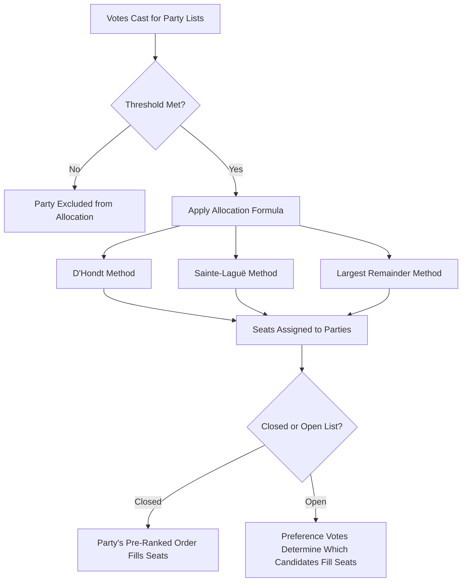

## Proportional Representation Systems

### Conceptual Overview

Proportional representation (PR) refers to a family of electoral systems designed to translate a party's share of the popular vote into a roughly corresponding share of legislative seats. PR systems stand in direct contrast to majoritarian/plurality systems, prioritizing proportionality and inclusive representation of diverse political viewpoints over the manufactured single-party majorities and strong constituency linkages characteristic of plurality systems. PR is the most widely used electoral system family among established democracies globally, particularly in continental Europe and Latin America.

### Core Mechanics

PR systems require **multi-member districts** (or a single nationwide district) since proportionality is mathematically impossible to achieve within single-member constituencies — a district electing only one representative cannot proportionally represent more than one party's supporters. The larger the **district magnitude** (number of seats per district), the greater the potential proportionality, with the theoretical maximum achieved under nationwide, single-district PR.

$$\text{Proportionality} \propto \text{District Magnitude}$$

### Major PR System Types

**List Proportional Representation**

Parties present ranked lists of candidates in multi-member districts; voters vote for a party (or, in some variants, for both a party and preferred candidates); seats are allocated to parties in proportion to their vote share, then filled from each party's list.

- **Closed-list PR**: Voters vote only for the party; the party's internal ranking determines exactly which candidates from the list receive seats. Voters have no influence over which individuals from a winning list are elected.
- **Open-list PR**: Voters can indicate preferences for individual candidates within a party's list, influencing which specific candidates are elected, even altering the party's original ranking based on preference votes received.
- **Flexible-list PR**: A hybrid where the party's ranking is used as a default but can be overridden if individual candidates receive sufficient preference votes to exceed a threshold.

**Single Transferable Vote (STV)**

Voters rank candidates (across party lines, not just within a single party list) in multi-member districts; a quota (typically the **Droop quota**) determines the number of votes needed for election; surplus votes from candidates exceeding the quota, and votes from eliminated lowest-placed candidates, are transferred according to voters' subsequent preferences until all seats are filled.

$$\text{Droop Quota} = \left\lfloor \frac{\text{Total Valid Votes}}{\text{Seats} + 1} \right\rfloor + 1$$

Used prominently in the Republic of Ireland, Malta, and the Australian Senate. STV is sometimes classified separately from list-PR since it combines candidate-centered ranked-choice voting with proportional outcomes, offering voters both cross-party choice and intra-party candidate choice simultaneously.

**Mixed-Member Proportional (MMP)**

A compensatory hybrid system where voters typically cast two votes — one for a local single-member district candidate (plurality-elected) and one for a party list — with list seats allocated to correct any disproportionality arising from the district-level results, so the overall seat distribution closely tracks the party-list vote share. Used in Germany and New Zealand as prominent examples.

### Seat Allocation Formulas

PR systems require a mathematical formula to convert vote totals into seat allocations, since exact proportionality is rarely achievable given the discrete, whole-number nature of seats.

**Highest Averages Methods**

- **D'Hondt Method**: Divides each party's vote total successively by 1, 2, 3, 4... and allocates seats sequentially to the highest resulting quotient; tends to modestly favor larger parties relative to pure proportionality; widely used across Europe and Latin America
- **Sainte-Laguë Method**: Divides by 1, 3, 5, 7... (odd numbers); produces outcomes closer to pure proportionality than D'Hondt, with less systematic bias toward larger parties; used in Scandinavian countries, New Zealand's list-seat allocation

$$\text{D'Hondt quotient} = \frac{V}{s+1}, \quad s = 0, 1, 2, \dots$$

$$\text{Sainte-Laguë quotient} = \frac{V}{2s+1}, \quad s = 0, 1, 2, \dots$$

**Largest Remainder Methods**

Calculate a quota (e.g., Hare quota = total votes ÷ seats), allocate seats based on how many full quotas each party's vote total contains, then allocate remaining seats to parties with the largest leftover ("remainder") vote fractions, in descending order.

$$\text{Hare Quota} = \frac{\text{Total Valid Votes}}{\text{Total Seats}}$$

### Electoral Thresholds

Many PR systems impose a minimum vote-share threshold a party must clear to receive any seats, intended to limit excessive party system fragmentation and prevent extremist or fringe parties from gaining a legislative foothold with minimal support.

**Key Points**

- Germany: 5% nationwide threshold (or winning at least 3 district seats directly)
- Sweden: 4% nationwide threshold
- Israel: uses one of the lowest thresholds among established democracies (raised over time, currently a low single-digit percentage), historically associated with high party system fragmentation
- Turkey: historically used one of the highest thresholds among democracies (originally 10%, later reformed), designed explicitly to limit small and regional party representation
- [Inference] Threshold design reflects an explicit institutional trade-off between inclusiveness (representing smaller parties and minority viewpoints) and governability (avoiding excessive fragmentation that complicates coalition formation), and threshold levels are frequently the subject of deliberate political engineering by dominant parties

### Comparative Table: PR System Variants

| System | Ballot Structure | Candidate Choice | Typical District Magnitude | Example Countries |
| --- | --- | --- | --- | --- |
| Closed-list PR | Party only | None | Medium-large | Spain, South Africa (national) |
| Open-list PR | Party + candidate preference | High | Medium-large | Brazil, Finland |
| STV | Ranked, cross-party | Very high | Small-medium (typically 3-5) | Ireland, Malta |
| MMP | Two votes: district + party | Moderate (district tier) | Mixed | Germany, New Zealand |

### Effects on Party Systems and Governance

**Key Points**

- **Multipartyism**: PR systems' proportionality (limited "wasted vote" effect, lower psychological pressure toward strategic voting) tends to sustain a greater number of viable parties compared to plurality systems, consistent with the PR-side prediction of Duverger's Law
- **Coalition governments**: Because PR rarely manufactures single-party majorities, most PR-based parliamentary systems operate through multi-party coalition governments, requiring post-election bargaining to form governing majorities
- **Minority and small-party representation**: PR systems generally provide markedly better proportional representation for smaller parties, regionally dispersed minorities, and ideologically distinct movements compared to majoritarian systems
- **Gender and diversity representation**: Comparative research consistently finds PR list systems, particularly closed-list systems combined with gender quota requirements, are associated with higher rates of women's descriptive representation than single-member plurality systems [Inference: this is one of the more robust comparative findings in electoral systems literature, generally attributed to party list-balancing incentives under PR versus the more localized, incumbency-driven candidate selection dynamics of single-member systems]
- **Government formation complexity and stability concerns**: Critics note PR-based coalition systems can experience prolonged post-election government formation negotiations and, in fragmented cases, coalition instability — though comparative evidence on overall cabinet duration/stability is more mixed than commonly assumed

### Diagram: List-PR Seat Allocation Flow

### Illustrative Example

**Example**

In a 10-seat district using D'Hondt allocation, suppose Party A receives 40,000 votes, Party B receives 30,000, and Party C receives 20,000 (with a smaller Party D receiving 10,000 falling below relevance after early rounds). The D'Hondt method divides each party's total by 1, 2, 3... sequentially, awarding each seat to whichever quotient is currently highest across all parties, cycling until all 10 seats are allocated. Party A's largest quotients (40,000; 20,000; 13,333...) will tend to win more seats than Party C's (20,000; 10,000; 6,666...), producing a seat distribution that is broadly proportional to vote share but with a modest mechanical advantage accruing to the largest party — illustrating D'Hondt's characteristic mild large-party bias relative to Sainte-Laguë, which would produce a marginally more proportional outcome for the same vote distribution due to its different divisor sequence.

### Critiques and Ongoing Debates

- **Governability critique**: Critics, particularly from majoritarian-system traditions, argue PR's tendency toward coalition government produces less decisive, less accountable governance, with policy outcomes shaped by post-election bargaining rather than a clear electoral mandate
- **Accountability and the "who to blame" problem**: In multi-party coalition systems, voters may find it harder to hold any single party clearly accountable for government performance compared to majoritarian systems' clearer government-opposition distinction
- **Closed-list critique**: Critics argue closed-list PR weakens the individual accountability link between representatives and voters, since candidates' election depends primarily on party leadership placement rather than direct voter choice — a concern open-list and STV variants are specifically designed to address
- **Extremist party representation concern**: Lower thresholds, while more inclusive, can enable fringe or extremist parties to gain parliamentary footholds that would be effectively excluded under plurality systems, an ongoing design tension reflected in threshold-setting debates
- **Fragmentation-governability trade-off**: The central normative debate in comparative electoral system design remains how to calibrate proportionality (inclusiveness, fair representation) against governability (stable, decisive government formation), with different democracies making markedly different institutional choices reflecting distinct historical and political priorities

### Related Topics

- Majoritarian and Plurality Systems
- Mixed Electoral Systems (MMP, Parallel Systems)
- Duverger's Law and Party System Formation
- District Magnitude and Its Effects on Proportionality
- Electoral Thresholds and Party System Fragmentation
- Coalition Formation and Government Bargaining Theory
- Gender Quotas and Descriptive Representation
- Comparative Effective Number of Parties (ENP) Measures
- Party List Selection and Candidate Nomination Processes
- Electoral System Reform Movements and Design Trade-offs