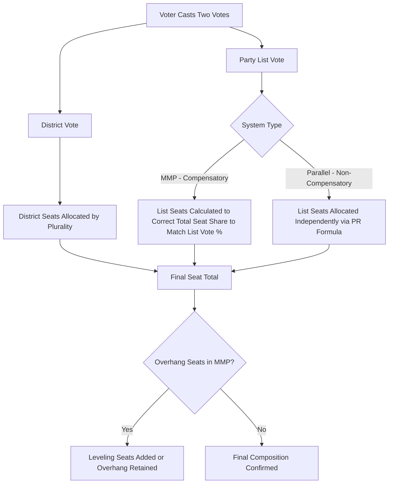

## Mixed and Hybrid Electoral Systems

### Conceptual Overview

Mixed and hybrid electoral systems combine elements of majoritarian/plurality systems and proportional representation within a single electoral framework, typically by using two (or more) distinct tiers of seat allocation simultaneously. These systems emerged largely from a deliberate design aspiration to capture the perceived advantages of both families — the constituency accountability and geographic representation of single-member plurality systems, alongside the proportionality and inclusiveness of PR — while mitigating each family's respective weaknesses. Mixed systems have become increasingly prevalent since the 1990s, particularly among new and reforming democracies.

### The Fundamental Distinction: Compensatory vs. Non-Compensatory (Parallel) Systems

**Compensatory (Linked) Mixed Systems**

The list-tier ("PR tier") seat allocation is calculated to correct or "compensate for" disproportionality generated by the district-tier results, such that the overall final seat distribution closely tracks the party-list vote share nationally. The two tiers are mathematically linked.

**Non-Compensatory (Parallel/Unlinked) Mixed Systems**

The district-tier and list-tier seats are allocated independently of one another, with no correction mechanism; the final overall seat distribution reflects the combined but unlinked results of both tiers, typically producing a moderately disproportional outcome rather than the near-proportionality of compensatory systems.

[Inference] This compensatory/non-compensatory distinction is generally regarded by comparative electoral systems scholars as more analytically important for predicting a mixed system's proportionality and party-system effects than the more commonly cited surface-level distinction between "MMP" and "parallel" labels, since the compensation mechanism is what actually determines whether the system behaves more like PR or more like a majoritarian system in practice.

### Major Mixed System Types

**Mixed-Member Proportional (MMP)**

- Compensatory design
- Voters typically cast two votes: one for a district candidate (plurality-elected), one for a party list
- List-tier seats are allocated to bring each party's total seat share into close alignment with its party-list vote share, effectively "topping up" parties underrepresented by district results
- Overall system behaves proportionally overall despite the majoritarian district tier
- **Key Points**: Germany (the paradigmatic case, originating the system after WWII), New Zealand (adopted via 1993 referendum, replacing FPTP), various regional/subnational applications (e.g., Scotland, Wales)
- Can produce "overhang seats" when a party wins more district seats than its proportional vote share would justify, requiring additional compensatory mechanisms (e.g., Germany's "leveling seats"/*Ausgleichsmandate* to restore proportionality across all parties)

**Parallel (Segmented/Superposition) Systems**

- Non-compensatory design
- Voters typically cast two votes (or one, depending on variant): one for a district candidate, one for a party list, calculated entirely independently
- Overall proportionality falls between pure majoritarian and pure PR outcomes, generally closer to majoritarian given the lack of correction
- **Key Points**: Japan (House of Representatives, adopted 1994 reforms), Russia, South Korea (historically, prior to partial MMP-style reform), various post-Soviet and newly democratizing states adopted parallel systems in the 1990s

**Mixed-Member Majoritarian (MMM)**

A term sometimes used interchangeably with "parallel" to emphasize the majoritarian-leaning overall outcome of non-compensatory mixed designs, distinguishing them clearly from MMP's proportional outcome despite superficially similar ballot structures.

**Additional Member System (AMS)**

A term used in the United Kingdom (particularly for devolved legislatures in Scotland and Wales) that is functionally a variant of MMP, though sometimes implemented with a smaller list-tier proportion than Germany's system, producing a system that is compensatory but only partially corrects disproportionality given the relatively small list-seat share.

### Comparative Table: Mixed System Variants

| System | Compensation Mechanism | Overall Proportionality | Example Countries |
| --- | --- | --- | --- |
| MMP | Full compensation via list-tier top-up | High (close to PR) | Germany, New Zealand |
| Parallel/MMM | None — tiers calculated independently | Moderate (majoritarian-leaning) | Japan, Russia |
| AMS | Partial compensation (smaller list-tier share) | Moderate-high | Scotland, Wales |
| Mixed Single Vote | Single vote determines both tiers via formula | Varies by design | Various historical/regional applications |

### The Overhang Seat Problem (MMP-Specific)

**Definition**

An overhang seat (*Überhangmandat* in the original German context) occurs when a party wins more district-tier seats through direct plurality victories than its national party-list vote share would proportionally entitle it to under the compensatory formula.

**Resolution Approaches**

- **Simple retention**: The party keeps the "extra" overhang seats, temporarily enlarging the legislature beyond its nominal size, with other parties not receiving additional compensation (Germany's original approach, criticized as undermining full proportionality)
- **Leveling/balance seats**: Additional list seats are awarded to other parties to restore overall proportionality across the entire chamber, at the cost of further enlarging the legislature (Germany's post-2013 reform approach, following a constitutional court ruling requiring closer proportionality)
- [Inference] The overhang seat problem is widely cited in comparative electoral systems literature as illustrating the genuine mathematical complexity of maintaining full proportionality when a majoritarian district tier is combined with a compensatory list tier, particularly as party support becomes more geographically concentrated or as the number of competitive parties increases

### Rationale for Adopting Mixed Systems

**Key Points**

- **"Best of both worlds" design logic**: Mixed systems are frequently adopted explicitly to combine constituency-level accountability (a locally identifiable representative) with proportional, inclusive representation of the national party vote
- **Democratization and post-authoritarian transitions**: Many mixed systems were adopted during the "third wave" of democratization and post-Soviet transitions as a compromise between reform advocates favoring proportionality/inclusiveness and status-quo actors favoring retained majoritarian elements
- **Political bargaining outcomes**: Mixed system adoption often reflects a negotiated compromise between political actors with competing interests during constitutional design moments — dominant parties favoring majoritarian elements to preserve their advantage, smaller parties favoring proportional elements to secure representation
- **Coalition-proofing for dominant parties**: In some cases, ruling parties confident of strong district-level performance have favored parallel (non-compensatory) systems specifically because they preserve more of the majoritarian mechanical advantage than a fully compensatory MMP system would allow [Inference: this strategic-adoption account is a common explanation in the comparative electoral system design literature, particularly regarding cases like Japan's 1994 reform and various post-Soviet parallel system adoptions, though the precise causal weight of strategic calculation versus genuine reform ideals varies by case and remains debated among country specialists]

### Diagram: MMP vs. Parallel System Seat Calculation

### Illustrative Example

**Example**

Consider a legislature with 300 total seats: 150 elected via single-member district plurality, 150 via party-list PR, and a party wins 40% of the national list vote. Under **MMP**, that party's overall seat total (combining both tiers) would be calculated to approximate 40% of the full 300-seat chamber (~120 seats), with list-tier seats "topping up" however many district seats it already won to reach that proportional target. Under a **parallel system**, that same party would receive approximately 40% of just the 150 list seats (~60 seats) *in addition to* however many district seats it separately won on a plurality basis — with no correction linking the two totals — likely producing a considerably higher or lower overall seat share than its 40% national list-vote support, depending on how well the party performed in district races specifically. This example illustrates why MMP is classified as behaving proportionally overall while parallel systems retain a meaningfully majoritarian character despite superficially similar dual-vote ballot structures.

### Critiques and Ongoing Debates

- **Complexity critique**: Mixed systems, particularly MMP with overhang/leveling mechanisms, can be considerably more difficult for voters to understand than single-formula systems, raising concerns about transparency and voter comprehension of how their votes translate into outcomes
- **"Two-vote" strategic complications**: Some mixed systems create opportunities for sophisticated strategic voting or party strategy (e.g., "decoy list" tactics, where a dominant party encourages supporters to help allied smaller parties gain list-tier representation) that can complicate the system's intended proportionality
- **Legislature size instability (MMP)**: Compensatory leveling mechanisms can cause unpredictable and sometimes substantial expansion of legislative chamber size following close or geographically skewed elections, a practical governance concern raised prominently in recent German electoral reform debates
- **Genuine hybrid vs. "worst of both worlds" debate**: Defenders argue mixed systems successfully combine accountability and proportionality; critics argue certain designs (particularly poorly calibrated parallel systems) can instead combine the disadvantages of both families — retaining majoritarian disproportionality while adding PR-style complexity — without fully capturing either family's core benefits

### Related Topics

- Majoritarian and Plurality Systems
- Proportional Representation Systems
- Duverger's Law and Party System Formation
- Overhang Seats and Legislature Size Instability
- Electoral System Reform and Constitutional Design Moments
- District Magnitude and Its Effects on Proportionality
- Strategic Voting Under Mixed Ballot Structures
- Comparative Effective Number of Parties (ENP) Measures
- Post-Authoritarian and Post-Soviet Electoral System Adoption
- Electoral Thresholds and Party System Fragmentation