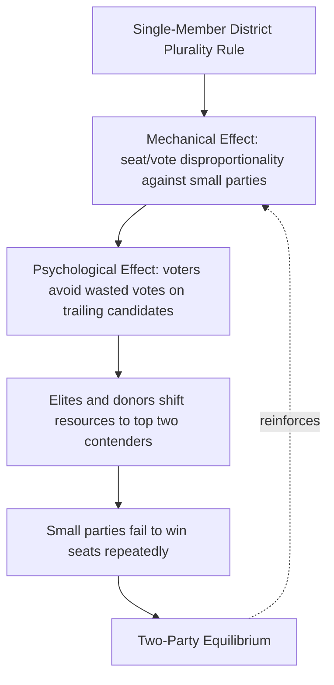

## Duverger's Law and Electoral Effects

### Definition and Core Statement

Duverger's Law is a principle in political science holding that plurality-rule elections conducted in single-member districts tend to produce and sustain two-party systems, while proportional representation (PR) systems tend to produce and sustain multi-party systems. The law is named after French sociologist Maurice Duverger, who formulated it in his 1951 work *Political Parties: Their Organization and Activity in the Modern State*.

Duverger proposed two distinct mechanisms behind this relationship:

- **Mechanical effect**: Plurality/majoritarian electoral formulas translate votes into seats in a way that systematically under-represents smaller parties and over-represents the largest party, since only one candidate can win per district.
- **Psychological effect**: Voters and elites, anticipating the mechanical effect, avoid "wasting" votes on parties unlikely to win, and instead gravitate toward one of the two leading contenders. Similarly, potential donors, activists, and candidates gravitate toward viable parties.

### Theoretical Mechanism

**Key Points**

- The mechanical effect operates on the translation of votes into seats within a given electoral formula.
- The psychological effect operates on the behavior of voters, candidates, and party strategists who act strategically in anticipation of the mechanical effect.
- The two effects are mutually reinforcing: mechanical disadvantage produces psychological abandonment, which further shrinks the mechanical viability of small parties, forming a self-reinforcing cycle.

The causal chain can be represented as follows.

### Electoral Formula and District Magnitude

Duverger's Law is closely tied to two structural variables:

1. **Electoral formula**: The rule by which votes are converted into seats (e.g., plurality/first-past-the-post, majority-runoff, PR list systems, mixed-member systems).
2. **District magnitude ($M$)**: The number of seats allocated per electoral district. In single-member district (SMD) plurality systems, $M = 1$.

As a general comparative-politics heuristic, the effective number of parties tends to rise with district magnitude, since larger $M$ allows smaller parties to clear the effective representation threshold. This relationship is formalized in the "Seat Product Model" developed by Rein Taagepera and Matthew Shugart, which relates the effective number of seat-winning parties ($N_S$) to the seat product ($MS$, where $S$ is assembly size):

$$N_S \approx (MS)^{1/4}$$

This is a widely cited empirical regularity in electoral systems research rather than a strict deterministic law; actual party-system outcomes vary with social cleavages, federalism, and party strategy. [Inference]

### Duverger's Hypothesis vs. Duverger's Law

Duverger himself distinguished between a stronger and a weaker claim, and later scholars formalized this distinction:

- **Duverger's Law** (strong claim): Plurality-rule, single-member-district elections favor a two-party system at the district (constituency) level.
- **Duverger's Hypothesis** (weaker claim): PR systems and two-ballot majority systems favor multipartism, though this relationship is treated as more probabilistic and less deterministic than the Law.

Duverger's Law is best understood as operating most reliably at the **constituency level**, not necessarily the **national level**. A country can have national multipartism even under SMD plurality rules if different regional or ethnic parties dominate different districts (each district still tends toward local two-candidate competition, but the identity of the "top two" varies by region). India and Canada are frequently cited as cases of national multipartism coexisting with plurality rule, explained by this district-level versus national-level distinction. [Inference — the explanatory adequacy of this account for specific cases is debated among specialists]

### Strategic (Sincere vs. Insincere) Voting

**Example**

Consider a single-member district plurality election with three candidates: A (30% expected support), B (35% expected support), and C (35% expected support), where A and B represent similar ideological positions and C represents a distinct position.

- A **sincere voter** supporting A votes for A regardless of A's chances of winning.
- A **strategic (insincere) voter** supporting A, recognizing A cannot beat B or C, instead votes for B (the closer ideological substitute with a real chance of winning) to prevent C from winning.

If enough A-supporters behave strategically, A's vote share collapses over successive elections, and the district converges toward a two-candidate contest between B and C. This voter-level behavior is the microfoundation of the psychological effect.

### Cross-National Comparison of Electoral Systems

| Electoral System | Typical District Magnitude | Duverger's Predicted Outcome | Illustrative Cases |
| --- | --- | --- | --- |
| Single-Member Plurality (FPTP) | $M = 1$ | Two-party system | United Kingdom, United States, Canada |
| Two-Round (Majority-Runoff) | $M = 1$ | Multipartism (moderated by runoff coordination) | France (legislative elections) |
| List Proportional Representation | $M > 1$, often large | Multi-party system | Netherlands, Israel, Sweden |
| Mixed-Member Proportional (MMP) | Mixed | Multipartism, moderated by compensatory tier | Germany, New Zealand |
| Single Transferable Vote (STV) | $M > 1$ | Multipartism | Ireland, Malta |

### Mechanisms Producing Deviations from the Law

Several factors are commonly cited in the literature as producing outcomes that deviate from the Duvergerian expectation:

- **Federalism and regional cleavages**: Regionally concentrated parties can win SMD seats without national-level viability (e.g., Bloc Québécois in Canada, Scottish National Party in the UK).
- **Weak party system institutionalization**: In new or unstable democracies, elites and voters may not yet have converged on strategic coordination equilibria, producing persistent multipartism even under plurality rules.
- **Social cleavage structure**: Duverger's Law is a *permissive* condition, not a *sufficient* one; underlying social cleavages (ethnic, linguistic, religious, class) supply the potential parties that the electoral system then filters. This synthesis is associated with the work of William Riker and later cleavage theorists such as Lipset and Rokkan.
- **Candidate-centered and personalist politics**: Where personal vote-seeking dominates over party-label voting, coordination around exactly two parties may be weaker.
- **Presidential coattail effects**: In presidential systems, concurrent presidential elections (which are themselves majoritarian, large-magnitude races) can pull legislative party systems toward two-bloc coordination — a mechanism examined by Shugart and Carey under the concept of electoral cycle effects.

### Contrast with PR Systems: The Multiplication Mechanism

**Key Points**

- PR systems lower the "effective threshold" for winning a seat, reducing the psychological incentive for strategic desertion.
- The Sainte-Laguë, D'Hondt, and Largest Remainder methods used in PR allocation differ in their favorability to small versus large parties, but all are structurally more permissive to small-party representation than SMD plurality.
- Legal thresholds (e.g., Germany's 5% national threshold) function as an artificial constraint reintroducing some Duvergerian-style consolidation pressure into otherwise permissive PR systems.

The effective threshold ($T$) for a party to win representation under PR in a district of magnitude $M$ can be approximated by:

$$T \approx \frac{75\%}{M + 1}$$

This is a widely used rule-of-thumb formula (associated with Rein Taagepera) rather than an exact law, since actual thresholds depend on the specific allocation formula and the distribution of vote shares among competitors. [Inference]

### Mixed and Deviant Cases

- **Two-round (runoff) systems**: Duverger predicted these favor multipartism because voters can express sincere first-round preferences knowing a second round allows strategic consolidation. France's National Assembly elections illustrate this, though a two-bloc dynamic frequently still emerges at the runoff stage.
- **Mixed-member systems**: Systems combining SMD and PR tiers (e.g., Germany's MMP, Japan's parallel system) produce hybrid incentives — SMD tier candidates face Duvergerian pressure while PR-list tier candidates do not, allowing smaller parties to survive nationally through the list tier even while struggling in constituency races.

### Formal and Rational-Choice Extensions

Later scholars formalized Duverger's insights using game-theoretic and rational-choice frameworks:

- **Gary Cox** (*Making Votes Count*, 1997) generalized Duverger's Law into the "M+1 rule": under sincere strategic coordination, the number of viable candidates or parties in a district tends toward $M + 1$, where $M$ is the district magnitude. Under this generalization, SMD plurality ($M=1$) yields at most 2 viable candidates per district.
- **William Riker** (1982) reviewed cross-national evidence and treated Duverger's Law as one of the few genuine "laws" in political science, while stressing that it requires auxiliary conditions (national-level party coordination, absence of strong federalism) to produce national two-partyism rather than merely district-level two-candidate competition.

### Formal Statement (Cox's M+1 Rule)

$$\text{Viable Candidates} \leq M + 1$$

Where $M$ is district magnitude. Under SMD plurality ($M = 1$), this predicts at most 2 viable candidates per constituency — the formal generalization of Duverger's original two-party claim.

### Diagram: District-Level vs. National-Level Party Systems

<svg xmlns="http://www.w3.org/2000/svg" viewBox="0 0 760 380">
<text x="380" y="28" font-size="18" font-weight="bold" text-anchor="middle" fill="#1a1a2e">District vs. National Party Systems Under Plurality Rule (svg_diagram)</text>
<rect x="30" y="60" width="330" height="140" rx="8" fill="#eef3fb" stroke="#3a5a99" stroke-width="1.5" />
<text x="195" y="85" font-size="14" font-weight="bold" text-anchor="middle" fill="#1a1a2e">District A (Region 1)</text>
<text x="195" y="115" font-size="13" text-anchor="middle" fill="#333">Party X vs. Party Y</text>
<text x="195" y="140" font-size="12" text-anchor="middle" fill="#666">(two-candidate competition)</text>
<circle cx="130" cy="170" r="16" fill="#4472c4" />
<text x="130" y="175" font-size="11" text-anchor="middle" fill="#fff">X</text>
<circle cx="260" cy="170" r="16" fill="#c44444" />
<text x="260" y="175" font-size="11" text-anchor="middle" fill="#fff">Y</text>
<rect x="400" y="60" width="330" height="140" rx="8" fill="#f6eefb" stroke="#7a3a99" stroke-width="1.5" />
<text x="565" y="85" font-size="14" font-weight="bold" text-anchor="middle" fill="#1a1a2e">District B (Region 2)</text>
<text x="565" y="115" font-size="13" text-anchor="middle" fill="#333">Party Z vs. Party W</text>
<text x="565" y="140" font-size="12" text-anchor="middle" fill="#666">(two-candidate competition)</text>
<circle cx="500" cy="170" r="16" fill="#7a3a99" />
<text x="500" y="175" font-size="11" text-anchor="middle" fill="#fff">Z</text>
<circle cx="630" cy="170" r="16" fill="#3a9970" />
<text x="630" y="175" font-size="11" text-anchor="middle" fill="#fff">W</text>
<line x1="195" y1="200" x2="380" y2="270" stroke="#888" stroke-width="1.5" />
<line x1="565" y1="200" x2="380" y2="270" stroke="#888" stroke-width="1.5" />
<rect x="230" y="280" width="300" height="80" rx="8" fill="#fff3e0" stroke="#cc8800" stroke-width="1.5" />
<text x="380" y="308" font-size="14" font-weight="bold" text-anchor="middle" fill="#1a1a2e">National Party System</text>
<text x="380" y="332" font-size="12" text-anchor="middle" fill="#333">Four Parties: X, Y, Z, W</text>
<text x="380" y="350" font-size="11" text-anchor="middle" fill="#666">(multipartism despite local Duvergerian dyads)</text>
</svg>

### Empirical Status and Critiques

**Key Points**

- Cross-national statistical studies generally find a robust correlation between SMD plurality rules and lower effective numbers of parties, supporting Duverger's Law as a strong empirical tendency.
- The law is more consistently supported as a description of constituency-level competition than as a deterministic predictor of national party-system size.
- Critics (e.g., certain applications of the "cube law" literature, and case-study scholars of federal or ethnically divided polities) argue the law is probabilistic and conditional on prior levels of party-system coordination, rather than a strict causal law in the sense of physical laws.
- Some scholars reframe Duverger's Law as an equilibrium condition: two-party competition is a stable Nash equilibrium under SMD plurality, but not the only mathematically possible equilibrium, and coordination failures (with resulting persistent multipartism) can occur, especially early in a democracy's institutional history.

### Related Topics

- Effective Number of Parties (Laakso-Taagepera Index)
- Cube Law and Seat-Vote Disproportionality
- Sartori's Typology of Party Systems
- Strategic Voting and Coordination Games
- Mixed-Member Electoral Systems (MMP vs. Parallel Systems)
- Cleavage Theory (Lipset and Rokkan)
- Electoral Thresholds and Their Political Effects
- Gerrymandering and District Magnitude Manipulation
- Comparative Party System Institutionalization