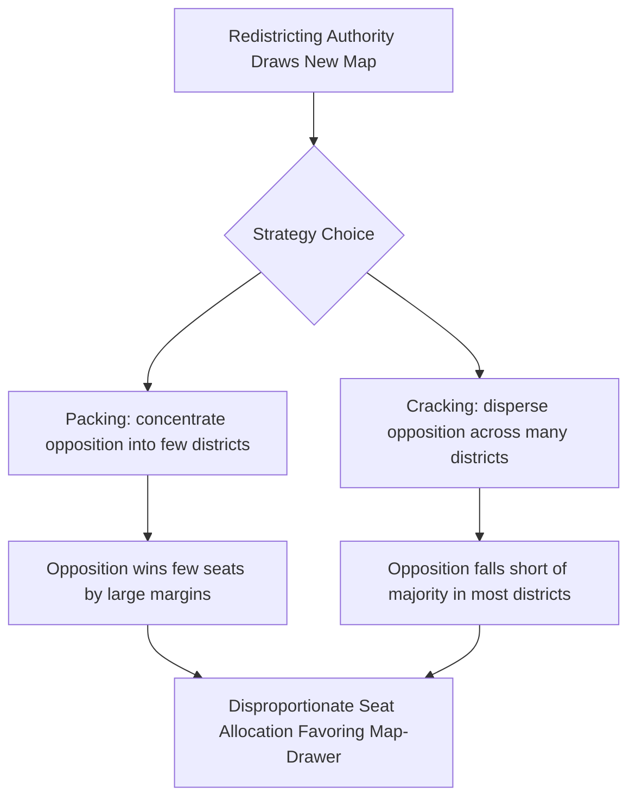

## Redistricting and Gerrymandering

### Definitions

**Redistricting** is the process of redrawing the geographic boundaries of electoral districts, typically conducted after a census to reflect population changes and maintain the constitutional or statutory principle of equal representation.

**Gerrymandering** is the deliberate manipulation of district boundaries to advantage a particular political party, incumbent, or group, at the expense of electoral fairness or proportionality. The term originates from Governor Elbridge Gerry of Massachusetts, whose 1812 redistricting plan produced a district resembling a salamander — hence "Gerry-mander."

### Constitutional and Legal Basis (United States Context)

**Key Points**

- Article I, Section 2 of the U.S. Constitution requires House districts to be reapportioned among states based on the decennial census.
- The principle of "one person, one vote," established in *Baker v. Carr* (1962) and *Reynolds v. Sims* (1964), requires districts within a state to have approximately equal population.
- *Wesberry v. Sanders* (1964) applied the equal-population principle specifically to congressional districts.
- The Voting Rights Act of 1965 (VRA), particularly Section 2, prohibits redistricting plans that dilute the voting power of racial or language minority groups.

### Types of Gerrymandering

1. **Partisan Gerrymandering**: Boundaries drawn to maximize one party's seat share relative to its vote share.
2. **Racial Gerrymandering**: Boundaries drawn to dilute or, conversely, to concentrate the voting power of a racial or ethnic group. This can be either dilutive (illegal under the VRA when discriminatory) or, in some interpretations, used to create "majority-minority" districts to comply with VRA Section 2 requirements.
3. **Incumbent (Bipartisan) Gerrymandering**: Boundaries drawn collusively by both major parties to protect sitting incumbents of both parties, reducing competitive seats overall.
4. **Prison Gerrymandering**: A related malapportionment issue where incarcerated populations are counted at prison locations rather than home communities for redistricting purposes, artificially inflating the population (and thus representational weight) of districts containing prisons.

### Core Techniques: Packing and Cracking

**Key Points**

- **Packing**: Concentrating opposition voters into a small number of districts where they win by overwhelming margins, "wasting" surplus votes that could have been competitive in other districts.
- **Cracking**: Spreading opposition voters thinly across many districts so they fall short of a winning majority in each, diluting their influence everywhere.

Both techniques exploit the same underlying mathematical principle: in single-member district plurality systems, votes above 50%+1 in a won district, and all votes in a lost district, do not translate into additional seats and are therefore "wasted" from the perspective of the disadvantaged party.

### Quantifying Gerrymandering: The Efficiency Gap

One widely used statistical measure for detecting partisan gerrymandering is the **Efficiency Gap (EG)**, developed by Nicholas Stephanopoulos and Eric McGhee. It measures the difference in "wasted votes" between the two parties as a share of total votes cast.

A vote is "wasted" if it is:

- Cast for a losing candidate (any vote for the loser), or
- Cast for a winning candidate in excess of the 50%+1 needed to win.

The Efficiency Gap is calculated as:

$$EG = \frac{(WV_B - WV_A)}{V_{total}}$$

Where $WV_A$ and $WV_B$ are the total wasted votes for Party A and Party B respectively, and $V_{total}$ is the total votes cast across all districts.

**Example**

Consider a simplified state with 5 single-member districts and 1,000 voters per district (5,000 total votes).

| District | Party A Votes | Party B Votes | Winner | A Wasted Votes | B Wasted Votes |
| --- | --- | --- | --- | --- | --- |
| 1 | 900 | 100 | A | 400 (surplus above 501) | 100 (all losing votes) |
| 2 | 900 | 100 | A | 400 | 100 |
| 3 | 400 | 600 | B | 400 | 99 (surplus above 501) |
| 4 | 400 | 600 | B | 400 | 99 |
| 5 | 400 | 600 | B | 400 | 99 |
| **Total** |  |  |  | **2000** | **497** |

$$EG = \frac{2000 - 497}{5000} = \frac{1503}{5000} = 0.3006 \approx 30.1\%$$

A positive value favoring Party B indicates a substantial efficiency gap against Party A, consistent with Party A's votes being "packed" into Districts 1 and 2. Legal and academic literature has proposed (without judicial consensus) thresholds around 7–8% as indicative of a durable partisan advantage warranting scrutiny. [Inference — the specific numeric threshold for legal actionability remains contested and was not adopted as a binding constitutional standard by the U.S. Supreme Court]

### Other Quantitative Metrics

- **Mean-Median Difference**: Compares a party's mean vote share across districts to its median vote share; a large gap suggests skewed district construction.
- **Partisan Bias**: Measures the seat share a party would receive if the statewide vote were exactly 50-50, with deviation from 50% indicating structural advantage.
- **Declination Angle**: A geometric measure comparing the trend lines of a party's winning versus losing districts when ranked by vote margin.
- **Polsby-Popper and Reock Scores**: Geometric compactness measures (not partisan outcome measures) used as proxies for irregular, gerrymandered shapes:

$$PP = \frac{4\pi A}{P^2}$$

Where $A$ is the district's area and $P$ is its perimeter; values closer to 1 indicate a more compact (circle-like) shape, while low values suggest irregular, potentially gerrymandered boundaries.

### Key U.S. Supreme Court Cases

| Case | Year | Holding |
| --- | --- | --- |
| *Baker v. Carr* | 1962 | Redistricting malapportionment claims are justiciable under the Equal Protection Clause. |
| *Reynolds v. Sims* | 1964 | Established the "one person, one vote" principle for state legislative districts. |
| *Shaw v. Reno* | 1993 | Race-based redistricting is subject to strict scrutiny even when intended to benefit minority representation. |
| *Miller v. Johnson* | 1995 | Race cannot be the "predominant factor" in redistricting absent a compelling state interest. |
| *Vieth v. Jubelirer* | 2004 | Plurality found no judicially manageable standard existed at the time for adjudicating partisan gerrymandering claims. |
| *League of United Latin American Citizens v. Perry* | 2006 | Addressed mid-decade redistricting and VRA Section 2 vote-dilution claims. |
| *Rucho v. Common Cause* | 2019 | Held that partisan gerrymandering claims present political questions beyond the reach of federal courts, leaving state courts and state constitutions as the primary venue for such challenges. |

### Redistricting Authority Models

**Key Points**

- **Legislative Control**: The state legislature draws and passes district maps directly, subject to gubernatorial veto in most states. This model carries the highest risk of self-interested partisan gerrymandering.
- **Independent Redistricting Commissions (IRCs)**: Bodies insulated (to varying degrees) from direct legislative control, intended to reduce partisan self-dealing. Examples include California's Citizens Redistricting Commission and Arizona's Independent Redistricting Commission.
- **Advisory/Backup Commissions**: Commissions that propose maps subject to legislative approval or used only if the legislature fails to act.
- **Court-Ordered Redistricting**: Maps imposed by state or federal courts after litigation finds an existing map unconstitutional or in violation of the VRA.

### Comparative Perspective

Gerrymandering as a distinct partisan phenomenon is most pronounced in single-member plurality district systems (see Duverger's Law), because seat allocation depends entirely on winning individual geographic districts rather than proportional vote share. Countries using PR systems with large multi-member districts largely avoid gerrymandering incentives, since seat shares track vote shares more closely regardless of boundary lines. Countries using SMD systems with independent boundary commissions — such as the United Kingdom's Boundary Commissions — are frequently cited as comparative institutional alternatives to legislator-controlled redistricting. [Inference — comparative institutional effectiveness varies by jurisdiction and is subject to ongoing empirical assessment]

### Diagram: Packing vs. Cracking Illustrated

<svg xmlns="http://www.w3.org/2000/svg" viewBox="0 0 780 420">
<text x="390" y="28" font-size="18" font-weight="bold" text-anchor="middle" fill="#1a1a2e">Packing vs. Cracking: District-Level Vote Distribution (svg_diagram)</text>

<text x="195" y="60" font-size="14" font-weight="bold" text-anchor="middle" fill="`#1a1a2e`">Packing Strategy</text>

<rect x="40" y="75" width="120" height="90" fill="`#c44444`" stroke="#333" />

<text x="100" y="125" font-size="12" text-anchor="middle" fill="#fff">D1: 90% Opp.</text>

<rect x="170" y="75" width="120" height="90" fill="`#4472c4`" stroke="#333" />

<text x="230" y="125" font-size="12" text-anchor="middle" fill="#fff">D2: 55% Maj.</text>

<rect x="40" y="175" width="120" height="90" fill="`#4472c4`" stroke="#333" />

<text x="100" y="225" font-size="12" text-anchor="middle" fill="#fff">D3: 55% Maj.</text>

<rect x="170" y="175" width="120" height="90" fill="`#4472c4`" stroke="#333" />

<text x="230" y="225" font-size="12" text-anchor="middle" fill="#fff">D4: 55% Maj.</text>

<text x="165" y="290" font-size="12" text-anchor="middle" fill="#333">Result: Majority wins 3/4 seats</text>

<text x="165" y="308" font-size="12" text-anchor="middle" fill="#333">despite narrow overall margin</text>

<text x="585" y="60" font-size="14" font-weight="bold" text-anchor="middle" fill="`#1a1a2e`">Cracking Strategy</text>

<rect x="460" y="75" width="120" height="90" fill="`#4472c4`" stroke="#333" />

<text x="520" y="125" font-size="12" text-anchor="middle" fill="#fff">D1: 52% Maj.</text>

<rect x="590" y="75" width="120" height="90" fill="`#4472c4`" stroke="#333" />

<text x="650" y="125" font-size="12" text-anchor="middle" fill="#fff">D2: 52% Maj.</text>

<rect x="460" y="175" width="120" height="90" fill="`#4472c4`" stroke="#333" />

<text x="520" y="225" font-size="12" text-anchor="middle" fill="#fff">D3: 52% Maj.</text>

<rect x="590" y="175" width="120" height="90" fill="`#4472c4`" stroke="#333" />

<text x="650" y="225" font-size="12" text-anchor="middle" fill="#fff">D4: 52% Maj.</text>

<text x="585" y="290" font-size="12" text-anchor="middle" fill="#333">Result: Opposition support diluted</text>

<text x="585" y="308" font-size="12" text-anchor="middle" fill="#333">below winning threshold everywhere</text>

<rect x="140" y="340" width="500" height="60" rx="6" fill="#fff3e0" stroke="#cc8800" />
<text x="390" y="365" font-size="12" text-anchor="middle" fill="#333">Both strategies convert a narrow statewide vote margin</text>
<text x="390" y="383" font-size="12" text-anchor="middle" fill="#333">into a disproportionate seat majority for the map-drawing party</text>
</svg>

### Technological and Methodological Considerations

**Key Points**

- Modern redistricting relies on Geographic Information Systems (GIS) software (e.g., Maptitude for Redistricting, Dave's Redistricting App) combined with precinct-level election results and census block data.
- **Algorithmic redistricting** using redistricting simulation algorithms (e.g., Markov Chain Monte Carlo ensemble methods, as used in academic tools like the *redist* R package) allows researchers to generate large numbers of alternative, legally compliant maps to statistically test whether an enacted map is an outlier — a technique used in expert testimony in partisan gerrymandering litigation.
- Behavioral and outcome-based claims about specific software tools' accuracy or adoption may vary by jurisdiction and version; verify current capabilities against primary documentation before relying on specific technical claims. [Unverified — tool-specific capabilities change over time and were not independently re-verified for this response]

### Federal Legislative Reform Proposals

Various U.S. federal reform proposals — including provisions within the For the People Act and John Lewis Voting Rights Advancement Act — have sought to mandate independent redistricting commissions nationally or establish uniform anti-gerrymandering standards, though none have been enacted into federal law as of the most recent legislative sessions reflected in training data. [Unverified — legislative status may have changed; verify current status via current congressional records for up-to-date information]

### Related Topics

- Duverger's Law and Electoral Effects
- Voting Rights Act Section 2 Litigation
- Majority-Minority Districts and the Voting Rights Act
- Independent Redistricting Commissions: Comparative Design
- Malapportionment and the "One Person, One Vote" Doctrine
- Geographic Information Systems in Political Redistricting
- Political Question Doctrine and Judicial Review of Elections
- Comparative Boundary Delimitation Systems (UK, Canada, Australia)