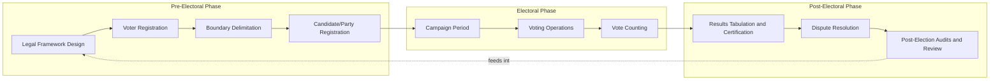

## Election Administration and Integrity

### Definition and Scope

**Election Administration** refers to the institutional processes, actors, and procedures responsible for organizing, conducting, and certifying elections — including voter registration, ballot design, polling place management, vote counting, and results certification. **Election Integrity** refers to the degree to which an election process is accurate, secure, transparent, and free from fraud, manipulation, or unlawful interference, such that outcomes genuinely reflect the will of eligible voters.

### Core Institutional Actors

**Key Points**

- **Election Management Bodies (EMBs)**: The formal institutions responsible for administering elections. Comparative election scholars, notably in work by International IDEA, classify EMBs into three models:
  - **Independent Model**: EMB operates as an autonomous body separate from the executive branch (e.g., Mexico's National Electoral Institute, India's Election Commission).
  - **Governmental Model**: Elections are administered by an executive branch ministry or department (e.g., historically common in parts of Europe).
  - **Mixed Model**: A policy-setting independent body works alongside a government-implementing body (e.g., France).
- **Local/Decentralized Administration**: In federal systems such as the United States, election administration is highly decentralized, conducted primarily by approximately 8,000+ county- and municipal-level election offices operating under varying state laws, rather than a single national EMB.

### The Electoral Cycle Framework

Election administration is commonly analyzed using the **Electoral Cycle** framework (developed by International IDEA, the UN, and other international election-assistance organizations), which divides the process into three broad phases:

### Voter Registration Systems

1. **Active Registration**: Citizens must proactively register to vote (e.g., historically common in the United States prior to automatic registration reforms).
2. **Passive/Automatic Registration**: Eligible citizens are registered automatically based on government records such as civil registries, tax records, or driver's license data (e.g., automatic voter registration adopted by many U.S. states; near-universal automatic enrollment in many European democracies).
3. **Same-Day Registration**: Allows voters to register and vote on the same day, typically at the polling location.

**Key Points**

- **Voter list maintenance** — removing deceased individuals, duplicate entries, and relocated voters — is a routine administrative function but has become a politically contested issue when purges are alleged to be overly aggressive or discriminatory (raising Section 2 Voting Rights Act concerns in the U.S. context) versus insufficiently maintained (raising integrity/accuracy concerns).

### Voting Methods and Technology

| Method | Description | Common Integrity Considerations |
| --- | --- | --- |
| Hand-Marked Paper Ballots | Voter marks paper ballot by hand, often counted by optical scanner | Provides a durable physical audit trail |
| Direct-Recording Electronic (DRE) | Touchscreen or button-based electronic voting with no independent paper record | Historically criticized by security researchers for lack of independently verifiable audit trail |
| Ballot-Marking Devices (BMDs) with Paper Output | Electronic interface produces a human-readable paper ballot, which is then scanned/counted | Combines accessibility benefits of electronic interface with a paper audit trail |
| Vote-by-Mail / Postal Voting | Ballots mailed to and returned by voters | Raises distinct chain-of-custody and signature-verification considerations |
| Internet/Online Voting | Ballots cast via internet-connected systems | Widely regarded by election security researchers as carrying substantially elevated cybersecurity risk relative to other methods, and is not widely adopted for general elections in most established democracies |

### Post-Election Verification: Audits

**Risk-Limiting Audits (RLAs)** are a statistically grounded post-election audit method designed to provide high confidence that a reported election outcome is correct without requiring a full manual recount in every case.

The core statistical logic of an RLA is to sample ballots and check whether the sample provides sufficient evidence to confirm the reported winner at a specified confidence level, escalating to larger samples (or a full recount) if the initial sample does not provide sufficient confidence.

A simplified statement of the risk limit is:

$$\alpha = P(\text{audit fails to correct an incorrect outcome})$$

Where $\alpha$ (the risk limit) is set in advance (commonly around 5–10% in implemented RLA statutes), meaning the audit is designed such that, if the reported outcome is actually wrong, there is at most an $\alpha$ probability the audit fails to detect and correct it. [Inference — exact statistical methodology (e.g., ballot-polling vs. comparison audits) varies by implementation; specific state statutory risk limits should be verified against current state election codes]

### Chain of Custody and Physical Security

**Key Points**

- **Chain of custody** refers to the documented, unbroken sequence of accountability for ballots and voting equipment from creation through final certification, typically involving tamper-evident seals, bipartisan or multi-party witness requirements, and logged transfers.
- **Logic and Accuracy (L&A) testing** is pre-election testing of voting equipment using a known set of test ballots to confirm the equipment correctly records and tabulates votes before it is used with real ballots.
- **Air-gapping**: Best-practice guidance from election security researchers (including work associated with the U.S. Cybersecurity and Infrastructure Security Agency, CISA) generally recommends that vote-tabulation systems not be connected to the internet, reducing remote cyberattack surface, though physical/insider threats and pre-election supply-chain risks remain distinct concerns not addressed by air-gapping alone.

### Election Observation and Transparency

International and domestic **election observation** is a widely used integrity mechanism, involving accredited observers (from organizations such as the OSCE Office for Democratic Institutions and Human Rights, the Carter Center, or domestic civil-society groups) who monitor procedures against established standards and publish assessment reports. Observation typically evaluates:

- Legal framework adequacy
- Voter registration accuracy and inclusiveness
- Campaign environment fairness (media access, campaign finance)
- Polling day procedures
- Counting and tabulation transparency
- Complaint and dispute-resolution mechanisms

### Common Threats to Election Integrity

1. **Fraud**: Illegal manipulation of the voting or counting process, including impersonation fraud, ballot stuffing, or falsification of results. Empirical studies in established democracies, including the U.S., have generally found documented instances of individual voter impersonation fraud to be rare relative to overall ballots cast, though this finding is contested in public debate and rates vary by country and study methodology. [Inference — prevalence estimates depend heavily on study design, jurisdiction, and time period]
2. **Voter Suppression**: Policies or practices that disproportionately or unlawfully impede eligible voters' access to registration or voting, such as discriminatory identification requirements, inadequate polling place access, or improper list purges.
3. **Cyberattacks**: Attempts to compromise voter registration databases, election night reporting systems, or (less commonly, given air-gapping practices) tabulation equipment.
4. **Disinformation**: Circulation of false information about voting procedures, candidates, or results intended to suppress turnout or delegitimize outcomes.
5. **Foreign Interference**: State or non-state foreign actors attempting to influence election processes or public perception through cyber intrusion, disinformation campaigns, or covert funding.

### Legitimacy and Public Confidence

**Key Points**

- Election integrity is analytically distinct from **election legitimacy** — an election can be procedurally sound by expert/technical measures while still facing contested public perceptions of legitimacy, and vice versa.
- Comparative election-integrity research, notably the **Electoral Integrity Project** (led by Pippa Norris), uses expert surveys to construct a Perceptions of Electoral Integrity (PEI) index scoring elections across the full electoral cycle rather than only election day.
- Trust in election administration is empirically associated in the political behavior literature with factors including transparency of procedures, perceived neutrality of election officials, media coverage patterns, and partisan alignment with election outcomes. [Inference — causal weighting among these factors varies across studies and contexts]

### Dispute Resolution Mechanisms

| Mechanism | Description |
| --- | --- |
| Administrative Recount | Recount conducted by election administrators, often automatically triggered by narrow margins defined in statute |
| Judicial Election Contests | Formal legal challenges filed in courts disputing the conduct or outcome of an election |
| Election Tribunals/Commissions | Specialized quasi-judicial bodies in some countries with exclusive jurisdiction over election disputes |
| Legislative Certification | In some systems, a legislative body performs a final certification or resolution role (e.g., the U.S. Congress's role under the Electoral Count Reform Act of 2022 in counting presidential electoral votes) |

### Diagram: Layers of Election Integrity Safeguards

<svg viewBox="0 0 700 400" xmlns="http://www.w3.org/2000/svg">
<text x="350" y="28" font-size="18" font-weight="bold" text-anchor="middle" fill="#1a1a2e">Layered Election Integrity Safeguards (svg_diagram)</text>
<circle cx="350" cy="220" r="170" fill="#eef3fb" stroke="#3a5a99" stroke-width="1.5"/>
<circle cx="350" cy="220" r="130" fill="#dce8fb" stroke="#3a5a99" stroke-width="1.5"/>
<circle cx="350" cy="220" r="90" fill="#c3d9f7" stroke="#3a5a99" stroke-width="1.5"/>
<circle cx="350" cy="220" r="50" fill="#a6c4f0" stroke="#3a5a99" stroke-width="1.5"/>

<text x="350" y="220" font-size="12" font-weight="bold" text-anchor="middle" fill="`#1a1a2e`">Vote Cast</text>

<text x="350" y="170" font-size="11" text-anchor="middle" fill="`#1a1a2e`">L&A Testing +</text>

<text x="350" y="184" font-size="11" text-anchor="middle" fill="`#1a1a2e`">Chain of Custody</text>

<text x="350" y="115" font-size="11" text-anchor="middle" fill="`#1a1a2e`">Post-Election Audits (RLA)</text>

<text x="350" y="65" font-size="11" text-anchor="middle" fill="`#1a1a2e`">Observation, Transparency, Judicial Review</text>

</svg>

### Comparative and Reform Considerations

Comparative political science research generally associates the following institutional features with higher measured electoral integrity scores, though associations are correlational rather than strictly causal in most study designs [Inference]:

- Independence of the EMB from direct executive control
- Existence of a durable, non-partisan professional election administration workforce
- Statutory audit requirements with defined, pre-committed risk limits
- Transparent, publicly auditable chain of custody and counting procedures
- Accessible and timely judicial or quasi-judicial dispute-resolution channels

### Related Topics

- Duverger's Law and Electoral Effects
- Redistricting and Gerrymandering
- Comparative Election Management Body Design
- Risk-Limiting Audits: Statistical Methodology
- Voting Rights Act Section 2 and Voter Access Litigation
- Election Cybersecurity and Critical Infrastructure Protection
- Electoral Integrity Project and Comparative Measurement
- Disinformation and Democratic Backsliding