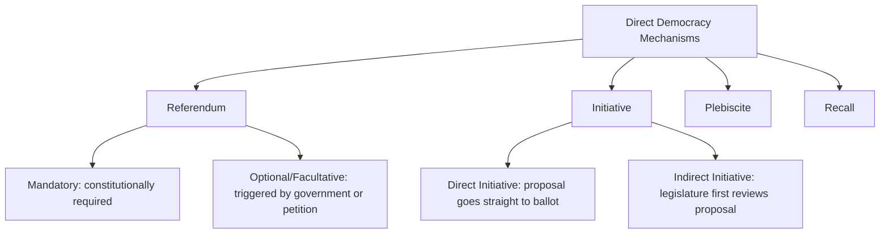
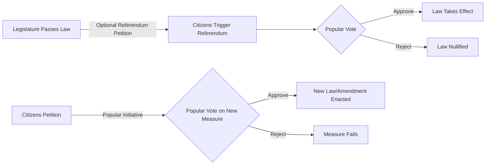

## Referendums and Direct Democracy

### Definitions

**Direct Democracy** refers to mechanisms by which citizens vote directly on policy questions or legislation, rather than exclusively through elected representatives (**representative** or **indirect democracy**). **Referendums** (also spelled referenda) are votes in which citizens directly approve, reject, or otherwise decide a specific policy, constitutional, or legislative question.

### Typology of Direct Democracy Mechanisms

**Key Points**

- **Referendum**: A vote on a measure that has been referred to the electorate, typically by a government, legislature, or as a constitutionally mandated procedure.
- **Initiative**: A process by which citizens themselves, through petition signatures, place a proposed law or constitutional amendment directly on the ballot, bypassing the legislature.
- **Plebiscite**: Often used interchangeably with referendum, though some scholars reserve the term for votes on matters of sovereignty, territorial status, or fundamental political questions (e.g., independence votes) rather than ordinary legislation.
- **Recall**: A vote allowing citizens to remove an elected official from office before the end of their term.

### Classification by Legal Effect

| Type | Description | Binding Status |
| --- | --- | --- |
| Mandatory Referendum | Required by constitution or law for certain decisions (e.g., constitutional amendments) | Legally binding |
| Optional/Facultative Referendum | Triggered voluntarily by government, legislature, or citizen petition | Typically binding |
| Advisory/Consultative Referendum | Gauges public opinion without automatic legal effect | Non-binding; government retains discretion to act on result |
| Abrogative Referendum | Allows voters to repeal an existing law (e.g., Italy's referendum abrogativo) | Legally binding |

### Classification by Initiator

1. **Government-Initiated (Top-Down)**: Called by the executive or legislature, often for constitutional amendments, treaty ratification (e.g., EU accession referendums), or politically sensitive issues where officials seek direct public mandate or wish to diffuse political responsibility.
2. **Citizen-Initiated (Bottom-Up)**: Placed on the ballot through a petition process requiring a specified number or percentage of registered voter signatures within a defined timeframe.

### Signature Threshold Mechanics (Citizen Initiatives)

Citizen-initiated processes typically require petition signatures equal to a percentage of a reference population (such as votes cast in a prior election or total registered voters). This can be formalized as:

$$S_{required} = t \times P_{reference}$$

Where $S_{required}$ is the number of valid signatures needed, $t$ is the statutory threshold percentage, and $P_{reference}$ is the reference population (e.g., votes cast for governor in the last election, as used in several U.S. states). Threshold percentages vary substantially by jurisdiction — for example, U.S. states with initiative processes commonly set thresholds in the range of roughly 5–15% of a reference vote total, though exact figures should be verified against current state law. [Inference — specific numeric thresholds vary by state and are subject to legislative change; verify against current statutory text]

### Supermajority and Turnout Requirements

Many referendum systems impose additional validity conditions beyond a simple majority of votes cast, intended to ensure adequate legitimacy and participation:

- **Supermajority Requirement**: Requires more than a simple majority (e.g., 60%) for approval, common for constitutional amendments in several U.S. states and for certain classes of measures elsewhere.
- **Quorum/Turnout Requirement**: Requires a minimum voter turnout for the result to be valid, regardless of the margin of approval (e.g., historically used in Italy's abrogative referendums, requiring 50%+1 turnout).
- **Double Majority**: Requires both an overall national majority and majorities across a defined number of sub-national units (e.g., Switzerland's requirement for many federal referendums to achieve both a popular majority and a majority of cantons).

### Case Studies by Jurisdiction

**Key Points**

- **Switzerland**: Widely regarded as having the most developed system of direct democracy globally, employing mandatory referendums for constitutional changes, optional (facultative) referendums that can be triggered by 50,000 citizen signatures against ordinary federal laws, and popular initiatives requiring 100,000 signatures to propose constitutional amendments.
- **United States**: No federal-level referendum or initiative mechanism exists; direct democracy operates at the state and local level, with roughly half of U.S. states permitting citizen initiatives and/or popular referendums, a legacy substantially shaped by the Progressive Era reform movement of the early twentieth century.
- **California**: Frequently studied as a high-usage initiative state, notable for landmark measures such as Proposition 13 (1978, property tax limitation).
- **United Kingdom**: Uses referendums sparingly and treats them as constitutionally advisory in principle (given parliamentary sovereignty), though the 2016 European Union membership referendum ("Brexit") was treated as politically binding in practice despite its formally advisory legal status.
- **Ireland**: Requires a referendum for any constitutional amendment, producing a relatively high frequency of referendums on socially significant questions (e.g., same-sex marriage in 2015, abortion law in 2018).

### Theoretical Arguments For Direct Democracy

1. **Popular Sovereignty**: Direct votes on policy are argued to more directly embody the principle that political authority derives from the people.
2. **Reduced Agency Loss**: Bypasses potential divergence between representatives' preferences/incentives and constituents' preferences (a core concern in principal-agent models of representation).
3. **Increased Civic Engagement**: Some empirical studies associate the availability of initiative processes with higher political knowledge and engagement, though causal direction and magnitude are debated. [Inference]
4. **Issue-Specific Legitimacy**: Provides clear, direct legitimacy for decisions of exceptional constitutional significance (e.g., sovereignty changes, constitutional amendments).

### Theoretical Arguments and Critiques

1. **Tyranny of the Majority**: Direct votes may inadequately protect minority rights, since majoritarian outcomes are not filtered through deliberative or constitutional constraints in the same way as representative legislative processes — a concern with roots in Madisonian and Tocquevillian political thought.
2. **Information and Complexity Problems**: Voters may lack the specialized policy expertise that legislative committee processes are designed to provide, raising concerns about "low-information" voting on technically complex measures.
3. **Elite and Interest-Group Capture**: Well-funded interest groups can dominate signature-gathering and campaign spending in initiative processes, potentially undermining the "citizen-driven" premise of the mechanism — a concern extensively documented in studies of California's initiative industry.
4. **Legislative Circumvention**: Initiative processes can be used to bypass ordinary legislative deliberation and compromise-building, sometimes producing rigid or fiscally unsustainable policy outcomes when interacting with other constitutional provisions (a critique frequently raised regarding certain California budget-related initiatives).
5. **Question Design and Framing Effects**: Ballot question wording, order, and framing can substantially affect outcomes independent of underlying voter preference — an empirical finding well documented in survey methodology and political behavior research.

### Referendum Campaign Dynamics

**Example**

Comparative election studies commonly note asymmetric campaign dynamics in referendums: "No" campaigns often benefit from a **status quo bias**, since undecided voters facing complex or uncertain policy questions frequently default to rejecting change under conditions of ambiguity — an empirically observed pattern (though not a strict law) sometimes summarized in campaign literature as "when in doubt, vote no." [Inference — the strength and consistency of this effect varies across specific referendum contexts and issue types]

### Referendums and Representative Institutions: Interaction Effects

### Constitutional Amendment Referendums

Many countries constitutionally require a referendum specifically for constitutional (as opposed to ordinary statutory) amendments, reflecting a common comparative-constitutional design principle that fundamental law changes warrant a higher form of direct popular legitimation than ordinary legislation. Examples include Ireland, Australia (where amendments additionally require the "double majority" of a national vote and a majority of states), and Switzerland.

### Related Topics

- Duverger's Law and Electoral Effects
- Redistricting and Gerrymandering
- Election Administration and Integrity
- Comparative Constitutional Amendment Procedures
- Ballot Question Framing and Survey Methodology
- Interest Group Influence in Initiative Campaigns
- Federalism and Sub-National Referendum Design (Switzerland, Australia)
- Populism and Direct Democracy in Comparative Politics