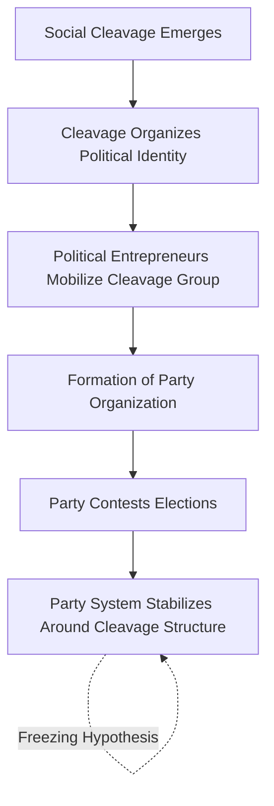

## Origins and Functions of Political Parties

### Definition

A **political party** is an organized group of individuals sharing broadly common political goals and policy positions that seeks to influence public policy by nominating candidates for elective office and, upon winning, controlling or participating in government. This definition, associated with scholars such as Edmund Burke and refined by later political scientists (e.g., Giovanni Sartori), distinguishes parties from factions, interest groups, and social movements primarily through the party's characteristic goal of contesting elections to hold governmental office.

### Historical Origins of Political Parties

**Key Points**

- **Cadre/Elite Origin Parties**: The earliest parties, emerging in 18th–19th century Britain and the early United States (e.g., the Whigs and Tories, the U.S. Federalists and Democratic-Republicans), originated as loose parliamentary factions or elite legislative caucuses coordinating votes among a small enfranchised political class, prior to mass suffrage.
- **Mass-Origin Parties**: Following suffrage expansion in the late 19th and early 20th centuries, parties — most notably European socialist and labor parties — developed as extra-parliamentary organizations built from pre-existing social organizations (trade unions, religious associations), a pattern extensively documented by Maurice Duverger in his cadre-versus-mass party distinction.

Duverger's classic distinction:

| Party Type | Origin | Organizational Structure | Membership Basis |
| --- | --- | --- | --- |
| Cadre Party | Parliamentary elites, pre-suffrage expansion | Loose, decentralized, notable-centered | Small; based on social prestige/wealth |
| Mass Party | Extra-parliamentary, post-suffrage expansion | Formal, centralized, bureaucratic branch structure | Large; dues-paying members, ideological commitment |

### Theoretical Accounts of Party Origins

1. **Institutional/Parliamentary Origin Theory** (associated with Duverger): Parties originate from the internal organizational needs of legislatures — coordinating voting blocs and electoral campaigns among sitting members.
2. **Societal Cleavage Theory** (associated with Seymour Martin Lipset and Stein Rokkan, 1967): Parties emerge from underlying social cleavages generated by historical developmental processes, notably:
   - The **National Revolution**: producing center-periphery and church-state cleavages.
   - The **Industrial Revolution**: producing owner-worker (class) and urban-rural cleavages.Lipset and Rokkan's associated **"freezing hypothesis"** proposed that the party systems of most Western European democracies had crystallized around these cleavages by the 1920s and remained comparatively stable ("frozen") for much of the twentieth century — a proposition that has been extensively debated and qualified by subsequent scholars examining post-1960s partisan dealignment and new cleavages (e.g., post-materialist and identity-based divisions). [Inference — the degree and timing of any "unfreezing" is a matter of ongoing scholarly debate]
3. **Modernization/Developmental Theory**: Associated with scholars such as Samuel Huntington and Joseph LaPalombara, this approach links party emergence to broader processes of political modernization and the need to structure participation as political systems develop.

### Core Functions of Political Parties

**Key Points**

Comparative party scholarship (notably work associated with Kay Lawson, Richard Katz, and Peter Mair) typically identifies several core functions parties perform within democratic political systems:

1. **Interest Aggregation**: Combining diverse individual and group preferences into a coherent, manageable set of policy platforms, reducing the complexity of the political agenda relative to unmediated individual demands.
2. **Interest Articulation**: Representing and voicing specific societal interests and demands within the political system (though this function is also performed by interest groups and social movements).
3. **Candidate Recruitment and Nomination**: Identifying, vetting, and formally nominating candidates for public office, structuring the pool of choices available to voters.
4. **Political Socialization and Mobilization**: Educating citizens about political issues, cultivating political identity and engagement, and mobilizing voter turnout.
5. **Governmental Organization**: Structuring the internal organization of legislatures and, in parliamentary systems, forming the basis for executive cabinet formation and legislative-executive coordination.
6. **Political Elite Recruitment and Training**: Serving as a career pathway and training ground for political leadership.
7. **Accountability and Electoral Choice Structuring**: Providing voters a simplified, recognizable "brand" or label that reduces the informational burden of evaluating individual candidates and policy positions — a function central to rational-choice and informational theories of party utility (e.g., work by John Aldrich, *Why Parties?*, 1995).

### Aldrich's Rational-Choice Account of Party Function

John Aldrich's influential *Why Parties?* (1995) framework argues parties solve several recurring collective-action problems for ambitious politicians:

- **The Regulation of Ambition**: Parties structure competition for office and reduce destructive intra-coalition competition.
- **Coordination on Legislative Voting**: Parties help legislators achieve stable, predictable voting coalitions, addressing collective-action and cycling problems inherent in unstructured majority-rule voting (related to Arrow's Impossibility Theorem and social choice theory).
- **Solving the Collective Action Problem of Campaigning**: Parties provide a durable brand/reputation that individual candidates benefit from but could not efficiently produce alone.

### Party System Development Sequence (Comparative Pattern)

**Example**

A stylized comparative sequence often described in the literature for party emergence in developing electoral democracies:

### Functional Typology: Linkage Mechanisms

Comparative scholars (e.g., Herbert Kitschelt) distinguish parties by the type of **linkage** connecting them to voters:

1. **Programmatic Linkage**: Parties compete on broad policy platforms and ideological positions applied consistently across the electorate.
2. **Clientelistic Linkage**: Parties exchange direct, particularistic material benefits (patronage, targeted goods) for voter support, common in many developing democracies and historically in urban political machines (e.g., Tammany Hall).
3. **Charismatic Linkage**: Parties organize around the personal appeal and authority of an individual leader rather than programmatic content or clientelistic exchange.

### Distinguishing Parties from Related Organizations

| Organization Type | Primary Goal | Seeks Elective Office? |
| --- | --- | --- |
| Political Party | Win control of government through elections | Yes |
| Interest Group | Influence policy on specific issues | No (typically) |
| Social Movement | Achieve broad social/political change through mobilization, often outside formal institutions | No (typically), though movements sometimes evolve into parties |
| Faction | Advance a subgroup's interest within a broader party or institution | Not independently; operates within a party |

### Party Institutionalization

**Key Points**

Political scientist Angelo Panebianco and later Vicky Randall/Lars Svåsand distinguish parties by their degree of **institutionalization** — the extent to which a party has developed value beyond the interests of its current leadership and become an autonomous, procedurally stable organization. Indicators commonly cited include:

- **Systemness**: Degree of coherent internal organizational structure and routine, rule-bound internal procedures.
- **Decisional Autonomy**: Independence from external actors (e.g., a single dominant leader, an external sponsoring organization) in internal decision-making.
- **Value Infusion**: The degree to which members and supporters attach intrinsic value/loyalty to the party as an institution, beyond instrumental support for current leaders or policies.
- **Reification**: The degree to which the party is perceived by the public as a stable, recognizable entity independent of specific individuals.

### Legal and Constitutional Recognition

Most contemporary democracies provide some form of legal recognition and regulation of political parties, addressing:

- **Ballot access requirements**: Signature or petition thresholds for party or candidate ballot placement.
- **Public funding regimes**: Direct or indirect state subsidies for party operations and campaigns, varying substantially across democracies (e.g., extensive public party financing in Germany versus more restricted models in the United States).
- **Internal democracy requirements**: Some countries (e.g., Germany's Basic Law, Article 21) constitutionally mandate that internal party organization conform to democratic principles.
- **Party banning provisions**: Legal mechanisms in some democracies (notably "militant democracy" frameworks, e.g., Germany) permitting the prohibition of parties deemed to threaten the constitutional order.

### Related Topics

- Party Systems: Classification and Typology (Sartori)
- Cleavage Theory (Lipset and Rokkan) in Depth
- Duverger's Law and Electoral Effects
- Party Organization Models: Cadre, Mass, Catch-All, and Cartel Parties
- Clientelism and Patronage Politics
- Party Institutionalization in New Democracies
- Intra-Party Democracy and Candidate Selection Methods
- Political Elite Recruitment and Career Pathways