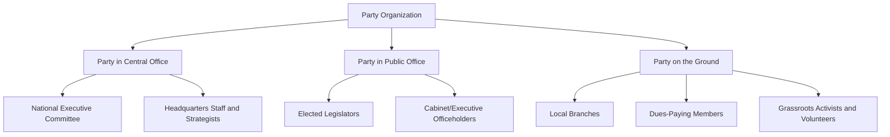
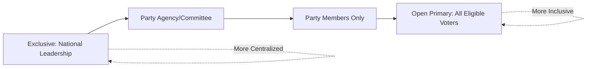

## Party Organization and Membership

### Definition

**Party organization** refers to the formal internal structure of a political party — its layers of leadership, decision-making bodies, staff, and membership base — through which the party recruits members, selects candidates, formulates policy positions, and mobilizes electoral support. **Party membership** refers to the formal or informal status of individuals affiliated with a party at a level beyond simply voting for it, ranging from card-carrying dues-paying members to loosely identified supporters.

### The Three Faces of Party Organization

A widely used analytical framework, developed by Katz and Mair (1993), decomposes party organization into three interlocking components:

**Key Points**

1. **Party in Central Office**: The formal national/central organizational apparatus — party headquarters, national executive committees, and administrative staff — responsible for coordinating strategy, resource allocation, and organizational continuity.
2. **Party in Public Office**: Elected officials and appointees holding government or legislative positions under the party label, who often exercise substantial autonomous influence over party policy positions once in office.
3. **Party on the Ground**: The membership base and grassroots organizational structure — local branches, activists, and dues-paying members — through which the party maintains societal roots and conducts local mobilization.

### Historical Evolution of Party Organizational Models

Comparative party scholarship (building on Duverger, and extended by Katz, Mair, Panebianco, and Kirchheimer) identifies a broadly sequential — though not universal — evolution of dominant party organizational types across Western democracies:

| Model | Approximate Era | Core Features | Associated Scholar(s) |
| --- | --- | --- | --- |
| Cadre/Elite Party | Pre-mass suffrage (18th–19th c.) | Small, notable-centered, loose organization, minimal formal membership | Duverger |
| Mass Party | Early-to-mid 20th century | Large dues-paying membership, strong extra-parliamentary bureaucracy, dense associational ties (unions, churches) | Duverger, Neumann |
| Catch-All Party | Mid-to-late 20th century | De-emphasized ideology and class base to broaden electoral appeal; reduced reliance on mass membership | Otto Kirchheimer |
| Cartel Party | Late 20th century–present | Parties become semi-state agencies reliant on public funding, with reduced membership incentivized organizational structures, and collusive competition among established parties | Katz and Mair |
| Business-Firm/Personalist Party | Late 20th century–present | Organized around a leader or professional campaign apparatus rather than membership or ideology; resembles a firm delivering a "product" (the leader/brand) to "consumers" (voters) | Angelo Panebianco |

### Organizational Structure: Vertical Layers

**Key Points**

Most party organizations exhibit a multi-tiered vertical structure, particularly in unitary or federal systems with sub-national elections:

1. **National/Federal Level**: Sets overarching platform, national campaign strategy, and coordinates national leadership selection.
2. **Regional/State/Provincial Level**: Adapts national platform to regional concerns; often manages state/regional-level candidate nominations and campaigns.
3. **Local/Constituency Level**: Conducts grassroots mobilization, local candidate recruitment, and direct voter contact; typically the entry point for individual party membership.

### Membership Types and Incentive Structures

Political scientist James Q. Wilson's incentive typology, widely applied to party membership analysis, distinguishes the incentives individuals have for joining and remaining active in party organizations:

1. **Material Incentives**: Tangible personal benefits, such as patronage jobs, government contracts, or direct financial gain (historically central to clientelistic party machines).
2. **Solidary Incentives**: Social benefits derived from group belonging, friendship networks, and social status within the party community.
3. **Purposive (Ideological) Incentives**: Satisfaction derived from advancing a cause or ideological goal, independent of material or social reward.

### The Membership Decline Phenomenon

**Key Points**

A substantial body of comparative party research (notably work by Peter Mair, Ingrid van Biezen, and colleagues) documents a long-term, broadly cross-national decline in formal party membership as a share of the electorate across most established Western democracies since the mid-20th century.

Commonly cited explanatory factors include:

- **Rise of mass media and television campaigning**, reducing parties' reliance on volunteer canvassers for voter contact.
- **Increased state/public campaign financing**, reducing parties' financial dependence on membership dues (a core mechanism in the cartel party thesis).
- **Partisan dealignment**: Weakening of stable, generationally transmitted party identification among voters, associated with broader societal trends of secularization, class dealignment, and rising educational attainment (linked to Dalton and Wattenberg's dealignment literature).
- **Rise of digital/low-commitment forms of political participation**, which some scholars argue substitute for, rather than supplement, formal party membership.

This is presented as an empirical pattern documented across multiple established democracies rather than a universal law; some parties and party systems have shown membership growth or reversal in specific periods (e.g., surges in membership for certain insurgent or movement-linked parties). [Inference — the generality and permanence of the decline trend, and its causal drivers, remain subjects of ongoing scholarly debate]

### Quantifying Party Membership: The M/E Ratio

A standard comparative metric for party membership strength is the **Party Membership to Electorate Ratio (M/E Ratio)**:

$$\frac{M}{E} = \frac{\text{Total Party Membership}}{\text{Total Electorate}} \times 100$$

This ratio allows cross-national and over-time comparison of party organizational density independent of raw population differences. Van Biezen, Mair, and Poguntke's comparative dataset is a widely cited source documenting M/E ratio decline across most European democracies from the mid-20th century into the early 21st century. [Inference — specific current numeric ratios vary by country and require verification against up-to-date comparative datasets]

### Candidate Selection Methods (Intra-Party Democracy)

**Key Points**

The method by which parties select candidates for elective office is a core organizational function with significant implications for party discipline, internal democracy, and representativeness. A widely used classification (developed by Reuven Hazan and Gideon Rahat) considers the **selectorate** — who participates in candidate selection — along a spectrum:

1. **Exclusive (Party Leadership) Selection**: A small group of national party leaders selects candidates.
2. **Party Agency Selection**: A specialized party body (e.g., national executive committee, selection committee) makes the decision.
3. **Party Members Selection**: All registered dues-paying party members vote to select candidates (e.g., some U.S. state party structures, UK Labour and Conservative constituency selections).
4. **Open Primary/Inclusive Selection**: All eligible voters, including non-members, may participate in selecting the party's candidate (widely used in U.S. state primary systems).

### Party Discipline and Cohesion

**Key Points**

- **Party discipline** refers to the degree to which elected party members vote in line with the official party position, typically enforced through incentives (committee assignments, campaign support) or sanctions (loss of endorsement, expulsion).
- Comparative legislative studies generally find substantially higher party discipline/cohesion in parliamentary systems with strong central party organizations (e.g., the UK "whip" system) compared to the U.S. congressional system, where candidate-centered nomination (via primaries) and campaign finance independence weaken central party leverage over individual legislators. [Inference — degree of discipline varies by specific party, period, and issue salience]
- Roll-call vote analysis (e.g., Rice Cohesion Index) is a standard quantitative technique for measuring party voting unity:

$$\text{Rice Index} = \left| \frac{Y - N}{Y + N} \right| \times 100$$

Where $Y$ and $N$ represent the number of party members voting "yes" and "no" respectively on a given roll-call vote; a score of 100 indicates perfect unity, while 0 indicates an even split.

### Party Finance as an Organizational Resource

Party organizational capacity is closely tied to funding sources, which vary substantially by country:

| Funding Source | Description | Illustrative Context |
| --- | --- | --- |
| Membership Dues | Fees paid by formal party members | Historically central to mass parties |
| Private Donations | Contributions from individuals, corporations, or organized interest groups | Central to U.S. party and campaign finance |
| Public/State Subsidies | Direct government funding allocated to parties, often based on prior electoral performance | Extensive in Germany, Sweden, and many European democracies |
| Affiliated Organization Support | Funding/resources from formally linked organizations (e.g., trade unions historically linked to labor/socialist parties) | UK Labour Party's historical trade union linkage |

### Related Topics

- Origins and Functions of Political Parties
- Cartel Party Thesis (Katz and Mair) in Depth
- Candidate Selection Methods and Intra-Party Democracy
- Party Discipline and Legislative Voting Cohesion
- Comparative Party Finance and Public Subsidy Regimes
- Partisan Dealignment and Declining Party Identification
- Clientelism and Patronage-Based Party Organization
- Duverger's Law and Electoral Effects