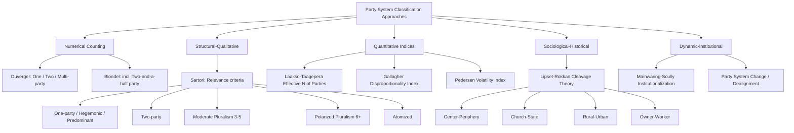

## Classifying Party Systems

### Overview

Party system classification is the analytical enterprise of categorizing the pattern of interactions among political parties within a polity, based on criteria such as the number of relevant parties, their relative size, ideological distance, and the nature of competition between them. Party systems are distinct from individual parties: a party system refers to the structured pattern of competition, cooperation, and interaction that emerges among all parties operating within a political system over time.

The foundational premise is that counting parties alone is insufficient for meaningful classification — two systems with the same number of parties can function very differently depending on their relative strength, ideological positioning, and behavior toward each other and toward the political system itself.

### Key Points

- Party system classification serves both descriptive and explanatory purposes: it describes patterns of competition and helps explain governmental stability, coalition behavior, and policy outcomes.
- Early classification schemes relied primarily on numerical criteria (counting parties), while later schemes incorporate qualitative dimensions.
- The most influential typology remains Giovanni Sartori's framework, which combines the number of "relevant" parties with ideological distance and the mechanics of competition.
- Party systems are not static; they can shift due to electoral reform, social cleavage realignment, or critical elections.
- Classification schemes have normative implications, often linking certain system types to governmental stability or instability.

### Early Numerical Classifications

The earliest systematic approach to classifying party systems, associated with scholars such as Maurice Duverger, relied on simple party counts.

**One-Party Systems**

A single party holds a legal or de facto monopoly on political power, with no legally sanctioned competition. Subtypes include:

- *One-party totalitarian systems*: the party penetrates all aspects of society and suppresses alternative political organization (e.g., the Communist Party in the former Soviet Union).
- *One-party authoritarian systems*: dominance is maintained through control of state institutions rather than total societal penetration.
- *One-party pragmatic/dominant systems*: a single party governs without necessarily banning opposition, often in post-colonial contexts.

**Two-Party Systems**

Two major parties dominate electoral competition and alternate in government, though minor parties may exist without seriously threatening the duopoly. The United States (Democratic and Republican parties) is the paradigmatic example.

**Multiparty Systems**

Three or more parties have realistic chances of gaining representation and, potentially, governmental power. This is the modal pattern in most parliamentary democracies using proportional representation.

**Limitation of Simple Counting**: Duverger's own scheme was criticized for treating all multiparty systems as a residual category, collapsing meaningful differences between, for example, a system with three parties of similar strength and one with eight parties. This motivated more refined typologies.

### Duverger's Law and Mechanical/Psychological Effects

Duverger's work introduced propositions linking electoral systems to party system outcomes, often summarized as "Duverger's Law":

1. **Plurality (first-past-the-post) electoral systems** tend to favor two-party systems.
2. **Proportional representation (PR)** and **majority-runoff systems** tend to favor multipartism.

Two causal mechanisms are typically cited:

- **Mechanical effect**: Plurality rules translate votes into seats in a way that disproportionately rewards the largest party/parties and penalizes smaller ones, since only the plurality winner in each district gains representation.
- **Psychological effect**: Voters and elites anticipate the mechanical effect and strategically avoid "wasting" votes on parties unlikely to win, consolidating support around the top two contenders.

[Inference] The strength of Duverger's Law is contested in comparative politics; scholars note numerous exceptions (e.g., India and Canada, plurality systems with more than two significant parties, often attributed to regionally concentrated minor parties), and much recent literature treats it as a probabilistic tendency rather than a deterministic law.

### Sartori's Typology: Number of Parties and Ideological Distance

Giovanni Sartori's 1976 framework, developed in *Parties and Party Systems: A Framework for Analysis*, remains the most cited classification scheme in comparative politics. Sartori's key innovation was combining a refined counting rule with an assessment of **ideological distance** (polarization) among relevant parties.

**Sartori's Counting Rule (Relevance Criteria)**

Not all parties that win seats are politically "relevant." Sartori proposed two tests for relevance:

1. **Coalition potential**: A party is relevant if it has been, or is realistically capable of being, included in governing coalitions.
2. **Blackmail potential**: A party is relevant if its existence affects the tactics of party competition, particularly by pulling the competition toward or away from the center (e.g., an anti-system party on the extreme flank), even if it never enters government.

Parties lacking both coalition and blackmail potential (e.g., perpetually marginal parties with no bargaining leverage) are excluded from the count, regardless of their vote share.

**Sartori's Seven-Category Typology**

| Category | Number of Relevant Parties | Key Characteristics |
| --- | --- | --- |
| One-party | 1 | No legal opposition permitted |
| Hegemonic party | 1 dominant + satellite parties | Satellites permitted but not allowed to compete for power |
| Predominant-party | Multiple, but one wins consistently | Competitive, but one party governs alone over successive elections (e.g., Japan's LDP for much of the postwar era, the African National Congress in South Africa) |
| Two-party | 2 | Alternation in single-party government; moderate ideological distance |
| Moderate pluralism | 3–5 | Bipolar coalition competition; centripetal (center-seeking) competition |
| Polarized pluralism | 6+ | Bilateral oppositions (anti-system parties on both flanks), centrifugal (center-fleeing) competition, presence of a relevant center party, ideological patterning, "irresponsible opposition," outbidding |
| Atomized | Many, none individually significant | No party has a decisive edge; residual category |

**Polarized Pluralism in Detail**

Sartori's polarized pluralism deserves special attention as his most theoretically distinctive contribution:

- **Bilateral opposition**: anti-system parties exist on both the left and right flanks (e.g., communist and fascist/neo-fascist parties in Weimar-era Germany or the Italian First Republic).
- **Center party or coalition**: occupies the ideological middle and is essential to most governing coalitions.
- **Centrifugal drives**: competitive incentives push flank parties toward more extreme positions to differentiate themselves, rather than converging toward the median voter as in centripetal competition.
- **Irresponsible opposition and outbidding**: opposition parties with no realistic chance of governing can make maximalist promises without accountability for governing consequences.

**Distinguishing Moderate from Polarized Pluralism**: The dividing line is not purely the number of parties (Sartori suggested five as a rough threshold) but whether **anti-system parties** are present and whether competition is centripetal or centrifugal. [Inference] Some scholars have argued the numerical threshold is less theoretically important than the qualitative dynamics of polarization, meaning a system with four parties could in principle exhibit centrifugal, polarized dynamics if ideological distance is extreme.

### The "Effective Number of Parties" (Laakso-Taagepera Index)

A major quantitative refinement addressing the weakness of raw party counts is the **Effective Number of Parties (ENP)**, developed by Markku Laakso and Rein Taagepera (1979). This index weights parties by their relative size, producing a continuous measure rather than a discrete category.

**Effective Number of Parties by Votes**:

$$N_v = \frac{1}{\sum_{i=1}^{n} v_i^2}$$

**Effective Number of Parties by Seats**:

$$N_s = \frac{1}{\sum_{i=1}^{n} s_i^2}$$

Where $v_i$ (or $s_i$) is the proportional vote (or seat) share of party $i$, expressed as a decimal fraction.

**Worked Example**:

Consider a legislature with the following seat shares: Party A = 0.45, Party B = 0.35, Party C = 0.20.

$$N_s = \frac{1}{(0.45)^2 + (0.35)^2 + (0.20)^2} = \frac{1}{0.2025 + 0.1225 + 0.04} = \frac{1}{0.365} \approx 2.74$$

This tells us the system behaves, in effective terms, like a system of about 2.74 equally-sized parties — capturing that Party C, while present, exerts less systemic weight than a full "third party" would.

**Interpretation**:

- $N \approx 2$: functionally two-party system.
- $2 < N < 3.5$: moderate multipartism (roughly corresponding to Sartori's moderate pluralism).
- $N > 4$: fragmented/highly multiparty system.
- The difference between $N_v$ (votes) and $N_s$ (seats) reflects the disproportionality introduced by the electoral system; a large gap indicates a highly disproportional translation of votes into seats (common under plurality rules), a feature further explored via the **Gallagher Index** of disproportionality in electoral systems studies.

[Unverified] Precise numerical cutoffs (e.g., "N > 4 means fragmented") are heuristic conventions used across the literature rather than fixed thresholds specified by Laakso and Taagepera themselves.

### Blondel's Classification (Party System by Size and Number)

Jean Blondel (1968) offered an alternative typology based on the number and relative size of parties, often used as a complement to Sartori's:

1. **Two-party systems** (e.g., United States, historically the United Kingdom)
2. **Two-and-a-half party systems**: two major parties plus a smaller third party with recurring, if limited, influence (e.g., Germany's FDP historically as kingmaker between the CDU/CSU and SPD)
3. **Multiparty systems with a dominant party**: several parties compete, but one is consistently larger and central to government formation (e.g., India under Congress dominance)
4. **Multiparty systems without a dominant party**: fragmented competition among roughly co-equal parties (e.g., Belgium, the Netherlands, Denmark)

### Dominant Party Systems

A separate strand of literature addresses systems where one party wins repeatedly and consecutively despite genuine electoral competition, distinguishing this from single-party authoritarian rule:

- **Examples commonly cited**: the Liberal Democratic Party in Japan (near-continuous rule 1955–2009 with brief interruptions), the Indian National Congress (1947–1977), the African National Congress in South Africa (post-1994), and the People's Action Party in Singapore.
- **Explanatory factors** typically discussed include incumbency advantages, patronage networks, opposition fragmentation, and, in some cases, control of state resources or media that tilt the playing field short of formal authoritarianism.
- T.J. Pempel's edited volume *Uncommon Democracies* (1990) is a key reference distinguishing "dominant party democracies" from competitive multiparty systems and from authoritarian one-party states.

### Cleavage-Based Approaches (Lipset and Rokkan)

An alternative to purely numerical/structural classification traces party systems to underlying **social cleavages**. Seymour Martin Lipset and Stein Rokkan's seminal 1967 work argued that Western European party systems reflect historical cleavages generated by two macro-processes:

1. **The National Revolution**, producing:
   - Center–periphery cleavage (nation-building vs. regional/ethnic resistance)
   - Church–state cleavage (secular state-building vs. religious institutions)
2. **The Industrial Revolution**, producing:
   - Rural–urban (land–industry) cleavage
   - Owner–worker (capital–labor) cleavage

Lipset and Rokkan's **"freezing hypothesis"** proposed that party systems crystallized around these cleavages by the 1920s (following the extension of suffrage) and remained remarkably stable — "frozen" — for decades afterward, since party organizations, once mobilized around a cleavage, developed a self-sustaining organizational base of loyal voters.

[Inference] The freezing hypothesis has been substantially challenged since the 1970s by evidence of partisan dealignment, the rise of new cleavages (e.g., materialist/post-materialist values per Ronald Inglehart, or the cosmopolitan/nationalist divide in contemporary literature), and the emergence of new party families (Green parties, radical right populist parties) not easily mapped onto the original four cleavages.

### Party System Change and Institutionalization

Beyond static classification, comparative scholars assess party system **institutionalization** — the degree to which patterns of competition are stable and predictable — versus **fluid or inchoate** systems.

**Mainwaring and Scully's criteria (1995)** for institutionalized party systems, developed initially for Latin American cases:

1. Stability in the rules and nature of inter-party competition (low electoral volatility).
2. Parties have stable roots in society (voters identify with parties across elections).
3. Legitimacy: major political actors accept parties and elections as the route to power.
4. Party organizations exist independently of individual leaders, with reasonably stable internal rules.

**Electoral volatility** is commonly measured with the **Pedersen Index**:

$$V = \frac{\sum_{i=1}^{n} |p_{i,t} - p_{i,t-1}|}{2}$$

Where $p_{i,t}$ is party $i$'s vote share in the current election and $p_{i,t-1}$ its share in the prior election. High volatility indicates a fluid, potentially deinstitutionalized system in which voters shift allegiance substantially between elections.

### Visual Summary: Classification Frameworks Relationship

### Comparative Illustration: System Types Positioned by Fragmentation and Polarization

<svg xmlns="http://www.w3.org/2000/svg" viewBox="0 0 720 460">
<text x="360" y="30" text-anchor="middle" font-size="18" font-weight="bold" font-family="sans-serif" fill="#1a1a2e">Party Systems by Fragmentation and Polarization (svg_diagram)</text>
<line x1="80" y1="400" x2="680" y2="400" stroke="#333" stroke-width="2" />
<line x1="80" y1="400" x2="80" y2="60" stroke="#333" stroke-width="2" />

<text x="380" y="435" text-anchor="middle" font-size="14" font-family="sans-serif" fill="#333">Fragmentation (Effective Number of Parties) →</text>

<text x="30" y="230" text-anchor="middle" font-size="14" font-family="sans-serif" fill="#333" transform="rotate(-90 30 230)">Ideological Polarization →</text>

<rect x="100" y="330" width="120" height="60" fill="#a8dadc" stroke="#1d3557" stroke-width="1.5" rx="6" />
<text x="160" y="355" text-anchor="middle" font-size="12" font-family="sans-serif" fill="#1d3557">Two-Party</text>
<text x="160" y="370" text-anchor="middle" font-size="11" font-family="sans-serif" fill="#1d3557">(N≈2, low pol.)</text>
<rect x="260" y="270" width="150" height="70" fill="#f4a261" stroke="#7a4a1c" stroke-width="1.5" rx="6" />
<text x="335" y="298" text-anchor="middle" font-size="12" font-family="sans-serif" fill="#4a2c0a">Moderate</text>
<text x="335" y="313" text-anchor="middle" font-size="12" font-family="sans-serif" fill="#4a2c0a">Pluralism</text>
<text x="335" y="328" text-anchor="middle" font-size="11" font-family="sans-serif" fill="#4a2c0a">(N=3-5, centripetal)</text>
<rect x="450" y="100" width="180" height="120" fill="#e63946" stroke="#6a0d1a" stroke-width="1.5" rx="6" />
<text x="540" y="140" text-anchor="middle" font-size="12" font-family="sans-serif" fill="#fff">Polarized</text>
<text x="540" y="155" text-anchor="middle" font-size="12" font-family="sans-serif" fill="#fff">Pluralism</text>
<text x="540" y="170" text-anchor="middle" font-size="11" font-family="sans-serif" fill="#fff">(N≥6, bilateral</text>
<text x="540" y="183" text-anchor="middle" font-size="11" font-family="sans-serif" fill="#fff">anti-system opp.,</text>
<text x="540" y="196" text-anchor="middle" font-size="11" font-family="sans-serif" fill="#fff">centrifugal drives)</text>
<rect x="150" y="150" width="130" height="60" fill="#6a994e" stroke="#2d4a1e" stroke-width="1.5" rx="6" />
<text x="215" y="175" text-anchor="middle" font-size="12" font-family="sans-serif" fill="#fff">Predominant</text>
<text x="215" y="190" text-anchor="middle" font-size="11" font-family="sans-serif" fill="#fff">Party (low pol.)</text>
<circle cx="160" cy="360" r="3" fill="#000" />
<text x="160" y="320" text-anchor="middle" font-size="10" font-family="sans-serif" fill="#000">USA, historic UK</text>
<circle cx="335" cy="305" r="3" fill="#000" />
<text x="335" y="265" text-anchor="middle" font-size="10" font-family="sans-serif" fill="#000">Germany, Netherlands</text>
<circle cx="540" cy="160" r="3" fill="#fff" />
<text x="540" y="228" text-anchor="middle" font-size="10" font-family="sans-serif" fill="#000">Weimar Germany, Italy (1945-1993)</text>
<circle cx="215" cy="180" r="3" fill="#fff" />
<text x="215" y="222" text-anchor="middle" font-size="10" font-family="sans-serif" fill="#000">Japan (LDP era), India (Congress era)</text>
</svg>

### Common Critiques and Limitations of Classification Schemes

- **Ideal-type problem**: Real-world cases rarely fit categories cleanly; classification often requires judgment calls about borderline cases (e.g., is a system with N=5.2 and moderate polarization "moderate" or "polarized" pluralism?).
- **Temporal instability**: A system classified as two-party or predominant-party at one point may shift categories after a critical election (e.g., Italy's transition from a polarized pluralist system in the First Republic to a more bipolar/fragmented pattern after 1994 electoral reforms).
- **Federal and multilevel complications**: In federal systems, national-level and subnational-level party systems can differ substantially (e.g., India, where state party systems vary widely despite a shared national framework), complicating single-level classification. [Inference] Some scholars argue nested or multilevel party system typologies are needed to fully capture such cases.
- **Relevance criteria subjectivity**: Sartori's coalition/blackmail potential criteria, while influential, require interpretive judgment about which parties "count," introducing a degree of researcher discretion into ostensibly objective classification.
- **Behavioral variance**: [Inference] Classifications describe modal patterns of party behavior; actual coalition formation, party discipline, and system dynamics can vary by election and are influenced by idiosyncratic factors (leadership, scandals, short-term issue salience) not captured by structural classification alone.

### Example: Applying Multiple Frameworks to a Single Case

**Illustrative Case — India (National Level, post-1989)**

- **Duverger/Blondel lens**: Shift from a Congress-dominant system (1947–1989) to a genuinely competitive multiparty system with coalition governments (1989–2014), followed by renewed BJP dominance post-2014 — illustrating movement between Blondel's "dominant party" and "multiparty without dominant party" categories over time.
- **Sartori lens**: The post-1989 coalition era exhibits characteristics of moderate pluralism at the level of national coalition-building (Congress-led UPA vs. BJP-led NDA blocs), even though dozens of regional parties are formally represented.
- **ENP lens**: The effective number of parliamentary parties rose sharply from roughly 4–5 in the 1970s–80s to over 7–8 during the coalition era of the 1990s–2000s, then contracted again after 2014 as the BJP secured outright majorities — a quantifiable illustration of party system fluidity that purely categorical schemes struggle to capture.
- **Cleavage lens**: Regional, linguistic, caste, and religious cleavages (distinct from the Western European Lipset-Rokkan model) underlie the proliferation of regional parties, illustrating the need to adapt cleavage theory outside its original European context.

### Conclusion

Classifying party systems requires moving beyond simple party counts to incorporate relative size, ideological distance, and the dynamics of competition. Sartori's typology remains the dominant qualitative framework, particularly for its distinction between centripetal (moderate pluralism) and centrifugal (polarized pluralism) competition, while the Laakso-Taagepera Effective Number of Parties provides a complementary quantitative measure enabling cross-national and over-time comparison. Cleavage-based approaches (Lipset-Rokkan) explain the sociological origins of party systems, while institutionalization frameworks (Mainwaring-Scully, Pedersen volatility) address their stability over time. No single scheme is fully sufficient; comprehensive analysis of any given party system typically draws on multiple frameworks in combination, as illustrated by the multi-lens application to the Indian case above.

**Related Topics**

- Duverger's Law and electoral system effects on party systems
- Coalition theory and government formation (Riker's minimal winning coalitions, portfolio allocation)
- Party system institutionalization and electoral volatility in new democracies
- Cleavage theory: Lipset-Rokkan model and its critiques/extensions
- Dominant party systems and democratic backsliding
- The Effective Number of Parties and disproportionality indices (Gallagher Index)
- Anti-system parties and the concept of "relevant" parties
- Party system change: critical elections, realignment, and dealignment
- Comparative electoral systems (plurality, PR, mixed-member systems) and their systemic effects
- Populism and the fragmentation of contemporary Western party systems