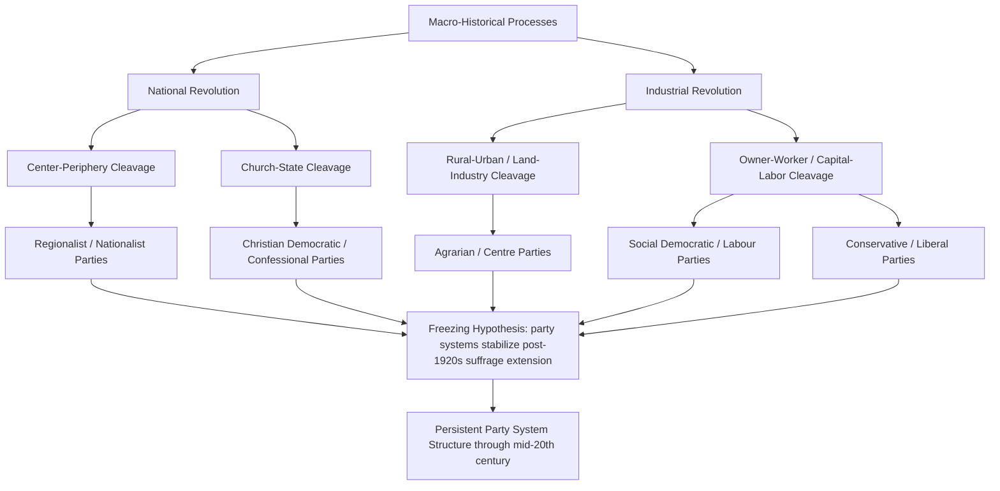

## Cleavage Theory and Party Formation

### Overview

Cleavage theory explains the origins and structure of party systems by tracing them to deep, durable divisions in society — social **cleavages** — that become politically organized and expressed through party competition. The theory's foundational statement is Seymour Martin Lipset and Stein Rokkan's 1967 essay "Cleavage Structures, Party Systems, and Voter Alignments," which argued that Western European party systems were not arbitrary but reflected historical conflicts generated by two great transformative processes: the National Revolution and the Industrial Revolution.

Unlike purely institutional explanations of party systems (e.g., electoral rules under Duverger's Law), cleavage theory is fundamentally **sociological**: it locates the origins of parties in the social structure itself, treating parties as organizational expressions of pre-existing group conflicts rather than as creations of political elites or electoral engineering alone.

### Key Points

- A cleavage is not simply any social difference; it requires a structural basis, group self-awareness, and organizational expression to become politically consequential.
- Lipset and Rokkan identified four principal cleavages arising from two historical revolutions.
- The "freezing hypothesis" proposed that party systems stabilized around these cleavages after the 1920s and changed little thereafter.
- Subsequent scholarship has both extended and challenged the model, particularly regarding new cleavages and partisan dealignment.
- Cleavage theory has been adapted, with modification, to non-Western contexts with different historical trajectories.

### Defining a Cleavage: Bartolini and Mair's Three Elements

A rigorous definition, developed by Stefano Bartolini and Peter Mair (1990), specifies that a genuine cleavage requires three simultaneous components:

1. **Structural/empirical element**: An objective social-structural basis — a measurable, empirically identifiable group defined by, for example, class position, religion, region, or ethnicity.
2. **Normative/cultural element**: A shared set of values, identity, or belief systems that gives the structural group a subjective sense of collective identity and interest.
3. **Organizational/behavioral element**: Institutional expression through organizations — political parties, trade unions, churches, or other associations — that mobilize the group and sustain the cleavage over time.

[Inference] This tripartite definition is widely used to distinguish a true cleavage from a mere demographic category or transient issue-based division; a social difference lacking the normative or organizational component (e.g., a purely statistical income bracket with no shared identity or representative organization) would not qualify as a cleavage under this framework, though scholars differ on how strictly to apply the criteria.

### The Two Revolutions and Four Cleavages

Lipset and Rokkan traced European party systems to critical junctures produced by two macro-historical processes.

**1. The National Revolution** (state- and nation-building, roughly 16th–19th centuries)

- **Center–Periphery Cleavage**: Conflict between the culturally/administratively dominant nation-building center and peripheral regions, ethnic groups, or linguistic minorities resisting standardization and centralized control. *Examples*: the Scottish National Party and Plaid Cymru in the UK, the Bloc Québécois in Canada, the Lega (historically Lega Nord) in Italy, the Basque and Catalan nationalist parties in Spain.
- **Church–State (Religious) Cleavage**: Conflict between the secularizing, centralizing nation-state and the traditional privileges and authority of the (typically Catholic) church over education, family law, and morals. *Examples*: Christian Democratic parties across continental Europe (Germany's CDU/CSU, Italy's historic Democrazia Cristiana, Belgium's CD&V/CDH), formed to defend religious and confessional interests against secular liberal and socialist parties.

**2. The Industrial Revolution** (economic transformation, roughly 18th–20th centuries)

- **Rural–Urban (Land–Industry) Cleavage**: Conflict between landed agricultural interests and the rising urban commercial/industrial class. *Examples*: agrarian parties such as the Nordic Agrarian/Centre parties (Finland's Centre Party, Sweden's Centerpartiet), historically representing farming interests against urban industrial and commercial elites.
- **Owner–Worker (Capital–Labor) Class Cleavage**: Conflict between capital owners/employers and industrial labor, generally regarded as the most electorally significant and enduring cleavage in most Western democracies. *Examples*: Social Democratic and Labour parties (UK Labour, German SPD, Swedish SAP) emerging to represent organized labor, opposed by conservative and liberal parties representing business and property interests.

### Visual Summary: Lipset-Rokkan Cleavage Genealogy

### The Freezing Hypothesis

Lipset and Rokkan's most cited — and most contested — claim is the **"freezing hypothesis"**: that European party systems, by the time mass suffrage was consolidated in the 1920s, had crystallized around the four cleavages and thereafter remained remarkably stable, with the same party families persisting across subsequent decades.

**Mechanisms proposed for "freezing":**

- **Organizational encapsulation**: Parties built dense networks of affiliated organizations (unions, churches, youth groups, newspapers) that socialized voters into durable partisan identities from an early age.
- **High barriers to new party entry**: Once major cleavages were occupied by established parties, electoral systems and voter loyalties created substantial barriers for new entrants.
- **Intergenerational transmission**: Partisan identification, once formed, was passed down within families and reinforced through group membership, producing stable voting blocs across generations.

The famous formulation is that the party systems of the 1960s reflected, to a remarkable degree, the cleavage structures of the 1920s — "frozen" in place despite subsequent social change.

### Critiques and Challenges to the Freezing Hypothesis

**1. Partisan Dealignment**

Beginning in the 1970s, scholars observed declining party identification, weakening class-vote correlations, and increased electoral volatility across advanced democracies — trends inconsistent with a permanently "frozen" system. [Inference] Dealignment is generally attributed to factors such as rising education levels, the expansion of mass media reducing dependence on party-affiliated information sources, and the erosion of traditional class and religious identities through secularization and post-industrial economic change.

**2. New Cleavages: Post-Materialism**

Ronald Inglehart's **post-materialist thesis** (1977) proposed that economic security in advanced industrial societies shifted younger generations' priorities from materialist concerns (economic and physical security) toward post-materialist values (self-expression, environmentalism, quality of life, participation). This helped explain the rise of **Green parties** and **New Left/New Politics parties** from the 1970s–80s onward, representing a cleavage not captured by the original Lipset-Rokkan framework.

**3. New Cleavages: The Cosmopolitan–Communitarian / GAL-TAN Divide**

More recent literature (e.g., Hanspeter Kriesi and colleagues, and the widely used **GAL-TAN** scale — Green/Alternative/Libertarian vs. Traditional/Authoritarian/Nationalist) identifies a cleavage centered on globalization "winners" (cosmopolitan, educated, urban) versus "losers" (economically and culturally threatened by globalization, immigration, and integration). This cleavage is commonly invoked to explain the rise of radical right populist parties (e.g., France's Rassemblement National, Germany's AfD, Italy's Lega) and cosmopolitan/liberal cultural realignment among center and left parties.

**4. Cleavage or Issue?**

[Inference] A recurring methodological debate concerns whether phenomena like immigration attitudes or cultural liberalism constitute a genuine cleavage in the Bartolini-Mair sense (structural + normative + organizational) or a more transient "issue dimension" lacking durable organizational anchoring; scholars are divided, and the classification carries significant implications for predictions about the stability of contemporary party system realignment.

### Adapting Cleavage Theory Beyond Western Europe

The original Lipset-Rokkan model was built specifically from Western European historical experience and requires substantial adaptation elsewhere.

**Latin America**: Scholars have proposed cleavages rooted in state-building conflicts distinct from Europe's, including center-periphery dynamics tied to federalism versus centralism, and — more prominently in the late 20th century — cleavages around import-substitution industrialization versus market liberalization, and populist-versus-oligarchic political traditions.

**Post-Communist Central and Eastern Europe**: Herbert Kitschelt and others have examined whether cleavages here reflect a "communist successor" divide (former regime parties vs. anti-communist opposition parties) rather than the classical Western European sequence, given the absence of an equivalent gradual National/Industrial Revolution sequence under communist rule.

**Postcolonial and Developing Democracies**: In many cases (e.g., India, Nigeria), ethnic, linguistic, caste, and religious cleavages dominate over the class-based owner-worker cleavage central to the European model, reflecting different historical processes of state formation, decolonization, and social stratification. [Inference] This has led scholars to treat the Lipset-Rokkan framework as one instance of a more general theoretical logic — social cleavages structuring party competition — rather than a universally applicable, fixed set of four cleavages.

### Example: Applying the Framework to a Concrete Case

**Illustrative Case — The Netherlands ("Pillarization"/*Verzuiling*)**

The Dutch case is frequently used to illustrate the organizational element of cleavage theory in its purest form. Dutch society historically was divided into distinct **"pillars"** (*zuilen*) — Catholic, Protestant (Calvinist), Socialist, and (to a lesser extent) Liberal — each with:

- Its own political party (e.g., historically the Catholic People's Party, the Anti-Revolutionary Party for orthodox Calvinists, the Labour Party (PvdA) for socialists).
- Its own affiliated newspapers, broadcasting associations, trade unions, schools, and even social clubs and sports associations.

This produced an unusually complete empirical illustration of Bartolini and Mair's three elements: structural group boundaries (religious/class membership), normative identity (pillar-specific worldview), and organizational encapsulation (a comprehensive associational infrastructure). From the 1960s–70s onward, secularization and social change progressively eroded pillarization, and the confessional parties eventually merged into the Christian Democratic Appeal (CDA) in 1980 — an empirical case of cleavage *de-freezing* consistent with the dealignment critique.

### Comparative Framework: Cleavage Theory vs. Rational Choice/Institutional Approaches

| Dimension | Cleavage Theory (Lipset-Rokkan) | Rational Choice / Downsian Spatial Models |
| --- | --- | --- |
| Core driver of party formation | Pre-existing social structure and group conflict | Strategic positioning to maximize votes |
| Party as... | Expression of a social group's identity and interests | Vote-maximizing entrepreneurial actor |
| Voter behavior | Sociologically anchored partisan identity | Rational calculation of policy proximity/utility |
| Explains stability via | Organizational encapsulation, intergenerational transmission | Median voter convergence, equilibrium positioning |
| Explains change via | Realignment of underlying social cleavages | Shifts in voter preference distributions or issue salience |
| Primary weakness | Struggles to explain rapid dealignment/new parties absent clear new cleavages | Struggles to explain persistent party loyalty inconsistent with pure policy proximity |

[Inference] Most contemporary comparative political scientists treat these as complementary rather than strictly competing frameworks: cleavage theory better explains the *origins* and *long-run structure* of party systems, while spatial/rational-choice models better explain *short-run* competitive positioning within an already-established cleavage structure.

### Conclusion

Cleavage theory, anchored in Lipset and Rokkan's account of the National and Industrial Revolutions, remains foundational for understanding why particular party families emerged where and when they did, and why party systems historically exhibited such durability. The four classical cleavages — center-periphery, church-state, rural-urban, and owner-worker — provided the organizing logic for most 20th-century Western European party systems, reinforced through the mechanisms described by the freezing hypothesis. However, the theory has required substantial revision in light of partisan dealignment, the emergence of post-materialist and cosmopolitan-communitarian cleavages, and its application to non-Western contexts with fundamentally different historical trajectories of state formation. Its enduring contribution is methodological as much as substantive: the insistence that party systems be understood as sociologically rooted rather than as arbitrary products of electoral engineering alone.

**Related Topics**

- Classifying Party Systems (Sartori's typology, Effective Number of Parties)
- Partisan dealignment and the decline of class voting
- Post-materialism and Inglehart's value change thesis
- The GAL-TAN dimension and radical right populist party emergence
- Party system institutionalization (Mainwaring-Scully criteria)
- Pillarization (*verzuiling*) and consociational democracy
- Comparative party families: Christian Democracy, Social Democracy, Agrarianism
- Ethnic and regional cleavages in postcolonial party systems
- Downsian spatial competition theory and median voter models
- Critical elections and realignment theory in American politics (V.O. Key Jr.)