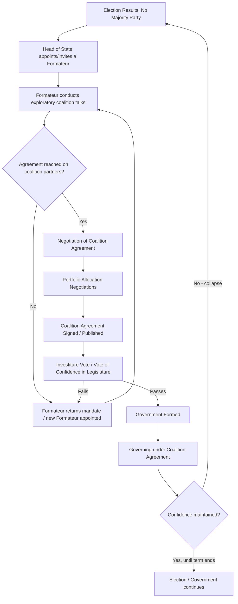

## Coalition Politics and Government Formation

### Overview

Coalition politics concerns the processes by which multiple political parties combine to form a government when no single party commands a legislative majority — a common circumstance in parliamentary systems using proportional representation, and an occasional occurrence even under plurality rules. The study of government formation asks three central questions: **which parties combine**, **how portfolios and policy concessions are allocated**, and **how stable and durable** the resulting government proves to be. This field sits at the intersection of formal/rational-choice political theory and comparative empirical analysis, and has generated some of the most rigorously formalized theory in political science.

### Key Points

- Coalition formation is necessitated by hung parliaments/legislatures where no party holds an outright majority of seats.
- William Riker's **minimal winning coalition** theory, grounded in rational-choice assumptions, remains the foundational formal model.
- Subsequent theory incorporated ideological/policy considerations (minimum connected winning coalitions, policy-seeking vs. office-seeking parties).
- Empirical patterns of coalition formation vary systematically by country, institutional context, and party system type.
- Coalition governments face distinct challenges of governance, accountability, and stability not present in single-party majority government.

### Why Coalitions Form: The Structural Precondition

Coalition government becomes necessary whenever electoral outcomes fail to produce a **legislative majority** for a single party. This is disproportionately common under:

- **Proportional representation (PR) electoral systems**, which tend to produce multiparty legislatures (per Duverger's Law and the Effective Number of Parties framework).
- **Fragmented party systems**, whether due to social cleavage structure (see cleavage theory) or permissive electoral thresholds.

By contrast, plurality/majoritarian electoral systems (e.g., UK, Canada, historically) more often manufacture single-party majorities even from a plurality of the vote, making coalition government comparatively rare — though not unheard of (e.g., the UK Conservative-Liberal Democrat coalition of 2010–2015).

### Riker's Minimal Winning Coalition Theory

William Riker's *The Theory of Political Coalitions* (1962) provides the foundational formal model, built on rational-choice/game-theoretic assumptions.

**Core assumptions:**

1. Parties are **office-seeking**: their primary goal is to maximize their share of government offices/spoils (cabinet portfolios, patronage), not necessarily to maximize policy influence.
2. Politics is a **zero-sum game** over a fixed set of governmental "spoils" (offices, resources).
3. Rational actors will seek to **minimize the size of the winning coalition**, because a smaller coalition means fewer parties with whom to share the fixed pool of spoils.

**The Size Principle**: Riker's central proposition is that rational, office-seeking political actors will form coalitions that are **just large enough to win** (i.e., control a majority of seats) but **no larger** — a "minimal winning coalition" (MWC). Any party beyond what is strictly necessary for a majority is excluded, since including it would only dilute the spoils among more members without adding necessary voting strength.

**Formal definition**: A coalition $C$ is minimal winning if:

$$\sum_{i \in C} s_i > 0.5 \text{ (or the relevant majority threshold)}$$

and removing any single party $j \in C$ would cause the coalition to fall below that threshold:

$$\sum_{i \in C \setminus \{j\}} s_i \leq 0.5$$

**Worked Example**:

Suppose a 100-seat legislature has four parties: A = 40 seats, B = 30 seats, C = 20 seats, D = 10 seats. Majority threshold = 51 seats.

- A+B = 70 seats → winning, and removing either A or B breaks the majority → **minimal winning coalition**.
- A+B+C = 90 seats → winning, but removing C still leaves A+B at 70 (still winning) → **not minimal** (C is a superfluous/non-critical member).
- A+C = 60 seats → winning and minimal.
- B+C+D = 60 seats → winning and minimal (removing any one member breaks the majority).
- A alone = 40 seats → not winning (losing coalition).

Riker's theory predicts that among these options, actors will gravitate toward *some* minimal winning coalition (A+B, A+C, or A+D+C, etc.) rather than an oversized coalition like A+B+C, since the latter needlessly dilutes spoils.

[Inference] Riker's pure office-seeking, zero-sum framework was influential in establishing formal coalition theory but has been extensively critiqued and extended since, as it does not by itself explain *which* particular minimal winning coalition forms among several mathematically possible ones, nor does it account for policy/ideological considerations.

### Refinements: Incorporating Policy and Ideology

**Minimum Connected Winning Coalitions (Axelrod, 1970)**

Robert Axelrod proposed that coalitions are not merely minimal in size, but tend to be **ideologically "connected"** — composed of parties that are adjacent to one another on a left-right policy dimension, without "ideologically distant" outliers, even if a smaller coalition were mathematically available with a non-adjacent party. This reflects the practical governing difficulty of forming stable policy compromises among ideologically disparate partners.

**Policy-Seeking vs. Office-Seeking Behavior**

Later scholars (e.g., Laver and Schofield, *Multiparty Government*, 1990) distinguished:

- **Office-seeking parties**: primarily motivated by cabinet portfolios and patronage (Riker's original assumption).
- **Policy-seeking parties**: primarily motivated by achieving policy outcomes close to their ideological position, even at the cost of office.

This distinction helps explain empirical anomalies such as **minority governments** (below) and **oversized/surplus majority coalitions**, both of which are puzzling under a pure office-seeking, minimal-size framework.

**Median Legislator/Party Theories**

Building on spatial (Downsian) models, some theories predict that the party controlling the **median legislator** on the primary policy dimension is disproportionately likely to be included in government, since it is pivotal to constructing a winning majority on either side.

### Minority and Oversized Governments: Departures from the Minimal Winning Prediction

**Minority Governments**

A government controlling fewer than half the legislative seats, relying on informal or issue-by-issue support from non-government parties (via confidence-and-supply arrangements or ad hoc voting agreements) rather than formal coalition membership.

- *Common in*: Scandinavian countries (Denmark, Sweden, Norway have frequently governed via minority cabinets), Canada at times.
- [Inference] Minority governments are often explained by strategic incentives: opposition parties may prefer supporting a minority government from outside (retaining freedom to criticize and avoid blame for unpopular policies) rather than joining formally and sharing responsibility, particularly when an early election is anticipated to improve their position.

**Oversized (Surplus Majority) Coalitions**

Coalitions including more parties than mathematically necessary for a majority.

- *Explanations typically offered*: reducing the "blackmail potential" of the coalition being held hostage by a single small pivotal partner; providing a buffer against defections; accommodating grand coalition norms in consensus-oriented systems (e.g., Germany's CDU/CSU-SPD "grand coalitions"); or managing external shocks/crises requiring broad legitimacy (e.g., wartime or emergency national unity governments).

### The Government Formation Process: Institutional Stages

While specifics vary by country, most parliamentary systems follow a broadly similar sequence:

**Key institutional actors and mechanisms:**

- **Formateur**: the individual (typically the leader of the largest party or the party best positioned to build a majority) formally tasked by the head of state with attempting to construct a governing coalition.
- **Informateur** (used in some systems, e.g., the Netherlands, Belgium): a preliminary figure tasked with exploring which coalitions are feasible before a formal formateur is appointed.
- **Investiture vote**: in many systems (e.g., Spain, Germany implicitly via chancellor election), the proposed government must win an explicit parliamentary vote of confidence before taking office; in others (e.g., historically the UK), government forms upon royal appointment without a mandatory prior vote, subject to later confidence votes.
- **Coalition agreement**: an increasingly formalized, often lengthy written document specifying policy commitments, portfolio distribution, and sometimes dispute-resolution mechanisms for the life of the coalition (highly elaborate in countries like Germany and the Netherlands; a more sparse convention in others).

### Portfolio Allocation

A major empirical regularity in coalition studies is **Gamson's Law** (William Gamson, 1961): the proportion of cabinet portfolios (ministries) a party receives tends to be roughly **proportional to the number of seats it contributes to the coalition**.

$$\frac{\text{Portfolios}_i}{\text{Total Portfolios}} \approx \frac{\text{Seats}_i}{\text{Total Coalition Seats}}$$

[Inference] Gamson's Law is one of the most robustly replicated empirical regularities in comparative coalition studies, though deviations occur — smaller parties sometimes secure disproportionately valuable or numerous portfolios (relative to strict seat proportionality) due to their pivotal bargaining position (blackmail potential in Sartori's sense) or by claiming a small number of especially salient ministries (e.g., a Green party insisting on the environment ministry) rather than a proportional share of all ministries.

**Salience of specific portfolios**: Beyond raw counts, parties often prioritize ministries central to their core policy platform (e.g., a labor party seeking the labor/social affairs ministry, a nationalist regional party seeking regional development), meaning portfolio *allocation quality*, not just quantity, matters for policy-seeking coalition theory.

### Coalition Government Stability and Duration

Coalition governments are commonly perceived as less stable than single-party majority governments, though the empirical picture is nuanced.

**Factors associated with coalition durability** (drawing on cross-national studies, e.g., Lupia and Strøm; Warwick):

- **Ideological compactness**: coalitions of ideologically proximate parties (per Axelrod's connectedness) tend to last longer than ideologically heterogeneous ones.
- **Number of coalition partners**: all else equal, coalitions with fewer parties tend to be more durable (fewer veto points and inter-party bargaining failures).
- **Bicameral/constitutional constraints**: constructive vote of no-confidence provisions (requiring the opposition to agree on an alternative government before ousting the incumbent, as in Germany) tend to enhance coalition stability by raising the bar for collapse.
- **Electoral cycle proximity**: governments nearing scheduled elections may either stabilize (avoiding unpopular collapse) or destabilize (parties positioning for the next election), and empirical findings here are mixed.
- **External shocks**: economic crises, corruption scandals, and unexpected events are frequently proximate triggers of coalition collapse even when underlying ideological compatibility was reasonable.

**Comparative note**: Italy's First Republic (1945–1993) is frequently cited as an extreme case of coalition instability (dozens of governments in under five decades) linked to Sartori's polarized pluralism dynamics discussed under party system classification, whereas Germany and the Nordic countries are typically cited as comparatively stable coalition environments due to more moderate pluralism and stronger formal/informal bargaining norms.

### Example: Types of Coalitions Illustrated

| Coalition Type | Definition | Illustrative Example |
| --- | --- | --- |
| Minimal Winning Coalition | Smallest set of parties needed for majority | Germany's CDU/CSU-FDP coalitions (multiple periods) |
| Minimum Connected Winning | Minimal winning + ideologically adjacent parties only | Nordic center-right/center-left bloc coalitions |
| Oversized/Surplus Majority | More parties than mathematically necessary | Germany's CDU/CSU-SPD "Grand Coalitions" (2005–09, 2013–17, 2018–21) |
| Minority Government | Below-majority government with external support | Danish and Swedish minority cabinets; Canadian minority parliaments |
| Grand Coalition | The two largest (often rival) parties govern together | Austria's SPÖ-ÖVP coalitions (historically frequent) |
| Caretaker Government | Temporary administration pending new government formation | Belgium's caretaker periods during prolonged formation talks (e.g., 2010–2011, 541 days without a government) |

### Coalition Politics and Party System Interaction

Coalition dynamics are shaped by, and in turn shape, the broader party system classification discussed previously:

- In **moderate pluralism** (Sartori), coalition bargaining tends to be centripetal, with coalitions forming among ideologically proximate parties around the center.
- In **polarized pluralism**, the presence of anti-system parties on the flanks constrains coalition options to a narrower "coalitionable" center-right/center-left range, often producing chronic reliance on similar core parties (as in Italy's Christian Democracy-centered governments for decades) and contributing to instability.
- **Predominant-party systems** may render coalition theory largely moot at the national level, since one party governs alone repeatedly, though coalition dynamics can still operate *within* a dominant party's internal factions.

### Conclusion

Coalition politics and government formation address a core empirical reality of most democracies employing proportional or mixed electoral systems: governing requires assembling cross-party agreement rather than relying on a single-party mandate. Riker's minimal winning coalition theory established the foundational rational-choice framework, predicting coalitions no larger than strictly necessary to maximize the share of spoils per member, while subsequent refinements (Axelrod's connected coalitions, Laver and Schofield's office-seeking/policy-seeking distinction) better account for observed deviations such as minority and oversized governments. Empirical regularities like Gamson's Law demonstrate that portfolio allocation is systematically, if imperfectly, tied to bargaining power, while comparative studies of coalition duration link stability to ideological compactness, institutional design, and party system type. Understanding coalition politics therefore requires integrating formal bargaining theory with the institutional and party-system context in which government formation occurs.

**Related Topics**

- Classifying Party Systems (Sartori's moderate vs. polarized pluralism, Effective Number of Parties)
- Cleavage Theory and Party Formation
- Electoral systems and their mechanical/psychological effects (Duverger's Law)
- Confidence and no-confidence procedures (constructive vote of no-confidence)
- Portfolio allocation and Gamson's Law in comparative perspective
- Minority government theory and legislative bargaining
- Comparative case studies: Weimar/Italian polarized pluralism vs. Nordic/German consensus models
- Spatial models of party competition (Downsian median voter theorem)
- Federalism and multilevel coalition bargaining
- Caretaker governments and prolonged government formation crises