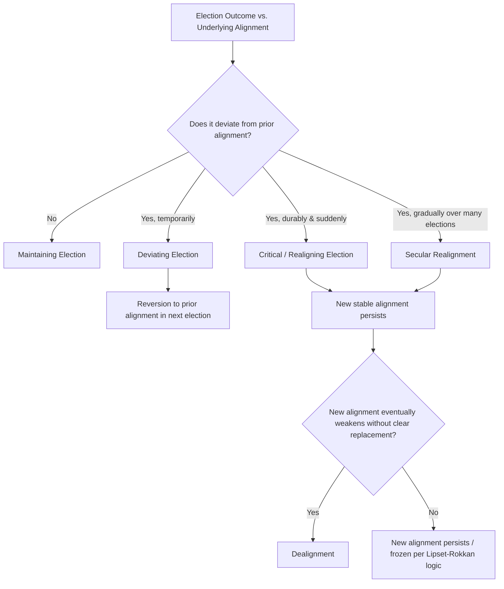

## Party System Change and Realignment

### Overview

Party system change and realignment theory addresses how and why the structure of party competition — the number of relevant parties, their relative strength, the cleavages they represent, and voters' patterns of attachment — shifts over time, in contrast to the relative stability implied by the "freezing hypothesis" in classical cleavage theory. Where cleavage theory explains the origins and historical persistence of party systems, realignment theory explains their **transformation**, whether through sudden, dramatic rupture or gradual, cumulative erosion. The field draws heavily on American political science (particularly V.O. Key Jr.'s foundational work) but has been extended into a general comparative framework applicable to European and other party systems.

### Key Points

- Party system change can occur along a spectrum from abrupt "critical" realignment to gradual "secular" realignment to non-directional "dealignment."
- V.O. Key Jr.'s concept of the **critical election** remains the foundational typology for realignment theory.
- **Dealignment** — the weakening of partisan attachment without a corresponding new alignment — is the dominant pattern identified in most advanced democracies since the 1970s.
- Structural, institutional, and behavioral explanations each contribute to accounts of why and when realignment occurs.
- Realignment concepts, while developed primarily in the U.S. context, have been adapted for comparative and European party system analysis.

### V.O. Key Jr. and the Critical Election

The foundational realignment concept originates with V.O. Key Jr.'s 1955 article "A Theory of Critical Elections," based on analysis of New England voting patterns.

**Definition of a critical election**: An election characterized by:

1. **High voter turnout and intensity of engagement**, reflecting unusually high stakes perceived by the electorate.
2. **Sharp and durable shifts** in the geographic and group bases of party support.
3. **Persistence of the new alignment** in subsequent elections — the change is not a temporary deviation but establishes a new, lasting pattern of party competition.

Key's original formulation focused on relatively short, sharp electoral shifts. In a 1959 follow-up article, Key extended the concept to **secular realignment** — gradual, incremental shifts in group-party alignments occurring cumulatively across many elections rather than in a single dramatic contest.

### The Three Modes of Party System Change

Comparative and American political science generally distinguishes three (sometimes four) patterns of change, often visualized as a spectrum from stability to disruption.

**1. Maintaining Elections**

Elections that simply confirm and continue the existing pattern of party competition and voter alignment, with no significant durable shift in the coalitions supporting each party. The majority of elections in any stable party system fall into this category.

**2. Deviating Elections**

Elections in which short-term forces (a particularly popular or unpopular candidate, a salient scandal, an economic shock) produce a temporary departure from the underlying, longer-term partisan alignment, but the electorate reverts to the prior pattern in the subsequent election. *Example*: Dwight Eisenhower's personal popularity delivering Republican presidential victories in 1952 and 1956 without a durable shift in the underlying New Deal Democratic coalition at other levels of government.

**3. Realigning (Critical) Elections**

Elections producing a durable transformation in the coalitional basis of party support, establishing a new "normal" pattern of competition that persists across subsequent elections. Commonly cited American examples include:

- **1860**: Realignment establishing the Republican Party as a major force amid the collapse of the Whigs and the sectional crisis over slavery.
- **1896**: Realignment consolidating Republican dominance in the industrializing Northeast and Midwest against a Democratic-Populist coalition centered on agrarian and silver-standard interests.
- **1932**: The New Deal realignment, forging the Democratic coalition of urban workers, ethnic minorities, Southern whites, and organized labor that dominated American politics for decades.
- **1968–1980 (contested)**: Some scholars identify a further realignment around this period, associated with the "Southern Strategy," the breakup of the New Deal coalition over civil rights, and the eventual consolidation of a Republican-leaning South — though this case is often analyzed as **secular** rather than a single critical election.

**4. Secular Realignment**

Gradual, cumulative shifts in group-party alignment occurring across many elections rather than in one dramatic contest, driven by incremental demographic, generational, or attitudinal change rather than a single galvanizing crisis. [Inference] Secular realignment is generally considered harder to identify empirically in real time, since it lacks the clear "before/after" marker of a single critical election and is often only recognized retrospectively.

### Visual Summary: Modes of Party System Change

### Dealignment: The Dominant Contemporary Pattern

Since the 1970s, the pattern most extensively documented across advanced industrial democracies is not realignment (the replacement of one durable alignment with another) but **dealignment** — the weakening of partisan attachments generally, without the emergence of a clear, comparably durable new alignment.

**Key empirical indicators of dealignment:**

- **Declining party identification**: Fewer voters report a strong, stable psychological attachment to a party (documented extensively in the American National Election Studies and comparable European surveys).
- **Increased electoral volatility**: Rising vote-switching between elections, measurable via the **Pedersen Index** (introduced under party system classification), indicating weaker durable loyalty.
- **Declining class voting**: The correlation between social class position and vote choice (central to the owner-worker cleavage) has weakened substantially in most Western democracies since the 1960s–70s, a trend documented by scholars such as Mark Franklin and colleagues in comparative class-voting studies.
- **Rise of "issue voting" and candidate-centered politics**: Voters increasingly evaluate specific issues or candidate characteristics on an election-by-election basis rather than relying on standing partisan identity as an informational shortcut.
- **Increased split-ticket voting** (in systems permitting it): Voters supporting different parties for different offices in the same election, indicating weaker unified partisan loyalty.

**Explanations for dealignment** [Inference — causal weighting varies across the literature]:

- **Cognitive mobilization** (Russell Dalton): Rising education levels and media access reduce voters' need for party cues to navigate politics, enabling more independent, issue-based evaluation.
- **Decline of traditional social structures**: Secularization, declining union density, and weakening of class-based community institutions erode the organizational encapsulation mechanisms (per Bartolini and Mair) that historically sustained partisan loyalty.
- **Changing media environment**: The shift from partisan press and broadcasting to more fragmented and personalized media consumption reduces the role of party-affiliated information sources in reinforcing identification.
- **Post-materialist value change** (per Inglehart): The rise of value-based rather than purely class-based political orientations disrupts the fit between older party alignments and new voter priorities.

### Realignment vs. Dealignment: A Comparative Distinction

| Feature | Realignment | Dealignment |
| --- | --- | --- |
| Nature of change | Replacement of one stable alignment with another | Erosion of stable alignment generally |
| Partisan attachment | Shifts to new party but remains strong | Weakens across the board |
| Volatility pattern | Sharp, then restabilizes at new equilibrium | Persistently elevated, no clear new equilibrium |
| Typical driver | Salient crisis or cleavage-defining event (e.g., depression, civil rights) | Long-run social/structural/cognitive change |
| Theoretical home | V.O. Key Jr., critical election theory | Russell Dalton, cognitive mobilization theory |
| Predicted party system trajectory | New "frozen" equilibrium (per Lipset-Rokkan logic) | Ongoing fluidity, fragmentation, potential for new/niche party entry |

### Party System Change in Comparative (Non-U.S.) Context

While Key's framework originated in American electoral history, comparative scholars have extended and adapted realignment concepts to European and other party systems, often integrating them with cleavage theory.

**European "New Politics" Realignment**: The rise of Green and New Left parties from the 1970s–80s, associated with post-materialist value change, is often analyzed as a form of realignment around a new (environmental/quality-of-life) cleavage cross-cutting the traditional class-based owner-worker cleavage.

**Radical Right Populist Realignment**: The more recent rise of parties along the GAL-TAN/cosmopolitan-communitarian dimension (e.g., France's Rassemblement National, Germany's AfD, the Netherlands' PVV/BBB) is frequently framed as an ongoing realignment process — some scholars argue this constitutes a "silent counter-revolution" (Piero Ignazi's term) against the post-materialist New Politics realignment of the prior generation, illustrating that realignments can occur in successive, even opposing, waves.

**Post-Communist Party System Formation**: In Central and Eastern Europe after 1989, scholars debate whether the rapid, often chaotic emergence and dissolution of parties in the 1990s–2000s constitutes a distinct process from Western "realignment" — since there was no prior "frozen" alignment to realign *from* — leading some (e.g., Kitschelt) to prefer terms like party system "formation" or "structuration" rather than realignment for these cases. [Unverified] The applicability of Western dealignment/realignment terminology to post-communist contexts remains a subject of ongoing scholarly debate rather than settled consensus.

### Example: Tracing a Realignment Empirically

**Illustrative Case — The U.S. New Deal Realignment (1932) and Its Later Erosion**

1. **Pre-realignment baseline**: Prior to 1932, the Republican Party held a dominant electoral coalition rooted in Northern business, industrial, and some working-class Protestant voters, a legacy of the 1896 realignment.
2. **Critical election (1932)**: The Great Depression triggered a decisive shift, with Franklin D. Roosevelt's Democratic coalition drawing together urban ethnic and Catholic voters, organized labor, African Americans (a significant later shift, initially still Republican-leaning in the 1930s but consolidating with Democrats by the 1960s), and white Southern voters (a historically Democratic bloc since Reconstruction).
3. **Persistence (maintaining elections, 1930s–1960s)**: This coalition sustained Democratic dominance across multiple subsequent elections, consistent with a genuine critical realignment per Key's criteria.
4. **Secular erosion (1960s–1980s)**: Civil rights legislation under Democratic administrations progressively alienated white Southern voters from the Democratic coalition — a gradual, multi-election process (secular realignment) rather than a single critical election — eventually producing the modern Republican-leaning South.
5. **Contemporary dealignment overlay**: Since the 1970s–80s, this Southern realignment has been accompanied by broader national dealignment trends (declining party ID, rising independents, increased volatility), illustrating how realignment and dealignment processes can operate simultaneously on different dimensions of the same party system.

### Methodological Challenges in Identifying Realignment

- **Retrospective bias**: Realignments are often only confidently identified well after the fact, once the durability of a new alignment across multiple elections can be confirmed — contemporaries frequently cannot distinguish a deviating election from the start of a genuine critical realignment in real time.
- **Level-of-analysis problems**: A realignment can be visible at one level of the political system (e.g., presidential voting) while the prior alignment persists longer at another (e.g., state legislatures or local government), complicating any single, unified declaration of "the" realignment date.
- **Operationalization of "durability"**: There is no universally agreed number of elections required to confirm a shift is durable rather than a prolonged deviating pattern, introducing an element of scholarly judgment into realignment classification. [Inference] This ambiguity is a significant reason why some scholars (e.g., critics of Key's original formulation) have questioned whether "critical realignment" is a fully coherent, cleanly identifiable category rather than one useful frame among several for describing party system change.

### Conclusion

Party system change and realignment theory extends cleavage theory's static account of party system origins into a dynamic framework for understanding how and why established patterns of party competition transform. V.O. Key Jr.'s distinction between maintaining, deviating, and realigning (critical) elections, later supplemented with the concept of secular realignment, provides the classical vocabulary for analyzing sudden versus gradual change. Since the 1970s, however, the dominant empirically documented pattern across most advanced democracies has been **dealignment** — a general weakening of partisan attachment without a clear, comparably stable replacement alignment — associated with cognitive mobilization, secularization, and changing media environments. Extending these American-originated concepts comparatively requires care, particularly in post-communist and post-colonial contexts lacking an equivalent prior "frozen" alignment, but the underlying analytical questions — what changes, how durably, and why — remain central to understanding the evolution of any party system over time.

**Related Topics**

- Cleavage Theory and Party Formation (the freezing hypothesis)
- Classifying Party Systems (Sartori's typology and the Effective Number of Parties over time)
- Coalition Politics and Government Formation
- Partisan dealignment and cognitive mobilization (Russell Dalton)
- Post-materialism and the rise of Green/New Left parties (Inglehart)
- The GAL-TAN dimension and radical right populist realignment
- Electoral volatility measurement (the Pedersen Index)
- Post-communist party system formation and structuration debates
- American electoral history: the New Deal coalition and Southern realignment
- Niche party entry and party system fragmentation theory