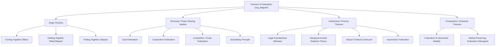

## Theories of Federalism

### Overview

Federalism denotes a constitutional arrangement in which sovereignty or governing authority is constitutionally divided between a central (national/federal) government and constituent territorial units (states, provinces, regions, cantons, Länder). "Theories of federalism" refers to the body of normative, empirical, and institutional frameworks political scientists and legal scholars use to explain why federal systems form, how authority is allocated and exercised, and how intergovernmental relations evolve over time. These theories provide the analytical vocabulary for comparative federalism studies (e.g., US, Germany, India, Canada, Nigeria, Malaysia, EU).

### Foundational Distinctions

**Federalism vs. Unitary vs. Confederal Systems**

- **Unitary system**: Ultimate sovereignty resides in the central government; subnational units exist and exercise power by devolution/delegation and can, in principle, be abolished or restructured by the center (e.g., UK, France, Japan).
- **Federal system**: Sovereignty is constitutionally divided; both levels derive authority directly from a founding constitution, not from each other, and neither can unilaterally abolish the other (e.g., United States, Germany, Brazil, India).
- **Confederal system**: Sovereignty resides primarily with the constituent units; the central body is a creature of the units, dependent on their continued consent, often lacking direct authority over individuals (e.g., the historical Articles of Confederation, arguably the EU in certain respects, though the EU is frequently classified as *sui generis*).

$$\text{Unitary} \; \longleftarrow \; \text{Federal} \; \longleftarrow \; \text{Confederal}$$

This is best understood as a spectrum of sovereignty concentration rather than three hermetically sealed categories — many real-world systems ("quasi-federal," "devolved unitary") sit between these points. [Inference: precise placement on this spectrum is often contested among scholars for hybrid cases like Spain or the UK post-devolution.]

**Key Conceptual Elements Common to Federal Theory**

- Constitutional entrenchment of the division of powers (not ordinary statute)
- Dual or multiple sources of legitimate authority
- A mechanism for resolving disputes between levels (typically a constitutional/supreme court)
- Some form of subnational representation in national institutions (e.g., a federal second chamber)
- Formal amendment procedures requiring subnational consent or supermajorities

### Classical/Normative Theories

**1. Origin Theory — "Coming Together" vs. "Holding Together" (William Riker, 1964)**

Riker's bargaining theory remains the dominant rational-choice explanation for the *formation* of federations.

- **Coming-together federalism**: Previously independent or sovereign units voluntarily bargain to unite, typically driven by external military/security threats or the promise of collective economic gain, while units retain guarantees over residual autonomy. Example: the original 13 American states (1787), Switzerland's cantons, Australia's colonies (1901).
- **Holding-together federalism**: A previously unitary state decentralizes to accommodate internal diversity (ethnic, linguistic, religious, regional) and forestall secession. Example: India (1950), Belgium (1993), Spain's Estado de las Autonomías (1978), post-Soviet Russia. [Inference: Riker's own typology was later extended by scholars like Alfred Stepan (1999), who added a third path.]
- **Putting-together federalism** (Stepan's extension): A coercive/authoritarian center imposes federal structures on previously non-federal or non-consenting units, often as a mechanism of imperial or ideological control rather than genuine bargaining. Example often cited: the USSR's constituent republics. [Inference/Speculation: this category is more contested and debated than the first two, since scholars disagree on how much genuine federalism existed under Soviet centralism.]

**Key Points**

- Riker's theory is fundamentally about elite bargaining and the trade-off between military/economic security and loss of unit autonomy.
- The origin path shapes subsequent institutional design: coming-together federations tend to have stronger subnational veto powers (e.g., strong bicameralism, unanimity for certain amendments), while holding-together federations often retain a stronger center with asymmetric arrangements for restive regions.

**2. Dual Federalism ("Layer-Cake Federalism")**

A classical American doctrinal model (dominant roughly 1789–1930s) holding that:

- National and state governments operate in **mutually exclusive, clearly separated spheres** of jurisdiction.
- Each level is supreme and autonomous within its own sphere, akin to distinct layers of a cake that do not intermix.
- The national government's powers are strictly enumerated (Article I, Section 8 in the US case), with residual powers reserved to the states (10th Amendment).

**3. Cooperative Federalism ("Marble-Cake Federalism")**

Associated with Morton Grodzins (1960s) and the New Deal/Great Society eras:

- National and subnational governments **share, overlap, and interact** in functional policy areas (e.g., healthcare, environmental regulation, infrastructure) rather than occupying separate silos.
- Intergovernmental grants-in-aid, conditional funding, and joint administration are the primary instruments.
- Reflects a shift toward interdependence: policy implementation requires vertical collaboration rather than jurisdictional separation.

**Example**: In the U.S., Medicaid is a cooperative federalism program — federally funded and regulated in its baseline requirements, but administered and partially funded by individual states, which retain discretion over eligibility expansions and delivery mechanisms.

**4. Competitive Federalism (Fiscal Federalism / "Race" Models)**

Drawing on public choice economics (Charles Tiebout's 1956 "voting with your feet" model, and later Wallace Oates's fiscal federalism theory):

- Subnational units compete for mobile residents, capital, and businesses by offering different bundles of taxes and public services.
- This competition is theorized to produce efficiency gains (a market-like sorting of citizens into jurisdictions matching their preferences) but can also produce a **"race to the bottom"** in regulatory or tax standards (e.g., corporate tax competition, environmental deregulation) — a normatively contested outcome. [Inference: whether competitive federalism is net-beneficial or net-harmful remains a genuinely disputed empirical/normative question in the fiscal federalism literature.]

**5. Fiscal Federalism (Oates's Decentralization Theorem)**

A formal economic theory concerning the optimal assignment of taxing, spending, and regulatory authority across levels of government.

- **Decentralization Theorem**: For a public good whose consumption is defined over geographically limited subsets of the population, it is more efficient for local governments to provide levels tailored to local preferences than for a uniform national level to be imposed on all jurisdictions — provided there are no significant economies of scale or spillovers from centralized provision.
- Distinguishes three functions of government per Musgrave: **stabilization** and **distribution** (best handled centrally, due to mobility and macroeconomic scale issues) versus **allocation** (better handled locally, due to heterogeneous preferences).

**6. New Federalism / Devolution Theory**

A late-20th-century American policy movement (Nixon-era and Reagan-era) advocating the **return** of power, program authority, and fiscal responsibility from the federal government to the states, typically via block grants replacing categorical/conditional grants. Theoretically grounded in subsidiarity and public choice critiques of centralized bureaucracy.

**7. Subsidiarity Principle**

Originating in Catholic social doctrine (Pope Pius XI's *Quadragesimo Anno*, 1931) and later codified as a constitutional principle in the European Union (Article 5, Treaty on European Union):

- Decisions and governance functions should be exercised at the **lowest, most local level capable of effectively addressing them**, with higher levels intervening only when local/regional levels cannot achieve the objective sufficiently.
- Functions as both a normative principle (respecting local autonomy and democratic proximity) and a legal/justiciable standard (in the EU, subsidiarity compliance can be reviewed by national parliaments and the Court of Justice of the EU).

### Structural/Institutional Theories

**8. Legal-Constitutional (Formalist) Theory of Federalism**

Associated with K.C. Wheare's classic definition (*Federal Government*, 1946): federalism exists where the constitution divides powers between coordinate, independent levels of government, **each of which is, within its sphere, coordinate with and not subordinate to the other.** Wheare's test emphasizes formal constitutional independence — neither level should owe its authority or existence to the other. This approach has been criticized for being overly formalistic and static, ignoring the fluid, negotiated practice of intergovernmental relations. [Inference: this criticism is now broadly accepted in comparative federalism scholarship, though Wheare's definitional framework is still commonly taught as a baseline.]

**9. Intergovernmental Relations (IGR) Theory**

Shifts analytical focus from static constitutional text to the ongoing, dynamic **process** of interaction, negotiation, and coordination between levels of government (and between units at the same level, i.e., horizontal IGR).

- Emphasizes formal and informal mechanisms: intergovernmental councils, conditional grants, joint task forces, executive federalism (meetings among heads of government/ministers, e.g., Canada's First Ministers' Conferences, Australia's National Cabinet, Germany's Bundesrat-mediated coordination).
- Highlights that real-world federal practice often diverges substantially from formal constitutional design.

**10. Asymmetric Federalism**

Describes federal systems in which constituent units possess **differentiated** degrees of autonomy, powers, or constitutional status rather than uniform, symmetric arrangements.

- **Example**: Canada's recognition of Québec's distinct society status and special immigration/language powers; India's Article 370 (historically, for Jammu & Kashmir, prior to its 2019 abrogation) and continuing special provisions for states like Nagaland (Article 371A); Spain's differentiated fueros for the Basque Country and Navarre.
- Theoretically justified as a mechanism for accommodating deep ethnic, linguistic, or historical diversity within a single federal state without requiring uniform decentralization everywhere.

**11. Federalism as a Continuum / Degrees of Federalism (Daniel Elazar)**

Elazar (*Exploring Federalism*, 1987) argued federalism is best understood not as a fixed category but as a **spectrum of self-rule plus shared-rule** arrangements, ranging from confederations, to federations, to federacies (asymmetric relationships between a large unit and a smaller autonomous one, e.g., Puerto Rico–US), to associated statehood, to condominiums, and to leagues. Elazar also emphasized the **covenantal** (as opposed to purely coercive or hierarchical) foundations of federal political culture — the idea that federal bargains are quasi-contractual partnerships.

### Comparative/Empirical Theories

**12. Federalism and Democratic Stability**

A long-running empirical debate concerns whether federalism helps or harms democratic consolidation and national unity in ethnically divided societies:

- **Accommodationist view** (e.g., Arend Lijphart's consociationalism, Alfred Stepan): Federalism, especially when combined with asymmetric or "multinational" designs, can manage and channel ethnic/regional conflict by giving groups territorial self-governance, reducing secessionist pressure.
- **Centripetalist/skeptical view** (e.g., some readings of Nigeria, former Yugoslavia, or the USSR): Territorially defined federal units organized along ethnic lines can *entrench* and *institutionalize* ethnic identities, provide resources and institutional platforms for secessionist mobilization, and in the worst cases contribute to state breakup. [Speculation: the causal direction here — whether federalism causes fragmentation or merely provides an arena in which pre-existing fragmentation plays out — remains empirically unresolved and is actively debated in the comparative politics literature.]

**13. Market-Preserving Federalism (Barry Weingast, 1995)**

A political-economy theory proposing that federal systems can (under specific conditions) credibly commit governments to **not** expropriate private economic actors or interfere destructively in markets, because:

1. Subnational governments have primary regulatory authority over their own economies.
2. The national government cannot unilaterally revoke this authority.
3. A common market exists across the federation (no internal trade barriers).
4. Subnational governments face a **hard budget constraint** — they cannot be bailed out indefinitely by the center, disciplining fiscal behavior.

This theory has been influential in explaining variation in economic performance across federal systems (e.g., contrasts drawn between China's fiscal decentralization dynamics and classical federations, though China is not federal in the constitutional-legal sense). [Inference: applying market-preserving federalism to non-federal decentralized systems like China is an extension debated among scholars, since Weingast's original framework assumes formal federal constitutionalism.]

### Diagrammatic Summary

### Powers Distribution Diagram (SVG)

<svg xmlns="http://www.w3.org/2000/svg" viewBox="0 0 720 320">
<text x="360" y="24" text-anchor="middle" font-size="16" font-weight="bold" fill="#1a1a1a">Dual vs. Cooperative Federalism Models (svg_diagram)</text>

<text x="180" y="50" text-anchor="middle" font-size="13" font-weight="bold" fill="#333">Dual Federalism (Layer-Cake)</text>

<rect x="60" y="65" width="240" height="60" fill="`#a8d5ba`" stroke="#333" stroke-width="1.5" />

<text x="180" y="100" text-anchor="middle" font-size="12" fill="`#1a1a1a`">National Government Sphere</text>

<rect x="60" y="135" width="240" height="60" fill="`#f4d58d`" stroke="#333" stroke-width="1.5" />

<text x="180" y="170" text-anchor="middle" font-size="12" fill="`#1a1a1a`">State/Subnational Sphere</text>

<text x="180" y="220" text-anchor="middle" font-size="11" fill="#555">Distinct, non-overlapping layers</text>

<text x="540" y="50" text-anchor="middle" font-size="13" font-weight="bold" fill="#333">Cooperative Federalism (Marble-Cake)</text>

<rect x="420" y="65" width="240" height="130" fill="`#f4d58d`" stroke="#333" stroke-width="1.5" />

<path d="M 420 90 Q 480 70, 540 100 T 660 90" stroke="`#a8d5ba`" stroke-width="14" fill="none" opacity="0.85" />

<path d="M 420 130 Q 490 110, 540 140 T 660 135" stroke="`#a8d5ba`" stroke-width="14" fill="none" opacity="0.85" />

<path d="M 420 170 Q 480 150, 540 180 T 660 170" stroke="`#a8d5ba`" stroke-width="14" fill="none" opacity="0.85" />

<text x="540" y="220" text-anchor="middle" font-size="11" fill="#555">Intermixed, interdependent authority</text>

<rect x="60" y="250" width="20" height="14" fill="#a8d5ba" stroke="#333" />
<text x="90" y="262" font-size="11" fill="#333">National authority</text>
<rect x="220" y="250" width="20" height="14" fill="#f4d58d" stroke="#333" />
<text x="250" y="262" font-size="11" fill="#333">State/local authority</text>
</svg>

### Worked Example: Applying the Theories to a Case

**Example — Classifying Nigeria's Federalism**

Nigeria (1999 Constitution, Fourth Republic) can be analyzed using multiple theoretical lenses simultaneously:

- **Origin**: A "holding-together" case in Riker/Stepan terms — the British colonial administration and post-independence elites structured a federation to manage deep ethnic/regional (Hausa-Fulani, Yoruba, Igbo, and hundreds of minority groups) diversity within a single decolonized state, though scholars also debate whether early military-imposed state creation (1967–1996, expanding from 3 regions to 36 states) resembles a "putting-together" dynamic given its top-down, non-bargained character.
- **Structural model**: Nominally cooperative federalism exists via the Exclusive, Concurrent, and Residual Legislative Lists in the constitution, plus federally mandated revenue-sharing formulas (the Federation Account).
- **Fiscal federalism critique**: Nigeria is frequently cited in fiscal federalism literature as an example of **fiscal centralization masquerading as federalism** — oil revenue is collected centrally and redistributed via formula, leaving states with limited independent fiscal capacity/tax authority, which undermines Oates-style decentralization efficiency gains. [Inference: characterizing Nigeria's system as having "limited genuine fiscal federalism" is a widely-held but not universal view among Nigerian federalism scholars, some of whom emphasize incremental fiscal decentralization reforms.]
- **Democratic stability debate**: Nigeria illustrates the accommodationist/centripetalist tension directly — federal structure has arguably prevented full-scale secession (aside from the 1967–70 Biafran War) by offering regional/state-level self-governance, while simultaneously being blamed for entrenching ethnic patronage politics ("federal character principle" quotas).

### Comparative Table of Core Theories

| Theory | Key Theorist(s) | Core Claim | Primary Unit of Analysis |
| --- | --- | --- | --- |
| Coming-/Holding-together | Riker, Stepan | Federations form via bargaining (voluntary union or accommodation) | Formation process |
| Dual Federalism | (US doctrinal tradition) | Separate, exclusive spheres of authority | Legal jurisdiction |
| Cooperative Federalism | Grodzins | Overlapping, interdependent functional authority | Policy implementation |
| Competitive/Fiscal Federalism | Tiebout, Oates | Jurisdictional competition and optimal allocation of functions | Public economics |
| Subsidiarity | Catholic social doctrine; EU law | Governance at lowest effective level | Normative/legal principle |
| Legal-Constitutional | Wheare | Formal constitutional coordinate independence | Constitutional text |
| Intergovernmental Relations | (Comparative federalism field) | Ongoing negotiated process, not static structure | Institutional practice |
| Asymmetric Federalism | (Comparative federalism field) | Differentiated unit autonomy | Unit-level variation |
| Federal Continuum | Elazar | Federalism as spectrum of self-rule + shared-rule | Typological classification |
| Market-Preserving Federalism | Weingast | Federal structure credibly limits state economic interference | Political economy |

### Common Critiques and Debates

- **Formalism vs. realism**: Legal-constitutional definitions (Wheare) are criticized for ignoring how power actually flows in practice (IGR theorists' critique).
- **Efficiency vs. equity trade-off**: Fiscal/competitive federalism may produce efficient sorting but can widen interregional inequality, since wealthier jurisdictions can offer better services at lower tax rates, disadvantaging poorer regions. [Inference: the magnitude of this equity trade-off is empirically contested and depends heavily on the presence/absence of equalization transfer mechanisms.]
- **Federalism and secession**: No consensus theory definitively predicts when federal structures suppress versus catalyze secessionist movements; outcomes appear highly conditional on the type of federalism (ethnic/territorial vs. non-ethnic), historical grievances, and elite behavior.
- **Judicialization**: Nearly all modern federal theories acknowledge the centrality of constitutional/supreme courts as arbiters of the vertical division of power, since written constitutional text is inherently incomplete and contested (e.g., US Commerce Clause jurisprudence, Indian Supreme Court's basic structure doctrine as applied to federalism, German Federal Constitutional Court's *Bund-Länder* rulings).

### Conclusion

Theories of federalism collectively address three distinct questions: **why** federations form (origin theories: Riker, Stepan), **how** power is structurally divided and exercised (dual, cooperative, competitive, subsidiarity, asymmetric models), and **what consequences** federal design has for governance quality, economic performance, and political stability (IGR theory, market-preserving federalism, democratic stability debates). No single theory is universally explanatory; comparative federalism scholarship typically applies multiple frameworks jointly to a given case, as demonstrated in the Nigeria example above, since formal constitutional design, economic incentives, and political practice frequently diverge from one another in real federal systems.

**Related Topics**

- Fiscal Federalism and Intergovernmental Transfers
- Comparative Federal Constitutions (US, Germany, India, Brazil, Nigeria)
- Devolution and Regional Autonomy in Unitary States
- Federalism and Ethnic Conflict Management
- The Role of Federal Second Chambers (Bicameralism in Federations)
- European Union as a Sui Generis Multilevel Polity
- Secession, Self-Determination, and Federal Design
- Subnational Constitutionalism