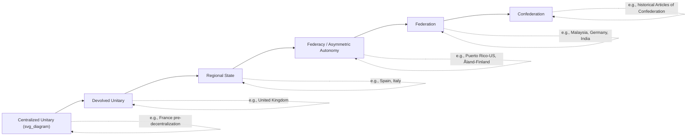

## Federal and Unitary Systems

### Overview

Federal and unitary systems represent the two principal constitutional templates for organizing the **vertical distribution of sovereignty and governing authority** within a state. The distinction turns on where constitutional sovereignty legally resides and how it is exercised across national and subnational levels. Nearly all modern states can be classified along this axis, though many exhibit hybrid or intermediate features (devolved unitary states, regionalized states, quasi-federations).

### Core Definitions

**Unitary System**

A constitutional order in which supreme legal authority is vested exclusively in the central/national government. Subnational units (provinces, regions, departments, counties, municipalities) exist and exercise whatever powers they have **by delegation** from the center — via ordinary statute, administrative decree, or constitutional provision that the center itself can, in principle, amend or revoke. Examples: France, Japan, China, Egypt, Sweden, Kenya (though Kenya devolved substantial power in 2010), Philippines.

**Federal System**

A constitutional order in which sovereignty is **constitutionally divided** between a central government and constituent territorial units, such that both levels derive their authority directly and independently from the founding constitution rather than from each other. Neither level can unilaterally abolish or fundamentally restructure the other's constitutionally guaranteed powers. Examples: United States, Germany, India, Brazil, Australia, Nigeria, Switzerland, Canada, Malaysia.

**Key Points**

- The defining legal test (per K.C. Wheare's classical formulation) is whether national and subnational governments are **coordinate and independent** of one another within their respective spheres, or whether one is **subordinate** to the other.
- Federalism is not synonymous with decentralization; a unitary state can be highly decentralized in practice (administratively or fiscally) while remaining legally unitary, because the center retains ultimate constitutional authority to recentralize.

### Structural Comparison

| Dimension | Unitary System | Federal System |
| --- | --- | --- |
| Locus of sovereignty | Central government exclusively | Divided/shared between center and units |
| Subnational powers | Delegated, revocable by center | Constitutionally entrenched, not unilaterally revocable |
| Constitutional amendment | Typically by national legislature alone | Usually requires subnational consent/supermajority |
| Second chamber | Often absent or weak (not unit-based) | Often present and unit-based (e.g., US Senate, German Bundesrat) |
| Legal uniformity | High — one legal system nationwide | Can vary — units may have distinct legal codes |
| Dispute resolution | Administrative/political, ordinary courts | Constitutional/supreme court adjudicates jurisdiction |
| Abolition of subunits | Possible via ordinary legislation | Constitutionally protected against unilateral abolition |
| Typical origin | Historical consolidation, colonial administration | Riker's "coming-together" or "holding-together" bargains |

### Visual Model: Authority Flow

<svg xmlns="http://www.w3.org/2000/svg" viewBox="0 0 720 300">
<text x="360" y="24" text-anchor="middle" font-size="16" font-weight="bold" fill="#1a1a1a">Authority Flow: Unitary vs. Federal (svg_diagram)</text>

<text x="180" y="55" text-anchor="middle" font-size="13" font-weight="bold" fill="#333">Unitary System</text>

<rect x="100" y="70" width="160" height="50" rx="6" fill="`#a8d5ba`" stroke="#333" stroke-width="1.5" />

<text x="180" y="100" text-anchor="middle" font-size="12" fill="`#1a1a1a`">Central Government</text>

<line x1="180" y1="120" x2="180" y2="150" stroke="#333" stroke-width="2" marker-end="url(#arrow1)" />

<rect x="60" y="150" width="100" height="45" rx="6" fill="`#f4d58d`" stroke="#333" stroke-width="1.5" />

<text x="110" y="177" text-anchor="middle" font-size="11" fill="`#1a1a1a`">Region A</text>

<line x1="180" y1="120" x2="260" y2="150" stroke="#333" stroke-width="2" marker-end="url(#arrow1)" />

<rect x="200" y="150" width="100" height="45" rx="6" fill="`#f4d58d`" stroke="#333" stroke-width="1.5" />

<text x="250" y="177" text-anchor="middle" font-size="11" fill="`#1a1a1a`">Region B</text>

<text x="180" y="225" text-anchor="middle" font-size="11" fill="#555">One-way delegation;</text>

<text x="180" y="240" text-anchor="middle" font-size="11" fill="#555">center can revoke</text>

<text x="540" y="55" text-anchor="middle" font-size="13" font-weight="bold" fill="#333">Federal System</text>

<ellipse cx="540" cy="100" rx="120" ry="35" fill="none" stroke="#333" stroke-width="1.5" stroke-dasharray="4,3" />

<text x="540" y="80" text-anchor="middle" font-size="11" fill="#555">Constitution (source of both)</text>

<rect x="460" y="150" width="100" height="45" rx="6" fill="`#a8d5ba`" stroke="#333" stroke-width="1.5" />

<text x="510" y="177" text-anchor="middle" font-size="11" fill="`#1a1a1a`">National Govt</text>

<rect x="580" y="150" width="100" height="45" rx="6" fill="`#f4d58d`" stroke="#333" stroke-width="1.5" />

<text x="630" y="177" text-anchor="middle" font-size="11" fill="`#1a1a1a`">State Govt</text>

<line x1="510" y1="120" x2="510" y2="150" stroke="#333" stroke-width="2" marker-end="url(#arrow1)" />

<line x1="590" y1="120" x2="630" y2="150" stroke="#333" stroke-width="2" marker-end="url(#arrow1)" />

<text x="565" y="225" text-anchor="middle" font-size="11" fill="#555">Coordinate, independent</text>

<text x="565" y="240" text-anchor="middle" font-size="11" fill="#555">authority from constitution</text>

</svg>

### Variants and Hybrid Forms

**Devolved Unitary States**

Formally unitary but with substantial statutory devolution of legislative and executive power to subnational bodies, which nonetheless remain legally subordinate to the center. Example: the United Kingdom — the Scottish Parliament, Senedd (Wales), and Northern Ireland Assembly hold devolved competencies, but the UK Parliament retains theoretical sovereignty and, per the doctrine of parliamentary sovereignty, could legally abolish devolved institutions (though the Sewel Convention establishes a strong political norm against doing so without consent). [Inference: whether the UK should be classified as "quasi-federal" is actively debated among constitutional scholars, particularly after the Scotland Act 2016 and Wales Act 2017 entrenched certain guarantees.]

**Regional State / Autonomous Communities Model**

An intermediate category (sometimes called the "regional state," a term associated with Italian and Spanish constitutional scholarship) where constitutionally guaranteed autonomy is granted to regions, but the overall architecture is formally unitary. Example: Spain's Estado de las Autonomías (17 Autonomous Communities with devolved competencies under the 1978 Constitution); Italy's ordinary and special-statute regions.

**Federacies**

A large federal or unitary state maintains an asymmetric relationship with a smaller, highly autonomous unit that has a distinct special status not shared by other units. Example: Puerto Rico's relationship with the United States; the Åland Islands within Finland (a unitary state); Hong Kong and Macau's Special Administrative Region status within unitary China's "one country, two systems" framework.

**Confederations (Contrast Case)**

Distinguished from both federal and unitary systems in that sovereignty resides primarily with constituent units, and the central body is a creature of and dependent on continuing member consent (historically the US under the Articles of Confederation, 1781–1789; arguably certain functions of the EU, though the EU is generally treated as *sui generis* rather than confederal). [Inference: EU classification remains contested — it possesses supranational features (direct effect of EU law, qualified majority voting) that exceed classical confederal models.]

### Worked Example: Comparing the Philippines and Malaysia

**Example**

- **Philippines**: A unitary state under the 1987 Constitution, with power concentrated in the national government (President, bicameral Congress). Local Government Units (provinces, cities, municipalities, barangays) exercise powers **delegated** under the Local Government Code of 1991 (RA 7160), which Congress can amend by ordinary legislation. The Autonomous Region in Muslim Mindanao (now the Bangsamoro Autonomous Region in Muslim Mindanao, BARMM, under RA 11054) represents an asymmetric grant of enhanced autonomy — closer to a federacy-like arrangement — but remains constitutionally unitary since BARMM's authority derives from and can be modified by national statute, not from independent constitutional entrenchment.
- **Malaysia**: A federal state (Federation of Malaysia, 1963 Constitution) comprising 13 states and 3 federal territories, with a constitutionally entrenched division of powers under the Federal List, State List, and Concurrent List (Ninth Schedule). Notably, Malaysia exhibits asymmetric federalism: Sabah and Sarawak retain special constitutional protections (e.g., over immigration control, native customary land, and religious matters) not extended to Peninsular states, reflecting the terms of their 1963 accession (the "20-Point Agreement" for Sabah and "18-Point Agreement" for Sarawak).

This comparison illustrates a persistent theme in Philippine political science coursework: proposals for **federalization of the Philippines** (a recurring policy debate, notably under the Duterte administration's 2018 draft federal constitution) are essentially proposals to shift from the unitary "delegated autonomy" model (as with BARMM) to the federal "constitutionally entrenched autonomy" model exemplified by Malaysia's states. [Unverified: the 2018 Philippine federalism draft did not proceed to ratification, and no subsequent administration has advanced a federalism referendum as of the available public record; readers should verify current legislative status if researching this for a time-sensitive assessment.]

### Institutional Mechanisms Distinguishing the Two Systems

**1. Second Chamber Design**

Federal systems commonly employ **unit-based bicameralism**, where the upper house represents constituent states equally or semi-equally regardless of population (e.g., 2 senators per US state; Germany's Bundesrat delegates appointed by Land governments). Unitary systems, when bicameral, typically base the second chamber on other criteria (functional representation, indirect election, revising/scrutiny role) rather than territorial-unit equality (e.g., the UK House of Lords, the Philippine Senate — elected nationally at-large rather than by region/province).

**2. Constitutional Amendment Procedures**

$$\text{Federal amendment threshold} \; \geq \; \text{Unitary amendment threshold}$$

Federal constitutions typically require ratification by a supermajority of constituent units (e.g., three-fourths of US state legislatures under Article V; a majority of German Länder via the Bundesrat for amendments affecting Länder interests) — a structural safeguard against unilateral central encroachment. Unitary constitutions can often be amended by the national legislature alone, sometimes via supermajority but without requiring subnational consent (e.g., the Philippine Constitution's amendment/revision process under Article XVII involves Congress and/or a constitutional convention, with ratification by national plebiscite — not by individual provincial approval).

**3. Judicial Review of Vertical Power Disputes**

Federal systems necessarily generate a body of "federalism jurisprudence" — constitutional or supreme courts routinely adjudicate boundary disputes between national and state authority (e.g., the US Supreme Court's Commerce Clause doctrine, the Indian Supreme Court's basic structure doctrine applied to Centre-State relations, Germany's Federal Constitutional Court rulings on *Bund-Länder Streit*). Unitary systems generally lack this category of dispute in the same constitutional register, since subnational authority is not constitutionally entrenched to begin with; conflicts are typically resolved through ordinary administrative law or political processes rather than constitutional adjudication. [Inference: devolved unitary states like the UK increasingly generate quasi-federal jurisprudence — e.g., the UK Supreme Court's 2022 Scottish Independence Referendum Bill reference — suggesting this distinction is narrowing in practice for highly devolved unitary systems.]

### Diagrammatic Classification Spectrum

### Common Analytical Pitfalls

- **Conflating decentralization with federalism**: A unitary state can decentralize extensively (fiscally, administratively) without becoming federal, since the legal capacity for recentralization always remains with the center. Political science exams frequently test this distinction.
- **Assuming federal systems are always "more decentralized" in practice**: Some federations exhibit highly centralized fiscal and policy authority in practice (e.g., critiques of Nigeria's oil-revenue-driven fiscal centralism, discussed under fiscal federalism theory), while some unitary states devolve extensive practical autonomy (e.g., the Nordic unitary states' strong local government traditions). Formal classification and practical operation can diverge. [Inference: this practice-vs-form gap is a recurring theme in comparative federalism scholarship and is not a settled, uniformly agreed-upon ranking across cases.]
- **Treating the EU as straightforwardly federal or confederal**: Most contemporary scholars classify the EU as *sui generis* — possessing federal-like features (direct effect, supremacy of EU law in its domains) alongside confederal features (treaty-based, member-state-driven amendment) — rather than fitting cleanly into either category.

### Conclusion

The federal-unitary distinction is fundamentally a question of **where constitutional sovereignty is legally located** and whether subnational authority is entrenched (federal) or delegated and revocable (unitary). While the classical dichotomy remains analytically useful, most real-world systems occupy intermediate positions along a spectrum from centralized unitary states through devolved unitary and regional-state models to federacies, full federations, and confederations. Distinguishing formal constitutional classification from actual practical decentralization is essential for accurate comparative analysis, since the two frequently diverge, as illustrated by the Philippines-Malaysia and UK devolution examples above.

**Related Topics**

- Theories of Federalism (origin, structural, and comparative models)
- Devolution and Regional Autonomy in Unitary States
- Comparative Constitutional Design of Second Chambers
- Fiscal Federalism and Intergovernmental Fiscal Transfers
- Federalism Debates in the Philippines (BARMM, federalism referendum proposals)
- Asymmetric Federalism and Special Autonomy Arrangements
- The European Union as a Sui Generis Multilevel Polity
- Subsidiarity and the Allocation of Governmental Functions