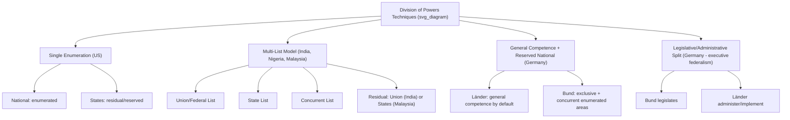

## Division of Powers in Federal Systems

### Overview

The division of powers is the constitutional mechanism by which federal systems allocate legislative, executive, and fiscal competencies between the national (central/federal) government and constituent subnational units (states, provinces, Länder, regions). This allocation is the substantive core of any federal constitution: it determines which level of government may legislate, tax, administer, and adjudicate over which subject matters, and it establishes the rules for resolving conflicts when both levels claim authority over the same domain.

### Foundational Concepts

**Enumerated, Reserved, and Concurrent Powers**

Most federal constitutions classify powers into three broad categories:

- **Enumerated (delegated/exclusive) powers**: Specific powers explicitly granted to one level of government (typically the national government) by the constitutional text. Example: the US Congress's Article I, Section 8 powers (regulate interstate commerce, coin money, declare war, raise armies).
- **Reserved (residual) powers**: Powers not explicitly granted to the national government are presumed to remain with the constituent units, or vice versa, depending on constitutional design. Example: the US 10th Amendment reserves undelegated powers to the states; conversely, in Canada, residual power ("Peace, Order, and Good Government") is assigned to the federal Parliament under Section 91 of the Constitution Act, 1867 — a rare instance of residual power flowing to the center rather than the units.
- **Concurrent powers**: Powers exercised by both levels simultaneously in the same policy domain, usually subject to a supremacy or paramountcy rule resolving conflicts. Example: India's Concurrent List (List III, Seventh Schedule) covers areas like criminal law, marriage, and economic planning, where both Parliament and State Legislatures may legislate, subject to Article 254's federal-supremacy rule in case of conflict.

**Key Points**

- The precise constitutional technique used to divide powers (exhaustive lists vs. general grants with residual clauses) varies significantly across federations and has major practical consequences for how flexibly the system can adapt to new policy areas (e.g., digital regulation, climate policy) not contemplated at the time of drafting.
- No federal constitution achieves a perfectly clean division; overlapping, ambiguous, or contested jurisdiction is a structural feature, not an aberration, and is precisely why constitutional/supreme courts play a central adjudicative role in federal systems.

### Comparative Constitutional Techniques

**1. Single Enumeration Model (US Style)**

The national government's powers are exhaustively enumerated in the constitutional text; anything not listed is reserved to the states.

$$\text{Total Powers} = \text{Enumerated (National)} + \text{Reserved (States)}$$

- Advantages: strong presumption of state autonomy in unlisted domains; a discipline device against uncontrolled national expansion.
- Disadvantages: rigidity when new policy domains emerge (e.g., environmental regulation, telecommunications) that the enumerated list didn't anticipate — historically addressed via expansive judicial interpretation of enumerated clauses (e.g., the US Commerce Clause and Necessary and Proper Clause) rather than formal amendment. [Inference: whether this judicial expansion represents legitimate constitutional interpretation or informal amendment by the courts is a long-standing normative debate in US constitutional theory.]

**2. Dual/Triple List Model (Indian/Nigerian/Malaysian Style)**

The constitution provides explicit, exhaustive **lists** allocating subjects to Union/Federal, State, and (optionally) Concurrent jurisdiction.

- India's Seventh Schedule: **Union List** (97 items — defense, foreign affairs, currency, banking), **State List** (66 items — police, public health, agriculture, local government), **Concurrent List** (47 items — criminal law, marriage/divorce, economic and social planning).
- Nigeria's Second Schedule to the 1999 Constitution: **Exclusive Legislative List** (68 items, federal only) and **Concurrent Legislative List** (state and federal, with federal law prevailing on conflict).
- Malaysia's Ninth Schedule: **Federal List**, **State List**, and **Concurrent List**.

Advantages: greater specificity and predictability regarding which level governs a given subject; reduces (but does not eliminate) litigation over jurisdictional boundaries. Disadvantages: exhaustive lists still require amendment to accommodate genuinely novel policy areas, and residual/interpretive disputes persist over how to classify subjects that straddle multiple list entries (e.g., is "e-commerce regulation" trade and commerce, or communications, or something else?).

**3. General Competence with Reserved National Powers (German Style)**

Germany's Basic Law (*Grundgesetz*) uses a different logic: **Länder** possess general legislative competence by default (Article 30), while the **Bund** (federal government) has competence only in specifically enumerated areas — **exclusive federal legislation** (Article 73: foreign affairs, defense, citizenship, currency), **concurrent legislation** (Article 74, where the *Bund* may legislate if uniform national regulation is deemed "necessary"), and framework legislation in some domains. This is structurally similar to the US model but with more extensive concurrent-power provisions and a formalized "necessity" test for federal intervention (*Erforderlichkeitsklausel*).

**4. Cooperative/Administrative Federalism Model**

Some federations formally separate **legislative competence** from **administrative/executive competence** — a distinctive German-influenced technique. Under the German Basic Law, the *Bund* frequently legislates while the **Länder administer and implement** the resulting laws (Article 83), producing a system where policy-making and policy-execution are constitutionally split across levels. This differs sharply from the US/Indian model, where legislative and executive competence are generally co-located at whichever level holds legislative authority over a subject.

### Supremacy, Paramountcy, and Conflict-Resolution Rules

Because concurrent and overlapping jurisdiction is unavoidable, every federal system requires a rule for resolving direct conflicts between national and subnational law over the same subject matter.

| System | Conflict Rule | Constitutional Basis |
| --- | --- | --- |
| United States | Federal law supreme when validly enacted within enumerated powers | Supremacy Clause, Article VI |
| India | Union law prevails over State law on Concurrent List conflicts, subject to Presidential-assent exception for State laws | Article 254 |
| Germany | Federal law overrides Land law ("*Bundesrecht bricht Landesrecht*") | Article 31, Basic Law |
| Nigeria | Federal law prevails on Concurrent List conflicts | Section 4(5), 1999 Constitution |
| Malaysia | Federal law prevails on Concurrent List conflicts | Article 75, Federal Constitution |
| Canada | Federal paramountcy doctrine (judicially developed, not textual) applies to operational conflicts between valid federal and provincial laws | Constitution Act 1867 (as interpreted by courts) |

**Example**

In Nigeria, a state law regulating environmental waste disposal (a Concurrent List subject under some interpretations) that directly contradicts a validly enacted federal environmental statute would be rendered void to the extent of the inconsistency, under Section 4(5) of the 1999 Constitution — illustrating the operational application of federal paramountcy even where states retain general legislative competence in the domain.

### Visual Model: Powers Allocation Architecture

<svg xmlns="http://www.w3.org/2000/svg" viewBox="0 0 720 340">
<text x="360" y="24" text-anchor="middle" font-size="16" font-weight="bold" fill="#1a1a1a">Division of Powers: List-Based Model (svg_diagram)</text>
<circle cx="200" cy="150" r="110" fill="#a8d5ba" fill-opacity="0.6" stroke="#333" stroke-width="1.5" />
<text x="140" y="90" font-size="12" font-weight="bold" fill="#1a1a1a">National/Union</text>
<text x="140" y="106" font-size="10" fill="#333">Defense, Currency,</text>
<text x="140" y="120" font-size="10" fill="#333">Foreign Affairs</text>
<circle cx="360" cy="150" r="110" fill="#f4d58d" fill-opacity="0.6" stroke="#333" stroke-width="1.5" />
<text x="400" y="90" font-size="12" font-weight="bold" fill="#1a1a1a">State/Provincial</text>
<text x="380" y="106" font-size="10" fill="#333">Police, Local Govt,</text>
<text x="385" y="120" font-size="10" fill="#333">Public Health</text>

<text x="280" y="150" text-anchor="middle" font-size="11" font-weight="bold" fill="`#1a1a1a`">Concurrent</text>

<text x="280" y="165" text-anchor="middle" font-size="10" fill="#333">Criminal Law,</text>

<text x="280" y="179" text-anchor="middle" font-size="10" fill="#333">Economic Planning</text>

<rect x="470" y="230" width="220" height="70" fill="none" stroke="#333" stroke-width="1.5" stroke-dasharray="5,3" />
<text x="580" y="250" text-anchor="middle" font-size="11" font-weight="bold" fill="#1a1a1a">Residual Powers</text>
<text x="580" y="268" text-anchor="middle" font-size="10" fill="#333">Unlisted subjects —</text>
<text x="580" y="282" text-anchor="middle" font-size="10" fill="#333">flow to national OR state</text>
<text x="580" y="296" text-anchor="middle" font-size="10" fill="#333">depending on constitution</text>
</svg>

### Fiscal Dimensions of the Division of Powers

The allocation of **taxing and spending authority** is a distinct but closely related dimension, often called **fiscal federalism** (see the related theoretical treatment under Theories of Federalism).

- **Tax assignment**: Federal constitutions typically reserve major, mobile, or macroeconomically sensitive tax bases (income tax, customs duties, corporate tax) to the national government, while assigning more geographically fixed bases (property tax, certain sales/consumption taxes) to subnational units — though significant variation exists (e.g., US states levy their own income taxes; Nigerian states have limited independent tax bases, relying heavily on federally distributed oil-revenue allocations).
- **Vertical fiscal imbalance**: A common structural feature where subnational units' constitutional expenditure responsibilities (education, health, local infrastructure) exceed their independent revenue-raising capacity, necessitating intergovernmental transfers, grants, or revenue-sharing formulas (e.g., India's Finance Commission-determined devolution formula under Article 280; Nigeria's Federation Account distribution formula).
- **Conditional vs. unconditional grants**: National governments frequently use conditional (categorical) grants-in-aid to influence subnational policy in areas formally reserved to the units — a mechanism sometimes termed "fiscal federalism as backdoor centralization," since conditions attached to funding can functionally override formal constitutional autonomy. [Inference: whether conditional grants constitute an erosion of federalism or a legitimate cooperative-federalism tool is a contested normative question, addressed differently by different scholars and courts (e.g., the US Supreme Court's *South Dakota v. Dole* [1987] anti-coercion doctrine, and its later application in *NFIB v. Sebelius* [2012] regarding Medicaid expansion).]

### Worked Example: Comparing Division-of-Powers Models — India and Malaysia

**Example**

Both India and Malaysia use the three-list technique (Union/Federal, State, Concurrent), reflecting their shared British colonial constitutional heritage (both lists trace back to the Government of India Act 1935 model). However, key divergences illustrate how the same structural template produces different degrees of centralization:

- **Residual power**: In India, residual power over subjects not covered by any of the three lists is assigned to the **Union** (Article 248) — a strongly centralizing design choice. In Malaysia, residual power is assigned to the **states** (Article 77) — nominally more decentralizing, though counterbalanced by the federal government's extensive Concurrent and Federal List authority and its fiscal dominance in practice.
- **Emergency powers effect on division**: Both systems allow the national government to temporarily assume legislative authority over State List subjects during a declared national emergency (India's Article 250; Malaysia's Article 150), demonstrating that even entrenched divisions of power are constitutionally designed to be **suspendable** under defined crisis conditions — a common feature across many federations, reflecting the recognition that rigid power division could otherwise paralyze crisis response.

### Diagrammatic Summary: Techniques Compared

### Common Sources of Intergovernmental Conflict

- **Classification disputes**: Whether a given regulatory subject (e.g., data privacy, cryptocurrency regulation, environmental standards) falls under an existing list entry or constitutes a genuinely novel "residual" subject not contemplated by the original constitutional drafters.
- **Doctrine of pith and substance / colorable legislation**: Courts in list-based systems (India, Canada, Nigeria) frequently apply doctrines examining the "true nature and character" of a challenged law to determine which list it substantively falls under, preventing one level from indirectly legislating on a subject reserved to the other by dressing it in the guise of a permitted subject.
- **Fiscal coercion challenges**: Litigation over whether conditional grant terms attached by the national government amount to unconstitutional coercion of subnational policy autonomy (see *NFIB v. Sebelius* above).
- **Emergency/necessity clauses**: Structural tension between designed flexibility (allowing temporary centralization during crises) and risk of abuse (prolonged or pretextual invocation of emergency powers to permanently erode subnational authority) — a recurring theme in comparative federalism scholarship regarding states like India (historical use of President's Rule under Article 356) and Malaysia.

### Conclusion

The division of powers is the operative core of federal constitutional design, implemented through varying textual techniques (single enumeration, multi-list allocation, general competence with reserved national powers, or legislative/administrative splits) that each carry distinct trade-offs between specificity, flexibility, and centralization tendency. Because no allocation technique can fully anticipate future policy domains or eliminate jurisdictional ambiguity, every federal system relies on constitutional courts, supremacy/paramountcy rules, and (in many cases) emergency-power provisions to manage the inevitable overlaps and conflicts between national and subnational authority.

**Related Topics**

- Theories of Federalism (origin and structural models)
- Federal and Unitary Systems (constitutional classification)
- Fiscal Federalism and Intergovernmental Transfers
- Judicial Review and Constitutional Adjudication of Federal Disputes
- Emergency Powers and Their Effect on Federal Structure
- Comparative Study of Second Chambers in Federal Systems
- Cooperative vs. Competitive Federalism in Practice
- Residual Powers Doctrine in Comparative Constitutional Law