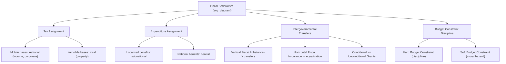

## Fiscal Federalism

### Overview

Fiscal federalism is the subfield of public economics and political science concerned with the allocation of **taxing authority, spending responsibility, and intergovernmental fiscal transfers** across levels of government in a multilevel (federal or decentralized unitary) system. It addresses both a normative question — how *should* fiscal functions be assigned across levels to maximize efficiency, equity, and macroeconomic stability — and a positive/empirical question — how fiscal authority actually *is* assigned and how intergovernmental fiscal relations operate in practice across different countries.

### Theoretical Foundations

**Musgrave's Three Functions of Government (1959)**

Richard Musgrave's framework, foundational to fiscal federalism theory, divides government economic functions into three categories and assigns each to the level of government best suited to perform it:

- **Allocation function**: Providing public goods and correcting market failures. Best decentralized, since local governments have superior information about heterogeneous local preferences.
- **Distribution function**: Redistributing income/wealth to achieve equity goals. Best centralized, since decentralized redistribution triggers migration incentives (wealthy residents relocate to jurisdictions with lower redistributive taxation; poor residents migrate toward jurisdictions with generous transfers), undermining the policy's sustainability.
- **Stabilization function**: Macroeconomic management (monetary policy, countercyclical fiscal policy). Best centralized, since subnational governments cannot control monetary policy, typically face balanced-budget constraints, and lack the scale to conduct effective macroeconomic stabilization independently.

**Key Points**

- Musgrave's framework provides the normative baseline against which most fiscal federalism debates are conducted, even though real-world assignments frequently deviate from it (e.g., subnational governments often do participate in redistributive programs like Medicaid in the US, or health/education financing in India, despite Musgrave's centralization prescription for distribution).

**Oates's Decentralization Theorem (1972)**

Wallace Oates formalized the efficiency case for decentralized provision of local public goods:

$$W_D \geq W_C \quad \text{when preferences for a local public good are heterogeneous across jurisdictions and no significant scale economies or externalities exist}$$

Where $W_D$ is welfare under decentralized provision (each jurisdiction sets its own quantity/quality matching local preferences) and $W_C$ is welfare under uniform centralized provision. The theorem holds that decentralization is welfare-superior specifically because it allows public good provision to be tailored to local preference heterogeneity — the efficiency loss from a uniform national standard applied to genuinely heterogeneous local demands.

**Conditions that weaken the case for decentralization** (favoring centralization instead):

- Significant **economies of scale** in provision (defense, large infrastructure networks)
- Substantial **interjurisdictional spillovers/externalities** (a state's air pollution control affects downwind neighbors; underprovision is likely if benefits aren't fully internalized)
- **Race-to-the-bottom risk** in regulatory or tax competition, undermining minimum standards

**Tiebout's "Voting with Your Feet" Model (1956)**

Charles Tiebout proposed that, under idealized conditions (perfect mobility, full information, many jurisdictions, no interjurisdictional externalities, no scale economies), residents sort themselves across jurisdictions based on the tax-service bundle each offers, producing a market-like efficient allocation analogous to consumer choice among differentiated products. [Inference: the Tiebout model's strong assumptions (perfect mobility, zero migration costs) are widely regarded by economists as unrealistic in practice, so the model functions more as a theoretical benchmark than a literal empirical description.]

### Structural Components of Fiscal Federalism

**1. Tax Assignment (Revenue Allocation)**

The constitutional or statutory allocation of which level of government may levy which taxes.

| Tax Type | Typical Assignment | Rationale |
| --- | --- | --- |
| Income tax (progressive) | National (sometimes shared) | Mobile base; redistribution function |
| Corporate tax | National (sometimes shared) | Highly mobile base; avoids race-to-bottom |
| Customs/trade duties | National (exclusively) | Requires uniform national trade policy |
| Property tax | Local/subnational | Immobile base; strong benefit-tax link to local services |
| Sales/consumption tax (VAT/GST) | Varies — national, subnational, or shared | Mobile base but administratively complex to fragment |
| Natural resource royalties | Varies widely by country | Often contentious (origin-based vs. shared) |

**Example**: Nigeria's heavy reliance on federally collected petroleum revenue, redistributed via the Federation Account Allocation Committee (FAAC) formula, exemplifies a system with severe **vertical fiscal imbalance** in reverse — most revenue-generating capacity sits with the federal government even though states bear significant expenditure responsibilities, making Nigerian states heavily transfer-dependent. [Inference: this arrangement is widely cited in fiscal federalism scholarship as producing weak subnational fiscal discipline and accountability, since states have limited incentive to develop independent tax bases when federal transfers are the dominant revenue source, though the precise causal weight of this factor relative to Nigeria's other governance challenges is debated.]

**2. Expenditure Assignment (Spending Responsibility)**

The allocation of responsibility for providing public services and programs.

- Following Oates's logic, services with localized benefit incidence (primary education, local roads, waste collection, municipal policing) are typically assigned to subnational levels, while services with national benefit incidence or requiring uniform standards (defense, foreign affairs, monetary policy, macroeconomic regulation) are assigned nationally.
- **Concurrent expenditure responsibilities** (health, higher education, environmental regulation, social welfare) are common and typically require intergovernmental coordination mechanisms.

**3. Vertical Fiscal Imbalance and Intergovernmental Transfers**

**Vertical fiscal imbalance (VFI)** describes the structural mismatch between a level of government's own-source revenue capacity and its expenditure responsibilities. Virtually all federations exhibit some VFI (subnational governments typically have expenditure responsibilities exceeding their independent revenue capacity), necessitating transfers from the national government.

**Types of Intergovernmental Transfers**:

- **Unconditional (general-purpose) grants**: Transferred with no restriction on use, preserving subnational spending discretion (e.g., India's tax devolution recommended by the Finance Commission under Article 280, currently around 41% of the net proceeds of central taxes per the Fifteenth Finance Commission's recommendation for 2021–26).
- **Conditional (categorical/specific-purpose) grants**: Tied to specific programs or policy conditions set by the national government (e.g., US federal highway funding conditioned on state adoption of a minimum drinking age, upheld in *South Dakota v. Dole*, 1987).
- **Equalization transfers**: Explicitly designed to reduce fiscal disparities between wealthier and poorer subnational units, ensuring a baseline capacity to provide comparable public services regardless of local tax base strength (e.g., Germany's *Länderfinanzausgleich* system; Canada's Equalization Program under Section 36(2) of the Constitution Act, 1982, which constitutionally commits the federal government to "making equalization payments" ensuring provinces have "sufficient revenues to provide reasonably comparable levels of public services at reasonably comparable levels of taxation").

**Example**

Canada's federal Equalization Program calculates a "fiscal capacity" measure for each province (an estimate of the revenue a province could raise applying national-average tax rates to its own tax bases) and transfers unconditional payments to provinces below the national average fiscal capacity — a formula-driven mechanism embodying the equity function Musgrave assigned to central government, implemented as a transfer rather than direct centralized redistribution.

**4. Horizontal Fiscal Imbalance**

Distinguished from vertical imbalance, **horizontal fiscal imbalance (HFI)** refers to disparities in fiscal capacity *among* subnational units at the same level (e.g., a resource-rich province versus a resource-poor province). Equalization transfers (above) are the primary policy instrument addressing HFI, though their design (formula-based vs. discretionary, full vs. partial equalization) varies substantially and is often politically contentious, since donor (net-contributing) jurisdictions frequently resist the redistribution implied.

### Visual Model: Fiscal Federalism Flow Architecture

<svg xmlns="http://www.w3.org/2000/svg" viewBox="0 0 720 340">
<text x="360" y="24" text-anchor="middle" font-size="16" font-weight="bold" fill="#1a1a1a">Fiscal Federalism: Revenue and Transfer Flows (svg_diagram)</text>
<rect x="270" y="45" width="180" height="55" rx="6" fill="#a8d5ba" stroke="#333" stroke-width="1.5" />
<text x="360" y="68" text-anchor="middle" font-size="12" font-weight="bold" fill="#1a1a1a">National Government</text>
<text x="360" y="85" text-anchor="middle" font-size="10" fill="#333">Income tax, customs, VAT</text>
<line x1="330" y1="100" x2="180" y2="170" stroke="#333" stroke-width="2" marker-end="url(#arrow2)" />
<text x="230" y="130" font-size="10" fill="#555">Unconditional</text>
<text x="230" y="143" font-size="10" fill="#555">transfers</text>
<line x1="390" y1="100" x2="540" y2="170" stroke="#333" stroke-width="2" marker-end="url(#arrow2)" />
<text x="470" y="130" font-size="10" fill="#555">Conditional</text>
<text x="470" y="143" font-size="10" fill="#555">grants</text>
<rect x="90" y="170" width="180" height="55" rx="6" fill="#f4d58d" stroke="#333" stroke-width="1.5" />
<text x="180" y="193" text-anchor="middle" font-size="12" font-weight="bold" fill="#1a1a1a">Province/State A</text>
<text x="180" y="210" text-anchor="middle" font-size="10" fill="#333">(lower fiscal capacity)</text>
<rect x="450" y="170" width="180" height="55" rx="6" fill="#f4d58d" stroke="#333" stroke-width="1.5" />
<text x="540" y="193" text-anchor="middle" font-size="12" font-weight="bold" fill="#1a1a1a">Province/State B</text>
<text x="540" y="210" text-anchor="middle" font-size="10" fill="#333">(higher fiscal capacity)</text>
<path d="M 540 225 Q 400 260, 270 225" stroke="#333" stroke-width="1.5" fill="none" stroke-dasharray="4,3" marker-end="url(#arrow2)" />
<text x="400" y="255" text-anchor="middle" font-size="10" fill="#555">Horizontal equalization (indirect, via center)</text>

<text x="180" y="250" text-anchor="middle" font-size="10" fill="#333">Own-source: property tax,</text>

<text x="180" y="264" text-anchor="middle" font-size="10" fill="#333">local fees</text>

<text x="540" y="250" text-anchor="middle" font-size="10" fill="#333">Own-source: property tax,</text>

<text x="540" y="264" text-anchor="middle" font-size="10" fill="#333">local fees, resource royalties</text>

</svg>

### Market-Preserving Federalism and Fiscal Discipline

Barry Weingast's **market-preserving federalism** theory adds a political-economy dimension: fiscal federalism arrangements can either **discipline** or **undermine** subnational fiscal responsibility depending on whether subnational governments face a genuine **hard budget constraint**.

- **Hard budget constraint**: Subnational governments cannot rely on automatic federal bailouts when they run unsustainable deficits, forcing fiscal discipline (associated with, e.g., US state balanced-budget requirements and limited historical federal bailout practice).
- **Soft budget constraint**: Subnational governments anticipate that the national government will bail them out of fiscal distress, creating a **moral hazard** that encourages fiscal irresponsibility (over-borrowing, populist overspending) since the political and economic costs of failure are externalized to the center. [Inference: Argentina's provincial debt crises and Brazil's historical state bailouts (pre-1990s Fiscal Responsibility Law reforms) are commonly cited in the literature as illustrations of soft-budget-constraint dynamics, though the specific causal contribution of federal structure versus other macroeconomic factors in each historical episode remains debated among specialists.]

### Worked Example: Comparing India's and Germany's Transfer Systems

**Example**

- **India**: The **Finance Commission**, a constitutional body appointed every five years under Article 280, recommends the formula for vertical (Union-to-States) tax devolution and horizontal (inter-state) distribution criteria — combining population, income distance (poorer states receive proportionally more), forest cover, tax effort, and demographic performance. The Fifteenth Finance Commission (2021–26) recommended a devolution of approximately 41% of the net proceeds of Union taxes to states.
- **Germany**: The *Länderfinanzausgleich* ("fiscal equalization among the Länder") system operates in stages — first apportioning shared VAT revenue with an equalizing component, then conducting direct horizontal equalization transfers between Länder based on fiscal capacity relative to a national average, followed by supplementary federal grants (*Bundesergänzungszuweisungen*) to persistently weak Länder. The system was substantially reformed in 2020, shifting from a direct horizontal Land-to-Land transfer model toward a mechanism operating primarily through federal VAT revenue allocation, following a 2017 political agreement among the *Länder* and the federal government. [Unverified: readers researching current-year specifics of the German equalization formula post-2020 reform should verify the latest parameters, as periodic technical adjustments continue.]

Both systems illustrate the **formula-based, independent-body approach** to managing horizontal and vertical fiscal imbalance — a design choice intended to depoliticize transfer allocation relative to discretionary, negotiation-based systems (contrast with more politically negotiated transfer arrangements in some other federations).

### Diagrammatic Summary: Fiscal Federalism Concepts

### Common Critiques and Debates

- **Efficiency vs. equity trade-off**: Decentralized tax competition (per Tiebout/Oates efficiency logic) can produce a "race to the bottom" undermining redistributive and regulatory goals, particularly for mobile tax bases like corporate profits — a tension between the allocation-efficiency and equity functions in Musgrave's framework.
- **Accountability and the "flypaper effect"**: Empirical fiscal federalism research has documented that intergovernmental grant money tends to increase subnational government spending by more than an equivalent increase in local citizens' own income would — informally termed the "flypaper effect" (money "sticks where it hits"), a finding that complicates simple rational-actor predictions about how subnational governments respond to transfers. [Inference: the flypaper effect is a well-documented empirical regularity in public finance literature, though its precise theoretical explanation (bureaucratic behavior, fiscal illusion, or asymmetric information) remains subject to ongoing scholarly discussion.]
- **Conditional grants as backdoor centralization**: Extensive use of conditional/categorical grants can functionally recentralize policy control even where formal constitutional expenditure authority remains with subnational units, since jurisdictions dependent on the funding face strong incentives to comply with attached conditions (subject to constitutional limits on coercion, e.g., the US anti-commandeering and anti-coercion doctrines).
- **Resource curse dynamics in resource-dependent federations**: Federations with significant natural resource revenue concentrated in specific subnational units (e.g., oil-producing states in Nigeria, mineral-rich provinces in some federations) face distinctive fiscal federalism challenges regarding origin-based vs. shared revenue allocation, often generating acute center-region political conflict.

### Conclusion

Fiscal federalism addresses the allocation of taxing power, spending responsibility, and intergovernmental transfers across levels of government, grounded theoretically in Musgrave's three-functions framework and Oates's decentralization theorem. In practice, virtually all federations exhibit vertical and horizontal fiscal imbalances requiring formula-based or negotiated transfer systems, and the design of these systems — particularly whether subnational governments face hard or soft budget constraints — has significant consequences for fiscal discipline, economic efficiency, and interregional equity, as illustrated by the comparative India-Germany-Nigeria-Canada examples above.

**Related Topics**

- Theories of Federalism (market-preserving federalism, competitive federalism)
- Division of Powers in Federal Systems (tax and expenditure assignment)
- Federal and Unitary Systems (fiscal decentralization in unitary states)
- Vertical and Horizontal Fiscal Imbalance in Comparative Perspective
- Equalization Transfer Design (Canada, Germany, India Finance Commission Models)
- Resource Revenue Sharing and the "Resource Curse" in Federations
- Soft Budget Constraints and Subnational Debt Crises
- Tax Competition and the Race-to-the-Bottom Debate