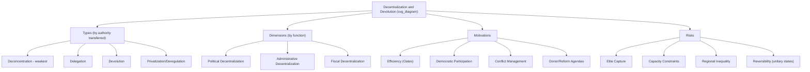

## Decentralization and Devolution

### Overview

Decentralization refers to the transfer of authority, responsibility, and resources for public functions from a central government to lower levels of government or other actors, along a continuum of intensity and permanence. Devolution is the strongest and most politically significant form of decentralization, in which a central authority formally transfers governing powers to a lower level while stopping short of federal constitutional entrenchment. Understanding the gradations between forms of decentralization is essential for distinguishing genuine power transfer from purely administrative reorganization, and for evaluating decentralization reforms across both unitary and federal states.

### The Decentralization Continuum

Political science and public administration literature (notably the influential typology developed by Dennis Rondinelli and G. Shabbir Cheema for the World Bank, 1983) conventionally distinguishes **four types of decentralization**, ordered roughly by the degree of authority genuinely transferred:

**1. Deconcentration**

The weakest form: the central government relocates staff, offices, or administrative decision-making authority to regional/local field offices, but ultimate authority, hierarchy, and accountability remain firmly within the central bureaucracy. Local officials remain agents of and answerable to the central ministry, not to local populations.

- **Example**: A national ministry of health establishing regional field offices to administer centrally-determined programs — the regional director still reports to and is appointed by the national ministry, with no independent local decision-making authority.

**2. Delegation**

The central government transfers specific managerial or administrative responsibility for defined functions to semi-autonomous organizations, agencies, or state-owned enterprises that are not wholly controlled by the central government on a day-to-day basis, but that ultimately remain accountable to and can be reabsorbed by the center.

- **Example**: A national government establishing an autonomous water utility authority or a state-owned enterprise with its own budget and management, while retaining ultimate ownership and oversight authority.

**3. Devolution**

The transfer of governing authority — legislative, fiscal, and/or administrative — to legally constituted, formally recognized subnational governments (regions, provinces, municipalities) that exercise this authority with a meaningful degree of independence and are accountable to their own local electorates, not merely to the central bureaucracy. Devolution is generally understood as creating genuine local self-government, though (crucially, in unitary systems) it typically remains **legally revocable by the center** since it operates through ordinary statute rather than constitutional entrenchment.

- **Example**: The UK's devolution settlements — the Scotland Act 1998, Government of Wales Act 1998 (later Wales Act 2014/2017), and Northern Ireland Act 1998 — created directly elected legislatures (Scottish Parliament, Senedd, Northern Ireland Assembly) with defined legislative competence over devolved matters (health, education, some taxation), accountable to their own electorates, while UK Parliament retains formal sovereignty.

**4. Privatization/Deregulation (sometimes included as a fourth category)**

The transfer of functions previously performed by government to private, non-governmental, or market actors — not strictly a *territorial* decentralization but often included in the broader decentralization literature because it similarly reduces direct central government control over service delivery.

**Key Points**

- These four categories represent **increasing degrees of genuine authority transfer**, not merely different labels for the same phenomenon: deconcentration transfers almost no independent authority, while devolution transfers substantial governing authority to politically accountable local institutions.
- Devolution is distinguished from federalism by its **legal reversibility**: because devolved powers are granted by ordinary statute (in a unitary state) rather than constitutional entrenchment, the central legislature retains the formal legal capacity to modify, reduce, or abolish devolved arrangements — though this capacity is often constrained in practice by strong political conventions (e.g., the UK's Sewel Convention, under which the UK Parliament will "not normally" legislate on devolved matters without the consent of the devolved legislature).

### Visual Model: The Decentralization Continuum

<svg xmlns="http://www.w3.org/2000/svg" viewBox="0 0 720 260">
<text x="360" y="24" text-anchor="middle" font-size="16" font-weight="bold" fill="#1a1a1a">Decentralization Continuum (svg_diagram)</text>
<line x1="60" y1="140" x2="660" y2="140" stroke="#333" stroke-width="2" marker-end="url(#arrow3)" />
<text x="360" y="165" text-anchor="middle" font-size="11" fill="#555">Increasing degree of genuine authority transfer</text>
<circle cx="120" cy="140" r="8" fill="#f4d58d" stroke="#333" />
<text x="120" y="105" text-anchor="middle" font-size="11" font-weight="bold" fill="#1a1a1a">Deconcentration</text>
<text x="120" y="120" text-anchor="middle" font-size="9" fill="#333">Field offices, central control</text>
<circle cx="280" cy="140" r="8" fill="#f0c987" stroke="#333" />
<text x="280" y="105" text-anchor="middle" font-size="11" font-weight="bold" fill="#1a1a1a">Delegation</text>
<text x="280" y="120" text-anchor="middle" font-size="9" fill="#333">Semi-autonomous agencies</text>
<circle cx="450" cy="140" r="8" fill="#c9dfa8" stroke="#333" />
<text x="450" y="105" text-anchor="middle" font-size="11" font-weight="bold" fill="#1a1a1a">Devolution</text>
<text x="450" y="120" text-anchor="middle" font-size="9" fill="#333">Elected local govt, revocable</text>
<circle cx="610" cy="140" r="8" fill="#a8d5ba" stroke="#333" />
<text x="610" y="105" text-anchor="middle" font-size="11" font-weight="bold" fill="#1a1a1a">Federalism</text>
<text x="610" y="120" text-anchor="middle" font-size="9" fill="#333">Constitutionally entrenched</text>

<text x="120" y="200" text-anchor="middle" font-size="9" fill="#555">Weakest form</text>

<text x="610" y="200" text-anchor="middle" font-size="9" fill="#555">Strongest form</text>

</svg>

### Dimensions of Decentralization

Beyond the type-based typology above, decentralization is often analyzed along **three functional dimensions**, which can vary independently of one another:

**1. Political Decentralization**

Transfer of political decision-making authority, typically manifested through direct election of subnational executives/legislatures and genuine local policy discretion. Measured by whether local officials are elected (accountable to local citizens) versus centrally appointed.

**2. Administrative Decentralization**

Transfer of responsibility for planning, financing, and managing public functions and service delivery from central to subnational levels — this dimension can exist even without political decentralization (e.g., under pure deconcentration).

**3. Fiscal Decentralization**

Transfer of revenue-raising authority and/or expenditure responsibility to subnational governments (closely related to, but analytically distinct from, the fiscal federalism concepts covered separately). A jurisdiction may have significant expenditure responsibility (administrative decentralization) while remaining highly dependent on central transfers (limited fiscal decentralization) — a common real-world pattern often described as **"decentralization without empowerment."** [Inference: whether a given country's reform constitutes genuine fiscal decentralization or merely administrative decentralization with continued fiscal dependency is a frequent point of empirical contention in decentralization studies, since formal legal authority to raise revenue does not guarantee subnational governments will develop the administrative capacity or political will to use it.]

**Example**

The Philippines' Local Government Code of 1991 (Republic Act 7160) transferred substantial administrative responsibility to provinces, cities, municipalities, and barangays for services including primary healthcare, social welfare, agricultural extension, and some infrastructure — a significant administrative and (to a lesser extent) political decentralization (local officials are directly elected). However, fiscal decentralization has historically been more limited: Local Government Units (LGUs) receive a large share of funding through the **Internal Revenue Allotment (IRA)**, now restructured as the **National Tax Allotment (NTA)** following the 2018 Mandanas-Garcia Supreme Court ruling (which held that the IRA computation base should include all national internal revenue collections, not merely BIR-collected taxes, substantially increasing LGU transfer amounts effective 2022) — illustrating both continued reliance on national transfers and an important judicially-driven expansion of subnational fiscal resources. [Unverified: exact current NTA percentage shares and any subsequent legislative adjustments should be verified against the latest DBM/DOF issuances, as intergovernmental fiscal transfer parameters are periodically revised.]

### Motivations for Decentralization

Decentralization reforms are typically justified (by governments, international financial institutions, and scholars) on several grounds, which are analytically distinct and sometimes in tension:

- **Efficiency rationale** (Oates-style): Local governments possess superior information about local preferences and conditions, enabling more efficient, tailored public service delivery than uniform central provision.
- **Democratic/participatory rationale**: Decentralization brings government "closer to the people," enhancing political accountability, citizen participation, and responsiveness — a normative argument distinct from pure economic efficiency.
- **Conflict management/accommodation rationale**: In ethnically, linguistically, or regionally diverse states, decentralization (or devolution) can accommodate demands for self-governance and reduce secessionist pressure — the same "holding-together" logic discussed under federalism origin theories, but applied within a unitary rather than federal framework (e.g., Indonesia's post-1998 "Big Bang" decentralization, partly motivated by separatist pressures in Aceh and Papua; Spain's Estado de las Autonomías, partly motivated by Basque and Catalan nationalism).
- **Fiscal/administrative rationale**: Reducing the administrative burden and fiscal strain on an overextended central bureaucracy by transferring service-delivery responsibility downward.
- **International donor/reform agenda influence**: Since the 1980s–1990s, international financial institutions (World Bank, IMF, UNDP) have actively promoted decentralization as part of broader governance and public sector reform agendas in developing countries, sometimes as a condition attached to structural adjustment or development financing. [Inference: the extent to which externally-promoted decentralization reforms reflect genuine domestic political demand versus externally-incentivized adoption is a subject of ongoing debate in development studies and comparative politics literature.]

### Risks and Critiques of Decentralization

- **Elite capture**: Decentralization can shift rent-seeking and corruption opportunities from the national to the local level rather than eliminating them, particularly where local accountability mechanisms (elections, civil society oversight, free press) are weak — local elites may capture decentralized resources and decision-making with less national scrutiny than centralized corruption would attract.
- **Capacity constraints**: Subnational governments, especially in developing countries, often lack the technical, administrative, and fiscal capacity to effectively absorb newly devolved responsibilities, potentially degrading service quality during the transition period.
- **Widening regional inequality**: Absent robust equalization mechanisms, decentralization can exacerbate interregional disparities, since wealthier regions with stronger administrative capacity and tax bases benefit disproportionately from increased autonomy compared to poorer regions.
- **Reversibility risk (in unitary states)**: Because devolved powers in unitary systems are not constitutionally entrenched, they remain vulnerable to political reversal by a subsequent central government — a structural vulnerability federalism's constitutional entrenchment is specifically designed to prevent (see Federal and Unitary Systems).
- **Coordination failure**: Fragmenting policy authority across many subnational units can undermine the capacity for nationally coherent policy responses to cross-jurisdictional challenges (pandemics, environmental regulation, macroeconomic management).

### Worked Example: Indonesia's "Big Bang" Decentralization

**Example**

Indonesia's 1999 decentralization laws (Law No. 22/1999 on Regional Governance and Law No. 25/1999 on Fiscal Balance, later revised) implemented one of the most rapid and extensive decentralization programs globally, transferring substantial administrative authority and civil service personnel (over two million civil servants) from the central government directly to district/municipal (*kabupaten/kota*) level — deliberately bypassing the provincial level to avoid strengthening potential secessionist provincial power centers, in the aftermath of Suharto's fall and separatist pressures in regions like Aceh and East Timor. This illustrates the **conflict-management rationale** for decentralization directly: the design choice to empower districts rather than provinces was explicitly intended to fragment potential centers of regional resistance to the central state while still satisfying demands for local self-governance. [Inference: scholarly assessment of the "Big Bang" reform's success is mixed — it is generally credited with defusing some separatist pressure and enhancing local service responsiveness, while also being criticized for initially exacerbating local elite capture and corruption during the transition, per assessments in the decentralization and Indonesian politics literature.]

### Diagrammatic Summary: Types and Dimensions

### Distinguishing Devolution from Federalism: A Direct Comparison

| Feature | Devolution (within a unitary state) | Federalism |
| --- | --- | --- |
| Legal source of subnational power | Ordinary statute | Constitutional entrenchment |
| Reversibility by center | Legally possible (politically constrained by convention) | Not unilaterally possible |
| Uniformity across units | Often asymmetric by design or negotiation | Typically more uniform (though asymmetric federalism exists) |
| Central sovereignty | Retained in full by central legislature | Constitutionally divided |
| Typical second-chamber design | Not necessarily unit-based | Often unit-based (see Division of Powers) |

### Conclusion

Decentralization and devolution describe a graduated continuum of authority transfer from central to subnational levels — ranging from the administratively weak deconcentration and delegation forms to the politically substantial devolution model, which creates genuine, electorally accountable local self-government while (in unitary states) remaining formally revocable by the center. Reform motivations span efficiency, democratic participation, and conflict-management rationales, while persistent risks include elite capture, capacity gaps, and reversibility, as illustrated by the UK, Philippine, and Indonesian cases above. The central analytical distinction to retain is that devolution, however extensive, differs categorically from federalism in its legal permanence — a difference with significant practical consequences for the durability and political dynamics of any given decentralization reform.

**Related Topics**

- Federal and Unitary Systems (legal classification and the devolution/federalism boundary)
- Fiscal Federalism (fiscal decentralization mechanisms and transfer design)
- Theories of Federalism (holding-together federalism and conflict-accommodation logic)
- Local Government Autonomy and Service Delivery
- Elite Capture and Corruption Risks in Decentralized Governance
- Comparative Decentralization Reforms (Indonesia, Philippines, UK, Kenya)
- Asymmetric Devolution and Special Autonomy Arrangements
- Subnational Fiscal Capacity and Equalization Mechanisms