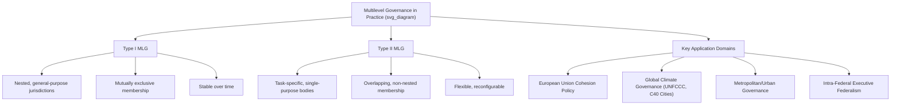

## Multilevel Governance in Practice

### Overview

Multilevel governance (MLG) is a conceptual framework describing how policy authority and decision-making are dispersed across multiple, interconnected levels of government — supranational, national, regional, and local — as well as across state and non-state actors, rather than concentrated within a single sovereign hierarchy. Originally developed to analyze European Union policy-making (Gary Marks, 1993), MLG has since become a general analytical tool for understanding governance systems in which no single level holds exclusive or final authority, and where policy outcomes emerge from continuous negotiation, coordination, and interaction across levels.

### Conceptual Origins and Core Definition

**Gary Marks's Original Formulation (1993, 1996)**

Marks introduced MLG to describe European Community structural policy, observing that decision-making authority in the EU was not simply "intergovernmental" (controlled by member-state governments alone) but instead involved a complex, overlapping interplay of supranational (European Commission), national, and subnational (regional) actors, each exercising independent influence over policy outcomes — challenging the classical realist assumption that nation-states are the sole or dominant locus of authority in international/domestic governance.

**Key Points**

- MLG differs from classical federalism theory in that it does not require constitutionally entrenched division of powers; it describes *functional* and *relational* patterns of authority-sharing that may exist even in the absence of formal federal structures (e.g., the EU's *sui generis* supranational architecture, or the informal networks connecting local governments, national ministries, and international organizations in a given policy domain).
- MLG explicitly incorporates **non-state and quasi-state actors** — NGOs, private firms, international organizations, professional associations — into the analysis of governance, extending beyond the purely governmental focus of classical federalism theory.

### Type I vs. Type II Multilevel Governance (Hooghe and Marks, 2003)

Liesbet Hooghe and Gary Marks refined the concept by distinguishing two structurally distinct forms of governance dispersion:

**Type I MLG**

- Jurisdictions are organized in a limited number of clearly nested, general-purpose levels (e.g., local → regional → national → supranational).
- Membership is mutually exclusive at each level (a citizen belongs to one municipality, one region, one nation-state).
- Jurisdictions are stable over extended periods and bundle multiple functions together (a general-purpose government handles education, health, infrastructure, etc. simultaneously).
- This resembles classical federalism's nested-jurisdiction structure.

**Type II MLG**

- Jurisdictions are task-specific, single-purpose, and often numerous.
- Memberships can overlap extensively — an individual or territory may simultaneously belong to multiple, non-nested functional jurisdictions (e.g., a river basin management authority, a metropolitan transit authority, a school district, and a special economic zone board, each with different, overlapping territorial boundaries).
- Jurisdictional boundaries and institutional arrangements are often more flexible and can be reconfigured relatively easily in response to changing functional needs.
- Examples: special-purpose regional development agencies, cross-border river basin commissions, metropolitan transportation authorities, EU policy networks organized around specific regulatory domains (competition policy networks, environmental compliance networks).

**Key Points**

- Type I and Type II are not mutually exclusive; most real-world governance systems exhibit a *combination* of nested general-purpose jurisdictions (Type I) overlaid with numerous overlapping functional bodies (Type II) — a defining feature of "governance" as distinct from simple "government."

### Visual Model: Type I vs. Type II Governance Structures

<svg xmlns="http://www.w3.org/2000/svg" viewBox="0 0 720 300">
<text x="360" y="24" text-anchor="middle" font-size="16" font-weight="bold" fill="#1a1a1a">Type I vs. Type II Multilevel Governance (svg_diagram)</text>

<text x="180" y="55" text-anchor="middle" font-size="13" font-weight="bold" fill="#333">Type I: Nested, General-Purpose</text>

<rect x="60" y="70" width="240" height="55" rx="6" fill="`#a8d5ba`" stroke="#333" stroke-width="1.5" />

<text x="180" y="102" text-anchor="middle" font-size="11" fill="`#1a1a1a`">National Government</text>

<rect x="90" y="140" width="180" height="45" rx="6" fill="`#c9dfa8`" stroke="#333" stroke-width="1.5" />

<text x="180" y="167" text-anchor="middle" font-size="10" fill="`#1a1a1a`">Regional Government</text>

<rect x="115" y="200" width="130" height="40" rx="6" fill="`#f4d58d`" stroke="#333" stroke-width="1.5" />

<text x="180" y="224" text-anchor="middle" font-size="10" fill="`#1a1a1a`">Local Government</text>

<text x="540" y="55" text-anchor="middle" font-size="13" font-weight="bold" fill="#333">Type II: Overlapping, Task-Specific</text>

<ellipse cx="480" cy="120" rx="80" ry="35" fill="`#a8d5ba`" fill-opacity="0.6" stroke="#333" stroke-width="1.5" />

<text x="480" y="118" text-anchor="middle" font-size="9" fill="`#1a1a1a`">River Basin</text>

<text x="480" y="130" text-anchor="middle" font-size="9" fill="`#1a1a1a`">Authority</text>

<ellipse cx="580" cy="160" rx="80" ry="35" fill="#f4d58d" fill-opacity="0.6" stroke="#333" stroke-width="1.5" />
<text x="580" y="158" text-anchor="middle" font-size="9" fill="#1a1a1a">Transit</text>
<text x="580" y="170" text-anchor="middle" font-size="9" fill="#1a1a1a">Authority</text>
<ellipse cx="500" cy="210" rx="80" ry="35" fill="#c9dfa8" fill-opacity="0.6" stroke="#333" stroke-width="1.5" />
<text x="500" y="208" text-anchor="middle" font-size="9" fill="#1a1a1a">School</text>
<text x="500" y="220" text-anchor="middle" font-size="9" fill="#1a1a1a">District</text>
</svg>

### Application: The European Union as the Paradigmatic MLG Case

The EU is the most extensively studied MLG system, exhibiting authority dispersion across:

- **Supranational level**: European Commission (policy initiation, enforcement), European Court of Justice (binding adjudication with direct effect and supremacy over national law in EU competence areas), European Parliament (directly elected, co-legislator).
- **National level**: Member-state governments (Council of the EU, European Council), which retain primary authority over non-transferred competencies (defense, taxation, largely).
- **Subnational level**: Regions and localities participate directly in EU policy through mechanisms like the **Committee of the Regions** (advisory body representing local/regional authorities), and directly access EU structural/cohesion funds without national government as sole intermediary in some programs — a hallmark of genuine multilevel (rather than purely intergovernmental) governance.
- **Non-state actors**: Interest groups, trade associations, and NGOs engage in extensive lobbying and consultation processes at the Commission level, and increasingly through formalized stakeholder consultation mechanisms.

**Example**

EU Cohesion Policy (structural and investment funds) exemplifies MLG in practice: funding allocation involves negotiation among the European Commission (setting overall priorities and regulations), member-state governments (negotiating national allocation envelopes), and regional/local authorities (which often directly manage "Operational Programmes" and select specific projects for funding) — illustrating a genuinely multilevel decision-making chain rather than a simple top-down or bottom-up hierarchy.

### Multilevel Governance Beyond the EU

While the EU remains the paradigmatic case, MLG frameworks are increasingly applied to other governance domains:

**1. Global Climate Governance**

Climate policy operates simultaneously at multiple levels: international treaty frameworks (UNFCCC, Paris Agreement), national government commitments (Nationally Determined Contributions), subnational/regional climate action (e.g., US state-level climate policies such as California's cap-and-trade system, operating independently of variable federal-level commitment), and city-level networks (e.g., the C40 Cities Climate Leadership Group, a transnational municipal network operating largely outside formal national government channels) — a frequently cited example of Type II MLG, since city networks constitute functionally specific, non-nested governance arrangements that cut across national state hierarchies.

**2. Federal Systems' Internal MLG Dynamics**

Even within formally federal states, MLG concepts illuminate governance beyond the formal constitutional division of powers — for instance, executive federalism institutions (intergovernmental councils, first-ministers' conferences) and cross-jurisdictional functional bodies (e.g., river basin or metropolitan planning authorities spanning multiple states/provinces) represent Type II-style governance layered atop the Type I federal constitutional structure.

**3. Metropolitan and Urban Governance**

Large metropolitan areas frequently span multiple formal jurisdictional boundaries (multiple municipalities, sometimes multiple states/provinces), requiring functional coordination mechanisms (metropolitan planning organizations, regional transit authorities, joint infrastructure boards) that exemplify Type II governance layered atop Type I local government structures.

### Worked Example: Philippine Multilevel Governance Dynamics

**Example**

The Philippines, formally a unitary state, nonetheless exhibits recognizable multilevel governance dynamics that political science analysis can productively examine through the MLG lens rather than purely through unitary/federal classification:

- **Type I structure**: National government → Regions (administrative, not devolved units, except BARMM) → Provinces → Cities/Municipalities → Barangays, per the Local Government Code of 1991.
- **Type II overlays**: Special-purpose bodies such as the Metropolitan Manila Development Authority (MMDA), which coordinates specific functions (traffic management, flood control, waste management) across the 16 cities and 1 municipality of Metro Manila — a jurisdiction that does not correspond to any single Type I administrative unit, and whose authority is functionally specific rather than general-purpose. Similarly, river basin management bodies (e.g., the Laguna Lake Development Authority) and regional development councils operate as functionally specific, often overlapping bodies layered atop the formal Type I local government hierarchy.
- **BARMM as an asymmetric case**: The Bangsamoro Autonomous Region in Muslim Mindanao represents an area of enhanced Type I autonomy (a general-purpose government with expanded legislative competence) coexisting with the national government's continued authority over reserved and concurrent powers under RA 11054 — illustrating how asymmetric arrangements complicate a simple nested-hierarchy account of Philippine governance.

This demonstrates a broader point in the multilevel governance literature: even nominally unitary states with formally simple Type I hierarchies typically develop substantial Type II functional governance overlays to manage cross-jurisdictional problems (metropolitan coordination, watershed management, regional economic development) that do not map neatly onto standard administrative boundaries.

### Diagrammatic Summary: MLG Analytical Framework

### Critiques and Analytical Debates

- **Accountability and democratic deficit concerns**: The dispersion of authority across many overlapping levels and actors (especially Type II bodies) can weaken clear lines of democratic accountability, since citizens may struggle to identify which level or body is responsible for a given policy outcome — a concern frequently raised regarding both EU governance and complex domestic metropolitan governance arrangements. [Inference: whether this accountability diffusion represents a fundamental structural flaw or a manageable trade-off against the functional benefits of specialized governance bodies is a normatively contested question in the MLG and democratic theory literature.]
- **Coordination costs**: The proliferation of Type II functional bodies can generate significant coordination costs, overlapping mandates, and potential turf conflicts between bodies with adjacent or overlapping jurisdiction.
- **MLG as description vs. MLG as prescription**: Scholars distinguish between using MLG as a **descriptive/analytical framework** (simply characterizing how governance actually operates) versus treating multilevel governance as a **normatively preferable model** to be actively pursued in institutional design — the original Marks/Hooghe formulation was primarily descriptive/analytical, though the concept has since also been invoked normatively in policy and reform debates.
- **Relationship to federalism theory**: MLG is sometimes criticized as lacking the analytical precision of classical federalism theory (constitutional entrenchment, formal division of powers), since it deliberately encompasses looser, more informal patterns of authority-sharing — a strength for descriptive flexibility but a potential weakness for rigorous comparative institutional analysis. [Inference: this tension between MLG's descriptive breadth and federalism theory's institutional precision is acknowledged within the comparative governance literature itself, rather than being a novel external critique.]

### Conclusion

Multilevel governance provides an analytical framework for understanding how policy authority is dispersed across nested general-purpose jurisdictions (Type I) and overlapping task-specific bodies (Type II), extending beyond classical federalism's focus on constitutionally entrenched divisions of power to capture the fuller complexity of governance in systems ranging from the European Union to domestic metropolitan areas and global climate governance. As the Philippine and EU examples illustrate, MLG dynamics arise even in formally unitary states and are essential for understanding how cross-jurisdictional policy problems are actually managed in practice, independent of a state's formal federal or unitary constitutional classification.

**Related Topics**

- Theories of Federalism (comparison of formal constitutional models to MLG's functional approach)
- Federal and Unitary Systems (formal classification versus practical governance complexity)
- Decentralization and Devolution (Type I structural transfer of authority)
- The European Union as a Sui Generis Multilevel Polity
- Metropolitan and Urban Governance Coordination Mechanisms
- Global Climate Governance and Transnational City Networks
- Intergovernmental Relations and Executive Federalism
- Democratic Accountability in Complex Governance Systems