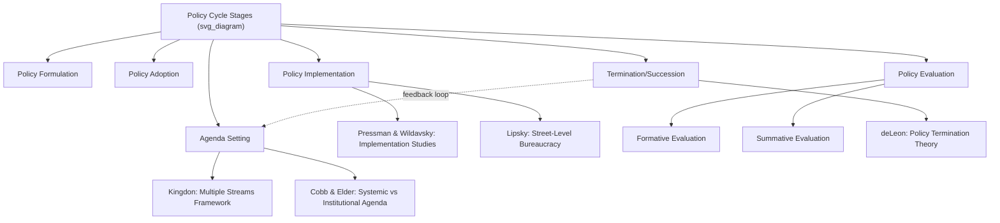

## Stages of the Policy Cycle

### Overview

The policy cycle (also called the "stages heuristic" or "policy process model") is the foundational analytical framework in public policy studies for decomposing the complex, often messy reality of government decision-making into a sequence of discrete, analyzable stages. Originally systematized by Harold Lasswell (1956) and substantially developed by scholars including Charles O. Jones, James Anderson, and later refined and critiqued by Paul Sabatier, the framework treats policy-making as a cyclical, iterative process rather than a single, linear event — enabling scholars and practitioners to isolate and study the distinct actors, institutions, and dynamics operative at each stage.

### The Core Stages

While specific formulations vary slightly across authors, the canonical policy cycle typically comprises five to seven stages. The most widely taught version consolidates these into the following sequence:

**1. Agenda Setting**

The process by which a societal condition or problem gains sufficient attention from policymakers, the media, and the public to be considered a legitimate candidate for government action — as distinguished from the vast universe of conditions that never rise to the level of a recognized "policy problem."

- Key theoretical models: John Kingdon's **Multiple Streams Framework** (problem stream, policy stream, and politics stream converging at a "policy window" to place an issue on the agenda); Roger Cobb and Charles Elder's distinction between the **systemic agenda** (broad public discussion) and the **institutional/governmental agenda** (issues actively under consideration by decision-making bodies).
- **Example**: A localized flooding event that has occurred for years without triggering national attention may abruptly rise to the institutional agenda following a catastrophic event that captures sustained media coverage and mobilizes advocacy coalitions — illustrating Kingdon's "focusing event" concept as a trigger opening a policy window.

**2. Policy Formulation**

The stage in which potential courses of action, alternatives, and specific policy proposals are developed, debated, and refined by policymakers, bureaucrats, interest groups, experts, and advisory bodies in response to an agenda-recognized problem.

- Involves technical policy analysis (cost-benefit analysis, program design options), political negotiation among competing interests, and the drafting of specific legislative or regulatory proposals.
- **Example**: Following recognition of a housing affordability crisis on the government agenda, formulation involves competing proposals — rent control ordinances, zoning reform to increase housing supply, direct subsidy programs, tax incentives for developers — each championed by different coalitions of legislators, advocacy groups, and bureaucratic agencies.

**3. Policy Adoption (Legitimation/Decision-Making)**

The formal stage at which a specific policy alternative is selected and given legal authority — enacted into law by a legislature, issued as an executive order, promulgated as an administrative regulation, or, in some systems, ratified by referendum.

- This stage is where formal institutional rules (legislative procedure, executive authority limits, judicial review standards) most directly constrain which of the formulated alternatives can actually become binding policy.
- **Example**: A housing reform bill passing through committee hearings, floor votes in both legislative chambers, and receiving executive signature constitutes the adoption stage — distinct from the preceding formulation stage where the bill's content was debated and amended.

**4. Policy Implementation**

The stage in which the adopted policy is translated into administrative action — resources are allocated, bureaucratic agencies design operational procedures, street-level bureaucrats interact directly with the public, and the policy's formal provisions are put into practice.

- A major focus of the "implementation studies" subfield (pioneered by Jeffrey Pressman and Aaron Wildavsky's 1973 study of a federal jobs program in Oakland, which highlighted how implementation failures can undermine even well-designed policies due to the sheer number of veto points and coordination requirements across implementing actors).
- Michael Lipsky's concept of **street-level bureaucracy** (1980) is central here: frontline implementers (teachers, police officers, social workers, immigration officers) exercise substantial discretion in how they apply policy in individual cases, meaning the policy "on paper" and the policy "as experienced by citizens" can diverge significantly.
- **Example**: After a national housing subsidy program is adopted, implementation involves the housing ministry designing application procedures, training caseworkers, establishing eligibility verification systems, and coordinating with local housing authorities — each step introducing potential gaps between the policy's original design intent and its actual delivery.

**5. Policy Evaluation**

The stage in which the implemented policy's performance, outcomes, and impacts are systematically assessed against its stated objectives, often using formal program evaluation methodologies (impact evaluation, cost-effectiveness analysis, process evaluation).

- Distinguishes **formative evaluation** (conducted during implementation to guide ongoing adjustments) from **summative evaluation** (conducted after a policy has been in effect for a defined period, to assess overall effectiveness).
- **Example**: A government audit agency or independent research body assessing whether a housing subsidy program achieved its stated goal of increasing affordable housing stock, examining metrics such as units constructed, occupancy rates, and cost per unit relative to comparable alternative interventions.

**6. Policy Termination / Succession / Maintenance**

The final (and most frequently omitted in simplified textbook treatments) stage, in which evaluation findings feed back into a decision to: terminate the policy (rare, given bureaucratic and political inertia favoring program continuation), maintain it largely unchanged, or pursue **policy succession** (replacing the existing policy with a substantially revised version) — feeding back into a renewed agenda-setting and formulation process, which is why the framework is termed a **cycle** rather than a linear sequence.

- Peter deLeon's scholarship on policy termination emphasizes that outright termination is politically difficult because established programs generate their own constituencies (beneficiaries, bureaucratic agencies, contractors) with vested interests in continuation, even when evaluation evidence suggests poor performance — a dynamic sometimes described using the broader concept of policy feedback or "path dependency."

### Visual Model: The Policy Cycle

<svg xmlns="http://www.w3.org/2000/svg" viewBox="0 0 700 500">
<text x="350" y="24" text-anchor="middle" font-size="16" font-weight="bold" fill="#1a1a1a">The Policy Cycle (svg_diagram)</text>
<circle cx="350" cy="270" r="180" fill="none" stroke="#ccc" stroke-width="1" stroke-dasharray="3,3" />
<circle cx="350" cy="90" r="55" fill="#a8d5ba" stroke="#333" stroke-width="1.5" />
<text x="350" y="85" text-anchor="middle" font-size="11" font-weight="bold" fill="#1a1a1a">Agenda</text>
<text x="350" y="99" text-anchor="middle" font-size="11" font-weight="bold" fill="#1a1a1a">Setting</text>
<circle cx="510" cy="180" r="55" fill="#c9dfa8" stroke="#333" stroke-width="1.5" />
<text x="510" y="175" text-anchor="middle" font-size="11" font-weight="bold" fill="#1a1a1a">Policy</text>
<text x="510" y="189" text-anchor="middle" font-size="11" font-weight="bold" fill="#1a1a1a">Formulation</text>
<circle cx="510" cy="360" r="55" fill="#f4d58d" stroke="#333" stroke-width="1.5" />
<text x="510" y="355" text-anchor="middle" font-size="11" font-weight="bold" fill="#1a1a1a">Policy</text>
<text x="510" y="369" text-anchor="middle" font-size="11" font-weight="bold" fill="#1a1a1a">Adoption</text>
<circle cx="350" cy="450" r="55" fill="#f0c987" stroke="#333" stroke-width="1.5" />
<text x="350" y="445" text-anchor="middle" font-size="11" font-weight="bold" fill="#1a1a1a">Policy</text>
<text x="350" y="459" text-anchor="middle" font-size="11" font-weight="bold" fill="#1a1a1a">Implementation</text>
<circle cx="190" cy="360" r="55" fill="#e6a97e" stroke="#333" stroke-width="1.5" />
<text x="190" y="355" text-anchor="middle" font-size="11" font-weight="bold" fill="#1a1a1a">Policy</text>
<text x="190" y="369" text-anchor="middle" font-size="11" font-weight="bold" fill="#1a1a1a">Evaluation</text>
<circle cx="190" cy="180" r="55" fill="#d9a8c4" stroke="#333" stroke-width="1.5" />
<text x="190" y="175" text-anchor="middle" font-size="10" font-weight="bold" fill="#1a1a1a">Termination /</text>
<text x="190" y="189" text-anchor="middle" font-size="10" font-weight="bold" fill="#1a1a1a">Succession</text>
<path d="M 390 130 A 180 180 0 0 1 470 140" fill="none" stroke="#333" stroke-width="2" marker-end="url(#arrow4)" />
<path d="M 540 230 A 180 180 0 0 1 545 310" fill="none" stroke="#333" stroke-width="2" marker-end="url(#arrow4)" />
<path d="M 480 405 A 180 180 0 0 1 400 435" fill="none" stroke="#333" stroke-width="2" marker-end="url(#arrow4)" />
<path d="M 300 440 A 180 180 0 0 1 225 400" fill="none" stroke="#333" stroke-width="2" marker-end="url(#arrow4)" />
<path d="M 165 320 A 180 180 0 0 1 165 235" fill="none" stroke="#333" stroke-width="2" marker-end="url(#arrow4)" />
<path d="M 220 140 A 180 180 0 0 1 300 120" fill="none" stroke="#333" stroke-width="2" marker-end="url(#arrow4)" />
</svg>

### Key Points on the Model's Function and Limitations

- **Heuristic, not empirical description**: The policy cycle is best understood as a **stages heuristic** — an analytically useful simplification for organizing research and teaching — rather than an accurate empirical description of how real policy-making actually unfolds. Paul Sabatier's influential critique (1988, 1991) argued the stages model lacks genuine causal/explanatory power (it describes a sequence but doesn't explain why movement between stages occurs), is not genuinely falsifiable as a theory, and often misrepresents reality since stages frequently overlap, occur out of sequence, or loop back unpredictably (e.g., implementation problems triggering renewed formulation without a discrete "evaluation" stage occurring first). [Inference: Sabatier's critique is widely cited and broadly accepted within the discipline as a significant limitation of the pure stages model, though the framework nonetheless retains substantial pedagogical value and continues to be taught as the standard entry point into policy process theory.]
- **Alternative/competing frameworks**: Partly in response to the stages model's limitations, scholars developed alternative theoretical frameworks aiming for greater explanatory power — notably Sabatier's own **Advocacy Coalition Framework** (competing coalitions of actors sharing core beliefs, contesting policy over long time horizons), Kingdon's **Multiple Streams Framework** (primarily focused on agenda-setting but with broader applicability), and **Punctuated Equilibrium Theory** (Baumgartner and Jones — policy typically exhibits long periods of stability punctuated by sudden, rapid shifts). [Inference: these frameworks are generally treated in the literature as complementary lenses addressing different aspects/stages of the policy process, rather than as a single unified replacement for the stages heuristic.]
- **Iterative/cyclical, not linear**: Despite being taught sequentially, the "cycle" terminology itself emphasizes that termination/succession feeds back into renewed agenda-setting, and that stages can and do loop back on each other in practice (e.g., implementation experience often generates new formulation debates without waiting for a formal evaluation stage).

### Worked Example: Applying the Full Cycle — Philippine K-12 Education Reform

**Example**

The Philippines' shift to a K-12 basic education system (Republic Act 10533, the Enhanced Basic Education Act of 2013) illustrates the full policy cycle:

- **Agenda setting**: The Philippines' 10-year basic education cycle (the shortest in Asia and among the shortest globally at the time) was identified as a competitiveness and educational-quality problem by education reform advocates, international assessments, and government planning bodies, eventually rising onto the Aquino administration's institutional agenda.
- **Formulation**: The Department of Education (DepEd), together with legislators, education experts, and stakeholder consultations, developed the specific K-12 curriculum framework, including the addition of Kindergarten and two additional senior high school years (Grades 11–12) with academic, technical-vocational, sports, and arts tracks.
- **Adoption**: RA 10533 was passed by Congress and signed into law in May 2013, formally legitimizing the K-12 framework.
- **Implementation**: DepEd, in coordination with the Commission on Higher Education (CHED) and TESDA, rolled out the new curriculum in phases beginning school year 2012-2013 (kindergarten and Grade 1) with senior high school implementation beginning 2016 — involving teacher retraining, curriculum material development, school infrastructure expansion, and private-sector partnerships for senior high school delivery capacity.
- **Evaluation**: Ongoing assessments (by DepEd, academic researchers, and international bodies) have examined outcomes including student learning performance (e.g., Philippine performance in the Programme for International Student Assessment, PISA), teacher workload and preparedness, and labor market outcomes for K-12 graduates. [Inference: evaluation findings on K-12 reform's overall effectiveness remain mixed and are the subject of ongoing academic and policy debate; readers researching current assessment findings should consult recent DepEd and independent research publications for up-to-date evidence.]
- **Termination/Succession dynamics**: Rather than termination, the K-12 program has undergone incremental adjustment debates (e.g., periodic legislative proposals to review or amend specific curriculum components or the senior high school track structure), illustrating policy maintenance-with-adjustment rather than either wholesale termination or static permanence — consistent with deLeon's observation that established programs with entrenched constituencies (students, teachers, private senior-high providers) rarely face clean termination even amid evaluation critiques.

### Diagrammatic Summary: Stages and Associated Theoretical Frameworks

### Common Analytical Pitfalls

- **Treating the cycle as strictly linear**: Real policy processes routinely skip stages, reorder them, or run multiple stages concurrently (e.g., implementation feedback prompting formulation adjustments before formal evaluation occurs) — students should apply the framework analytically rather than assuming real-world policy-making follows it mechanically.
- **Confusing adoption with implementation**: A policy being formally enacted (adoption) does not guarantee it will be implemented as designed — the gap between adopted policy and implemented reality (the "implementation gap") is a major and well-documented independent area of study, not an assumption that can be skipped over.
- **Underweighting termination/succession**: Introductory treatments frequently omit or underemphasize the termination/succession stage, obscuring the framework's genuinely *cyclical* (rather than linear, terminal) character, and missing an important insight: policies rarely simply end, but rather evolve, if evaluation and political pressures prompt renewed formulation.

### Conclusion

The policy cycle decomposes the public policy process into agenda setting, formulation, adoption, implementation, evaluation, and termination/succession stages, offering an accessible and widely-taught heuristic for analyzing how issues become government action. While Sabatier's influential critique highlights the model's limited causal/explanatory power relative to competing frameworks (Advocacy Coalition Framework, Multiple Streams, Punctuated Equilibrium Theory), the stages heuristic remains foundational for organizing policy studies pedagogically and for identifying the distinct actors, institutions, and dynamics operative at each stage, as illustrated by the Philippine K-12 education reform example above.

**Related Topics**

- Agenda-Setting Theories (Kingdon's Multiple Streams Framework, Cobb and Elder)
- Policy Implementation and the Implementation Gap
- Street-Level Bureaucracy and Discretion in Service Delivery
- Program Evaluation Methods (Formative vs. Summative Evaluation)
- The Advocacy Coalition Framework
- Punctuated Equilibrium Theory in Policy Studies
- Policy Termination and Succession Dynamics
- Case Study: Philippine K-12 Education Reform (RA 10533)