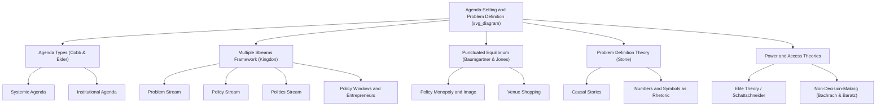

## Agenda-Setting and Problem Definition

### Overview

Agenda-setting and problem definition constitute the earliest and, in many respects, most politically consequential stage of the policy process: the process by which some social conditions come to be recognized as public problems requiring government action, while others remain unaddressed or are treated as private matters, natural occurrences, or someone else's responsibility. Problem definition is not a neutral, technical exercise — how a problem is framed determines which solutions appear feasible, which actors are seen as responsible, and which institutional venue is appropriate to address it, making agenda-setting a central site of political contestation.

### Foundational Distinction: Conditions vs. Problems

**Key Points**

- Not every undesirable social condition automatically becomes a recognized "policy problem." A **condition** becomes a **problem** only when it is perceived by relevant actors as (a) amenable to change through collective/government action, and (b) a legitimate matter for government intervention rather than private responsibility, fate, or nature.
- This distinction, emphasized by scholars including Deborah Stone (*Policy Paradox*), highlights that problem definition inherently involves **causal storytelling**: actors compete to characterize a condition's cause (individual failing vs. systemic failure, accident vs. intentional harm, natural vs. human-caused) because the assigned cause shapes who is held responsible and what kind of solution follows.
- **Example**: Poverty can be framed as resulting from individual behavioral choices (implying solutions like work requirements or personal responsibility programs), from structural economic factors like labor market discrimination or automation (implying solutions like job training or redistribution), or from inadequate social safety nets (implying solutions like expanded welfare benefits) — each framing supports a different policy response and mobilizes different political coalitions.

### Agenda Types: Cobb and Elder's Framework (1972)

Roger Cobb and Charles Elder distinguished between different levels of agenda status, providing essential vocabulary for tracking an issue's progression:

- **Systemic (public) agenda**: The broad set of issues perceived by the political community as meriting public attention and falling within the legitimate jurisdiction of government authority, without necessarily being under active consideration by any specific decision-making body.
- **Institutional (governmental) agenda**: The narrower, more concrete set of issues explicitly under active, serious consideration by authoritative decision-makers (a legislature scheduling hearings, an executive agency drafting regulations, a court granting certiorari).

Movement from the systemic to the institutional agenda is neither automatic nor guaranteed — many issues remain permanently on the systemic agenda (broadly recognized as problems) without ever securing institutional attention, often due to resource constraints, lack of political will, or absence of a viable policy solution.

### John Kingdon's Multiple Streams Framework (1984)

Kingdon's framework remains the most influential and widely-applied model of agenda-setting, proposing that policy change occurs when three largely independent "streams" converge:

**1. Problem Stream**

Conditions become recognized as problems through indicators (statistical measures showing a condition is worsening or differs from comparable cases), focusing events (sudden, dramatic occurrences that draw sustained attention — disasters, scandals, crises), and feedback (evidence that existing policies are failing to achieve their goals).

**2. Policy Stream**

The community of specialists, analysts, and advocates continuously generates, refines, and circulates policy proposals and solutions — largely independent of whether any specific problem is currently salient. Kingdon likens this to a "primeval soup" in which ideas are proposed, combined, and gradually gain acceptance among the policy community based on criteria including technical feasibility, value acceptability, and anticipated cost.

**3. Politics Stream**

Encompasses the broader political climate: shifts in public mood/national mood, election results and resulting changes in partisan control of government, and organized interest group pressure/opposition — factors that operate largely independently of the specific technical merits of any given problem or solution.

**Policy Windows**

Kingdon argues that these three streams typically flow independently, and significant policy change becomes possible only when a **policy window** opens — a brief period when the streams converge (a recognized problem, a ready technically-and-politically-viable solution, and a receptive political climate align simultaneously). **Policy entrepreneurs** — individuals or organizations who invest time, resources, and political capital in advocating for a preferred solution — play a critical role by being prepared to "couple" a ready-made solution to a newly salient problem the moment a window opens, since windows tend to be unpredictable and short-lived.

**Key Points**

- Kingdon's central insight is that solutions frequently precede and exist independently of the problems they eventually get attached to — challenging a naive rationalist assumption that policy proposals are developed *in response to* a clearly identified problem. Advocates often have a preferred solution ready in advance and actively search for a problem (and political moment) to which it can be persuasively attached.

### Visual Model: Kingdon's Multiple Streams Framework

<svg xmlns="http://www.w3.org/2000/svg" viewBox="0 0 720 320">
<text x="360" y="24" text-anchor="middle" font-size="16" font-weight="bold" fill="#1a1a1a">Multiple Streams Framework (svg_diagram)</text>
<rect x="40" y="60" width="160" height="200" rx="8" fill="#a8d5ba" fill-opacity="0.5" stroke="#333" stroke-width="1.5" />
<text x="120" y="85" text-anchor="middle" font-size="12" font-weight="bold" fill="#1a1a1a">Problem Stream</text>
<text x="120" y="115" text-anchor="middle" font-size="10" fill="#333">Indicators</text>
<text x="120" y="140" text-anchor="middle" font-size="10" fill="#333">Focusing events</text>
<text x="120" y="165" text-anchor="middle" font-size="10" fill="#333">Feedback</text>
<rect x="280" y="60" width="160" height="200" rx="8" fill="#f4d58d" fill-opacity="0.5" stroke="#333" stroke-width="1.5" />
<text x="360" y="85" text-anchor="middle" font-size="12" font-weight="bold" fill="#1a1a1a">Policy Stream</text>
<text x="360" y="115" text-anchor="middle" font-size="10" fill="#333">Specialist proposals</text>
<text x="360" y="140" text-anchor="middle" font-size="10" fill="#333">Technical feasibility</text>
<text x="360" y="165" text-anchor="middle" font-size="10" fill="#333">"Primeval soup" of ideas</text>
<rect x="520" y="60" width="160" height="200" rx="8" fill="#c9dfa8" fill-opacity="0.5" stroke="#333" stroke-width="1.5" />
<text x="600" y="85" text-anchor="middle" font-size="12" font-weight="bold" fill="#1a1a1a">Politics Stream</text>
<text x="600" y="115" text-anchor="middle" font-size="10" fill="#333">National mood</text>
<text x="600" y="140" text-anchor="middle" font-size="10" fill="#333">Election outcomes</text>
<text x="600" y="165" text-anchor="middle" font-size="10" fill="#333">Interest group pressure</text>
<path d="M 200 160 L 275 160" stroke="#333" stroke-width="2" marker-end="url(#arrow5)" />
<path d="M 440 160 L 515 160" stroke="#333" stroke-width="2" marker-end="url(#arrow5)" />
<ellipse cx="360" cy="290" rx="130" ry="20" fill="#f0c987" stroke="#333" stroke-width="1.5" />
<text x="360" y="295" text-anchor="middle" font-size="11" font-weight="bold" fill="#1a1a1a">Policy Window Opens</text>
</svg>

### Additional Theoretical Perspectives on Agenda-Setting

**Punctuated Equilibrium Theory (Baumgartner and Jones, 1993)**

Argues that policy agendas typically exhibit long periods of stability ("policy monopolies" maintained by dominant issue framings and institutional arrangements) punctuated by sudden, rapid bursts of agenda change and policy shift, often triggered by a shift in the dominant **policy image** (how an issue is publicly framed and understood) combined with a shift in the **venue** (which institution has jurisdiction to address it). When a policy monopoly's supportive image erodes (e.g., through new information, a focusing event, or successful reframing by challengers), issues can rapidly escalate onto the institutional agenda after long dormancy.

**Media and Framing Theories**

- **Agenda-setting theory (mass communication research, McCombs and Shaw, 1972)**: The media may not tell people *what to think*, but is highly influential in telling people *what to think about* — issues receiving sustained media coverage tend to be perceived by the public as more important, independent of objective severity indicators.
- **Framing effects**: How an issue is presented (which aspects are emphasized, what causal narrative is invoked, which values are highlighted) shapes public and elite interpretation and preferred solutions — closely related to Stone's causal-story framework above.

**Interest Group and Elite Theories**

- **Elite theory perspectives** (e.g., drawing on C. Wright Mills, E.E. Schattschneider) emphasize that agenda access is unevenly distributed: well-resourced interest groups, corporations, and elite actors possess disproportionate capacity to place issues on (or keep issues off) the institutional agenda, compared to diffuse, poorly-organized publics — Schattschneider's famous observation that "the definition of alternatives is the supreme instrument of power" underscores those who control problem definition and agenda access often exercise more influence than those who merely vote on already-defined alternatives.
- **Non-decision-making** (Bachrach and Baratz, 1962): A form of power exercised not by winning policy battles but by preventing certain issues from ever reaching the institutional agenda at all — suppressing potential challenges to the status quo before they gain traction, a form of agenda-control that is often difficult to empirically observe precisely because its effect is the *absence* of agenda activity.

### Problem Definition as Strategic Political Activity (Deborah Stone)

Stone's *Policy Paradox* (1988, revised editions) provides an influential account of problem definition as inherently strategic and value-laden rather than purely technical:

- **Causal stories**: Political actors construct competing narratives assigning cause and responsibility for a problem — as "intentional" (deliberate harm by an identifiable actor), "inadvertent" (unintended consequence of otherwise legitimate action), "mechanical" (impersonal cause, no human agency), or "accidental" (unforeseeable) — each causal type implies different policy remedies and different targets for blame or corrective action.
- **Numbers and symbols as rhetorical tools**: Statistical measures and symbolic narratives (personal anecdotes, powerful images) are not neutral data but are strategically deployed by advocates to construct particular problem definitions favorable to their preferred solutions.

**Example**

A rise in traffic fatalities can be defined (a) as an individual behavior problem (reckless/impaired driving, implying enforcement and penalty solutions), (b) as an engineering/infrastructure problem (poor road design, implying infrastructure investment solutions), or (c) as a vehicle safety/regulatory problem (inadequate manufacturer safety standards, implying stricter vehicle regulation) — each definition mobilizes different advocacy coalitions (law enforcement associations, civil engineering professional bodies, consumer safety organizations) and points toward different institutional venues for action.

### Worked Example: Agenda-Setting for Philippine Traffic Congestion Policy (EDSA Carousel/Bus Rapid Transit)

**Example**

Metro Manila traffic congestion illustrates multiple-streams dynamics in a Philippine context:

- **Problem stream**: Long-standing indicators (worsening average commute times, economic productivity loss estimates, air quality data) established traffic congestion as a chronic, well-documented systemic-agenda item for years without triggering major institutional action at the scale eventually achieved.
- **Policy stream**: Transport planning specialists and multilateral development agencies had long circulated Bus Rapid Transit (BRT) and dedicated bus-lane proposals as technically feasible solutions, based on comparative experience from other cities (e.g., Bogotá's TransMilenio system), independent of any specific triggering event.
- **Politics stream and policy window**: The COVID-19 pandemic created an unusual convergence — reduced private vehicle usage created a temporary opportunity to implement EDSA busway/bus-lane reforms (the "EDSA Carousel," launched 2020) with reduced immediate political resistance from private motorists, illustrating how an exogenous crisis event can open a policy window enabling policy entrepreneurs (transport officials, reform advocates) to couple a long-available policy stream solution (dedicated bus lanes) to a newly-salient political moment. [Inference: the specific causal weight of the pandemic-related traffic reduction versus other political factors (leadership priorities, international development bank pressure/financing) in enabling this particular policy window is a matter that would benefit from dedicated case-study research rather than being definitively established by a single causal account.]

### Diagrammatic Summary: Agenda-Setting Theoretical Landscape

### Common Analytical Pitfalls

- **Treating problem definition as objective/technical**: Students frequently underestimate the degree to which problem definition is a strategic, contested political activity rather than a neutral identification of "facts" — the same underlying condition can be defined multiple, competing ways with significant downstream policy consequences.
- **Assuming rational, linear problem-to-solution sequencing**: Kingdon's key contribution is precisely to challenge this assumption — solutions frequently exist independently of and prior to the problems they eventually attach to, meaning the sequence "problem identified → solution designed" is often reversed or simultaneous in practice.
- **Overlooking non-decision-making**: Analytical focus tends to concentrate on issues that successfully reach the agenda, potentially neglecting Bachrach and Baratz's important insight that agenda-*exclusion* (issues systematically kept off the agenda) is an equally significant, if empirically harder to observe, exercise of political power.

### Conclusion

Agenda-setting and problem definition determine which social conditions are recognized as legitimate objects of government action and how those recognized problems are causally framed — decisions with profound downstream consequences for which solutions appear viable and which actors bear responsibility. Kingdon's Multiple Streams Framework, Cobb and Elder's systemic/institutional agenda distinction, Baumgartner and Jones's punctuated equilibrium theory, and Stone's analysis of strategic problem definition together provide the core theoretical toolkit for analyzing this stage, as illustrated by the traffic congestion and poverty-framing examples above. Because problem definition is inherently contested rather than technical, agenda-setting remains one of the most politically consequential — and analytically rich — stages of the policy process.

**Related Topics**

- Stages of the Policy Cycle (agenda-setting's place in the broader process)
- Kingdon's Multiple Streams Framework in Depth
- Punctuated Equilibrium Theory and Policy Monopolies
- Deborah Stone's Policy Paradox and Causal Story Construction
- Media Framing and Public Opinion Formation
- Interest Groups, Elite Theory, and Agenda Access
- Focusing Events and Crisis-Driven Policy Change
- Case Study: Metro Manila Transport Policy Reform