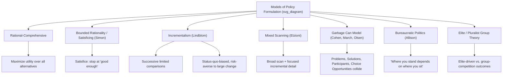

## Models of Policy Formulation and Decision-Making

### Overview

Models of policy formulation and decision-making are theoretical frameworks describing *how* policymakers actually develop, select among, and adopt policy alternatives, once a problem has secured agenda status. These models range from idealized rational-choice accounts to descriptively grounded models emphasizing cognitive limitations, incrementalism, organizational routines, bureaucratic politics, and elite/group influence. Understanding these competing models is essential because each carries distinct implications for how policy analysis should be conducted and what kind of policy advice is realistic to offer decision-makers.

### The Rational (Comprehensive) Model

**Core Claim**

The rational-comprehensive model, most closely associated with classical decision theory and early policy analysis (e.g., Herbert Simon's initial baseline before his own critique, discussed below), posits that policymakers proceed through an idealized sequence:

1. Identify and clarify the problem and objectives
2. Identify **all** possible alternative solutions
3. Evaluate **all** alternatives against **all** relevant criteria (costs, benefits, side effects)
4. Select the alternative that **maximizes** the achievement of stated objectives (the single "best" option)

$$\text{Optimal Policy} = \underset{a \in A}{\arg\max} \; U(a)$$

Where $A$ represents the complete set of feasible alternatives and $U(a)$ represents the utility/value achieved by alternative $a$ against the decision-maker's objectives.

**Key Points**

- The rational model functions as an important **normative benchmark** for policy analysis technique (systematic option comparison, formal cost-benefit and cost-effectiveness analysis) even though virtually all policy scholars agree it fails as an accurate **descriptive** account of how real-world decision-making occurs.
- Practical limitations: policymakers rarely (if ever) possess complete information about all alternatives and their consequences, face severe time and resource constraints, operate amid contested and often internally inconsistent policy objectives, and must act within political constraints that preclude simply selecting the analytically "optimal" solution regardless of its political feasibility.

### Herbert Simon's Bounded Rationality

**Core Claim**

Herbert Simon (1947, *Administrative Behavior*) provided the foundational critique of the pure rational model, arguing that human decision-makers operate under **bounded rationality**: cognitive, informational, and time constraints make truly comprehensive rationality impossible. Rather than maximizing (selecting the objectively optimal alternative from a complete alternative set), decision-makers **satisfice** — they search only until they identify an alternative that meets some minimally acceptable threshold of satisfactory performance, then stop searching and adopt it, rather than continuing to search for the theoretically optimal solution.

**Key Points**

- Satisficing is not simply "settling for less" out of laziness; Simon frames it as a **rational adaptation** to genuine cognitive and informational limits — exhaustive search and evaluation of every conceivable alternative would itself be an inefficient (and often practically impossible) use of scarce decision-making resources.
- Bounded rationality became foundational not only for public policy studies but also for organizational theory and behavioral economics (subsequently developed further by scholars including Daniel Kahneman and Amos Tversky in the behavioral decision-making tradition).

### Charles Lindblom's Incrementalism ("Muddling Through")

**Core Claim**

Charles Lindblom's highly influential 1959 article "The Science of 'Muddling Through'" proposed that real-world policy-making proceeds through **successive limited comparisons** rather than comprehensive rational analysis. Under this model, policymakers:

- Consider only a **narrow range of alternatives** that differ only marginally (incrementally) from existing policy, rather than considering the full universe of theoretically possible options.
- Do not clearly separate the specification of objectives from the evaluation of alternatives — means and ends are adjusted simultaneously, since policymakers often work backward from politically feasible means to acceptable-sounding ends.
- Evaluate alternatives primarily by whether relevant political actors can reach **agreement**, rather than by whether an alternative is analytically optimal against a fixed, agreed-upon set of objectives.
- Treat policy-making as a continuous, never-finished process of successive adjustments ("serial adjustment"), rather than a single decisive choice-event.

**Key Points**

- Incrementalism is both a **descriptive** claim (this is how policy-making actually tends to occur, especially in stable, pluralist democratic systems) and, in Lindblom's own framing, a partially **normative** claim (incremental adjustment is often a *reasonable* strategy given uncertainty, since large, comprehensive policy changes carry greater risk of large-scale unintended consequences, whereas small incremental steps allow for course-correction based on observed feedback).
- Critics (notably Yehezkel Dror and Amitai Etzioni, discussed below) argued incrementalism is overly conservative, systematically biased toward preserving the status quo, poorly suited to addressing genuinely novel or urgent problems requiring substantial departure from existing policy, and potentially reinforces existing power distributions by never seriously questioning the broader status quo framework within which incremental adjustments occur.

### Visual Model: Rational vs. Incremental Decision Paths

<svg xmlns="http://www.w3.org/2000/svg" viewBox="0 0 720 320">
<text x="360" y="24" text-anchor="middle" font-size="16" font-weight="bold" fill="#1a1a1a">Rational vs. Incremental Models (svg_diagram)</text>

<text x="180" y="55" text-anchor="middle" font-size="13" font-weight="bold" fill="#333">Rational-Comprehensive Model</text>

<circle cx="80" cy="150" r="10" fill="`#a8d5ba`" stroke="#333" />

<circle cx="140" cy="100" r="10" fill="`#f4d58d`" stroke="#333" />

<circle cx="140" cy="200" r="10" fill="`#f4d58d`" stroke="#333" />

<circle cx="200" cy="70" r="10" fill="`#f4d58d`" stroke="#333" />

<circle cx="200" cy="150" r="10" fill="`#f4d58d`" stroke="#333" />

<circle cx="200" cy="230" r="10" fill="`#f4d58d`" stroke="#333" />

<circle cx="260" cy="150" r="14" fill="`#c9dfa8`" stroke="#333" stroke-width="2" />

<line x1="80" y1="150" x2="140" y2="100" stroke="#999" stroke-width="1" />

<line x1="80" y1="150" x2="140" y2="200" stroke="#999" stroke-width="1" />

<line x1="80" y1="150" x2="200" y2="70" stroke="#999" stroke-width="1" />

<line x1="80" y1="150" x2="200" y2="150" stroke="#999" stroke-width="1" />

<line x1="80" y1="150" x2="200" y2="230" stroke="#999" stroke-width="1" />

<line x1="200" y1="150" x2="260" y2="150" stroke="#333" stroke-width="2" marker-end="url(#arrow6)" />

<text x="180" y="270" text-anchor="middle" font-size="10" fill="#555">All alternatives evaluated;</text>

<text x="180" y="284" text-anchor="middle" font-size="10" fill="#555">optimal one selected</text>

<text x="540" y="55" text-anchor="middle" font-size="13" font-weight="bold" fill="#333">Incremental Model</text>

<circle cx="440" cy="150" r="10" fill="`#a8d5ba`" stroke="#333" />

<text x="440" y="130" text-anchor="middle" font-size="9" fill="#333">Status Quo</text>

<circle cx="500" cy="150" r="10" fill="`#f0c987`" stroke="#333" />

<circle cx="560" cy="150" r="10" fill="`#f0c987`" stroke="#333" />

<circle cx="620" cy="150" r="10" fill="`#f0c987`" stroke="#333" />

<line x1="450" y1="150" x2="490" y2="150" stroke="#333" stroke-width="2" marker-end="url(#arrow6)" />

<line x1="510" y1="150" x2="550" y2="150" stroke="#333" stroke-width="2" marker-end="url(#arrow6)" />

<line x1="570" y1="150" x2="610" y2="150" stroke="#333" stroke-width="2" marker-end="url(#arrow6)" />

<text x="530" y="270" text-anchor="middle" font-size="10" fill="#555">Small successive steps from</text>

<text x="530" y="284" text-anchor="middle" font-size="10" fill="#555">existing policy, via agreement</text>

</svg>

### Mixed Scanning (Amitai Etzioni, 1967)

Proposed as a synthesis addressing perceived weaknesses in both preceding models. Etzioni argued decision-makers should combine:

- **Broad, "high-order" fundamental decisions**: Made periodically using a rational-comprehensive-style approach but at a lower level of detail (a general strategic scan of the overall policy landscape, without exhaustively evaluating every micro-alternative).
- **Detailed "bit" incremental decisions**: Made within the broad direction set by the fundamental decisions, using an incremental, satisficing approach for the finer operational details.

The analogy Etzioni used is a satellite camera system combining a wide-angle lens (scanning the whole field broadly, at low resolution, to detect where more detailed examination is warranted) with a narrow-angle, high-resolution lens (used only on the specific areas the wide-angle scan identified as significant) — hence "mixed scanning." [Inference: mixed scanning is generally regarded in the policy studies literature as a useful conceptual synthesis, though it is less frequently applied as an operational analytical method compared to the more widely-cited rational and incremental models, and empirical application of the model in practice is less extensively documented than the foundational Lindblom and Simon contributions.]

### Garbage Can Model (Cohen, March, and Olsen, 1972)

Developed originally to describe decision-making in "organized anarchies" (organizations, including universities and some government bodies, characterized by problematic/unclear preferences, unclear technology/means-ends relationships, and fluid participation), the Garbage Can Model proposes that decisions result from the essentially **random, loosely coupled collision** of four independent streams:

- **Problems**: Concerns that participants care about
- **Solutions**: Answers actively being promoted, sometimes independent of any specific problem (echoing Kingdon's later, related "solutions looking for problems" insight in the Multiple Streams Framework, which drew partly on this earlier work)
- **Participants**: Decision-makers with varying time, attention, and energy to devote to any given issue
- **Choice opportunities**: Occasions when an organization is expected to produce a decision

Under this model, a decision outcome depends heavily on which problems, solutions, and participants happen to be present and attentive at the moment a choice opportunity arises — a substantially more contingent, less rationally-ordered account than either the rational or incremental models. [Inference: while influential in organizational theory, the Garbage Can Model's direct empirical applicability to formal government policy-making (as opposed to looser organizational settings) is more contested and less universally adopted in mainstream policy process textbooks compared to Kingdon's related but distinct Multiple Streams Framework.]

### Bureaucratic Politics / Governmental Politics Model (Graham Allison, 1971)

Developed from Allison's landmark analysis of the Cuban Missile Crisis (*Essence of Decision*), this model contrasts with the assumption (implicit in the rational model) that "government" acts as a single, unified, rational actor. Instead, policy outcomes are understood as the **result of bargaining and political competition among multiple actors and agencies**, each with distinct organizational interests, institutional positions, information access, and bargaining power.

- Allison's famous aphorism, "where you stand depends on where you sit," captures the model's central claim: an official's policy position is substantially shaped by their institutional/bureaucratic role and the interests of the agency they represent, rather than by objective, agency-independent analysis of the national interest.
- Policy outcomes, under this model, often represent a **negotiated compromise or "resultant"** among competing bureaucratic actors, rather than a deliberate, unified choice by any single rational decision-maker — meaning the final policy may not closely resemble what any individual participant would have designed in isolation.

**Example**

A national defense budget decision might reflect not a coherent strategic assessment of security needs, but rather the outcome of bargaining among military service branches (each advocating for programs benefiting their own service), defense contractors' congressional allies, and executive budget officials — producing a final allocation that represents negotiated compromise rather than a single unified rational calculation of optimal defense strategy.

### Elite Theory and Group (Pluralist) Theory Models

- **Elite theory**: Policy outcomes primarily reflect the preferences and values of a relatively small, cohesive governing elite (drawn from political, economic, and social leadership positions), with limited responsiveness to mass public preferences except where elite and mass preferences happen to coincide.
- **Group (pluralist) theory**: Policy is the outcome of ongoing competition, bargaining, and coalition-formation among multiple, relatively open-access interest groups, with government functioning largely as an arena/referee for group conflict rather than an independent actor with its own preferences — associated with classical pluralist political science (e.g., Robert Dahl's early work), though substantially qualified by later scholarship (including elite-theory critiques such as Schattschneider's observation that the interest-group "pressure system" has a pronounced upper-class bias in practice).

### Worked Example: Comparing Models Applied to a Single Case — Philippine Rice Tariffication

**Example**

The Philippine Rice Tariffication Law (RA 11203, 2019), which removed quantitative import restrictions on rice in favor of tariffs, illustrates how different models illuminate different aspects of a single policy formulation process:

- **Rational-comprehensive lens**: Economic analysis by agencies like the Department of Finance and multilateral institutions (e.g., World Bank studies on Philippine rice policy) provided formal cost-benefit projections comparing tariffication to the existing quota system, emphasizing consumer price reductions and government revenue from tariffs — an application of rational policy-analytic technique to inform the decision, even though the ultimate political process was not purely rational-comprehensive.
- **Incrementalist lens**: The reform built upon (rather than radically replacing) the pre-existing framework of agricultural trade protection embedded in the Philippines' WTO commitments and prior partial liberalization steps, representing a significant but not unprecedented departure from the immediately preceding quota regime.
- **Bureaucratic politics lens**: The policy process involved observable bargaining among agencies and stakeholders with divergent institutional interests — the Department of Agriculture and farmer groups expressing concern over the impact on local rice farmers' livelihoods and incomes, versus the Department of Finance and consumer-oriented agencies emphasizing price reduction benefits for net rice-consuming urban households — with the final law including a **Rice Competitiveness Enhancement Fund** (funded by tariff revenue) reflecting a negotiated compromise addressing farmer-group concerns rather than a policy design reflecting only the economic efficiency logic of unconditional tariffication. [Inference: the precise weighting of farmer-group political influence versus other factors (executive branch trade policy priorities, WTO commitment timelines) in shaping the final compromise design is a matter for detailed case-study research rather than a settled, singularly-attributable causal finding.]

### Diagrammatic Summary: Comparing the Models

### Common Analytical Pitfalls

- **Assuming one model universally applies**: Different models tend to have differential explanatory power depending on context (crisis decision-making may fit the bureaucratic politics or garbage-can models better than routine budgetary incrementalism; stable, low-salience issue areas may fit incrementalism better than rational-comprehensive analysis) — student analysis should identify which model(s) best fit the specific empirical case at hand rather than mechanically applying a single preferred framework.
- **Treating "rational" and "incremental" as strictly incompatible in practice**: Real-world policy processes often combine elements of both (as Etzioni's mixed-scanning synthesis explicitly recognizes), and formal rational-style analysis (cost-benefit studies, technical modeling) frequently *informs* an ultimately incremental or bureaucratically-negotiated final decision, rather than the two operating in pure isolation from one another.
- **Neglecting the normative dimension of incrementalism**: Lindblom's argument was not purely descriptive fatalism but included a genuine normative claim that incremental adjustment can be a *prudent* strategy under uncertainty — students should engage with this normative claim rather than treating incrementalism only as a description of political inertia.

### Conclusion

Models of policy formulation and decision-making range from the idealized rational-comprehensive benchmark through Simon's bounded rationality and satisficing, Lindblom's incrementalism, Etzioni's mixed-scanning synthesis, the Garbage Can Model's emphasis on organizational contingency, and Allison's bureaucratic politics model emphasizing institutional bargaining, to elite and pluralist group-competition accounts. As the Philippine rice tariffication example demonstrates, real-world policy formulation typically exhibits elements of multiple models simultaneously, and selecting the most illuminating framework (or combination of frameworks) for a given case is itself a core analytical skill in public policy studies.

**Related Topics**

- Stages of the Policy Cycle (formulation's place within the broader cycle)
- Agenda-Setting and Problem Definition (Kingdon's Multiple Streams Framework parallels)
- Bureaucratic Politics and Organizational Behavior in Government
- Cost-Benefit Analysis and Formal Policy Analysis Techniques
- Pluralism, Elite Theory, and Democratic Theory Debates
- Case Study: Philippine Rice Tariffication Law (RA 11203)
- Behavioral Economics and Bounded Rationality in Public Administration
- Comparative Policy-Making Styles Across Political Systems