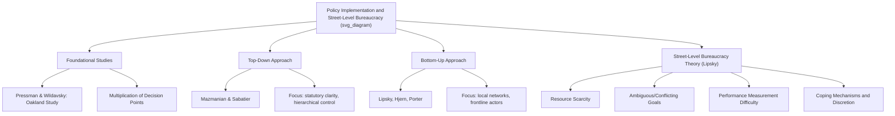

## Policy Implementation and Street-Level Bureaucracy

### Overview

Policy implementation is the stage of the policy process in which adopted policies are translated into administrative action and delivered to their intended targets. Implementation studies emerged as a distinct subfield in the 1970s after scholars recognized that the gap between a policy's formal design and its actual on-the-ground effects — the **implementation gap** — was often as consequential as the original policy formulation itself. Street-level bureaucracy theory, developed by Michael Lipsky, provides the most influential framework for understanding why this gap arises: frontline public employees exercise substantial discretion that shapes how policy is actually experienced by citizens, regardless of the formal rules written by higher-level policymakers.

### The Foundational Implementation Studies Tradition

**Pressman and Wildavsky's Oakland Study (1973)**

Jeffrey Pressman and Aaron Wildavsky's landmark study, subtitled *"How Great Expectations in Washington Are Dashed in Oakland,"* examined a federal Economic Development Administration jobs program intended to reduce unemployment among minority residents in Oakland, California, and found that despite broad initial political consensus and adequate funding, the program largely failed to achieve its objectives due to implementation breakdown rather than flawed original policy design.

**Key Points**

- The study's central analytical contribution was demonstrating that implementation failure often results from the sheer **multiplication of decision points and required clearances** — even where each individual actor involved has only a modest probability of causing delay or non-cooperation, the *cumulative* probability of successful completion across many sequential/interdependent decision points can be surprisingly low.
- This is often illustrated mathematically: if a program requires clearance from $n$ independent decision points, each with an independent probability $p$ of approval, the overall probability of complete successful implementation is:

$$P(\text{success}) = p^n$$

Even with a high per-step approval probability (e.g., $p = 0.90$), the cumulative probability of success falls substantially as $n$ grows — for example, with $n = 20$ required clearances, $P(\text{success}) = 0.90^{20} \approx 0.12$, illustrating how implementation involving many sequential veto points can fail even when no single actor intends to sabotage the program.

- The Oakland study established that implementation deserves to be studied as a genuinely independent variable affecting policy outcomes, rather than treated as an unproblematic, automatic administrative afterthought to the "real" political work of formulation and adoption.

### Top-Down vs. Bottom-Up Approaches to Implementation Research

Following the foundational Oakland study, implementation scholarship diverged into two broad analytical traditions, each emphasizing different actors and units of analysis:

**Top-Down Approach**

- Associated with scholars including Daniel Mazmanian and Paul Sabatier.
- Analytical starting point: the **statute or formal policy decision** itself, examining how effectively higher-level policymakers can structure implementation to achieve their original objectives.
- Emphasizes factors such as clarity of statutory objectives, causal theory linking means to ends, hierarchical integration of implementing agencies, availability of resources, and the extent to which implementing officials' incentives are aligned with the policy's goals.
- Critique: this approach can overstate the capacity of central policymakers to control implementation outcomes and tends to treat deviation from original statutory intent as "implementation failure," even where such deviation may reflect legitimate local adaptation to conditions the original policymakers could not have anticipated.

**Bottom-Up Approach**

- Associated with scholars including Michael Lipsky, Benny Hjern, and David Porter.
- Analytical starting point: the **frontline implementing actors and target populations** themselves, examining the network of local actors involved in actually delivering a service or program, and treating "policy" as something substantially defined and redefined through the accumulated actions of these local actors, rather than as a fixed object handed down from the top.
- Emphasizes that meaningful policy analysis must account for local implementation networks and the discretion exercised by frontline actors, since formal statutory language alone cannot capture how policy is actually experienced.
- Critique: this approach can understate the importance of formal institutional structure and central resource allocation, and risks treating any and all local adaptation as legitimate without adequately distinguishing beneficial local responsiveness from genuine policy subversion or corruption.

**Key Points**

- Later scholarship (e.g., Richard Elmore's "backward mapping" technique, and various syntheses) has generally moved toward **hybrid approaches** combining insights from both traditions — recognizing that both statutory design/resource structure (top-down concerns) and frontline discretion/local network dynamics (bottom-up concerns) are simultaneously relevant to understanding real implementation outcomes.

### Michael Lipsky's Street-Level Bureaucracy Theory (1980)

**Core Claim**

Lipsky's *Street-Level Bureaucracy: Dilemmas of the Individual in Public Services* argues that public employees who interact directly with citizens and who possess substantial discretion in how they apply rules — **street-level bureaucrats** (teachers, police officers, social workers, immigration officers, healthcare providers in public systems, welfare caseworkers) — effectively **make policy** through the accumulated pattern of their individual case-level decisions, regardless of what the formal written policy states.

**Structural Conditions Producing Street-Level Discretion**

Lipsky identifies several structural features common to street-level bureaucratic work that necessitate and reinforce discretion:

- **Resource scarcity relative to demand**: Caseloads, time, and resources are typically insufficient to treat every case with the individualized, comprehensive attention formal policy might ideally require, forcing frontline workers to develop routines and shortcuts (which Lipsky terms **"coping mechanisms"**) to manage otherwise unmanageable workloads.
- **Ambiguous or conflicting goals**: Street-level bureaucrats often face goals that are vague, contradictory, or impossible to fully satisfy simultaneously (e.g., a teacher balancing individualized attention to struggling students against covering a mandated curriculum for the full class within limited instructional time).
- **Difficulty measuring performance**: The outcomes street-level bureaucrats are meant to produce (educational achievement, rehabilitation, public safety, client wellbeing) are often difficult to measure directly or attribute causally to specific worker actions, complicating meaningful performance accountability and creating space for discretion to go largely unmonitored.
- **Non-voluntary or captive clientele**: In many street-level bureaucratic relationships (policing, immigration enforcement, some social services), clients cannot simply exit and choose an alternative provider, reducing normal market-like accountability pressures on frontline worker behavior.

**Key Points**

- Lipsky's central and most-cited claim: **"the decisions of street-level bureaucrats, the routines they establish, and the devices they invent to cope with uncertainties and work pressures, effectively become the public policies they carry out."** This inverts the naive top-down assumption that policy is simply "handed down" and mechanically applied; instead, policy is substantially *made* at the point of frontline implementation.
- **Coping mechanisms** frequently include rationing scarce resources (e.g., a caseworker prioritizing certain cases over others based on informal, non-codified criteria), routinizing and simplifying complex cases into standardized categories that may not fully capture individual circumstances, and psychologically adapting to the gap between idealized professional standards and achievable practice (e.g., redefining "success" in more modest, attainable terms to manage occupational stress).

### Visual Model: The Implementation Gap and Street-Level Discretion

<svg xmlns="http://www.w3.org/2000/svg" viewBox="0 0 720 320">
<text x="360" y="24" text-anchor="middle" font-size="16" font-weight="bold" fill="#1a1a1a">Policy as Written vs. Policy as Experienced (svg_diagram)</text>
<rect x="60" y="60" width="200" height="60" rx="6" fill="#a8d5ba" stroke="#333" stroke-width="1.5" />
<text x="160" y="85" text-anchor="middle" font-size="12" font-weight="bold" fill="#1a1a1a">Policy as Adopted</text>
<text x="160" y="102" text-anchor="middle" font-size="10" fill="#333">(statute/regulation text)</text>
<line x1="160" y1="120" x2="160" y2="170" stroke="#333" stroke-width="2" marker-end="url(#arrow7)" />
<rect x="60" y="170" width="200" height="70" rx="6" fill="#f4d58d" stroke="#333" stroke-width="1.5" />
<text x="160" y="192" text-anchor="middle" font-size="11" font-weight="bold" fill="#1a1a1a">Implementing Agency</text>
<text x="160" y="208" text-anchor="middle" font-size="9" fill="#333">Resource constraints,</text>
<text x="160" y="221" text-anchor="middle" font-size="9" fill="#333">institutional routines</text>
<line x1="260" y1="205" x2="330" y2="205" stroke="#333" stroke-width="2" marker-end="url(#arrow7)" />
<rect x="330" y="170" width="200" height="70" rx="6" fill="#f0c987" stroke="#333" stroke-width="1.5" />
<text x="430" y="192" text-anchor="middle" font-size="11" font-weight="bold" fill="#1a1a1a">Street-Level Bureaucrat</text>
<text x="430" y="208" text-anchor="middle" font-size="9" fill="#333">Discretion, coping</text>
<text x="430" y="221" text-anchor="middle" font-size="9" fill="#333">mechanisms, routines</text>
<line x1="530" y1="205" x2="600" y2="205" stroke="#333" stroke-width="2" marker-end="url(#arrow7)" />
<rect x="600" y="170" width="100" height="70" rx="6" fill="#c9dfa8" stroke="#333" stroke-width="1.5" />
<text x="650" y="200" text-anchor="middle" font-size="11" font-weight="bold" fill="#1a1a1a">Citizen</text>
<text x="650" y="216" text-anchor="middle" font-size="9" fill="#333">(experienced policy)</text>
<path d="M 160 130 Q 400 280, 650 240" fill="none" stroke="#999" stroke-width="1.5" stroke-dasharray="4,3" />
<text x="400" y="290" text-anchor="middle" font-size="10" fill="#777">Implementation gap</text>
</svg>

### Classic Examples of Street-Level Discretion

**Example**

- **Police officers** exercise substantial discretion in deciding whether to issue a citation, make an arrest, or provide only a verbal warning for a given infraction — meaning the "law as written" (which may mandate specific penalties for specific offenses) is substantially mediated by officer-level judgment about the offender's demeanor, the officer's assessment of the situation's seriousness, departmental informal norms, and available time/resources, producing wide variation in actual enforcement patterns for ostensibly identical formal offenses.
- **Public school teachers** exercise discretion over how strictly to enforce grading rubrics, how much individualized attention to allocate to struggling versus advanced students within fixed classroom time, and how to interpret and apply general curriculum standards in day-to-day instruction — meaning national or provincial curriculum policy is substantially reshaped by classroom-level teacher decisions.
- **Welfare/social assistance caseworkers** exercise discretion in interpreting ambiguous eligibility criteria, in the thoroughness of documentation verification, and in the tone and helpfulness of client interactions — significantly shaping whether formally eligible applicants actually successfully access benefits they are entitled to under the written program rules.

### Sabatier's Later Synthesis and the Broader Implementation Research Agenda

Paul Sabatier, initially a leading top-down theorist, later (partly through his development of the Advocacy Coalition Framework) argued that a more comprehensive account of implementation requires attention to long-term **policy learning** among the network of actors involved across implementation cycles, and to the influence of belief systems and coalition dynamics extending beyond the immediate top-down/bottom-up dichotomy — suggesting the debate is best understood as complementary rather than strictly oppositional lenses on the same underlying phenomenon. [Inference: this synthesis view — that top-down and bottom-up approaches address different, complementary aspects of implementation rather than being mutually exclusive competing theories — is broadly, though not universally, accepted within contemporary implementation studies scholarship.]

### Worked Example: Street-Level Bureaucracy in Philippine Barangay Health Worker Programs

**Example**

The Philippines' Barangay Health Worker (BHW) system, integral to delivering national public health programs (immunization, maternal health referrals, health education) at the community level under the Department of Health's broader public health architecture, illustrates street-level bureaucracy dynamics clearly:

- **Resource scarcity**: BHWs typically serve large populations with limited compensation (often honoraria rather than full civil-service salaries), limited supplies, and heavy caseloads relative to the comprehensive health outreach mandate assigned to them by national health policy — a textbook Lipsky-style resource-demand mismatch.
- **Discretion in practice**: Because BHWs operate with substantial autonomy in their day-to-day community outreach (which households to prioritize for follow-up visits, how to allocate limited time across competing health programs like immunization drives versus nutrition monitoring versus family planning counseling), the *actual* pattern of public health service delivery experienced by any given barangay resident depends heavily on individual BHW judgment, workload, and relationship with the community — meaning national health policy as formally designed is substantially reshaped at the point of BHW-level implementation.
- **Coping mechanisms**: BHWs facing an overwhelming range of assigned responsibilities relative to their limited time and resources may develop informal prioritization routines (e.g., focusing primarily on the most visible, easily measurable indicators like immunization counts, which are subject to reporting requirements and supervisory review, potentially at the expense of less easily measured but equally important functions like sustained health education or mental health first-line support) — a direct illustration of Lipsky's observation that performance-measurement difficulty shapes which aspects of a broad mandate street-level workers prioritize in practice.

### Diagrammatic Summary: Implementation Theory Landscape

### Common Analytical Pitfalls

- **Treating implementation as automatic**: A frequent error in policy analysis is assuming that once a policy is formally adopted, its effects follow mechanically from its written design — implementation studies exist precisely to correct this assumption, since the "implementation gap" is often the primary explanation for why policies fail to achieve their stated objectives.
- **Conflating discretion with dysfunction**: Street-level discretion is not inherently a policy failure or sign of bureaucratic incompetence; Lipsky's framework presents discretion as a structurally necessary and often reasonable adaptation to genuine resource and information constraints, even while acknowledging it can produce inequitable or inconsistent outcomes across cases and clients.
- **Applying only top-down or only bottom-up analysis**: A comprehensive implementation analysis typically requires attention to both the statutory/resource structure set by higher-level policymakers (top-down) and the discretionary practices and local network dynamics of frontline actors (bottom-up) — over-relying on only one lens risks an incomplete account of why implementation succeeds or fails in a given case.

### Conclusion

Policy implementation studies address the frequently substantial gap between a policy's formal design and its actual effects, a gap first systematically documented by Pressman and Wildavsky's Oakland study and subsequently analyzed through competing top-down and bottom-up theoretical traditions. Michael Lipsky's street-level bureaucracy theory provides the most influential account of *why* this gap persists: frontline public employees, operating under structural conditions of resource scarcity, ambiguous goals, and difficult performance measurement, exercise discretion that effectively makes policy through the accumulated pattern of individual case decisions — a dynamic clearly illustrated by the Philippine Barangay Health Worker system described above, and applicable across virtually any public service delivery context involving direct, discretionary frontline interaction with citizens.

**Related Topics**

- Stages of the Policy Cycle (implementation's place in the broader process)
- Models of Policy Formulation and Decision-Making (bureaucratic politics parallels)
- Public Administration Theory and Bureaucratic Discretion
- Performance Measurement and Accountability in Public Services
- Policy Evaluation Methods (assessing implementation effectiveness)
- The Advocacy Coalition Framework and Policy Learning
- Case Study: Philippine Barangay Health Worker System
- Principal-Agent Problems in Public Service Delivery